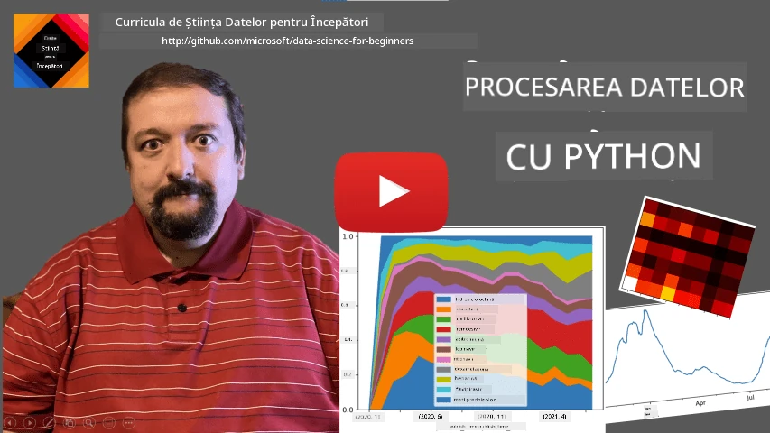
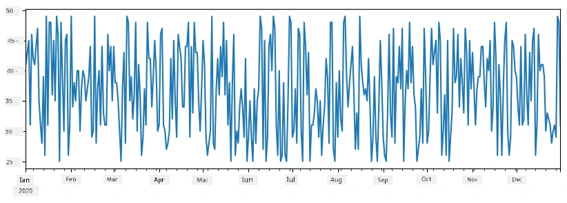
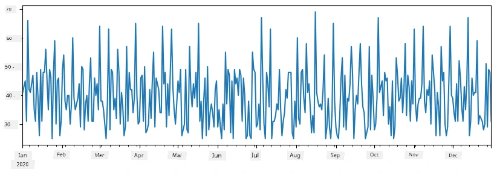
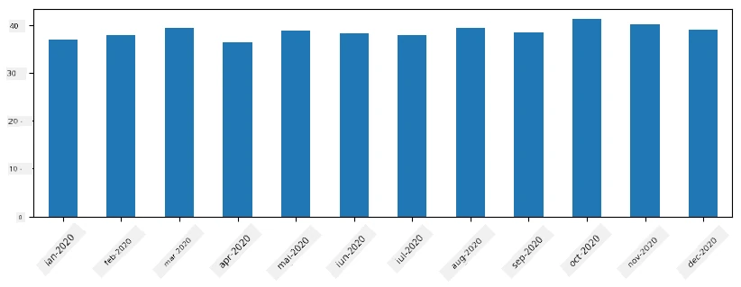
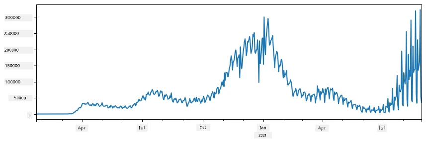
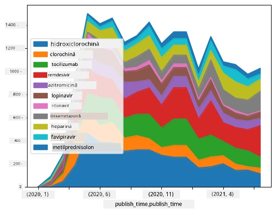

# Lucrul cu date: Python și biblioteca Pandas

|  ](../../sketchnotes/07-WorkWithPython.png) |
| :-------------------------------------------------------------------------------------------------------: |
|                 Lucrul cu Python - _Sketchnote de [@nitya](https://twitter.com/nitya)_                 |

[](https://youtu.be/dZjWOGbsN4Y)

În timp ce bazele de date oferă modalități foarte eficiente pentru stocarea datelor și interogarea acestora folosind limbaje de interogare, cea mai flexibilă metodă de procesare a datelor este scrierea propriului program pentru manipularea datelor. În multe cazuri, efectuarea unei interogări în baza de date ar fi o metodă mai eficientă. Totuși, în unele cazuri când este necesară o procesare mai complexă a datelor, aceasta nu poate fi făcută ușor cu SQL. 
Procesarea datelor poate fi programată în orice limbaj de programare, însă există anumite limbaje care sunt la un nivel mai înalt în ceea ce privește lucrul cu datele. Oamenii de știință în date preferă de obicei unul dintre următoarele limbaje:

* **[Python](https://www.python.org/)**, un limbaj de programare general, considerat adesea una dintre cele mai bune opțiuni pentru începători datorită simplității sale. Python dispune de multe biblioteci suplimentare care te pot ajuta să rezolvi multe probleme practice, cum ar fi extragerea datelor dintr-un arhiv ZIP sau conversia unei imagini în tonuri de gri. Pe lângă știința datelor, Python este folosit și frecvent pentru dezvoltarea web. 
* **[R](https://www.r-project.org/)** este un set de instrumente tradițional dezvoltat cu prelucrarea statistică a datelor în minte. De asemenea, conține un depozit mare de biblioteci (CRAN), făcându-l o alegere bună pentru procesarea datelor. Totuși, R nu este un limbaj de programare general, și este rar folosit în afara domeniului științei datelor.
* **[Julia](https://julialang.org/)** este un alt limbaj dezvoltat special pentru știința datelor. Este destinat să ofere performanțe mai bune decât Python, fiind astfel un instrument excelent pentru experimentarea științifică.

În această lecție, ne vom concentra pe utilizarea Python pentru procesarea simplă a datelor. Vom presupune o familiaritate de bază cu limbajul. Dacă dorești un tur mai aprofundat al Python, poți consulta una dintre următoarele resurse:

* [Învață Python într-un mod distractiv cu grafică Turtle și fractali](https://github.com/shwars/pycourse) - curs introductiv rapid pe GitHub pentru Programarea în Python
* [Fă-ți primii pași cu Python](https://docs.microsoft.com/en-us/learn/paths/python-first-steps/?WT.mc_id=academic-77958-bethanycheum) Parcurs de învățare pe [Microsoft Learn](http://learn.microsoft.com/?WT.mc_id=academic-77958-bethanycheum)

Datele pot veni în multe forme. În această lecție, vom lua în considerare trei forme de date - **date tabulare**, **text** și **imagini**.

Ne vom concentra pe câteva exemple de prelucrare a datelor, în loc să oferim o prezentare completă a tuturor bibliotecilor conexe. Acest lucru îți va permite să înțelegi ideea principală despre ce este posibil și te va lăsa cu o înțelegere a unde să găsești soluții la problemele tale când ai nevoie.

> **Cel mai util sfat**. Când ai nevoie să faci o anumită operațiune pe date și nu știi cum, încearcă să cauți pe internet. [Stackoverflow](https://stackoverflow.com/) conține de obicei multe exemple utile de cod Python pentru multe sarcini tipice. 


## [Test pre-lecture](https://ff-quizzes.netlify.app/en/ds/quiz/12)

## Date tabulare și Dataframes

Ai întâlnit deja date tabulare când am vorbit despre bazele de date relaționale. Când ai multe date conținute în mai multe tabele diferite legate între ele, cu siguranță are sens să folosești SQL pentru a lucra cu ele. Totuși, există multe cazuri în care avem un tabel de date și avem nevoie să obținem anumite **înțelegeri** sau **informații** despre aceste date, cum ar fi distribuția, corelația între valori, etc. În știința datelor, sunt multe cazuri când trebuie să facem diverse transformări ale datelor originale, urmate de vizualizare. Ambele etape pot fi făcute ușor folosind Python.

Există două biblioteci foarte utile în Python care te pot ajuta să lucrezi cu date tabulare:
* **[Pandas](https://pandas.pydata.org/)** îți permite să manipulezi așa-numitele **Dataframes**, care sunt analogice tabelelor relaționale. Poți avea coloane denumite și poți efectua diferite operațiuni pe rânduri, coloane și Dataframes în general. 
* **[Numpy](https://numpy.org/)** este o bibliotecă pentru lucrul cu **tensorii**, adică **matrice multidimensionale**. Matricea are valori de același tip de bază și este mai simplă decât un Dataframe, dar oferă mai multe operațiuni matematice și creează mai puțin overhead.

Există și câteva alte biblioteci despre care ar trebui să știi:
* **[Matplotlib](https://matplotlib.org/)** este o bibliotecă folosită pentru vizualizarea datelor și trasarea graficelor
* **[SciPy](https://www.scipy.org/)** este o bibliotecă cu câteva funcții științifice suplimentare. Am întâlnit deja această bibliotecă vorbind despre probabilitate și statistică

Iată un fragment de cod pe care l-ai folosi de obicei pentru a importa acele biblioteci la începutul programului tău Python:
```python
import numpy as np
import pandas as pd
import matplotlib.pyplot as plt
from scipy import ... # trebuie să specificați exact sub-pachetele de care aveți nevoie
``` 

Pandas se bazează pe câteva concepte de bază.

### Serie (Series)

**Serie** este o secvență de valori, similară unei liste sau unui array numpy. Diferența principală este că seria are și un **index** și când operăm pe serii (de exemplu, le adunăm), indexul este luat în considerare. Indexul poate fi un număr întreg simplu (este indexul utilizat implicit când creăm o serie din listă sau array), sau poate avea o structură complexă, cum ar fi interval de date.

> **Notă**: Există niște cod introductiv Pandas în caietul atașat [`notebook.ipynb`](notebook.ipynb). Aici prezentăm doar câteva exemple, dar ești binevenit să verifici întregul caiet.

Consideră un exemplu: vrem să analizăm vânzările locației noastre de înghețată. Să generăm o serie de numere ale vânzărilor (numărul de articole vândute în fiecare zi) pentru o anumită perioadă:

```python
start_date = "Jan 1, 2020"
end_date = "Mar 31, 2020"
idx = pd.date_range(start_date,end_date)
print(f"Length of index is {len(idx)}")
items_sold = pd.Series(np.random.randint(25,50,size=len(idx)),index=idx)
items_sold.plot()
```


Acum, să presupunem că în fiecare săptămână organizăm o petrecere pentru prieteni și aducem suplimentar 10 pachete de înghețată pentru petrecere. Putem crea o altă serie, indexată după săptămâni, pentru a demonstra acest lucru:
```python
additional_items = pd.Series(10,index=pd.date_range(start_date,end_date,freq="W"))
```
Când adunăm două serii, obținem numărul total:
```python
total_items = items_sold.add(additional_items,fill_value=0)
total_items.plot()
```


> **Notă** că nu folosim sintaxa simplă `total_items+additional_items`. Dacă am face asta, am obține multe valori `NaN` (*Not a Number*) în seria rezultată. Acest lucru se datorează faptului că există valori lipsă pentru unele puncte de index în seria `additional_items`, iar adăugarea NaN la orice duce la NaN. Prin urmare, trebuie să specificăm parametrul `fill_value` la adunare.

Cu seriile temporale, putem și **reasambla (resample)** seria cu intervale de timp diferite. De exemplu, să presupunem că vrem să calculăm media vânzărilor lunar. Putem folosi următorul cod:
```python
monthly = total_items.resample("1M").mean()
ax = monthly.plot(kind='bar')
```


### DataFrame

Un DataFrame este în esență o colecție de serii cu același index. Putem combina mai multe serii într-un DataFrame:
```python
a = pd.Series(range(1,10))
b = pd.Series(["I","like","to","play","games","and","will","not","change"],index=range(0,9))
df = pd.DataFrame([a,b])
```
Aceasta va crea un tabel orizontal ca acesta:
|     | 0   | 1    | 2   | 3   | 4      | 5   | 6      | 7    | 8    |
| --- | --- | ---- | --- | --- | ------ | --- | ------ | ---- | ---- |
| 0   | 1   | 2    | 3   | 4   | 5      | 6   | 7      | 8    | 9    |
| 1   | I   | like | to  | use | Python | and | Pandas | very | much |

Putem folosi și Serii ca și coloane, și specifica numele coloanelor printr-un dicționar:
```python
df = pd.DataFrame({ 'A' : a, 'B' : b })
```
Aceasta ne va da un tabel de acest fel:

|     | A   | B      |
| --- | --- | ------ |
| 0   | 1   | I      |
| 1   | 2   | like   |
| 2   | 3   | to     |
| 3   | 4   | use    |
| 4   | 5   | Python |
| 5   | 6   | and    |
| 6   | 7   | Pandas |
| 7   | 8   | very   |
| 8   | 9   | much   |

**Notă** că putem obține acest layout al tabelului și prin transpusa tabelului anterior, de exemplu scriind 
```python
df = pd.DataFrame([a,b]).T.rename(columns={ 0 : 'A', 1 : 'B' })
```
Aici `.T` înseamnă operația de transpunere a DataFrame-ului, adică schimbarea rândurilor în coloane și invers, iar `rename` ne permite să redenumim coloanele pentru a corespunde exemplului anterior.

Iată câteva dintre cele mai importante operațiuni pe care le putem face cu DataFrame-urile:

**Selecția coloanelor**. Putem selecta coloane individuale scriind `df['A']` - această operațiune returnează o Serie. Putem de asemenea să selectăm un subset de coloane într-un alt DataFrame scriind `df[['B','A']]` - aceasta returnează un alt DataFrame.

**Filtrarea** doar a anumitor rânduri după criterii. De exemplu, pentru a păstra doar rândurile cu coloana `A` mai mare decât 5, scriem `df[df['A']>5]`.

> **Notă**: Modul în care funcționează filtrarea este următorul. Expresia `df['A']<5` returnează o serie booleană, care indică dacă expresia este `True` sau `False` pentru fiecare element al seriei originale `df['A']`. Când o serie booleană este folosită ca index, returnează un subset de rânduri din DataFrame. Prin urmare, nu este posibil să folosești o expresie booleană arbitrară în Python, de exemplu, scriind `df[df['A']>5 and df['A']<7]` ar fi greșit. În schimb, trebuie să folosești operatorul special `&` pentru seriile booleene, scriind `df[(df['A']>5) & (df['A']<7)]` (*parantezele sunt importante aici*).

**Crearea unor coloane noi calculabile**. Putem crea cu ușurință coloane noi calculabile pentru DataFrame-ul nostru folosind expresii intuitive de acest fel:
```python
df['DivA'] = df['A']-df['A'].mean() 
``` 
Acest exemplu calculează deviația lui A față de valoarea sa medie. Ceea ce se întâmplă aici este că calculăm o serie și apoi îi atribuim rezultatul pe partea stângă, creând o coloană nouă. Prin urmare, nu putem folosi operații care nu sunt compatibile cu serii, de exemplu codul de mai jos este greșit:
```python
# Cod greșit -> df['ADescr'] = "Low" dacă df['A'] < 5 altfel "Hi"
df['LenB'] = len(df['B']) # <- Rezultat greșit
``` 
Ultimul exemplu, deși este corect din punct de vedere sintactic, produce un rezultat greșit deoarece asignează lungimea întregii serii `B` tuturor valorilor din coloană, nu lungimea elementelor individuale, cum intenționam.

Dacă avem nevoie să calculăm expresii complexe ca aceasta, putem folosi funcția `apply`. Ultimul exemplu poate fi scris astfel:
```python
df['LenB'] = df['B'].apply(lambda x : len(x))
# sau
df['LenB'] = df['B'].apply(len)
```

După operațiile de mai sus, vom ajunge la următorul DataFrame:

|     | A   | B      | DivA | LenB |
| --- | --- | ------ | ---- | ---- |
| 0   | 1   | I      | -4.0 | 1    |
| 1   | 2   | like   | -3.0 | 4    |
| 2   | 3   | to     | -2.0 | 2    |
| 3   | 4   | use    | -1.0 | 3    |
| 4   | 5   | Python | 0.0  | 6    |
| 5   | 6   | and    | 1.0  | 3    |
| 6   | 7   | Pandas | 2.0  | 6    |
| 7   | 8   | very   | 3.0  | 4    |
| 8   | 9   | much   | 4.0  | 4    |

**Selectarea rândurilor pe baza numerelor** poate fi făcută folosind constructul `iloc`. De exemplu, pentru a selecta primele 5 rânduri din DataFrame:
```python
df.iloc[:5]
```

**Gruparea** este folosită adesea pentru a obține un rezultat similar cu *tabelele pivot* din Excel. Să presupunem că vrem să calculăm media valorii coloanei `A` pentru fiecare număr dat de `LenB`. Atunci putem grupa DataFrame-ul după `LenB` și apela `mean`:
```python
df.groupby(by='LenB')[['A','DivA']].mean()
```
Dacă vrem să calculăm media și numărul de elemente din grup, putem folosi funcția mai complexă `aggregate`:
```python
df.groupby(by='LenB') \
 .aggregate({ 'DivA' : len, 'A' : lambda x: x.mean() }) \
 .rename(columns={ 'DivA' : 'Count', 'A' : 'Mean'})
```
Aceasta ne oferă următorul tabel:

| LenB | Count | Mean     |
| ---- | ----- | -------- |
| 1    | 1     | 1.000000 |
| 2    | 1     | 3.000000 |
| 3    | 2     | 5.000000 |
| 4    | 3     | 6.333333 |
| 6    | 2     | 6.000000 |

### Obținerea datelor


Am văzut cât de ușor este să construim Series și DataFrames din obiecte Python. Totuși, datele vin de obicei sub forma unui fișier text sau a unui tabel Excel. Din fericire, Pandas ne oferă o modalitate simplă de a încărca date de pe disc. De exemplu, citirea unui fișier CSV este la fel de simplă ca asta:
```python
df = pd.read_csv('file.csv')
```
Vom vedea mai multe exemple de încărcare a datelor, inclusiv preluarea acestora de pe site-uri web externe, în secțiunea „Provocare”


### Tipărire și Plotare

Un Data Scientist trebuie adesea să exploreze datele, astfel că este important să putem vizualiza acestea. Când DataFrame-ul este mare, de multe ori vrem doar să ne asigurăm că facem totul corect prin afișarea primelor câteva rânduri. Acest lucru se poate face apelând `df.head()`. Dacă îl rulați din Jupyter Notebook, va afișa DataFrame-ul într-o formă tabelară frumoasă.

Am văzut și utilizarea funcției `plot` pentru a vizualiza anumite coloane. În timp ce `plot` este foarte util pentru multe sarcini și suportă multe tipuri diferite de grafice prin parametrul `kind=`, puteți oricând să folosiți biblioteca brută `matplotlib` pentru a crea ceva mai complex. Vom aborda vizualizarea datelor în detaliu în lecții separate ale cursului.

Această privire de ansamblu acoperă cele mai importante concepte din Pandas, însă biblioteca este foarte bogată și nu există limită la ceea ce puteți face cu ea! Să aplicăm acum aceste cunoștințe pentru a rezolva o problemă specifică.

## 🚀 Provocarea 1: Analiza Răspândirii COVID

Prima problemă pe care ne vom concentra este modelarea răspândirii epidemice a COVID-19. Pentru a face acest lucru, vom folosi datele despre numărul de persoane infectate în diferite țări, furnizate de către [Center for Systems Science and Engineering](https://systems.jhu.edu/) (CSSE) de la [Johns Hopkins University](https://jhu.edu/). Setul de date este disponibil în [acest depozit GitHub](https://github.com/CSSEGISandData/COVID-19).

Deoarece vrem să demonstrăm cum să lucrăm cu date, vă invităm să deschideți [`notebook-covidspread.ipynb`](notebook-covidspread.ipynb) și să îl citiți de la început până la sfârșit. Puteți de asemenea să executați celulele și să rezolvați provocările pe care le-am lăsat pentru voi la final.



> Dacă nu știți cum să rulați cod într-un Jupyter Notebook, consultați [acest articol](https://soshnikov.com/education/how-to-execute-notebooks-from-github/).

## Lucrul cu Date Nestructurate

Deși datele vin foarte des sub formă tabelară, în unele cazuri trebuie să lucrăm cu date mai puțin structurate, de exemplu texte sau imagini. În acest caz, pentru a aplica tehnicile de procesare a datelor pe care le-am văzut mai sus, trebuie cumva să **extragem** date structurate. Iată câteva exemple:

* Extragem cuvinte cheie din text și vedem cât de des apar acestea
* Folosim rețele neurale pentru a extrage informații despre obiectele din imagine
* Obținem informații despre emoțiile persoanelor din fluxul video al camerei

## 🚀 Provocarea 2: Analiza Articolelor despre COVID

În această provocare vom continua cu subiectul pandemiei COVID și ne vom concentra pe procesarea articolelor științifice pe această temă. Există [setul de date CORD-19](https://www.kaggle.com/allen-institute-for-ai/CORD-19-research-challenge) cu peste 7000 (la momentul scrierii) de articole despre COVID, disponibile împreună cu metadate și rezumate (și pentru aproximativ jumătate dintre ele este disponibil și textul integral).

Un exemplu complet de analiză a acestui set de date folosind serviciul cognitiv [Text Analytics for Health](https://docs.microsoft.com/azure/cognitive-services/text-analytics/how-tos/text-analytics-for-health/?WT.mc_id=academic-77958-bethanycheum) este descris [în această postare pe blog](https://soshnikov.com/science/analyzing-medical-papers-with-azure-and-text-analytics-for-health/). Vom discuta o versiune simplificată a acestei analize.

> **ATENȚIE**: Nu oferim o copie a setului de date ca parte a acestui depozit. Întâi poate fi necesar să descărcați fișierul [`metadata.csv`](https://www.kaggle.com/allen-institute-for-ai/CORD-19-research-challenge?select=metadata.csv) din [acest set de date de pe Kaggle](https://www.kaggle.com/allen-institute-for-ai/CORD-19-research-challenge). Poate fi necesară înregistrarea la Kaggle. De asemenea, puteți descărca setul de date fără înregistrare [de aici](https://ai2-semanticscholar-cord-19.s3-us-west-2.amazonaws.com/historical_releases.html), însă acesta va include toate textele integrale în plus față de fișierul cu metadatele.

Deschideți [`notebook-papers.ipynb`](notebook-papers.ipynb) și citiți-l de la început până la sfârșit. Puteți de asemenea să executați celulele și să rezolvați provocările pe care le-am lăsat pentru voi la final.



## Procesarea Datelor de Imagine

Recent, au fost dezvoltate modele AI foarte puternice care ne permit să înțelegem imaginile. Există multe sarcini care pot fi rezolvate folosind rețele neurale preantrenate sau servicii cloud. Câteva exemple includ:

* **Clasificarea Imaginilor**, care te poate ajuta să categorizezi imaginea într-una dintre clasele predefinite. Poți antrena cu ușurință propriile clasificatoare de imagini folosind servicii precum [Custom Vision](https://azure.microsoft.com/services/cognitive-services/custom-vision-service/?WT.mc_id=academic-77958-bethanycheum)
* **Detecția Obiectelor** pentru a detecta diferite obiecte în imagine. Servicii precum [computer vision](https://azure.microsoft.com/services/cognitive-services/computer-vision/?WT.mc_id=academic-77958-bethanycheum) pot detecta o serie de obiecte comune, iar tu poți antrena un model [Custom Vision](https://azure.microsoft.com/services/cognitive-services/custom-vision-service/?WT.mc_id=academic-77958-bethanycheum) pentru a detecta anumite obiecte specifice de interes.
* **Detecția Feței**, inclusiv detectarea vârstei, genului și emoției. Acest lucru se poate realiza prin [Face API](https://azure.microsoft.com/services/cognitive-services/face/?WT.mc_id=academic-77958-bethanycheum).

Toate aceste servicii cloud pot fi apelate folosind [SDK-uri Python](https://docs.microsoft.com/samples/azure-samples/cognitive-services-python-sdk-samples/cognitive-services-python-sdk-samples/?WT.mc_id=academic-77958-bethanycheum), astfel că pot fi ușor integrate în fluxul tău de explorare a datelor.

Iată câteva exemple de explorare a datelor din surse de tip imagine:
* În postarea de blog [How to Learn Data Science without Coding](https://soshnikov.com/azure/how-to-learn-data-science-without-coding/) explorăm fotografii de pe Instagram, încercând să înțelegem ce face oamenii să dea mai multe like-uri unei fotografii. Mai întâi extragem cât mai multe informații din imagini folosind [computer vision](https://azure.microsoft.com/services/cognitive-services/computer-vision/?WT.mc_id=academic-77958-bethanycheum), apoi folosim [Azure Machine Learning AutoML](https://docs.microsoft.com/azure/machine-learning/concept-automated-ml/?WT.mc_id=academic-77958-bethanycheum) pentru a construi un model interpretabil.
* În [Facial Studies Workshop](https://github.com/CloudAdvocacy/FaceStudies) folosim [Face API](https://azure.microsoft.com/services/cognitive-services/face/?WT.mc_id=academic-77958-bethanycheum) pentru a extrage emoțiile persoanelor din fotografiile de la evenimente, în încercarea de a înțelege ce îi face fericiți pe oameni.

## Concluzie

Indiferent dacă aveți deja date structurate sau nestructurate, folosind Python puteți realiza toate etapele legate de procesarea și înțelegerea datelor. Este probabil cea mai flexibilă modalitate de procesare a datelor, iar acesta este motivul pentru care majoritatea oamenilor de știință în date folosesc Python ca principală unealtă. Învățarea profundă a Python-ului este cu siguranță o idee bună dacă sunteți serioși în călătoria voastră în domeniul științei datelor!

## [Test de evaluare post-lectură](https://ff-quizzes.netlify.app/en/ds/quiz/13)

## Recapitulare & Auto-studiu

**Cărți**
* [Wes McKinney. Python for Data Analysis: Data Wrangling with Pandas, NumPy, and IPython](https://www.amazon.com/gp/product/1491957662)

**Resurse Online**
* Tutorialul oficial [10 minutes to Pandas](https://pandas.pydata.org/pandas-docs/stable/user_guide/10min.html)
* [Documentația despre Vizualizarea în Pandas](https://pandas.pydata.org/pandas-docs/stable/user_guide/visualization.html)

**Învățarea Python**
* [Învață Python într-un mod distractiv cu Turtle Graphics și fractali](https://github.com/shwars/pycourse)
* [Fă-ți primii pași în Python](https://docs.microsoft.com/learn/paths/python-first-steps/?WT.mc_id=academic-77958-bethanycheum) Parcurs de învățare pe [Microsoft Learn](http://learn.microsoft.com/?WT.mc_id=academic-77958-bethanycheum)

## Temă

[Realizează un studiu mai detaliat al datelor pentru provocările de mai sus](assignment.md)

## Mulțumiri

Această lecție a fost creată cu ♥️ de [Dmitry Soshnikov](http://soshnikov.com)

---

<!-- CO-OP TRANSLATOR DISCLAIMER START -->
**Declinare a responsabilității**:
Acest document a fost tradus folosind serviciul de traducere AI [Co-op Translator](https://github.com/Azure/co-op-translator). În timp ce ne străduim pentru acuratețe, vă rugăm să rețineți că traducerile automate pot conține erori sau inexactități. Documentul original în limba sa nativă trebuie considerat sursa autorizată. Pentru informații critice, se recomandă traducerea profesională realizată de un om. Nu ne asumăm responsabilitatea pentru eventualele neînțelegeri sau interpretări greșite care decurg din utilizarea acestei traduceri.
<!-- CO-OP TRANSLATOR DISCLAIMER END -->