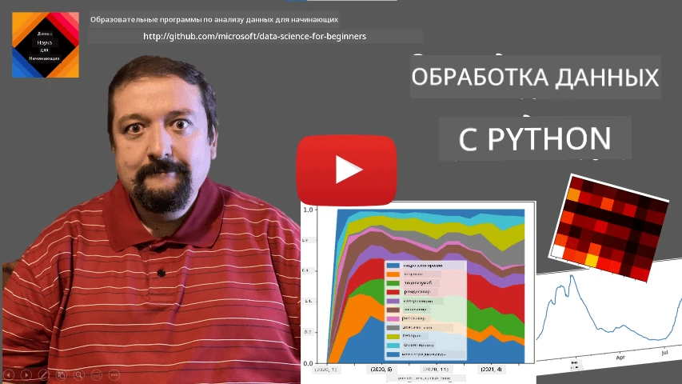
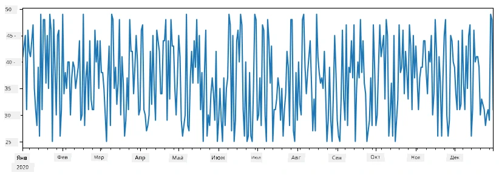
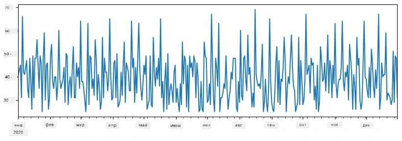
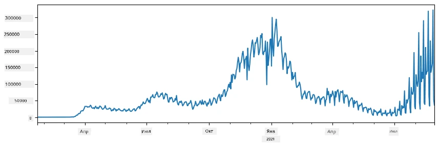
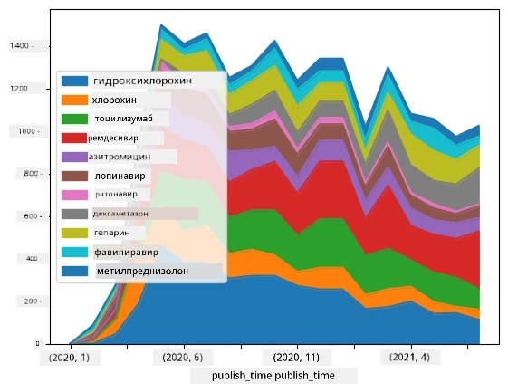

# Работа с данными: Python и библиотека Pandas

|  ](../../sketchnotes/07-WorkWithPython.png) |
| :-------------------------------------------------------------------------------------------------------: |
|                 Работа с Python - _Sketchnote от [@nitya](https://twitter.com/nitya)_                 |

[](https://youtu.be/dZjWOGbsN4Y)

Хотя базы данных предлагают очень эффективные способы хранения данных и их запросов с помощью языков запросов, самым гибким способом обработки данных является написание собственной программы для манипуляции данными. Во многих случаях выполнение запроса к базе данных было бы более эффективным способом. Однако в некоторых случаях, когда требуется более сложная обработка данных, это нельзя легко сделать с помощью SQL. 
Обработка данных может программироваться на любом языке программирования, но существуют определённые языки более высокого уровня для работы с данными. Учёные данных обычно предпочитают один из следующих языков:

* **[Python](https://www.python.org/)**, универсальный язык программирования, который часто считается одним из лучших вариантов для новичков из-за своей простоты. У Python есть множество дополнительных библиотек, которые помогут решить многие практические задачи, например извлечение данных из ZIP-архива или преобразование изображения в оттенки серого. Кроме науки о данных, Python часто используется и для веб-разработки. 
* **[R](https://www.r-project.org/)** — это традиционный набор инструментов, разработанный с учётом статистической обработки данных. Он также содержит большой репозиторий библиотек (CRAN), что делает его хорошим выбором для обработки данных. Однако R не является универсальным языком программирования и редко используется за пределами области науки о данных.
* **[Julia](https://julialang.org/)** — ещё один язык, разработанный специально для науки о данных. Он предназначен для обеспечения лучшей производительности, чем Python, что делает его отличным инструментом для научных экспериментов.

В этом уроке мы сосредоточимся на использовании Python для простой обработки данных. Мы предположим базовое знакомство с языком. Если вы хотите более глубокое изучение Python, вы можете обратиться к одному из следующих ресурсов:

* [Изучайте Python весело с помощью Turtle Graphics и фракталов](https://github.com/shwars/pycourse) — быстрый вводный курс по программированию на Python, размещённый на GitHub
* [Сделайте первые шаги с Python](https://docs.microsoft.com/en-us/learn/paths/python-first-steps/?WT.mc_id=academic-77958-bethanycheum) — учебный путь на [Microsoft Learn](http://learn.microsoft.com/?WT.mc_id=academic-77958-bethanycheum)

Данные могут принимать разные формы. В этом уроке мы рассмотрим три формы данных - **табличные данные**, **текст** и **изображения**.

Мы сосредоточимся на нескольких примерах обработки данных, вместо полного обзора всех связанных библиотек. Это позволит вам получить основное представление о возможностях и даст понимание, где искать решения ваших задач при необходимости.

> **Самый полезный совет**. Когда вам нужно выполнить определённую операцию с данными, которую вы не знаете, как сделать, попробуйте поискать её в интернете. [Stackoverflow](https://stackoverflow.com/) обычно содержит много полезных примеров кода на Python для многих типичных задач. 


## [Викторина перед лекцией](https://ff-quizzes.netlify.app/en/ds/quiz/12)

## Табличные данные и DataFrame

Вы уже встречались с табличными данными, когда мы говорили о реляционных базах данных. Когда у вас много данных, содержащихся во многих различных связанных таблицах, определённо имеет смысл использовать SQL для работы с ними. Однако во многих случаях у нас есть таблица данных, и нам нужно получить некоторое **понимание** или **инсайты** о этих данных, такие как распределение, корреляция между значениями и др. В науке о данных часто требуется выполнить преобразования исходных данных с последующей визуализацией. Оба этих шага можно легко сделать с помощью Python.

В Python есть две наиболее полезные библиотеки, которые помогут вам работать с табличными данными:
* **[Pandas](https://pandas.pydata.org/)** позволяет манипулировать так называемыми **DataFrame**, которые аналогичны реляционным таблицам. Вы можете иметь именованные колонки и выполнять различные операции с рядами, колонками и DataFrame в целом. 
* **[Numpy](https://numpy.org/)** — библиотека для работы с **тензорами**, то есть многомерными **массивами**. Массив содержит значения одного типа, и он проще, чем DataFrame, но предлагает больше математических операций и создаёт меньше накладных расходов.

Есть также несколько других библиотек, о которых стоит знать:
* **[Matplotlib](https://matplotlib.org/)** — библиотека для визуализации данных и построения графиков
* **[SciPy](https://www.scipy.org/)** — библиотека с дополнительными научными функциями. Мы уже встречались с этой библиотекой, обсуждая вероятность и статистику

Вот кусочек кода, который обычно используется для импорта этих библиотек в начале Python-программы:
```python
import numpy as np
import pandas as pd
import matplotlib.pyplot as plt
from scipy import ... # вам нужно указать конкретные подпакеты, которые вам нужны
``` 

Pandas основан на нескольких базовых понятиях.

### Series 

**Series** — это последовательность значений, похожая на список или numpy-массив. Главное отличие в том, что у series есть **индекс**, и при операциях над series (например, сложении) индекс учитывается. Индекс может быть простым — целочисленным номером строки (используется по умолчанию при создании series из списка или массива) или иметь сложную структуру, например, интервал дат.

> **Примечание**: В сопроводительном блокноте [`notebook.ipynb`](notebook.ipynb) есть вводный код для Pandas. Здесь мы лишь кратко представляем некоторые примеры, и вы, безусловно, можете ознакомиться с полным блокнотом.

Рассмотрим пример: мы хотим проанализировать продажи нашего киоска с мороженым. Сгенерируем ряд из чисел продаж (количество проданных единиц в каждый день) за некоторый период:

```python
start_date = "Jan 1, 2020"
end_date = "Mar 31, 2020"
idx = pd.date_range(start_date,end_date)
print(f"Length of index is {len(idx)}")
items_sold = pd.Series(np.random.randint(25,50,size=len(idx)),index=idx)
items_sold.plot()
```


Теперь предположим, что каждую неделю мы устраиваем вечеринку для друзей и берём дополнительно 10 упаковок мороженого на вечеринку. Мы можем создать другой series с индексом по неделям, чтобы это показать:
```python
additional_items = pd.Series(10,index=pd.date_range(start_date,end_date,freq="W"))
```
Когда мы складываем два series, получаем итоговое количество:
```python
total_items = items_sold.add(additional_items,fill_value=0)
total_items.plot()
```


> **Обратите внимание**, что мы не используем простой синтаксис `total_items+additional_items`. Были бы они использованы, мы получили бы множество значений `NaN` (*Not a Number*) в результирующем series. Это происходит потому, что в некоторых индексных точках серии `additional_items` отсутствуют значения, и сложение с `NaN` даёт `NaN`. Поэтому при сложении необходимо указать параметр `fill_value`.

С временными рядами мы также можем **пересамплировать** series с другими временными интервалами. Например, предположим, что мы хотим вычислить средний объём продаж помесячно. Для этого используем следующий код:
```python
monthly = total_items.resample("1M").mean()
ax = monthly.plot(kind='bar')
```


### DataFrame

DataFrame — по сути коллекция series с одинаковым индексом. Мы можем объединить несколько series в один DataFrame:
```python
a = pd.Series(range(1,10))
b = pd.Series(["I","like","to","play","games","and","will","not","change"],index=range(0,9))
df = pd.DataFrame([a,b])
```
Это создаст горизонтальную таблицу следующего вида:
|     | 0   | 1    | 2   | 3   | 4      | 5   | 6      | 7    | 8    |
| --- | --- | ---- | --- | --- | ------ | --- | ------ | ---- | ---- |
| 0   | 1   | 2    | 3   | 4   | 5      | 6   | 7      | 8    | 9    |
| 1   | I   | like | to  | use | Python | and | Pandas | very | much |

Мы также можем использовать Series в качестве колонок и задать имена колонок через словарь:
```python
df = pd.DataFrame({ 'A' : a, 'B' : b })
```
Это даст нам таблицу такого вида:

|     | A   | B      |
| --- | --- | ------ |
| 0   | 1   | I      |
| 1   | 2   | like   |
| 2   | 3   | to     |
| 3   | 4   | use    |
| 4   | 5   | Python |
| 5   | 6   | and    |
| 6   | 7   | Pandas |
| 7   | 8   | very   |
| 8   | 9   | much   |

**Обратите внимание**, что такую таблицу можно получить, транспонировав предыдущую, например, написав 
```python
df = pd.DataFrame([a,b]).T.rename(columns={ 0 : 'A', 1 : 'B' })
```
Здесь `.T` означает операцию транспонирования DataFrame, то есть замену строк на столбцы и наоборот, а операция `rename` позволяет переименовать колонки, чтобы привести их в соответствие с предыдущим примером.

Вот несколько самых важных операций, которые можно выполнять с DataFrame:

**Выбор колонок**. Мы можем выбрать отдельные колонки, написав `df['A']` — эта операция возвращает Series. Также можно выбрать подмножество колонок в другой DataFrame написав `df[['B','A']]` — это возвращает другой DataFrame.

**Фильтрация** только определённых строк по критериям. Например, чтобы оставить только строки, у которых значение в колонке `A` больше 5, можно написать `df[df['A']>5]`.

> **Примечание**: Фильтрация работает следующим образом. Выражение `df['A']<5` возвращает булевский series, указывающий, для каждого элемента исходного series `df['A']`, истинно ли условие (`True`) или ложно (`False`). Когда булевский series используется в качестве индекса, он возвращает подмножество строк DataFrame. Поэтому нельзя использовать произвольное булевское выражение Python, например, написание `df[df['A']>5 and df['A']<7]` будет ошибкой. Вместо этого следует использовать специальную операцию `&` для булевских series, написав `df[(df['A']>5) & (df['A']<7)]` (*скобки здесь важны*).

**Создание новых вычисляемых колонок**. Мы можем легко создать новые вычисляемые колонки в нашем DataFrame, используя интуитивное выражение, например:
```python
df['DivA'] = df['A']-df['A'].mean() 
``` 
Этот пример вычисляет отклонение A от её среднего значения. Фактически здесь мы вычисляем series, а затем присваиваем этот series в левую часть, создавая новую колонку. Поэтому мы не можем использовать операции, несовместимые с series, например, следующий код неправильный:
```python
# Неправильный код -> df['ADescr'] = "Low" если df['A'] < 5 иначе "Hi"
df['LenB'] = len(df['B']) # <- Неправильный результат
``` 
Последний пример, хотя синтаксически корректен, даёт неправильный результат, так как присваивает длину series `B` всем значениям колонки, а не длину отдельных элементов, как предполагалось.

Если нам нужно вычислить сложные выражения, можно использовать функцию `apply`. Последний пример можно записать так:
```python
df['LenB'] = df['B'].apply(lambda x : len(x))
# или
df['LenB'] = df['B'].apply(len)
```

После вышеописанных операций мы получим следующий DataFrame:

|     | A   | B      | DivA | LenB |
| --- | --- | ------ | ---- | ---- |
| 0   | 1   | I      | -4.0 | 1    |
| 1   | 2   | like   | -3.0 | 4    |
| 2   | 3   | to     | -2.0 | 2    |
| 3   | 4   | use    | -1.0 | 3    |
| 4   | 5   | Python | 0.0  | 6    |
| 5   | 6   | and    | 1.0  | 3    |
| 6   | 7   | Pandas | 2.0  | 6    |
| 7   | 8   | very   | 3.0  | 4    |
| 8   | 9   | much   | 4.0  | 4    |

**Выбор строк по номеру** можно сделать с помощью конструкции `iloc`. Например, чтобы выбрать первые 5 строк из DataFrame:
```python
df.iloc[:5]
```

**Группировка** часто используется для получения результата, похожего на *сводные таблицы* в Excel. Допустим, мы хотим вычислить среднее значение колонки `A` для каждого значения `LenB`. Для этого можно сгруппировать DataFrame по `LenB` и вызвать `mean`:
```python
df.groupby(by='LenB')[['A','DivA']].mean()
```
Если нужно вычислить среднее и количество элементов в группе, можно использовать более сложную функцию `aggregate`:
```python
df.groupby(by='LenB') \
 .aggregate({ 'DivA' : len, 'A' : lambda x: x.mean() }) \
 .rename(columns={ 'DivA' : 'Count', 'A' : 'Mean'})
```
Это даст нам следующую таблицу:

| LenB | Count | Mean     |
| ---- | ----- | -------- |
| 1    | 1     | 1.000000 |
| 2    | 1     | 3.000000 |
| 3    | 2     | 5.000000 |
| 4    | 3     | 6.333333 |
| 6    | 2     | 6.000000 |

### Получение данных


Мы уже видели, как просто создавать Series и DataFrames из объектов Python. Однако данные обычно поступают в виде текстового файла или таблицы Excel. К счастью, Pandas предлагает нам простой способ загрузки данных с диска. Например, считывание CSV-файла так же просто:
```python
df = pd.read_csv('file.csv')
```
Мы увидим больше примеров загрузки данных, включая получение их с внешних веб-сайтов, в разделе "Задание"


### Печать и построение графиков

Специалист по данным часто должен исследовать данные, поэтому важно уметь их визуализировать. Когда DataFrame большой, часто хочется просто убедиться, что все сделано правильно, распечатав первые несколько строк. Это можно сделать, вызвав `df.head()`. Если вы используете Jupyter Notebook, он выведет DataFrame в красивом табличном виде.

Мы также видели использование функции `plot` для визуализации некоторых столбцов. Хотя `plot` очень полезен для многих задач и поддерживает множество типов графиков через параметр `kind=`, вы всегда можете использовать библиотеку `matplotlib` для построения чего-то более сложного. Подробно мы рассмотрим визуализацию данных в отдельных уроках курса.

Этот обзор охватывает наиболее важные концепции Pandas, однако библиотека очень богата, и нет предела тому, что вы можете с ней делать! Теперь давайте применим эти знания для решения конкретной задачи.

## 🚀 Задание 1: Анализ распространения COVID

Первая задача, на которой мы сосредоточимся, — моделирование эпидемического распространения COVID-19. Для этого мы воспользуемся данными о количестве инфицированных в разных странах, предоставленными [Центром системной науки и инженерии](https://systems.jhu.edu/) (CSSE) в [Университете Джонса Хопкинса](https://jhu.edu/). Набор данных доступен в [этом репозитории на GitHub](https://github.com/CSSEGISandData/COVID-19).

Поскольку мы хотим показать, как работать с данными, предлагаем открыть [`notebook-covidspread.ipynb`](notebook-covidspread.ipynb) и прочитать его от начала до конца. Вы также можете выполнить ячейки и выполнить некоторые испытания, которые мы оставили для вас в конце.



> Если вы не знаете, как запускать код в Jupyter Notebook, взгляните на [эту статью](https://soshnikov.com/education/how-to-execute-notebooks-from-github/).

## Работа с неструктурированными данными

Хотя данные очень часто бывают в табличной форме, в некоторых случаях нам нужно работать с менее структурированными данными, например, текстом или изображениями. В таких случаях, чтобы применить рассмотренные выше методы обработки данных, нам нужно как-то **извлечь** структурированные данные. Вот несколько примеров:

* Извлечение ключевых слов из текста и анализ частоты их появления
* Использование нейронных сетей для получения информации об объектах на изображении
* Получение информации об эмоциях людей с видеопотока

## 🚀 Задание 2: Анализ COVID-статей

В этом задании мы продолжим тему пандемии COVID и сосредоточимся на обработке научных статей по теме. Существует набор данных [CORD-19 Dataset](https://www.kaggle.com/allen-institute-for-ai/CORD-19-research-challenge) с более чем 7000 (на момент написания) статей о COVID, доступных с метаданными и аннотациями (а примерно для половины из них также предоставлены полные тексты).

Полный пример анализа этого набора данных с использованием когнитивной службы [Text Analytics for Health](https://docs.microsoft.com/azure/cognitive-services/text-analytics/how-tos/text-analytics-for-health/?WT.mc_id=academic-77958-bethanycheum) описан [в этом блоге](https://soshnikov.com/science/analyzing-medical-papers-with-azure-and-text-analytics-for-health/). Мы обсудим упрощённую версию этого анализа.

> **ПРИМЕЧАНИЕ**: Мы не предоставляем копию набора данных в составе этого репозитория. Сначала вам может понадобиться скачать файл [`metadata.csv`](https://www.kaggle.com/allen-institute-for-ai/CORD-19-research-challenge?select=metadata.csv) из [этого набора на Kaggle](https://www.kaggle.com/allen-institute-for-ai/CORD-19-research-challenge). Может потребоваться регистрация на Kaggle. Набор данных можно скачать и без регистрации [здесь](https://ai2-semanticscholar-cord-19.s3-us-west-2.amazonaws.com/historical_releases.html), но он будет включать все полные тексты в дополнение к файлу метаданных.

Откройте [`notebook-papers.ipynb`](notebook-papers.ipynb) и прочитайте его от начала до конца. Вы также можете выполнить ячейки и выполнить некоторые испытания, которые мы оставили для вас в конце.



## Обработка изображений

В последнее время были разработаны очень мощные модели ИИ, которые позволяют нам понимать изображения. Существует множество задач, которые можно решать с помощью предварительно обученных нейронных сетей или облачных сервисов. Вот несколько примеров:

* **Классификация изображений**, которая помогает отнести изображение к одному из заранее определённых классов. Вы можете легко обучить свои собственные классификаторы изображений с помощью таких сервисов, как [Custom Vision](https://azure.microsoft.com/services/cognitive-services/custom-vision-service/?WT.mc_id=academic-77958-bethanycheum)
* **Обнаружение объектов** для выявления разных объектов на изображении. Сервисы, такие как [computer vision](https://azure.microsoft.com/services/cognitive-services/computer-vision/?WT.mc_id=academic-77958-bethanycheum), могут распознавать множество распространённых объектов, а вы можете обучить модель [Custom Vision](https://azure.microsoft.com/services/cognitive-services/custom-vision-service/?WT.mc_id=academic-77958-bethanycheum) для обнаружения специфических интересующих вас объектов.
* **Обнаружение лиц**, включая определение возраста, пола и эмоций. Это можно сделать через [Face API](https://azure.microsoft.com/services/cognitive-services/face/?WT.mc_id=academic-77958-bethanycheum).

Все эти облачные сервисы можно вызывать с помощью [Python SDK](https://docs.microsoft.com/samples/azure-samples/cognitive-services-python-sdk-samples/cognitive-services-python-sdk-samples/?WT.mc_id=academic-77958-bethanycheum), что позволяет легко интегрировать их в ваш рабочий процесс исследования данных.

Вот несколько примеров исследования данных из источников изображений:
* В блоге [Как учиться Data Science без программирования](https://soshnikov.com/azure/how-to-learn-data-science-without-coding/) мы исследуем фотографии из Instagram, пытаясь понять, что заставляет людей ставить больше лайков. Сначала мы извлекаем как можно больше информации из изображений с помощью [computer vision](https://azure.microsoft.com/services/cognitive-services/computer-vision/?WT.mc_id=academic-77958-bethanycheum), а затем используем [Azure Machine Learning AutoML](https://docs.microsoft.com/azure/machine-learning/concept-automated-ml/?WT.mc_id=academic-77958-bethanycheum) для построения интерпретируемой модели.
* В [Facial Studies Workshop](https://github.com/CloudAdvocacy/FaceStudies) мы используем [Face API](https://azure.microsoft.com/services/cognitive-services/face/?WT.mc_id=academic-77958-bethanycheum) для выявления эмоций у людей на фотографиях с мероприятий, чтобы попытаться понять, что делает людей счастливыми.

## Заключение

Независимо от того, есть ли у вас уже структурированные или неструктурированные данные, используя Python, вы можете выполнить все этапы обработки и анализа данных. Это, пожалуй, самый гибкий способ обработки данных, и именно поэтому большинство специалистов по данным используют Python в качестве основного инструмента. Изучение Python в глубину — отличная идея, если вы серьезно настроены на развитие в области Data Science!

## [Викторина после лекции](https://ff-quizzes.netlify.app/en/ds/quiz/13)

## Обзор и самостоятельное изучение

**Книги**
* [Wes McKinney. Python для анализа данных: манипулирование данными с Pandas, NumPy и IPython](https://www.amazon.com/gp/product/1491957662)

**Онлайн-ресурсы**
* Официальное руководство [10 минут с Pandas](https://pandas.pydata.org/pandas-docs/stable/user_guide/10min.html)
* [Документация по визуализации в Pandas](https://pandas.pydata.org/pandas-docs/stable/user_guide/visualization.html)

**Изучение Python**
* [Учимся Python весело с помощью черепашьей графики и фракталов](https://github.com/shwars/pycourse)
* [Сделайте первые шаги с Python](https://docs.microsoft.com/learn/paths/python-first-steps/?WT.mc_id=academic-77958-bethanycheum) Обучающий путь на [Microsoft Learn](http://learn.microsoft.com/?WT.mc_id=academic-77958-bethanycheum)

## Задание

[Выполните более детальное исследование данных для указанных выше заданий](assignment.md)

## Благодарности

Этот урок был подготовлен с ♥️ Дмитрием Сошниковым (http://soshnikov.com)

---

<!-- CO-OP TRANSLATOR DISCLAIMER START -->
**Отказ от ответственности**:
Этот документ был переведен с использованием сервиса машинного перевода [Co-op Translator](https://github.com/Azure/co-op-translator). Несмотря на наши усилия по обеспечению точности, имейте в виду, что автоматический перевод может содержать ошибки или неточности. Оригинальный документ на его исходном языке следует считать авторитетным источником. Для получения критически важной информации рекомендуется обратиться к профессиональному человеческому переводу. Мы не несем ответственности за любые недоразумения или неправильные толкования, возникшие в результате использования этого перевода.
<!-- CO-OP TRANSLATOR DISCLAIMER END -->