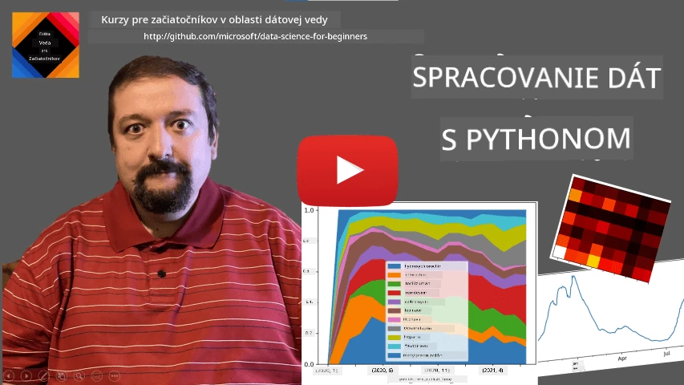
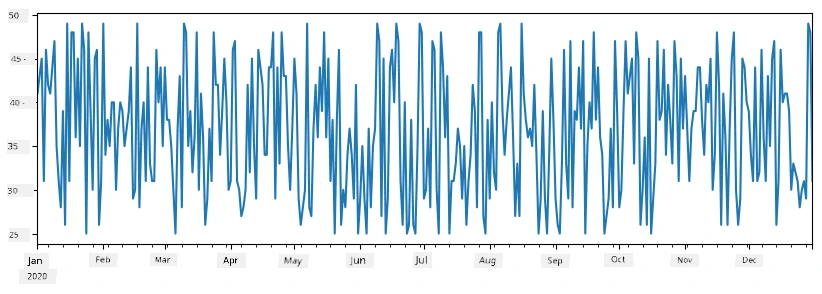
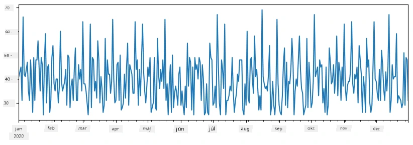
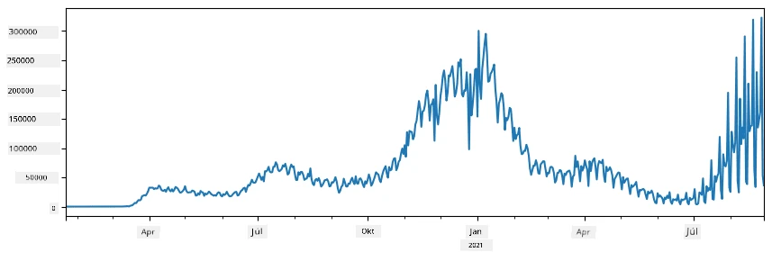
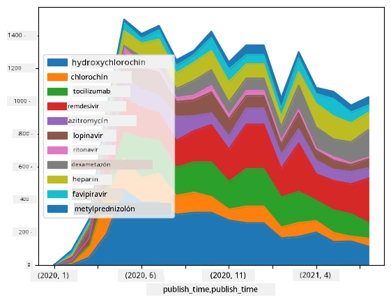

# Práca s dátami: Python a knižnica Pandas

|  ](../../sketchnotes/07-WorkWithPython.png) |
| :-------------------------------------------------------------------------------------------------------: |
|                 Práca s Python - _Sketchnote od [@nitya](https://twitter.com/nitya)_                 |

[](https://youtu.be/dZjWOGbsN4Y)

Kým databázy ponúkajú veľmi efektívne spôsoby ukladania dát a ich dotazovania pomocou dotazovacích jazykov, najflexibilnejším spôsobom spracovania dát je napísanie vlastného programu na manipuláciu s dátami. V mnohých prípadoch by však bolo efektívnejšie použiť dotaz do databázy. Avšak v niektorých prípadoch, keď je potrebné zložitejšie spracovanie dát, to nie je jednoduché vykonať pomocou SQL.
Spracovanie dát možno naprogramovať v akomkoľvek programovacom jazyku, no existujú určité jazyky, ktoré sú z hľadiska práce s dátami na vyššej úrovni. Vedci pracujúci s dátami zvyčajne uprednostňujú jeden z nasledujúcich jazykov:

* **[Python](https://www.python.org/)**, univerzálny programovací jazyk, ktorý je často považovaný za jednu z najlepších volieb pre začiatočníkov kvôli svojej jednoduchosti. Python má veľa ďalších knižníc, ktoré vám môžu pomôcť vyriešiť mnoho praktických problémov, ako napríklad extrahovanie dát zo ZIP archívu alebo konverziu obrázku na odtiene šedej. Okrem dátovej vedy sa Python často používa aj pre webový vývoj.
* **[R](https://www.r-project.org/)** je tradičný nástroj vyvinutý s ohľadom na štatistické spracovanie dát. Obsahuje aj veľké úložisko knižníc (CRAN), čo z neho robí dobrú voľbu pre spracovanie dát. R však nie je univerzálny programovací jazyk a mimo oblasti dátovej vedy sa zriedka používa.
* **[Julia](https://julialang.org/)** je ďalší jazyk vyvinutý špeciálne pre dátovú vedu. Je určený na dosiahnutie lepšieho výkonu ako Python, čo z neho robí skvelý nástroj pre vedecké experimentovanie.

V tejto lekcii sa zameriame na použitie Pythonu pre jednoduché spracovanie dát. Predpokladáme základnú znalosť jazyka. Ak chcete detailnejšie štúdium Pythonu, môžete sa obrátiť na niektorý z nasledujúcich zdrojov:

* [Naučte sa Python hravou formou s Turtle grafikou a fraktálmi](https://github.com/shwars/pycourse) - Rýchly úvodný kurz do programovania v Pythone na GitHub-e
* [Urobte svoje prvé kroky s Pythonom](https://docs.microsoft.com/en-us/learn/paths/python-first-steps/?WT.mc_id=academic-77958-bethanycheum) Výuková cesta na [Microsoft Learn](http://learn.microsoft.com/?WT.mc_id=academic-77958-bethanycheum)

Dáta môžu mať rôzne formy. V tejto lekcii zvážime tri formy dát - **tabuľkové dáta**, **text** a **obrázky**.

Zameriame sa na niekoľko príkladov spracovania dát namiesto poskytovania kompletného prehľadu všetkých súvisiacich knižníc. Toto vám umožní získať základnú predstavu o tom, čo je možné, a zároveň pochopiť, kde nájsť riešenia vašich problémov, keď ich budete potrebovať.

> **Najdôležitejšia rada**. Ak potrebujete vykonať nejakú operáciu s dátami, ktorú neviete, ako spraviť, skúste ju vyhľadať na internete. [Stackoverflow](https://stackoverflow.com/) zvyčajne obsahuje veľa užitočných príkladov kódu v Pythone pre mnohé typické úlohy.


## [Prednáškový kvíz](https://ff-quizzes.netlify.app/en/ds/quiz/12)

## Tabuľkové dáta a Dataframes

Už ste sa stretli s tabuľkovými dátami, keď sme hovorili o relačných databázach. Ak máte veľa dát a tieto sú uložené v mnohých rôznych prepojených tabuľkách, určite dáva zmysel použiť SQL na ich spracovanie. Existuje však veľa prípadov, keď máme tabuľku s dátami a potrebujeme získať nejaké **pochopenie** alebo **prehľad** o týchto dátach, napríklad o rozložení, korelácii medzi hodnotami a pod. V dátovej vede je mnoho prípadov, keď potrebujeme vykonať nejaké transformácie pôvodných dát, nasledované vizualizáciou. Obe tieto kroky je možné ľahko vykonať pomocou Pythonu.

V Pythone existujú dve najpoužívanejšie knižnice, ktoré vám pomôžu pracovať s tabuľkovými dátami:
* **[Pandas](https://pandas.pydata.org/)** umožňuje manipulovať takzvanými **Dataframes**, ktoré sú analogické relačným tabuľkám. Môžete mať pomenované stĺpce a vykonávať rôzne operácie nad riadkami, stĺpcami a dataframe-ami všeobecne.
* **[Numpy](https://numpy.org/)** je knižnica na prácu s **tenzormi**, teda viacrozmernými **polami**. Pole obsahuje hodnoty rovnakého podkladového typu a je jednoduchšie ako dataframe, no ponúka viac matematických operácií a vytvára menší režijný náklad.

Existuje tiež niekoľko ďalších knižníc, ktoré by ste mali poznať:
* **[Matplotlib](https://matplotlib.org/)** je knižnica používaná na vizualizáciu dát a kreslenie grafov
* **[SciPy](https://www.scipy.org/)** je knižnica s niektorými ďalšími vedeckými funkciami. Už sme sa s ňou stretli pri rozprave o pravdepodobnosti a štatistike

Tu je kúsok kódu, ktorý by ste typicky na začiatku svojho Python programu použili na import týchto knižníc:
```python
import numpy as np
import pandas as pd
import matplotlib.pyplot as plt
from scipy import ... # musíte špecifikovať presné podbalíky, ktoré potrebujete
``` 

Pandas je založený na niekoľkých základných konceptoch.

### Series

**Series** je postupnosť hodnôt, podobná zoznamu alebo numpy poľu. Hlavný rozdiel je v tom, že séria má tiež **index** a pri operáciách na sériách (napríklad sčítanie) sa berie do úvahy index. Index môže byť jednoduchý ako celé číslo riadku (čo je štandardný index pri vytváraní série zo zoznamu alebo poľa), alebo môže mať zložitejšiu štruktúru, napríklad dátumový interval.

> **Poznámka**: Úvodný kód pre Pandas je dostupný v priloženom notebooku [`notebook.ipynb`](notebook.ipynb). Tu iba načrtneme niektoré príklady, no určite si môžete pozrieť celý notebook.

Vezmime si príklad: chceme analyzovať predaje nášho stánku s nanukmi. Vygenerujme sériu predajných čísel (počet predaných kusov za každý deň) za isté časové obdobie:

```python
start_date = "Jan 1, 2020"
end_date = "Mar 31, 2020"
idx = pd.date_range(start_date,end_date)
print(f"Length of index is {len(idx)}")
items_sold = pd.Series(np.random.randint(25,50,size=len(idx)),index=idx)
items_sold.plot()
```


Predstavme si, že každý týždeň organizujeme párty pre priateľov a k tomu vezmeme ďalších 10 balíčkov nanukov. Môžeme vytvoriť inú sériu s indexom podľa týždňov, ktorá to ukáže:
```python
additional_items = pd.Series(10,index=pd.date_range(start_date,end_date,freq="W"))
```
Keď sčítame dve série dokopy, dostaneme celkový počet:
```python
total_items = items_sold.add(additional_items,fill_value=0)
total_items.plot()
```


> **Poznámka**: Nevykonávame jednoduchú syntax `total_items+additional_items`. Ak by sme to spravili, výsledná séria by obsahovala veľa hodnôt `NaN` (*Nie číslo*). To je preto, že v sérii `additional_items` chýbajú hodnoty pre niektoré indexové body, a sčítanie s `NaN` vždy vedie k `NaN`. Preto je potrebné špecifikovať parameter `fill_value` počas sčítavania.

Pri časových radoch môžeme tiež **resamplovať** sériu s inými časovými intervalmi. Napríklad, keď chceme vypočítať priemerný objem predaja mesačne, môžeme použiť nasledujúci kód:
```python
monthly = total_items.resample("1M").mean()
ax = monthly.plot(kind='bar')
```


### DataFrame

DataFrame je v podstate kolekcia sérií so spoločným indexom. Môžeme spojiť niekoľko sérií do DataFrame:
```python
a = pd.Series(range(1,10))
b = pd.Series(["I","like","to","play","games","and","will","not","change"],index=range(0,9))
df = pd.DataFrame([a,b])
```
Toto vytvorí horizontálnu tabuľku takúto:
|     | 0   | 1    | 2   | 3   | 4      | 5   | 6      | 7    | 8    |
| --- | --- | ---- | --- | --- | ------ | --- | ------ | ---- | ---- |
| 0   | 1   | 2    | 3   | 4   | 5      | 6   | 7      | 8    | 9    |
| 1   | I   | like | to  | use | Python | and | Pandas | very | much |

Môžeme tiež použiť séria ako stĺpce a pomenovať ich pomocou slovníka:
```python
df = pd.DataFrame({ 'A' : a, 'B' : b })
```
Toto nám dá tabuľku takúto:

|     | A   | B      |
| --- | --- | ------ |
| 0   | 1   | I      |
| 1   | 2   | like   |
| 2   | 3   | to     |
| 3   | 4   | use    |
| 4   | 5   | Python |
| 5   | 6   | and    |
| 6   | 7   | Pandas |
| 7   | 8   | very   |
| 8   | 9   | much   |

**Poznámka**: túto rozloženie tabuľky môžeme získať aj transpozíciou predchádzajúcej tabuľky, napríklad takto
```python
df = pd.DataFrame([a,b]).T.rename(columns={ 0 : 'A', 1 : 'B' })
```
Tu `.T` znamená operáciu transpozície DataFrame, teda výmenu riadkov a stĺpcov, a operácia `rename` nám umožňuje premenovať stĺpce, aby zodpovedali predchádzajúcemu príkladu.

Tu je niekoľko najdôležitejších operácií, ktoré môžeme na DataFrame vykonať:

**Výber stĺpcov**. Môžeme vybrať jednotlivé stĺpce zapísaním `df['A']` - táto operácia vráti Series. Tiež môžeme vybrať podmnožinu stĺpcov do iného DataFrame zapísaním `df[['B','A']]` - to vráti ďalší DataFrame.

**Filtrovanie** iba určitých riadkov podľa kritérií. Napríklad, aby sme vybrali len riadky so stĺpcom `A` väčším ako 5, môžeme zapísať `df[df['A']>5]`.

> **Poznámka**: Filtrovanie prebieha takto. Výraz `df['A']<5` vracia boolovskú sériu, ktorá ukazuje, či je výraz pre každý prvok pôvodnej série `df['A']` pravdivý alebo nepravdivý. Keď sa boolovská séria použije ako index, vráti podmnožinu riadkov v DataFrame. Preto nie je možné použiť ľubovoľný boolovský výraz v Pythone, napríklad `df[df['A']>5 and df['A']<7]` by bolo nesprávne. Namiesto toho treba použiť špeciálnu operáciu `&` na boolovské série, teda `df[(df['A']>5) & (df['A']<7)]` (*zátvorky sú tu dôležité*).

**Vytváranie nových vypočítateľných stĺpcov**. Jednoducho môžeme vytvárať nové stĺpce počítané pre náš DataFrame pomocou intuitívnych výrazov ako tento:
```python
df['DivA'] = df['A']-df['A'].mean() 
``` 
Tento príklad vypočíta odchýlku A od jej priemernej hodnoty. V skutočnosti tu počítame sériu a potom ju priradíme na ľavú stranu, čím vytvoríme ďalší stĺpec. Preto nemôžeme použiť žiadne operácie, ktoré nie sú kompatibilné so sériami, napríklad tento kód nižšie je nesprávny:
```python
# Nesprávny kód -> df['ADescr'] = "Low" ak df['A'] < 5 inak "Hi"
df['LenB'] = len(df['B']) # <- Nesprávny výsledok
``` 
Posledný príklad, hoci je syntakticky správny, dáva nesprávny výsledok, pretože priraďuje dĺžku série `B` ku všetkým hodnotám v stĺpci, a nie dĺžku jednotlivých prvkov, ako sme zamýšľali.

Ak potrebujeme počítať zložité výrazy, môžeme použiť funkciu `apply`. Posledný príklad môžeme zapísať takto:
```python
df['LenB'] = df['B'].apply(lambda x : len(x))
# alebo
df['LenB'] = df['B'].apply(len)
```

Po vykonaní týchto operácií skončíme s nasledujúcim DataFrame:

|     | A   | B      | DivA | LenB |
| --- | --- | ------ | ---- | ---- |
| 0   | 1   | I      | -4.0 | 1    |
| 1   | 2   | like   | -3.0 | 4    |
| 2   | 3   | to     | -2.0 | 2    |
| 3   | 4   | use    | -1.0 | 3    |
| 4   | 5   | Python | 0.0  | 6    |
| 5   | 6   | and    | 1.0  | 3    |
| 6   | 7   | Pandas | 2.0  | 6    |
| 7   | 8   | very   | 3.0  | 4    |
| 8   | 9   | much   | 4.0  | 4    |

**Výber riadkov podľa pozície** môžeme vykonať pomocou konštruktu `iloc`. Napríklad na výber prvých 5 riadkov z DataFrame:
```python
df.iloc[:5]
```

**Zoskupovanie** sa často používa na získanie výsledku podobného *kontingenčným tabuľkám* v Exceli. Predpokladajme, že chceme vypočítať priemernú hodnotu stĺpca `A` pre každú danú hodnotu `LenB`. V takom prípade môžeme DataFrame zoskupiť podľa `LenB` a zavolať `mean`:
```python
df.groupby(by='LenB')[['A','DivA']].mean()
```
Ak potrebujeme vypočítať priemer aj počet prvkov v skupine, môžeme použiť zložitejšiu funkciu `aggregate`:
```python
df.groupby(by='LenB') \
 .aggregate({ 'DivA' : len, 'A' : lambda x: x.mean() }) \
 .rename(columns={ 'DivA' : 'Count', 'A' : 'Mean'})
```
Toto nám dá nasledujúcu tabuľku:

| LenB | Count | Mean     |
| ---- | ----- | -------- |
| 1    | 1     | 1.000000 |
| 2    | 1     | 3.000000 |
| 3    | 2     | 5.000000 |
| 4    | 3     | 6.333333 |
| 6    | 2     | 6.000000 |

### Získavanie dát


Videli sme, aké jednoduché je vytvoriť Series a DataFrames z Python objektov. Dáta však zvyčajne prichádzajú vo forme textového súboru alebo Excel tabuľky. Našťastie nám Pandas ponúka jednoduchý spôsob, ako načítať dáta z disku. Napríklad čítanie CSV súboru je také jednoduché ako toto:
```python
df = pd.read_csv('file.csv')
```
Uvidíme viac príkladov načítania dát, vrátane ich získavania z externých web stránok, v sekcii "Výzva"


### Tlač a grafy

Data Scientist často musí skúmať dáta, preto je dôležité ich vedieť vizualizovať. Keď je DataFrame veľký, často chceme len overiť, že všetko robíme správne, vytlačením prvých niekoľkých riadkov. To sa dá urobiť zavolaním `df.head()`. Ak to spúšťate v Jupyter Notebooku, vytlačí DataFrame v peknej tabuľkovej forme.

Videli sme tiež použitie funkcie `plot` na vizualizáciu niektorých stĺpcov. Zatiaľ čo `plot` je veľmi užitočný pre mnoho úloh a podporuje mnoho rôznych typov grafov pomocou parametra `kind=`, vždy môžete použiť priamo knižnicu `matplotlib` na vykreslenie niečoho zložitejšieho. Podrobne budeme vizualizáciu dát pokrývať v samostatných lekciách kurzu.

Tento prehľad zahŕňa najdôležitejšie koncepty Pandas, avšak knižnica je veľmi bohatá a neexistuje žiadny limit tomu, čo s ňou môžete robiť! Teraz aplikujme tieto poznatky na riešenie konkrétneho problému.

## 🚀 Výzva 1: Analýza šírenia COVID

Prvým problémom, na ktorý sa zameriame, je modelovanie šírenia epidémie COVID-19. Na to použijeme dáta o počte nakazených v rôznych krajinách, ktoré poskytuje [Center for Systems Science and Engineering](https://systems.jhu.edu/) (CSSE) na [Johns Hopkins University](https://jhu.edu/). Dataset je dostupný v [tomto GitHub repozitári](https://github.com/CSSEGISandData/COVID-19).

Keďže chceme ukázať, ako pracovať s dátami, pozývame vás otvoriť [`notebook-covidspread.ipynb`](notebook-covidspread.ipynb) a prečítať ho od začiatku po koniec. Môžete tiež vykonávať bunky a riešiť niektoré výzvy, ktoré sme vám nechali na konci.



> Ak neviete, ako spustiť kód v Jupyter Notebooku, pozrite si [tento článok](https://soshnikov.com/education/how-to-execute-notebooks-from-github/).

## Práca s nestruktúrovanými dátami

Hoci dáta veľmi často prichádzajú v tabuľkovej forme, v niektorých prípadoch musíme pracovať s menej štruktúrovanými dátami, napríklad textom alebo obrázkami. V takom prípade, aby sme mohli použiť techniky spracovania dát, ktoré sme videli vyššie, musíme nejako **extrahovať** štruktúrované dáta. Tu je niekoľko príkladov:

* Extrahovanie kľúčových slov z textu a zisťovanie, ako často sa tieto kľúčové slová vyskytujú
* Použitie neurónových sietí na extrahovanie informácií o objektoch na obrázku
* Získavanie informácií o emóciách ľudí na videu z kamery

## 🚀 Výzva 2: Analýza COVID článkov

V tejto výzve budeme pokračovať v téme pandémie COVID a zameriame sa na spracovanie vedeckých článkov o tomto predmete. Existuje [CORD-19 Dataset](https://www.kaggle.com/allen-institute-for-ai/CORD-19-research-challenge) s viac ako 7000 (v čase písania) článkami o COVID, dostupnými s metadátami a abstraktmi (a pre približne polovicu z nich je k dispozícii aj celý text).

Kompletný príklad analýzy tohto datasetu pomocou kognitívnej služby [Text Analytics for Health](https://docs.microsoft.com/azure/cognitive-services/text-analytics/how-tos/text-analytics-for-health/?WT.mc_id=academic-77958-bethanycheum) je opísaný [v tomto blogovom príspevku](https://soshnikov.com/science/analyzing-medical-papers-with-azure-and-text-analytics-for-health/). Prediskutujeme zjednodušenú verziu tejto analýzy.

> **NOTE**: Nekopírujeme dataset ako súčasť tohto repozitára. Najprv možno budete musieť stiahnuť súbor [`metadata.csv`](https://www.kaggle.com/allen-institute-for-ai/CORD-19-research-challenge?select=metadata.csv) z [tohto datasetu na Kaggle](https://www.kaggle.com/allen-institute-for-ai/CORD-19-research-challenge). Môže byť potrebná registrácia na Kaggle. Dataset si môžete stiahnuť aj bez registrácie [tu](https://ai2-semanticscholar-cord-19.s3-us-west-2.amazonaws.com/historical_releases.html), ale bude obsahovať všetky plné texty okrem metadát.

Otvorte [`notebook-papers.ipynb`](notebook-papers.ipynb) a prečítajte ho od začiatku po koniec. Môžete tiež spúšťať bunky a riešiť výzvy, ktoré sme vám nechali na konci.



## Spracovanie obrazových dát

Nedávno boli vyvinuté veľmi výkonné AI modely, ktoré nám umožňujú rozumieť obrázkom. Existuje mnoho úloh, ktoré je možné vyriešiť pomocou predtrénovaných neurónových sietí alebo cloudových služieb. Niekoľko príkladov:

* **Klasifikácia obrázkov**, ktorá vám pomôže kategorizovať obrázok do jednej z preddefinovaných tried. Môžete si ľahko vytrénovať vlastné klasifikátory obrázkov pomocou služieb ako [Custom Vision](https://azure.microsoft.com/services/cognitive-services/custom-vision-service/?WT.mc_id=academic-77958-bethanycheum)
* **Detekcia objektov** na rozpoznanie rôznych objektov na obrázku. Služby ako [computer vision](https://azure.microsoft.com/services/cognitive-services/computer-vision/?WT.mc_id=academic-77958-bethanycheum) dokážu detegovať množstvo bežných objektov a môžete vytrénovať model [Custom Vision](https://azure.microsoft.com/services/cognitive-services/custom-vision-service/?WT.mc_id=academic-77958-bethanycheum) na detekciu niektorých konkrétnych objektov.
* **Detekcia tváre**, vrátane rozpoznávania veku, pohlavia a emócií. Toto sa dá zrealizovať cez [Face API](https://azure.microsoft.com/services/cognitive-services/face/?WT.mc_id=academic-77958-bethanycheum).

Všetky tieto cloudové služby je možné volať pomocou [Python SDKs](https://docs.microsoft.com/samples/azure-samples/cognitive-services-python-sdk-samples/cognitive-services-python-sdk-samples/?WT.mc_id=academic-77958-bethanycheum), a teda ich ľahko integrovať do vášho workflow prieskumu dát.

Tu je niekoľko príkladov skúmania dát z obrazových zdrojov:
* V blogovom príspevku [How to Learn Data Science without Coding](https://soshnikov.com/azure/how-to-learn-data-science-without-coding/) skúmame fotografie z Instagramu, snažiac sa pochopiť, čo spôsobuje, že ľudia dávajú fotografie viac lajkov. Najskôr extrahujeme čo najviac informácií z obrázkov pomocou [computer vision](https://azure.microsoft.com/services/cognitive-services/computer-vision/?WT.mc_id=academic-77958-bethanycheum), a potom použijeme [Azure Machine Learning AutoML](https://docs.microsoft.com/azure/machine-learning/concept-automated-ml/?WT.mc_id=academic-77958-bethanycheum) na vybudovanie interpretovateľného modelu.
* V [Facial Studies Workshop](https://github.com/CloudAdvocacy/FaceStudies) používame [Face API](https://azure.microsoft.com/services/cognitive-services/face/?WT.mc_id=academic-77958-bethanycheum) na extrahovanie emócií ľudí na fotografiách z rôznych podujatí, aby sme sa pokúsili pochopiť, čo robí ľudí šťastnými.

## Záver

Či už máte štruktúrované alebo nestruktúrované dáta, pomocou Pythonu môžete vykonávať všetky kroky súvisiace so spracovaním a pochopením dát. Je to pravdepodobne najflexibilnejší spôsob spracovania dát, a preto väčšina dátových vedcov používa Python ako svoj primárny nástroj. Hlbšie učenie Pythonu je určite dobrý nápad, ak to so svojou dátovou vedeckou cestou myslíte vážne!

## [Kvíz po prednáške](https://ff-quizzes.netlify.app/en/ds/quiz/13)

## Prehľad a samostatné štúdium

**Knihy**
* [Wes McKinney. Python for Data Analysis: Data Wrangling with Pandas, NumPy, and IPython](https://www.amazon.com/gp/product/1491957662)

**Online zdroje**
* Oficiálny [10 minutes to Pandas](https://pandas.pydata.org/pandas-docs/stable/user_guide/10min.html) tutoriál
* [Dokumentácia ku vizualizácii v Pandas](https://pandas.pydata.org/pandas-docs/stable/user_guide/visualization.html)

**Učenie sa Pythonu**
* [Naučte sa Python zábavnou formou cez Turtle Graphics a Fraktály](https://github.com/shwars/pycourse)
* [Urobte prvé kroky s Python](https://docs.microsoft.com/learn/paths/python-first-steps/?WT.mc_id=academic-77958-bethanycheum) Learning Path na [Microsoft Learn](http://learn.microsoft.com/?WT.mc_id=academic-77958-bethanycheum)

## Zadanie

[Vykonajte detailnejšiu štúdiu dát pre vyššie uvedené výzvy](assignment.md)

## Zdroje

Túto lekciu pripravil s ♥️ [Dmitry Soshnikov](http://soshnikov.com)

---

<!-- CO-OP TRANSLATOR DISCLAIMER START -->
**Vyhlásenie o zodpovednosti**:
Tento dokument bol preložený pomocou AI prekladateľskej služby [Co-op Translator](https://github.com/Azure/co-op-translator). Hoci sa snažíme o presnosť, vezmite prosím na vedomie, že automatické preklady môžu obsahovať chyby alebo nepresnosti. Pôvodný dokument v jeho natívnom jazyku by mal byť považovaný za autoritatívny zdroj. Pre kritické informácie sa odporúča profesionálny ľudský preklad. Nie sme zodpovední za žiadne nedorozumenia alebo nesprávne interpretácie vyplývajúce z použitia tohto prekladu.
<!-- CO-OP TRANSLATOR DISCLAIMER END -->