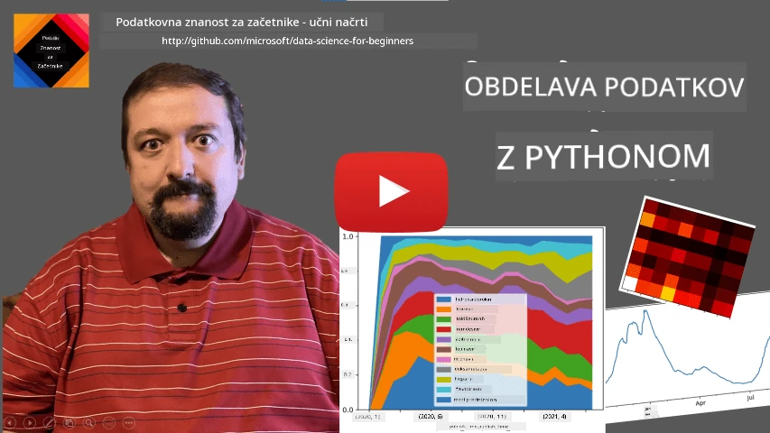
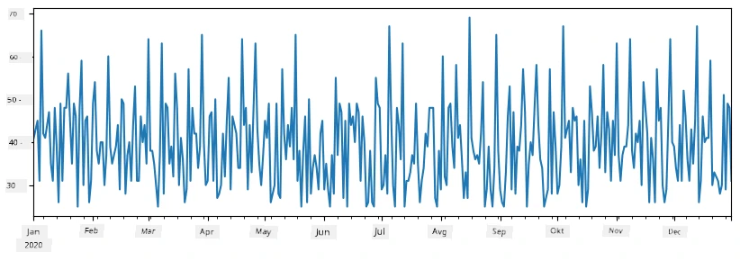
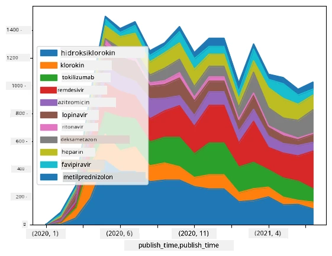

# Delo z podatki: Python in knjižnica Pandas

|  ](../../sketchnotes/07-WorkWithPython.png) |
| :-------------------------------------------------------------------------------------------------------: |
|                 Delo s Pythonom - _Sketchnote avtorja [@nitya](https://twitter.com/nitya)_                 |

[](https://youtu.be/dZjWOGbsN4Y)

Medtem ko baze podatkov ponujajo zelo učinkovite načine shranjevanja podatkov in poizvedovanja z uporabo poizvedovalnih jezikov, je najbolj prilagodljiv način obdelave podatkov pisanje lastnega programa za manipulacijo s podatki. V mnogih primerih je izvedba poizvedbe v bazi podatkov učinkovitejši način. Vendar pa v nekaterih primerih, ko je potrebna bolj kompleksna obdelava podatkov, tega ni mogoče enostavno narediti z uporabo SQL.
Obdelavo podatkov je mogoče programirati v kateremkoli programskem jeziku, vendar obstajajo določeni jeziki, ki so na višji ravni glede dela s podatki. Podatkovni znanstveniki običajno dajejo prednost enemu od naslednjih jezikov:

* **[Python](https://www.python.org/)**, splošni programski jezik, ki ga pogosto štejemo za eno najboljših možnosti za začetnike zaradi njegove enostavnosti. Python ima veliko dodatnih knjižnic, ki vam lahko pomagajo rešiti številne praktične probleme, kot so izvleka podatkov iz ZIP arhiva ali pretvorba slike v sivinsko lestvico. Poleg podatkovne znanosti se Python pogosto uporablja tudi za razvoj spletnih aplikacij.
* **[R](https://www.r-project.org/)** je tradicionalno orodje razvito z mislijo na statistično obdelavo podatkov. Vsebuje tudi veliko zbirko knjižnic (CRAN), kar ga naredi dobro izbiro za obdelavo podatkov. Vendar pa R ni splošni programski jezik in se redko uporablja zunaj področja podatkovne znanosti.
* **[Julia](https://julialang.org/)** je še en jezik, razvit posebej za podatkovno znanost. Namenjen je zagotavljanju boljše zmogljivosti kot Python, zaradi česar je odlično orodje za znanstvene eksperimente.

V tej lekciji se bomo osredotočili na uporabo Pythona za preprosto obdelavo podatkov. Predpostavljamo osnovno seznanjenost z jezikom. Če želite bolj poglobljen pregled Pythona, se lahko obrnete na enega od naslednjih virov:

* [Nauči se Python na zabaven način z želkasto grafiko in fraktali](https://github.com/shwars/pycourse) - hitri uvodni tečaj programiranja v Pythonu na GitHubu
* [Naredi prve korake s Pythonom](https://docs.microsoft.com/en-us/learn/paths/python-first-steps/?WT.mc_id=academic-77958-bethanycheum) - učna pot na [Microsoft Learn](http://learn.microsoft.com/?WT.mc_id=academic-77958-bethanycheum)

Podatki so lahko v različnih oblikah. V tej lekciji bomo obravnavali tri oblike podatkov - **tabelarične podatke**, **besedilo** in **slike**.

Osredotočili se bomo na nekaj primerov obdelave podatkov, namesto da bi vam dali celovit pregled vseh povezanih knjižnic. To vam bo omogočilo, da dobite osnovno predstavo o tem, kaj je mogoče, in vam dalo razumevanje, kje najti rešitve za vaše težave, ko jih boste potrebovali.

> **Najbolj uporaben nasvet**. Ko morate izvesti določeno operacijo na podatkih, ki ne veste, kako jo narediti, poskusite to poiskati na internetu. [Stackoverflow](https://stackoverflow.com/) običajno vsebuje veliko koristnih primerov kode v Pythonu za številne tipične naloge.


## [Predpredavanje kviz](https://ff-quizzes.netlify.app/en/ds/quiz/12)

## Tabelarni podatki in podatkovni okviri (Dataframes)

Tabelarne podatke ste že srečali, ko smo govorili o relacijskih bazah podatkov. Ko imate veliko podatkov, ki so vsebovani v mnogih različnih povezanih tabelah, ima zagotovo smisel uporabljati SQL za delo z njimi. Vendar pa je veliko primerov, ko imamo tabelo podatkov in želimo pridobiti nekaj **razumevanja** ali **vpogledov** v te podatke, kot so porazdelitev, korelacija med vrednostmi itd. V podatkovni znanosti je veliko primerov, ko moramo izvesti nekatere transformacije izvornih podatkov, ki ji sledita vizualizacija. Obe koraki lahko enostavno izvedemo z uporabo Pythona.

Obstajata dve najbolj uporabni knjižnici v Pythonu, ki vam lahko pomagata pri delu s tabelarnimi podatki:
* **[Pandas](https://pandas.pydata.org/)** omogoča manipulacijo s t.i. **Dataframes** (podatkovnimi okviri), ki so analogni relacijskim tabelam. Lahko imate imenovane stolpce in izvajate različne operacije na vrsticah, stolpcih in podatkovnih okvirih na splošno.
* **[Numpy](https://numpy.org/)** je knjižnica za delo s **tenzorji**, tj. večdimenzionalnimi **tabelami** (array). Tabela ima vrednosti istega osnovnega tipa in je preprostejša od podatkovnega okvira, vendar ponuja več matematičnih operacij in ustvarja manj režijskih stroškov.

Obstaja tudi še nekaj drugih knjižnic, ki jih je dobro poznati:
* **[Matplotlib](https://matplotlib.org/)** je knjižnica za vizualizacijo podatkov in risanje grafov
* **[SciPy](https://www.scipy.org/)** je knjižnica z dodatnimi znanstvenimi funkcijami. S to knjižnico smo se že srečali pri obravnavi verjetnosti in statistike

Tukaj je kos kode, ki ga običajno uporabljate za uvoz teh knjižnic na začetku vašega Python programa:
```python
import numpy as np
import pandas as pd
import matplotlib.pyplot as plt
from scipy import ... # morate navesti natančne podpakete, ki jih potrebujete
``` 

Pandas temelji na nekaj osnovnih konceptih.

### Serija (Series)

**Series** je zaporedje vrednosti, podobno kot seznam ali numpy tabela. Glavna razlika je, da ima serija tudi **indeks** in ko izvajamo operacije na serijah (npr. seštevanje), se indeks upošteva. Indeks je lahko preprosto število vrstice (to je indeks, ki se privzeto uporablja pri ustvarjanju serije iz seznama ali tabele), ali pa ima kompleksno strukturo, kot je časovni interval.

> **Opomba**: Nekaj uvodne Pandas kode najdete v pripadajoči beležnici [`notebook.ipynb`](notebook.ipynb). Tukaj navedemo le nekaj primerov in zagotovo ste vabljeni, da si ogledate celotno beležnico.

Vzemimo primer: želimo analizirati prodajo naše sladoledne trgovine. Ustvarimo serijo prodajnih številk (število prodanih enot na dan) za določeno časovno obdobje:

```python
start_date = "Jan 1, 2020"
end_date = "Mar 31, 2020"
idx = pd.date_range(start_date,end_date)
print(f"Length of index is {len(idx)}")
items_sold = pd.Series(np.random.randint(25,50,size=len(idx)),index=idx)
items_sold.plot()
```


Recimo, da vsako soboto priredimo zabavo za prijatelje in vzamemo dodatnih 10 paketov sladoleda za zabavo. Lahko ustvarimo drugo serijo, indeksirano po tednih, da to pokažemo:
```python
additional_items = pd.Series(10,index=pd.date_range(start_date,end_date,freq="W"))
```
Ko seštejemo dve seriji, dobimo skupno število:
```python
total_items = items_sold.add(additional_items,fill_value=0)
total_items.plot()
```


> **Opomba**, da ne uporabljamo preproste sintakse `total_items+additional_items`. Če bi jo, bi dobili veliko vrednosti `NaN` (*Not a Number*) v nastali seriji. To je zato, ker manjkajo vrednosti za nekatere indeksne položaje v seriji `additional_items` in seštevanje `NaN` z čimkoli vrne `NaN`. Zato moramo med seštevanjem navesti parameter `fill_value`.

Pri časovnih serijah lahko tudi **ponovno vzorčimo** serijo z različnimi časovnimi intervali. Na primer, če želimo izračunati povprečni prodajni volumen mesečno, lahko uporabimo naslednjo kodo:
```python
monthly = total_items.resample("1M").mean()
ax = monthly.plot(kind='bar')
```


### Podatkovni okvir (DataFrame)

Podatkovni okvir je v bistvu zbirka serij s istim indeksom. Lahko združimo več serij v en podatkovni okvir:
```python
a = pd.Series(range(1,10))
b = pd.Series(["I","like","to","play","games","and","will","not","change"],index=range(0,9))
df = pd.DataFrame([a,b])
```
To bo ustvarilo horizontalno tabelo, kot je ta:
|     | 0   | 1    | 2   | 3   | 4      | 5   | 6      | 7    | 8    |
| --- | --- | ---- | --- | --- | ------ | --- | ------ | ---- | ---- |
| 0   | 1   | 2    | 3   | 4   | 5      | 6   | 7      | 8    | 9    |
| 1   | I   | like | to  | use | Python | and | Pandas | very | much |

Lahko uporabimo tudi Series kot stolpce in določimo imena stolpcev z uporabo slovarja:
```python
df = pd.DataFrame({ 'A' : a, 'B' : b })
```
To nam bo dalo tabelo, kot je ta:

|     | A   | B      |
| --- | --- | ------ |
| 0   | 1   | I      |
| 1   | 2   | like   |
| 2   | 3   | to     |
| 3   | 4   | use    |
| 4   | 5   | Python |
| 5   | 6   | and    |
| 6   | 7   | Pandas |
| 7   | 8   | very   |
| 8   | 9   | much   |

**Opomba**, da lahko to postavitev tabele dobimo tudi z transponiranjem prejšnje tabele, npr. s pisanjem 
```python
df = pd.DataFrame([a,b]).T.rename(columns={ 0 : 'A', 1 : 'B' })
```
Tu `.T` pomeni operacijo transponiranja podatkovnega okvira, tj. menjavo vrstic in stolpcev, in operacija `rename` nam omogoča preimenovanje stolpcev, da se ujame prejšnji primer.

Tukaj je nekaj najpomembnejših operacij, ki jih lahko izvajamo na podatkovnih okvirih:

**Izbira stolpcev**. Posamezne stolpce lahko izberemo z zapisom `df['A']` - ta operacija vrne Series. Lahko tudi izberemo podmnožico stolpcev v drug DataFrame z zapisom `df[['B','A']]` - to vrne drugi DataFrame.

**Filtriranje** samo določenih vrstic glede na kriterije. Na primer, da pustimo le vrstice, kjer je stolpec `A` večji od 5, napišemo `df[df['A']>5]`.

> **Opomba**: Filtriranje deluje tako. Izraz `df['A']<5` vrne logično serijo, ki kaže, ali je izraz `True` ali `False` za vsak element izvorne serije `df['A']`. Ko se logična serija uporabi kot indeks, vrne podmnožico vrstic v podatkovnem okviru. Zato ni mogoče uporabiti poljubnih Python logičnih izrazov, na primer `df[df['A']>5 and df['A']<7]` bi bilo napačno. Namesto tega morate uporabiti poseben operator `&` za logične serije, npr. `df[(df['A']>5) & (df['A']<7)]` (*oklepaji so tukaj pomembni*).

**Ustvarjanje novih izračunljivih stolpcev**. Zlahka ustvarimo nove izračunljive stolpce za naš DataFrame z uporabo intuitivnih izrazov, kot je ta:
```python
df['DivA'] = df['A']-df['A'].mean() 
``` 
Ta primer izračuna odklon A od njegove povprečne vrednosti. Dejstvo je, da izračunamo serijo in jo nato dodelimo na levo stran, s čimer ustvarimo nov stolpec. Zato ne moremo uporabljati operacij, ki niso združljive s serijami, na primer spodnja koda je napačna:
```python
# Napačna koda -> df['ADescr'] = "Nizka" če je df['A'] < 5 sicer "Visoka"
df['LenB'] = len(df['B']) # <- Napačen rezultat
``` 
Zadnji primer, čeprav sintaktično pravilen, da napačen rezultat, ker dodeli dolžino serije `B` vsem vrednostim stolpca in ne dolžine posameznih elementov, kot smo želeli.

Če moramo izračunati kompleksne izraze, lahko uporabimo funkcijo `apply`. Zadnji primer lahko napišemo takole:
```python
df['LenB'] = df['B'].apply(lambda x : len(x))
# ali
df['LenB'] = df['B'].apply(len)
```

Po zgornjih operacijah bomo dobili naslednji podatkovni okvir:

|     | A   | B      | DivA | LenB |
| --- | --- | ------ | ---- | ---- |
| 0   | 1   | I      | -4.0 | 1    |
| 1   | 2   | like   | -3.0 | 4    |
| 2   | 3   | to     | -2.0 | 2    |
| 3   | 4   | use    | -1.0 | 3    |
| 4   | 5   | Python | 0.0  | 6    |
| 5   | 6   | and    | 1.0  | 3    |
| 6   | 7   | Pandas | 2.0  | 6    |
| 7   | 8   | very   | 3.0  | 4    |
| 8   | 9   | much   | 4.0  | 4    |

**Izbira vrstic glede na številke** lahko poteka z uporabo konstrukta `iloc`. Na primer, da izberemo prvih 5 vrstic iz podatkovnega okvira:
```python
df.iloc[:5]
```

**Grupiranje** se pogosto uporablja za dosego rezultata, podobnega *vrtiljam* (pivot tables) v Excelu. Recimo, da želimo izračunati povprečno vrednost stolpca `A` za vsako dano število `LenB`. Potem lahko združimo naš DataFrame po `LenB` in pokličemo `mean`:
```python
df.groupby(by='LenB')[['A','DivA']].mean()
```
Če moramo izračunati tako povprečje kot število elementov v skupini, lahko uporabimo kompleksnejšo funkcijo `aggregate`:
```python
df.groupby(by='LenB') \
 .aggregate({ 'DivA' : len, 'A' : lambda x: x.mean() }) \
 .rename(columns={ 'DivA' : 'Count', 'A' : 'Mean'})
```
To nam daje naslednjo tabelo:

| LenB | Count | Mean     |
| ---- | ----- | -------- |
| 1    | 1     | 1.000000 |
| 2    | 1     | 3.000000 |
| 3    | 2     | 5.000000 |
| 4    | 3     | 6.333333 |
| 6    | 2     | 6.000000 |

### Pridobivanje podatkov


Videli smo, kako enostavno je sestaviti Series in DataFrames iz Python objektov. Vendar pa podatki običajno prihajajo v obliki besedilne datoteke ali Excelove tabele. Na srečo nam Pandas ponuja enostaven način za nalaganje podatkov z diska. Na primer, branje CSV datoteke je tako preprosto:
```python
df = pd.read_csv('file.csv')
```
Videli bomo še več primerov nalaganja podatkov, vključno s pridobivanjem s spletnih strani, v razdelku "Izziv"


### Izpisovanje in Risanje grafov

Data Scientist pogosto mora raziskovati podatke, zato je pomembno, da jih lahko vizualizira. Ko je DataFrame velik, si pogosto želimo samo preveriti, ali delamo pravilno, tako da izpišemo prvih nekaj vrstic. To lahko storimo z klicem `df.head()`. Če to izvajate v Jupyter Notebook, bo izpisal DataFrame v lepi tabelarični obliki.

Videli smo tudi uporabo funkcije `plot` za vizualizacijo nekaterih stolpcev. Medtem ko je `plot` zelo uporaben za mnoge naloge in podpira različne tipe grafov preko parametra `kind=`, lahko vedno uporabite surovo knjižnico `matplotlib` za risanje nekaj bolj zapletenega. Vizualizacijo podatkov bomo podrobno obravnavali v ločenih lekcijah.

Ta pregled pokriva najpomembnejše koncepte PANDAS-a, vendar je knjižnica zelo bogata in ni omejitev, kaj vse lahko z njo naredite! Zdaj pa uporabimo to znanje za reševanje specifične težave.

## 🚀 Izziv 1: Analiza širjenja COVID-a

Prva težava, na kateri se bomo osredotočili, je modeliranje širjenja epidemije COVID-19. Za to bomo uporabili podatke o številu okuženih oseb v različnih državah, ki jih zagotavlja [Center for Systems Science and Engineering](https://systems.jhu.edu/) (CSSE) na [Johns Hopkins University](https://jhu.edu/). Podatkovni niz je na voljo v [tem GitHub repozitoriju](https://github.com/CSSEGISandData/COVID-19).

Ker želimo prikazati, kako ravnati s podatki, vas vabimo, da odprete [`notebook-covidspread.ipynb`](notebook-covidspread.ipynb) in ga preberete od začetka do konca. Lahko tudi izvedete celice in naredite nekaj izzivov, ki smo jih za vas pripravili na koncu.


> Če ne veste, kako zagnati kodo v Jupyter Notebook, si oglejte [ta članek](https://soshnikov.com/education/how-to-execute-notebooks-from-github/).

## Delo z nestrukturiranimi podatki

Čeprav podatki zelo pogosto prihajajo v tabelarični obliki, v nekaterih primerih moramo delati z manj strukturiranimi podatki, na primer z besedilom ali slikami. V tem primeru, da bi uporabili tehnike obdelave podatkov, ki smo jih videli zgoraj, moramo nekako **izluščiti** strukturirane podatke. Tukaj je nekaj primerov:

* Izluščevanje ključnih besed iz besedila in pregled, kako pogosto se te ključne besede pojavljajo
* Uporaba nevronskih mrež za izluščevanje informacij o objektih na sliki
* Pridobivanje podatkov o čustvih ljudi na video posnetku

## 🚀 Izziv 2: Analiza COVID publikacij

V tem izzivu bomo nadaljevali s temo pandemije COVID in se osredotočili na obdelavo znanstvenih člankov o tej temi. Obstaja [CORD-19 Dataset](https://www.kaggle.com/allen-institute-for-ai/CORD-19-research-challenge) z več kot 7000 (ob času pisanja) članki o COVID-u, na voljo z metapodatki in povzetki (za približno polovico izmed njih je na voljo tudi celotno besedilo).

Celovit primer analize tega podatkovnega nabora z uporabo kognitivne storitve [Text Analytics for Health](https://docs.microsoft.com/azure/cognitive-services/text-analytics/how-tos/text-analytics-for-health/?WT.mc_id=academic-77958-bethanycheum) je opisan [v tem blog zapisu](https://soshnikov.com/science/analyzing-medical-papers-with-azure-and-text-analytics-for-health/). Obravnavali bomo poenostavljeno različico te analize.

> **OPOMBA**: Kopije podatkovnega nabora ne zagotavljamo v tem repozitoriju. Najprej boste morali prenesti datoteko [`metadata.csv`](https://www.kaggle.com/allen-institute-for-ai/CORD-19-research-challenge?select=metadata.csv) iz [tega nabora podatkov na Kaggle](https://www.kaggle.com/allen-institute-for-ai/CORD-19-research-challenge). Morda bo potrebna registracija pri Kaggle. Podatkovni niz lahko prenesete tudi brez registracije [tukaj](https://ai2-semanticscholar-cord-19.s3-us-west-2.amazonaws.com/historical_releases.html), vendar bo vseboval celotna besedila poleg datoteke z metapodatki.

Odprite [`notebook-papers.ipynb`](notebook-papers.ipynb) in ga preberite od začetka do konca. Prav tako lahko izvedete celice in naredite nekaj izzivov, ki smo jih za vas pripravili na koncu.



## Obdelava slikovnih podatkov

Nedavno so bili razviti zelo zmogljivi modeli umetne inteligence, ki nam omogočajo razumevanje slik. Obstaja veliko nalog, ki jih lahko rešimo z uporabo predtreniranih nevronskih mrež ali oblačnih storitev. Nekaj primerov vključuje:

* **Klasifikacija slik**, ki vam pomaga kategorizirati sliko v eno od vnaprej določenih kategorij. S storitvami, kot je [Custom Vision](https://azure.microsoft.com/services/cognitive-services/custom-vision-service/?WT.mc_id=academic-77958-bethanycheum), lahko enostavno trenirate svoje lastne klasifikatorje slik
* **Detekcija objektov** za zaznavanje različnih objektov na sliki. Storitev, kot je [computer vision](https://azure.microsoft.com/services/cognitive-services/computer-vision/?WT.mc_id=academic-77958-bethanycheum), lahko zazna nekaj pogostih objektov, prav tako pa lahko s [Custom Vision](https://azure.microsoft.com/services/cognitive-services/custom-vision-service/?WT.mc_id=academic-77958-bethanycheum) modelom trenirate zaznavanje specifičnih zanimivih objektov.
* **Zaznavanje obraza**, vključno z zaznavanjem starosti, spola in čustev. To je mogoče storiti preko [Face API](https://azure.microsoft.com/services/cognitive-services/face/?WT.mc_id=academic-77958-bethanycheum).

Vse te oblačne storitve je mogoče klicati s pomočjo [Python SDK-jev](https://docs.microsoft.com/samples/azure-samples/cognitive-services-python-sdk-samples/cognitive-services-python-sdk-samples/?WT.mc_id=academic-77958-bethanycheum), zato jih lahko enostavno vključite v vaš delovni tok raziskovanja podatkov.

Tukaj je nekaj primerov raziskovanja podatkov iz slikovnih virov:
* V blog zapisu [Kako se naučiti data science brez kodiranja](https://soshnikov.com/azure/how-to-learn-data-science-without-coding/) raziskujemo fotografije z Instagrama in poskušamo razumeti, kaj ljudem povzroči, da dajo več like-ov na fotografijo. Najprej izluščimo čim več informacij iz slik s pomočjo [computer vision](https://azure.microsoft.com/services/cognitive-services/computer-vision/?WT.mc_id=academic-77958-bethanycheum), nato pa z uporabo [Azure Machine Learning AutoML](https://docs.microsoft.com/azure/machine-learning/concept-automated-ml/?WT.mc_id=academic-77958-bethanycheum) sestavimo interpretabilni model.
* V [Delavnici za študije obraza](https://github.com/CloudAdvocacy/FaceStudies) uporabljamo [Face API](https://azure.microsoft.com/services/cognitive-services/face/?WT.mc_id=academic-77958-bethanycheum) za izluščenje čustev ljudi na fotografijah z dogodkov, da bi poskušali razumeti, kaj ljudi osrečuje.

## Zaključek

Ne glede na to, ali že imate strukturirane ali nestrukturirane podatke, lahko z uporabo Pythona izvedete vse korake, povezane z obdelavo in razumevanjem podatkov. Verjetno je to najbolj prilagodljiv način obdelave podatkov in zato večina data scientistov uporablja Python kot svoje glavno orodje. Poglobljeno učenje Pythona je verjetno dobra ideja, če torej mislite resno o svoji poti v data science!

## [Kvizz po predavanju](https://ff-quizzes.netlify.app/en/ds/quiz/13)

## Pregled & Samostojno učenje

**Knjige**
* [Wes McKinney. Python for Data Analysis: Data Wrangling with Pandas, NumPy, and IPython](https://www.amazon.com/gp/product/1491957662)

**Spletni viri**
* Uradni [10-minutni vodič za Pandas](https://pandas.pydata.org/pandas-docs/stable/user_guide/10min.html)
* [Dokumentacija o Pandas vizualizaciji](https://pandas.pydata.org/pandas-docs/stable/user_guide/visualization.html)

**Učenje Pythona**
* [Nauči se Python na zabaven način z nepremošljanjem želve in fraktali](https://github.com/shwars/pycourse)
* [Naredi prve korake s Pythonom](https://docs.microsoft.com/learn/paths/python-first-steps/?WT.mc_id=academic-77958-bethanycheum) učno pot na [Microsoft Learn](http://learn.microsoft.com/?WT.mc_id=academic-77958-bethanycheum)

## Naloga

[Izvedi podrobnejšo analizo podatkov za zgoraj navedene izzive](assignment.md)

## Zahvale

To lekcijo je z ljubeznijo avtoriral [Dmitry Soshnikov](http://soshnikov.com)

---

<!-- CO-OP TRANSLATOR DISCLAIMER START -->
**Omejitev odgovornosti**:
Ta dokument je bil preveden z uporabo AI prevajalske storitve [Co-op Translator](https://github.com/Azure/co-op-translator). Čeprav si prizadevamo za natančnost, vas prosimo, da upoštevate, da avtomatizirani prevodi lahko vsebujejo napake ali netočnosti. Izvirni dokument v njegovem izvirnem jeziku je treba obravnavati kot avtoritativni vir. Za kritične informacije je priporočljiv strokovni človeški prevod. Ne odgovarjamo za morebitna nesporazume ali napačne interpretacije, ki izhajajo iz uporabe tega prevoda.
<!-- CO-OP TRANSLATOR DISCLAIMER END -->