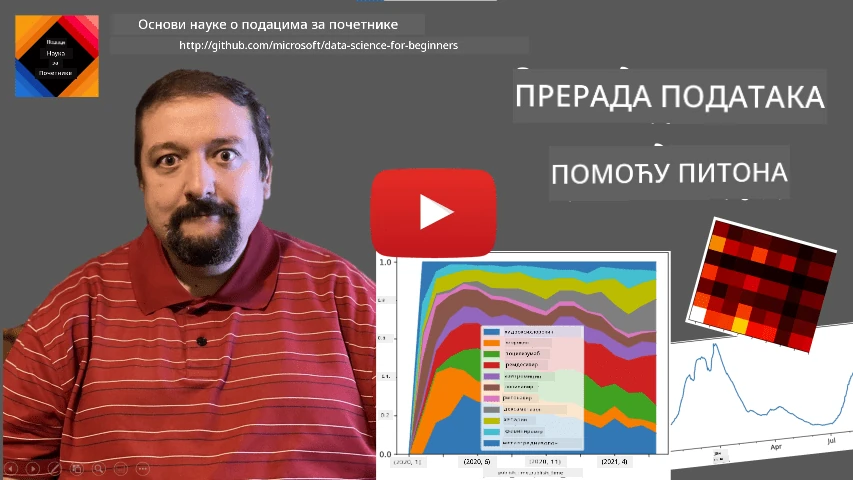
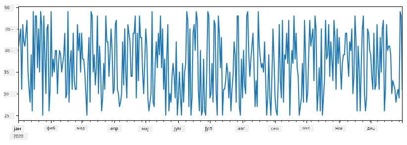
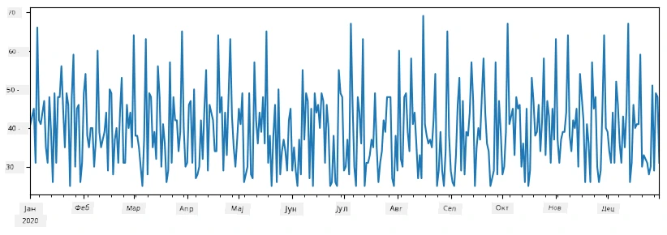
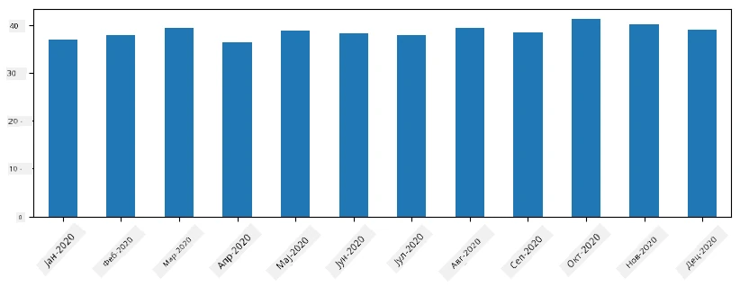
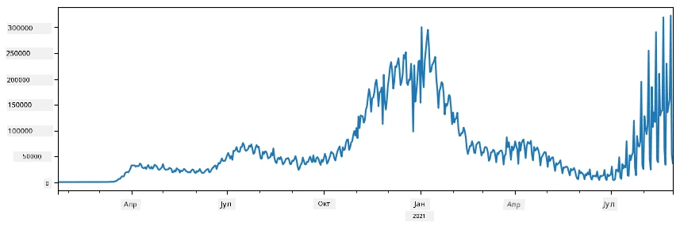
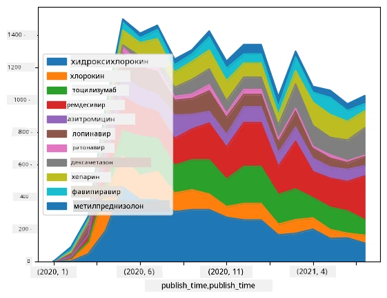

# Рад са подацима: Python и Pandas библиотека

|  ](../../sketchnotes/07-WorkWithPython.png) |
| :-------------------------------------------------------------------------------------------------------: |
|                 Рад са Python-ом - _Sketchnote од [@nitya](https://twitter.com/nitya)_                 |

[](https://youtu.be/dZjWOGbsN4Y)

Док базе података нуде веома ефикасне начине за чување података и њихово испитивање помоћу језика за упитe, најфлексибилнији начин обраде података је писање сопственог програма за манипулацију подацима. У многим случајевима, извршавање упита у бази података било би ефикасније. Међутим, у неким случајевима када је потребна сложенија обрада података, то се не може лако урадити помоћу SQL-а.
Обрада података може бити програмирана у било ком програмском језику, али постоје неки језици који су вишег нивоа у погледу рада са подацима. Стручњаци за податке обично преферирају један од следећих језика:

* **[Python](https://www.python.org/)**, општи програмски језик, који се често сматра једном од најбољих опција за почетнике због своје једноставности. Python има много додатних библиотека које вам могу помоћи да решите многе практичне проблеме, као што је издвајање података из ZIP архива или конверзија слике у нијансе сиве. Поред обраде података, Python се често користи и за веб развој.
* **[R](https://www.r-project.org/)** је традиционални скуп алата развијен са идејом статистичке обраде података у виду. Такође садржи велику репозиторију библиотека (CRAN), што га чини добрим избором за обраду података. Међутим, R није општи програмски језик и ретко се користи ван домена науке о подацима.
* **[Julia](https://julialang.org/)** је још један језик развијен посебно за науку о подацима. Намењен је да пружи боље перформансе од Python-а, чинећи га сјајним алатом за научно експериментисање.

У овој лекцији ћемо се фокусирати на коришћење Python-a за једноставну обраду података. Претпоставићемо основно познавање језика. Ако желите дубљу туру по Python-у, можете погледати један од следећих извора:

* [Learn Python in a Fun Way with Turtle Graphics and Fractals](https://github.com/shwars/pycourse) - GitHub базирани брзи увод у програмски језик Python
* [Take your First Steps with Python](https://docs.microsoft.com/en-us/learn/paths/python-first-steps/?WT.mc_id=academic-77958-bethanycheum) Learning Path на [Microsoft Learn](http://learn.microsoft.com/?WT.mc_id=academic-77958-bethanycheum)

Подаци могу бити у различитим облицима. У овој лекцији ћемо размотрити три облика података - **табеларни подаци**, **текст** и **слике**.

Фокусираћемо се на неколико примера обраде података, уместо да вам дамо потпун преглед свих релевантних библиотека. Ово ће вам омогућити да стекнете главну идеју о ономе што је могуће и оставити вас са разумевањем где да нађете решења за своје проблеме када вам затребају.

> **Најкориснији савет**. Када требате да извршите одређену операцију над подацима коју не знате како да урадите, покушајте да је потражите на интернету. [Stackoverflow](https://stackoverflow.com/) обично садржи много корисних примера кода на Python-у за многе типичне задатке.


## [Прелиминарни квиз](https://ff-quizzes.netlify.app/en/ds/quiz/12)

## Табеларни подаци и Dataframes

Већ сте упознали табеларне податке када смо говорили о реловационим базама података. Када имате пуно података који су садржани у многим различитим повезаним табелама, дефинитивно има смисла користити SQL за рад са њима. Међутим, постоји много случајева када имамо табеларне податке и потребно нам је да добијемо неко **разумевање** или **инсајт** о тим подацима, као што су расподела, корелација између вредности итд. У науци о подацима, често је потребно извршити неке трансформације изворних података, праћене визуализацијом. Оба ова корака се могу лако урадити коришћењем Python-a.

Постоје две најкорисније библиотеке у Python-у које вам могу помоћи да радите са табеларним подацима:
* **[Pandas](https://pandas.pydata.org/)** вам омогућава да манипулишете такозваним **Dataframes**, који су аналогни реловационим табелама. Можете имати именоване колоне и извршавати различите операције над редовима, колонама и целом DataFrame-ом.
* **[Numpy](https://numpy.org/)** је библиотека за рад са **тензорима**, тј. вишедимензионалним **низовима**. Низ има вредности истог примарног типа и једноставнији је од DataFrame-а, али нуди више математичких операција и ствара мање допунског оптерећења.

Постоји и неколико других библиотека које би требало да знате:
* **[Matplotlib](https://matplotlib.org/)** је библиотека која се користи за визуализацију података и цртање графикона
* **[SciPy](https://www.scipy.org/)** је библиотека са додатним научним функцијама. Већ смо наишли на ову библиотеку када смо говорили о вероватноћи и статистици

Ево пример кода којим ћете обично почети да увозите те библиотеке у почетку свог Python програма:
```python
import numpy as np
import pandas as pd
import matplotlib.pyplot as plt
from scipy import ... # потребно је да наведете тачне подпакете који су вам потребни
``` 

Pandas је заснован на неколико основних концепата.

### Series

**Series** је низ вредности, сличан листи или numpy низу. Главна разлика је што series има и **индеx**, и када извршавамо операције над series (нпр. сабирање), индеx се узима у обзир. Индекс може бити једноставан, као нпр. број реда (који је подразумевани индекс при креирању series од листе или низа), или може имати комплексну структуру, као што је временски интервал.

> **Напомена**: Постоји неки уводни Pandas код у приложеном notebook-у [`notebook.ipynb`](notebook.ipynb). Овде само наводимо неке примере, а свакако сте добродошли да погледате цео notebook.

Размотримо пример: желимо да анализирамо продају у нашем киоску за сладолед. Хајде да генеришемо series бројева продаје (број продатих јединица сваког дана) за одређени период:

```python
start_date = "Jan 1, 2020"
end_date = "Mar 31, 2020"
idx = pd.date_range(start_date,end_date)
print(f"Length of index is {len(idx)}")
items_sold = pd.Series(np.random.randint(25,50,size=len(idx)),index=idx)
items_sold.plot()
```


Сада претпоставимо да сваке недеље организујемо журку за пријатеље и додатно донесемо 10 пакетића сладоледа за журку. Можемо направити другу series, индексирану по недељама, да то прикажемо:
```python
additional_items = pd.Series(10,index=pd.date_range(start_date,end_date,freq="W"))
```
Када саберемо две series, добијамо укупни број:
```python
total_items = items_sold.add(additional_items,fill_value=0)
total_items.plot()
```


> **Напомена** да не користимо једноставну синтаксу `total_items+additional_items`. Кад бисмо је користили, добили бисмо много `NaN` (*Not a Number*) вредности у резултујућој series. То је зато што недостају вредности за неке индексе у series `additional_items`, а сабирање `NaN` са било чим даје `NaN`. Због тога морамо да наведемо параметар `fill_value` приликом сабирања.

Код серија са временом можемо такође **промјенити узорак** (resample) са другим временским интервалима. На пример, претпоставимо да желимо да израчунамо просечан промет продаје месечно. Можемо користити следећи код:
```python
monthly = total_items.resample("1M").mean()
ax = monthly.plot(kind='bar')
```


### DataFrame

DataFrame је у основи скуп series са истим индексом. Можемо спојити неколико series у један DataFrame:
```python
a = pd.Series(range(1,10))
b = pd.Series(["I","like","to","play","games","and","will","not","change"],index=range(0,9))
df = pd.DataFrame([a,b])
```
Ово ће направити хоризонталну табелу као што је ова:
|     | 0   | 1    | 2   | 3   | 4      | 5   | 6      | 7    | 8    |
| --- | --- | ---- | --- | --- | ------ | --- | ------ | ---- | ---- |
| 0   | 1   | 2    | 3   | 4   | 5      | 6   | 7      | 8    | 9    |
| 1   | I   | like | to  | use | Python | and | Pandas | very | much |

Такође можемо користити Series као колоне и одредити имена колона користећи речник:
```python
df = pd.DataFrame({ 'A' : a, 'B' : b })
```
Ово ће нам дати табелу као што је ова:

|     | A   | B      |
| --- | --- | ------ |
| 0   | 1   | I      |
| 1   | 2   | like   |
| 2   | 3   | to     |
| 3   | 4   | use    |
| 4   | 5   | Python |
| 5   | 6   | and    |
| 6   | 7   | Pandas |
| 7   | 8   | very   |
| 8   | 9   | much   |

**Напомена** да ову структуру табеле можемо добити и транспоновањем претходне табеле, нпр. писањем 
```python
df = pd.DataFrame([a,b]).T.rename(columns={ 0 : 'A', 1 : 'B' })
```
Овде `.T` значи операцију транспоновања DataFrame-а, тј. мењање редова и колона, а операција `rename` нам омогућава да преименујемо колоне како би одговарале претходном примеру.

Ево неколико најважнијих операција које можемо извршити над DataFrame-овима:

**Селекција колона**. Можемо изабрати појединачне колоне писањем `df['A']` - ова операција враћа Series. Такође можемо изабрати подскуп колона у други DataFrame писањем `df[['B','A']]` - ова операција враћа други DataFrame.

**Филтрирање** само одређених редова по критеријуму. На пример, да задржимо само редове где је колона `A` већа од 5, можемо написати `df[df['A']>5]`.

> **Напомена**: Начин на који филтрирање функционише је следећи. Израз `df['A']<5` враћа буловску серију која показује да ли је услов `True` или `False` за сваки елемент оригиналне Series `df['A']`. Када се буловска серија користи као индекс, враћа подмножину редова DataFrame-а. Због тога није могуће користити произвољан Python буловски израз, на пример, писање `df[df['A']>5 and df['A']<7]` би било погрешно. Уместо тога, треба користити посебну операцију `&` за буловске серије, писањем `df[(df['A']>5) & (df['A']<7)]` (*заграде су овде важне*).

**Креирање нових рачунских колона**. Можемо лако креирати нове колоне израчунате за наш DataFrame користећи интуитивне изразе овако:
```python
df['DivA'] = df['A']-df['A'].mean() 
``` 
Овај пример израчунава разлику A од њене просечне вредности. У ствари, овде рачунамо series, која се онда додељује левој страни, стварајући тако још једну колону. Због тога не можемо користити операције које нису компатибилне са series; пример из кода испод је погрешан:
```python
# Погрешан код -> df['ADescr'] = "Low" ако је df['A'] < 5 иначе "Hi"
df['LenB'] = len(df['B']) # <- Погрешан резултат
``` 
Овај други пример, иако је синтаксно исправан, даје погрешан резултат, јер додељује дужину Series `B` свим вредностима у колони, уместо дужине појединачних елемената, како смо намеравали.

Ако морамо да рачунамо сложене изразе овако, можемо користити функцију `apply`. Последњи пример може бити написан овако:
```python
df['LenB'] = df['B'].apply(lambda x : len(x))
# или
df['LenB'] = df['B'].apply(len)
```

Након ових операција, добићемо следећи DataFrame:

|     | A   | B      | DivA | LenB |
| --- | --- | ------ | ---- | ---- |
| 0   | 1   | I      | -4.0 | 1    |
| 1   | 2   | like   | -3.0 | 4    |
| 2   | 3   | to     | -2.0 | 2    |
| 3   | 4   | use    | -1.0 | 3    |
| 4   | 5   | Python | 0.0  | 6    |
| 5   | 6   | and    | 1.0  | 3    |
| 6   | 7   | Pandas | 2.0  | 6    |
| 7   | 8   | very   | 3.0  | 4    |
| 8   | 9   | much   | 4.0  | 4    |

**Селекција редова по броју** може се урадити користећи `iloc` конструкцију. На пример, да изаберемо првих 5 редова из DataFrame-а:
```python
df.iloc[:5]
```

**Груписање** се често користи за добијање резултата сличног *pivot таблицама* у Excel-у. Претпоставимо да желимо да израчунамо просечну вредност колоне `A` за сваки дати број `LenB`. Тада можемо груписати наш DataFrame по `LenB` и позвати `mean`:
```python
df.groupby(by='LenB')[['A','DivA']].mean()
```
Ако желимо да израчунамо просек и број елемената у групи, онда можемо користити сложенију функцију `aggregate`:
```python
df.groupby(by='LenB') \
 .aggregate({ 'DivA' : len, 'A' : lambda x: x.mean() }) \
 .rename(columns={ 'DivA' : 'Count', 'A' : 'Mean'})
```
Ово нам даје следећу табелу:

| LenB | Count | Mean     |
| ---- | ----- | -------- |
| 1    | 1     | 1.000000 |
| 2    | 1     | 3.000000 |
| 3    | 2     | 5.000000 |
| 4    | 3     | 6.333333 |
| 6    | 2     | 6.000000 |

### Добијање података


Видели смо колико је лако конструисати Series и DataFrames из Python објеката. Међутим, подаци обично долазе у облику текстуалних фајлова или Excel табела. Срећом, Pandas нам нуди једноставан начин да учитамо податке са диска. На пример, читање CSV фајла је једноставно као ово:
```python
df = pd.read_csv('file.csv')
```
Видећемо више примера учитавања података, укључујући преузимање са спољних веб сајтова, у одељку "Изазов"


### Штампање и графички приказ

Data Scientist често мора да истражи податке, па је зато важно бити у могућности да их визуализује. Када је DataFrame велики, често желимо само да се уверимо да све радимо исправно тако што ћемо одштампати првих неколико редова. Ово се може урадити позивом `df.head()`. Ако покрећете код у Jupyter Notebook-у, он ће приказати DataFrame у лепом табеларном формату.

Такође смо видели коришћење функције `plot` за визуализацију одређених колона. Док је `plot` веома користан за многе задатке и подржава различите типове графикона преко параметра `kind=`, увек можете користити сирову библиотеку `matplotlib` за цртање нечег сложенијег. Визуелизацију података ћемо детаљно обрадити у посебним лекцијама курса.

Овај преглед покрива најважније концепте Pandas-а, али библиотека је веома богата и нема граница шта све можете са њом урадити! Хајде сада да применимо ово знање на решавање конкретног проблема.

## 🚀 Изазов 1: Анализа ширења COVID-а

Први проблем на који ћемо се фокусирати је моделирање ширења пандемије COVID-19. За то ћемо користити податке о броју заражених у различитим земљама, које обезбеђује [Center for Systems Science and Engineering](https://systems.jhu.edu/) (CSSE) на [Johns Hopkins University](https://jhu.edu/). Скуп података је доступан у [овом GitHub Репозиторијуму](https://github.com/CSSEGISandData/COVID-19).

Пошто желимо да вам покажемо како се рукује подацима, позивамо вас да отворите [`notebook-covidspread.ipynb`](notebook-covidspread.ipynb) и прочитате га од почетка до краја. Такође можете извршавати ћелије и решавати неке изазове које смо оставили за вас на крају.



> Ако не знате како покренути код у Jupyter Notebook-у, погледајте [овaj чланак](https://soshnikov.com/education/how-to-execute-notebooks-from-github/).

## Рад са неструктурираним подацима

Иако подаци често долазе у табеларном облику, у неким случајевима треба да радимо са мање структуираним подацима, на пример текстом или сликама. У том случају, да бисмо применили технике обраде података које смо горе видели, морамо на неки начин **извући** структуиране податке. Ево неколико примера:

* Издвајање кључних речи из текста и преглед учесталости појављивања тих речи
* Коришћење неуронских мрежа за издвајање информација о објектима на слици
* Добијање информација о емоцијама људи на видео снимку

## 🚀 Изазов 2: Анализа COVID научних радова

У овом изазову ћемо наставити са темом COVID пандемије и фокусирати се на обраду научних радова о овој теми. Постоји [CORD-19 скуп података](https://www.kaggle.com/allen-institute-for-ai/CORD-19-research-challenge) са више од 7000 (у време писања) радова о COVID-у, доступних са метаподацима и апстрактима (а за око половине радова је доступан и цео текст).

Потпун пример анализе овог скупа података коришћењем когнитивне услуге [Text Analytics for Health](https://docs.microsoft.com/azure/cognitive-services/text-analytics/how-tos/text-analytics-for-health/?WT.mc_id=academic-77958-bethanycheum) описан је [у овом блогу](https://soshnikov.com/science/analyzing-medical-papers-with-azure-and-text-analytics-for-health/). Разматраћемо поједностављену верзију ове анализе.

> **НАПОМЕНА**: Не обезбеђујемо копију скупа података у оквиру овог репозиторијума. Прво морате преузети фајл [`metadata.csv`](https://www.kaggle.com/allen-institute-for-ai/CORD-19-research-challenge?select=metadata.csv) са [овог скупа података на Kaggle](https://www.kaggle.com/allen-institute-for-ai/CORD-19-research-challenge). Можда је потребна регистрација на Kaggle. Такође можете преузети скуп података без регистрације [овде](https://ai2-semanticscholar-cord-19.s3-us-west-2.amazonaws.com/historical_releases.html), али он ће укључивати све пуне текстове поред метаподатака.

Отворите [`notebook-papers.ipynb`](notebook-papers.ipynb) и прочитајте га од почетка до краја. Такође можете извршавати ћелије и решавати неке изазове које смо оставили за вас на крају.



## Обрада слика

Недавно су развијени веома моћни AI модели који нам омогућавају да разумемо слике. Постоје многи задаци који се могу решити коришћењем унапред тренираних неуронских мрежа или облачних сервиса. Неки примери укључују:

* **Класификацију слика**, која вам помаже да категоришете слику у једну од унапред дефинисаних класа. Једноставно можете обучити сопствене класификаторе слика користећи сервисе као што је [Custom Vision](https://azure.microsoft.com/services/cognitive-services/custom-vision-service/?WT.mc_id=academic-77958-bethanycheum)
* **Препознавање објеката** за детекцију различитих објеката на слици. Услуге као што је [computer vision](https://azure.microsoft.com/services/cognitive-services/computer-vision/?WT.mc_id=academic-77958-bethanycheum) могу детектовати број уобичајених објеката, а такође можете обући модел на [Custom Vision](https://azure.microsoft.com/services/cognitive-services/custom-vision-service/?WT.mc_id=academic-77958-bethanycheum) да детектује одређене специфичне објекте од интереса.
* **Детекцију лица**, укључујући одређивање старости, пола и емоција. Ово се може урадити преко [Face API](https://azure.microsoft.com/services/cognitive-services/face/?WT.mc_id=academic-77958-bethanycheum).

Све те облачне сервисе можете позвати помоћу [Python SDK-ова](https://docs.microsoft.com/samples/azure-samples/cognitive-services-python-sdk-samples/cognitive-services-python-sdk-samples/?WT.mc_id=academic-77958-bethanycheum), и на тај начин их лако укључити у свој ток рада истраживања података.

Ево неколико примера истраживања података из извора слика:
* У блогу [How to Learn Data Science without Coding](https://soshnikov.com/azure/how-to-learn-data-science-without-coding/) истражујемо Instagram фотографије, покушавајући да разумемо шта људе подстиче да дају више лајкова фотографији. Прво изузимамо највише информација из слика коришћењем [computer vision](https://azure.microsoft.com/services/cognitive-services/computer-vision/?WT.mc_id=academic-77958-bethanycheum), а затим користимо [Azure Machine Learning AutoML](https://docs.microsoft.com/azure/machine-learning/concept-automated-ml/?WT.mc_id=academic-77958-bethanycheum) да бисмо изградили интерпретабилни модел.
* У [Facial Studies Workshop](https://github.com/CloudAdvocacy/FaceStudies) користимо [Face API](https://azure.microsoft.com/services/cognitive-services/face/?WT.mc_id=academic-77958-bethanycheum) за издвајање емоција људи на фотографијама са догађаја како бисмо покушали да разумемо шта чини људе срећним.

## Закључак

Без обзира да ли већ имате структуриране или неструктуриране податке, коришћењем Pythona можете извршити све кораке везане за обраду и разумевање података. То је вероватно најфлексибилнији начин обраде података и због тога већина Data Scientist-а користи Python као свој примарни алат. Учити Python детаљно је добра идеја ако озбиљно приступате својем Data Science путу!

## [Квиз после предавања](https://ff-quizzes.netlify.app/en/ds/quiz/13)

## Ревизија и самостално учење

**Књиге**
* [Wes McKinney. Python for Data Analysis: Data Wrangling with Pandas, NumPy, and IPython](https://www.amazon.com/gp/product/1491957662)

**Онлајн ресурси**
* Званични [10 minutes to Pandas](https://pandas.pydata.org/pandas-docs/stable/user_guide/10min.html) туторијал
* [Документација о Pandas визуализацији](https://pandas.pydata.org/pandas-docs/stable/user_guide/visualization.html)

**Учење Pythona**
* [Учите Python на забаван начин са Turtle Graphics и фракталима](https://github.com/shwars/pycourse)
* [Правите прве кораке у Python-у](https://docs.microsoft.com/learn/paths/python-first-steps/?WT.mc_id=academic-77958-bethanycheum) Лернинг Пут на [Microsoft Learn](http://learn.microsoft.com/?WT.mc_id=academic-77958-bethanycheum)

## Задатак

[Обавите детаљнију студију података за изазове изнад](assignment.md)

## Захвалности

Ова лекција је ауторска уз ♥️ од [Dmitry Soshnikov](http://soshnikov.com)

---

<!-- CO-OP TRANSLATOR DISCLAIMER START -->
**Изјава о одрицању одговорности**:
Овај документ је преведен коришћењем услуге за аутоматски превод [Co-op Translator](https://github.com/Azure/co-op-translator). Иако тежимо тачности, имајте у виду да аутоматски преводи могу садржати грешке или нетачности. Оригинални документ на његовом изворном језику треба сматрати ауторитативним извором. За критичне информације препоручује се професионални људски превод. Нисмо одговорни за било каква неспоразума или погрешна тумачења која произилазе из коришћења овог превода.
<!-- CO-OP TRANSLATOR DISCLAIMER END -->