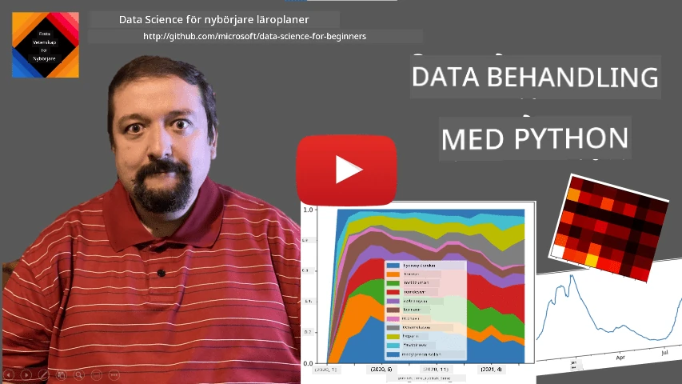
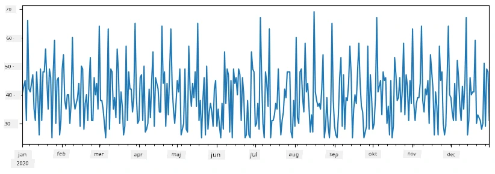
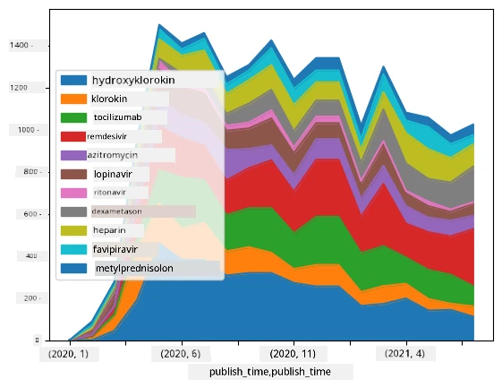

# Arbeta med data: Python och Pandas-biblioteket

|  ](../../sketchnotes/07-WorkWithPython.png) |
| :-------------------------------------------------------------------------------------------------------: |
|                 Arbeta med Python - _Sketchnote av [@nitya](https://twitter.com/nitya)_                 |

[](https://youtu.be/dZjWOGbsN4Y)

Medan databaser erbjuder mycket effektiva sätt att lagra data och fråga efter dem med frågespråk, är det mest flexibla sättet att bearbeta data att skriva ditt eget program för att manipulera data. I många fall skulle en databasfråga vara ett mer effektivt sätt. Men i vissa fall när mer komplex databehandling behövs kan det inte enkelt göras med SQL.
Databearbetning kan programmeras i vilket programspråk som helst, men det finns vissa språk som är på högre nivå när det gäller att arbeta med data. Dataforskare föredrar vanligtvis ett av följande språk:

* **[Python](https://www.python.org/)**, ett general purpose-programmeringsspråk, som ofta anses vara ett av de bästa alternativen för nybörjare tack vare sin enkelhet. Python har många tilläggsbibliotek som kan hjälpa dig lösa många praktiska problem, som att extrahera data från ZIP-arkiv eller konvertera bilder till gråskala. Utöver datavetenskap används Python också ofta för webbprogrammering.
* **[R](https://www.r-project.org/)** är ett traditionellt verktyg utvecklat med statistisk databehandling i fokus. Det innehåller också ett stort bibliotek av paket (CRAN), vilket gör det till ett bra val för datahantering. Dock är R inte ett general purpose-programmeringsspråk och används sällan utanför datavetenskapsdomänen.
* **[Julia](https://julialang.org/)** är ett annat språk som är utvecklat särskilt för datavetenskap. Det är avsett att ge bättre prestanda än Python, vilket gör det till ett utmärkt verktyg för vetenskapliga experiment.

I denna lektion kommer vi att fokusera på att använda Python för enkel databehandling. Vi förutsätter grundläggande bekantskap med språket. Om du vill ha en djupare genomgång av Python kan du hänvisa till någon av följande resurser:

* [Lär dig Python på ett roligt sätt med Turtle Graphics och Fraktaler](https://github.com/shwars/pycourse) - GitHub-baserad snabb introduktionskurs i Pythonprogrammering
* [Ta dina första steg med Python](https://docs.microsoft.com/en-us/learn/paths/python-first-steps/?WT.mc_id=academic-77958-bethanycheum) Lerningsväg på [Microsoft Learn](http://learn.microsoft.com/?WT.mc_id=academic-77958-bethanycheum)

Data kan komma i många former. I denna lektion kommer vi att behandla tre former av data - **tabulär data**, **text** och **bilder**.

Vi kommer att fokusera på några exempel på databehandling istället för att ge en fullständig översikt av alla relaterade bibliotek. Detta gör att du kan få en huvudidé om vad som är möjligt och ger dig förståelse för var du kan hitta lösningar på dina problem när du behöver dem.

> **Mest användbara råd**. När du behöver utföra en viss operation på data men inte vet hur, försök söka efter det på internet. [Stackoverflow](https://stackoverflow.com/) innehåller vanligtvis många användbara kodexempel i Python för många typiska uppgifter.


## [Förkunskapstest](https://ff-quizzes.netlify.app/en/ds/quiz/12)

## Tabulär data och Dataframes

Du har redan stött på tabulär data när vi pratade om relationsdatabaser. När du har mycket data och den är innehållen i många olika länkade tabeller, är det definitivt vettigt att använda SQL för att arbeta med det. Men det finns många fall där vi har en datatabell och behöver få lite **förståelse** eller **insikter** om denna data, som fördelning, korrelation mellan värden etc. Inom datavetenskap finns det många fall där vi behöver utföra transformationssteg på ursprungsdata följt av visualisering. Båda dessa steg kan enkelt göras med Python.

Det finns två mest använda bibliotek i Python som kan hjälpa dig hantera tabulär data:
* **[Pandas](https://pandas.pydata.org/)** låter dig manipulera så kallade **Dataframes**, som är analoga med relationsdatabastabeller. Du kan ha namngivna kolumner och utföra olika operationer på rader, kolumner och i allmänhet på dataframes.
* **[Numpy](https://numpy.org/)** är ett bibliotek för att arbeta med **tensors**, dvs. flerdimensionella **arrayer**. En array har värden av samma underliggande typ och är enklare än dataframe, men erbjuder fler matematiska operationer och skapar mindre overhead.

Det finns också ett par andra bibliotek som är bra att känna till:
* **[Matplotlib](https://matplotlib.org/)** är ett bibliotek som används för datavisualisering och att plotta diagram
* **[SciPy](https://www.scipy.org/)** är ett bibliotek med ytterligare vetenskapliga funktioner. Vi har redan stött på detta bibliotek när vi pratade om sannolikhet och statistik

Här är en kodsnutt som man typiskt använder för att importera dessa bibliotek i början av ditt Pythonprogram:
```python
import numpy as np
import pandas as pd
import matplotlib.pyplot as plt
from scipy import ... # du behöver ange exakt vilka underpaket du behöver
``` 

Pandas är centrerat kring några grundläggande begrepp.

### Series 

**Series** är en serie värden, liknande en lista eller numpy-array. Huvudskillnaden är att en series också har ett **index**, och när vi opererar på serier (t.ex. adderar dem) tas indexet i beaktning. Index kan vara så enkelt som ett heltalsradnummer (det är det index som används som standard när man skapar en series från en lista eller array) eller ha en komplex struktur, som ett datumintervall.

> **Notera**: Det finns viss introduktionskod för Pandas i den medföljande notebooken [`notebook.ipynb`](notebook.ipynb). Vi beskriver bara några exempel här och du är definitivt välkommen att titta på hela notebooken.

Tänk dig ett exempel: vi vill analysera försäljningen på vår glassbar. Låt oss generera en series med försäljningssiffror (antal sålda artiklar varje dag) för en given tidsperiod:

```python
start_date = "Jan 1, 2020"
end_date = "Mar 31, 2020"
idx = pd.date_range(start_date,end_date)
print(f"Length of index is {len(idx)}")
items_sold = pd.Series(np.random.randint(25,50,size=len(idx)),index=idx)
items_sold.plot()
```


Anta nu att vi varje vecka anordnar en fest för vänner och tar med ytterligare 10 paket glass till festen. Vi kan skapa en annan series, indexerad på veckor, för att demonstrera det:
```python
additional_items = pd.Series(10,index=pd.date_range(start_date,end_date,freq="W"))
```
När vi adderar två serier får vi totalt antal:
```python
total_items = items_sold.add(additional_items,fill_value=0)
total_items.plot()
```


> **Notera** att vi inte använder den enkla syntaxen `total_items+additional_items`. Om vi gjorde det hade vi fått många `NaN` (*Not a Number*) värden i den resulterande serien. Detta beror på att det finns saknade värden för vissa indexpunkter i serien `additional_items`, och att addera `NaN` till något ger `NaN`. Därför behöver vi specificera parametern `fill_value` vid addition.

På tidsserier kan vi även **resampla** serien med olika tidsintervall. Till exempel, anta att vi vill beräkna medelförsäljningsvolym per månad. Vi kan använda följande kod:
```python
monthly = total_items.resample("1M").mean()
ax = monthly.plot(kind='bar')
```


### DataFrame

En DataFrame är i huvudsak en samling av serier med samma index. Vi kan kombinera flera serier ihop till en DataFrame:
```python
a = pd.Series(range(1,10))
b = pd.Series(["I","like","to","play","games","and","will","not","change"],index=range(0,9))
df = pd.DataFrame([a,b])
```
Detta skapar en horisontell tabell som denna:
|     | 0   | 1    | 2   | 3   | 4      | 5   | 6      | 7    | 8    |
| --- | --- | ---- | --- | --- | ------ | --- | ------ | ---- | ---- |
| 0   | 1   | 2    | 3   | 4   | 5      | 6   | 7      | 8    | 9    |
| 1   | I   | like | to  | use | Python | and | Pandas | very | much |

Vi kan även använda Series som kolumner och specificera kolumnnamn med hjälp av en ordbok:
```python
df = pd.DataFrame({ 'A' : a, 'B' : b })
```
Detta ger oss en tabell som denna:

|     | A   | B      |
| --- | --- | ------ |
| 0   | 1   | I      |
| 1   | 2   | like   |
| 2   | 3   | to     |
| 3   | 4   | use    |
| 4   | 5   | Python |
| 5   | 6   | and    |
| 6   | 7   | Pandas |
| 7   | 8   | very   |
| 8   | 9   | much   |

**Observera** att vi också kan få denna tabellayout genom att transponera den tidigare tabellen, t.ex. genom att skriva
```python
df = pd.DataFrame([a,b]).T.rename(columns={ 0 : 'A', 1 : 'B' })
```
Här betyder `.T` transponeringsoperationen av DataFrame, det vill säga att rader och kolumner byter plats, och `rename`-operationen tillåter oss att byta namn på kolumner för att matcha föregående exempel.

Här är några av de viktigaste operationerna vi kan göra på DataFrames:

**Kolumnval**. Vi kan välja enskilda kolumner genom att skriva `df['A']` - denna operation returnerar en Series. Vi kan också välja en delmängd av kolumner till en annan DataFrame genom att skriva `df[['B','A']]` - detta returnerar en annan DataFrame.

**Filtrering** av endast vissa rader efter kriterier. Till exempel, för att behålla endast rader där kolumn `A` är större än 5 kan vi skriva `df[df['A']>5]`.

> **Notera**: Så här fungerar filtreringen. Uttrycket `df['A']<5` returnerar en boolesk Series som anger om uttrycket är `True` eller `False` för varje element i den ursprungliga serien `df['A']`. När en boolesk serie används som index returneras en delmängd av rader i DataFrame. Därför är det inte möjligt att använda godtyckliga Python-boolska uttryck, till exempel skulle `df[df['A']>5 and df['A']<7]` vara felaktigt. Istället bör du använda den speciella `&` operationen på booleska serier, skriva `df[(df['A']>5) & (df['A']<7)]` (*parenteserna är viktiga här*).

**Skapa nya beräkningsbara kolumner.** Vi kan enkelt skapa nya beräkningsbara kolumner för vår DataFrame genom att använda intuitiva uttryck som detta:
```python
df['DivA'] = df['A']-df['A'].mean() 
``` 
Detta exempel beräknar avvikelsen för A från dess medelvärde. Vad som faktiskt händer här är att vi beräknar en Series och sedan tilldelar denna Series till vänster sida, vilket skapar en ny kolumn. Därför kan vi inte använda operationer som inte är kompatibla med Series, t.ex. koden nedan är felaktig:
```python
# Fel kod -> df['ADescr'] = "Låg" om df['A'] < 5 annars "Hög"
df['LenB'] = len(df['B']) # <- Fel resultat
``` 
Det senare exemplet, även om det är syntaktiskt korrekt, ger oss ett felaktigt resultat eftersom det tilldelar längden av serien `B` till alla värden i kolumnen, och inte längden på individuella element som vi avsåg.

Om vi behöver beräkna komplexa uttryck som detta kan vi använda funktionen `apply`. Det sista exemplet kan skrivas så här:
```python
df['LenB'] = df['B'].apply(lambda x : len(x))
# eller
df['LenB'] = df['B'].apply(len)
```

Efter ovanstående operationer får vi följande DataFrame:

|     | A   | B      | DivA | LenB |
| --- | --- | ------ | ---- | ---- |
| 0   | 1   | I      | -4.0 | 1    |
| 1   | 2   | like   | -3.0 | 4    |
| 2   | 3   | to     | -2.0 | 2    |
| 3   | 4   | use    | -1.0 | 3    |
| 4   | 5   | Python | 0.0  | 6    |
| 5   | 6   | and    | 1.0  | 3    |
| 6   | 7   | Pandas | 2.0  | 6    |
| 7   | 8   | very   | 3.0  | 4    |
| 8   | 9   | much   | 4.0  | 4    |

**Välja rader baserat på nummer** kan göras med hjälp av konstruktionen `iloc`. Till exempel för att välja de första 5 raderna från DataFrame:
```python
df.iloc[:5]
```

**Gruppering** används ofta för att få ett resultat liknande *pivot-tabeller* i Excel. Anta att vi vill beräkna medelvärdet av kolumn `A` för varje givet värde av `LenB`. Då kan vi gruppera vår DataFrame efter `LenB` och kalla `mean`:
```python
df.groupby(by='LenB')[['A','DivA']].mean()
```
Om vi vill beräkna medelvärde och antalet element i gruppen kan vi använda den mer avancerade funktionen `aggregate`:
```python
df.groupby(by='LenB') \
 .aggregate({ 'DivA' : len, 'A' : lambda x: x.mean() }) \
 .rename(columns={ 'DivA' : 'Count', 'A' : 'Mean'})
```
Detta ger oss följande tabell:

| LenB | Count | Mean     |
| ---- | ----- | -------- |
| 1    | 1     | 1.000000 |
| 2    | 1     | 3.000000 |
| 3    | 2     | 5.000000 |
| 4    | 3     | 6.333333 |
| 6    | 2     | 6.000000 |

### Hämta data


Vi har sett hur enkelt det är att konstruera Series och DataFrames från Python-objekt. Data kommer dock vanligtvis i form av en textfil eller en Exceltabell. Som tur är erbjuder Pandas oss ett enkelt sätt att ladda data från disk. Till exempel är det lika enkelt att läsa en CSV-fil som detta:
```python
df = pd.read_csv('file.csv')
```
Vi kommer att se fler exempel på laddning av data, inklusive att hämta det från externa webbplatser, i avsnittet "Challenge"


### Utskrift och Plottning

En data scientist behöver ofta utforska data, så det är viktigt att kunna visualisera det. När DataFrame är stor vill man många gånger bara försäkra sig om att allt går rätt till genom att skriva ut de första raderna. Det kan göras genom att anropa `df.head()`. Om du kör det i Jupyter Notebook kommer det att skriva ut DataFrame i ett snyggt tabellformat.

Vi har också sett användningen av `plot`-funktionen för att visualisera vissa kolumner. Även om `plot` är mycket användbart för många uppgifter och stödjer många olika grafer via `kind=`-parametern kan du alltid använda det råa `matplotlib`-biblioteket för att plotta något mer komplext. Vi kommer att gå igenom datavisualisering i detalj i separata kurslektioner.

Den här översikten täcker de viktigaste koncepten inom Pandas, men biblioteket är mycket rikt, och det finns ingen gräns för vad du kan göra med det! Låt oss nu tillämpa denna kunskap för att lösa ett specifikt problem.

## 🚀 Utmaning 1: Analysera spridningen av COVID

Det första problemet vi ska fokusera på är modellering av epidemispridning av COVID-19. För att göra detta kommer vi att använda data om antalet infekterade individer i olika länder, tillhandahållna av [Center for Systems Science and Engineering](https://systems.jhu.edu/) (CSSE) vid [Johns Hopkins University](https://jhu.edu/). Datasetet finns tillgängligt i [denna GitHub-repositorium](https://github.com/CSSEGISandData/COVID-19).

Eftersom vi vill visa hur man hanterar data, inbjuder vi dig att öppna [`notebook-covidspread.ipynb`](notebook-covidspread.ipynb) och läsa det från början till slut. Du kan också köra celler och göra några utmaningar som vi har lämnat till dig i slutet.


> Om du inte vet hur man kör kod i Jupyter Notebook, ta en titt på [denna artikel](https://soshnikov.com/education/how-to-execute-notebooks-from-github/).

## Arbeta med ostrukturerad data

Även om data ofta kommer i tabellform måste vi i vissa fall hantera mindre strukturerad data, till exempel text eller bilder. I sådana fall, för att tillämpa de databehandlingstekniker vi sett ovan, behöver vi på något sätt **extrahera** strukturerad data. Här är några exempel:

* Extrahera nyckelord från text och se hur ofta dessa nyckelord förekommer
* Använda neurala nätverk för att extrahera information om objekt på en bild
* Få information om människors känslor via videoövervakning

## 🚀 Utmaning 2: Analysera COVID-artiklar

I denna utmaning fortsätter vi med ämnet COVID-pandemin och fokuserar på att bearbeta vetenskapliga artiklar om ämnet. Det finns en [CORD-19 Dataset](https://www.kaggle.com/allen-institute-for-ai/CORD-19-research-challenge) med mer än 7000 (vid skrivande stund) artiklar om COVID, tillgängliga med metadata och abstrakt (och för ungefär hälften av dem finns även fulltext tillgänglig).

Ett fullständigt exempel på att analysera detta dataset med hjälp av [Text Analytics for Health](https://docs.microsoft.com/azure/cognitive-services/text-analytics/how-tos/text-analytics-for-health/?WT.mc_id=academic-77958-bethanycheum) kognitiva tjänst beskrivs [i detta blogginlägg](https://soshnikov.com/science/analyzing-medical-papers-with-azure-and-text-analytics-for-health/). Vi kommer att diskutera en förenklad version av denna analys.

> **NOTERA**: Vi tillhandahåller inte en kopia av datasetet som en del av detta repository. Du kan först behöva ladda ner [`metadata.csv`](https://www.kaggle.com/allen-institute-for-ai/CORD-19-research-challenge?select=metadata.csv) filen från [detta dataset på Kaggle](https://www.kaggle.com/allen-institute-for-ai/CORD-19-research-challenge). Registrering hos Kaggle kan krävas. Du kan också ladda ner datasetet utan registrering [härifrån](https://ai2-semanticscholar-cord-19.s3-us-west-2.amazonaws.com/historical_releases.html), men det inkluderar alla fulltexter tillsammans med metadatafilen.

Öppna [`notebook-papers.ipynb`](notebook-papers.ipynb) och läs det från början till slut. Du kan också köra celler och göra några av de utmaningar vi har lämnat till dig i slutet.



## Bearbeta bilddata

Nyligen har mycket kraftfulla AI-modeller utvecklats som gör det möjligt för oss att förstå bilder. Det finns många uppgifter som kan lösas med hjälp av förtränade neurala nätverk eller molntjänster. Några exempel är:

* **Bildklassificering**, som kan hjälpa dig att kategorisera en bild i en av fördefinierade klasser. Du kan enkelt träna dina egna bildklassificerare med tjänster som [Custom Vision](https://azure.microsoft.com/services/cognitive-services/custom-vision-service/?WT.mc_id=academic-77958-bethanycheum)
* **Objektdetektering** för att upptäcka olika objekt i bilden. Tjänster som [computer vision](https://azure.microsoft.com/services/cognitive-services/computer-vision/?WT.mc_id=academic-77958-bethanycheum) kan upptäcka ett antal vanliga objekt, och du kan träna en [Custom Vision](https://azure.microsoft.com/services/cognitive-services/custom-vision-service/?WT.mc_id=academic-77958-bethanycheum) modell för att detektera vissa specifika objekt av intresse.
* **Ansiktsdetektion**, inklusive ålder-, köns- och känsledetektering. Detta kan göras via [Face API](https://azure.microsoft.com/services/cognitive-services/face/?WT.mc_id=academic-77958-bethanycheum).

Alla dessa molntjänster kan anropas med hjälp av [Python SDK:er](https://docs.microsoft.com/samples/azure-samples/cognitive-services-python-sdk-samples/cognitive-services-python-sdk-samples/?WT.mc_id=academic-77958-bethanycheum) och kan därför enkelt integreras i din datautforskningsprocess.

Här är några exempel på att utforska data från bilddatakällor:
* I blogginlägget [How to Learn Data Science without Coding](https://soshnikov.com/azure/how-to-learn-data-science-without-coding/) utforskar vi Instagram-foton och försöker förstå vad som får människor att ge fler likes till en bild. Vi extraherar först så mycket information som möjligt från bilder med hjälp av [computer vision](https://azure.microsoft.com/services/cognitive-services/computer-vision/?WT.mc_id=academic-77958-bethanycheum), och använder sedan [Azure Machine Learning AutoML](https://docs.microsoft.com/azure/machine-learning/concept-automated-ml/?WT.mc_id=academic-77958-bethanycheum) för att bygga en tolkbar modell.
* I [Facial Studies Workshop](https://github.com/CloudAdvocacy/FaceStudies) använder vi [Face API](https://azure.microsoft.com/services/cognitive-services/face/?WT.mc_id=academic-77958-bethanycheum) för att extrahera känslor hos människor på fotografier från event, för att försöka förstå vad som gör människor lyckliga.

## Avslutning

Oavsett om du redan har strukturerad eller ostrukturerad data kan du med Python utföra alla steg relaterade till databehandling och förståelse. Det är förmodligen det mest flexibla sättet att behandla data, och det är anledningen till att majoriteten av data scientists använder Python som sitt främsta verktyg. Att lära sig Python på djupet är förmodligen en bra idé om du är seriös med din data science-resa!

## [Quiz efter lektionen](https://ff-quizzes.netlify.app/en/ds/quiz/13)

## Repetition & Självstudier

**Böcker**
* [Wes McKinney. Python for Data Analysis: Data Wrangling with Pandas, NumPy, and IPython](https://www.amazon.com/gp/product/1491957662)

**Online-resurser**
* Officiell [10 minuter till Pandas](https://pandas.pydata.org/pandas-docs/stable/user_guide/10min.html) handledning
* [Dokumentation om Pandas Visualisering](https://pandas.pydata.org/pandas-docs/stable/user_guide/visualization.html)

**Lär dig Python**
* [Lär dig Python på ett roligt sätt med Turtle Graphics och Fraktaler](https://github.com/shwars/pycourse)
* [Ta dina första steg med Python](https://docs.microsoft.com/learn/paths/python-first-steps/?WT.mc_id=academic-77958-bethanycheum) lärandestig på [Microsoft Learn](http://learn.microsoft.com/?WT.mc_id=academic-77958-bethanycheum)

## Uppgift

[Utför en mer detaljerad dataanalys för utmaningarna ovan](assignment.md)

## Tack

Denna lektion har författats med ♥️ av [Dmitry Soshnikov](http://soshnikov.com)

---

<!-- CO-OP TRANSLATOR DISCLAIMER START -->
**Ansvarsfriskrivning**:
Detta dokument har översatts med hjälp av AI-översättningstjänsten [Co-op Translator](https://github.com/Azure/co-op-translator). Även om vi strävar efter noggrannhet, var vänlig notera att automatiska översättningar kan innehålla fel eller brister. Det ursprungliga dokumentet på dess modersmål bör betraktas som den auktoritativa källan. För kritisk information rekommenderas professionell mänsklig översättning. Vi ansvarar inte för några missförstånd eller feltolkningar som uppstår till följd av användningen av denna översättning.
<!-- CO-OP TRANSLATOR DISCLAIMER END -->