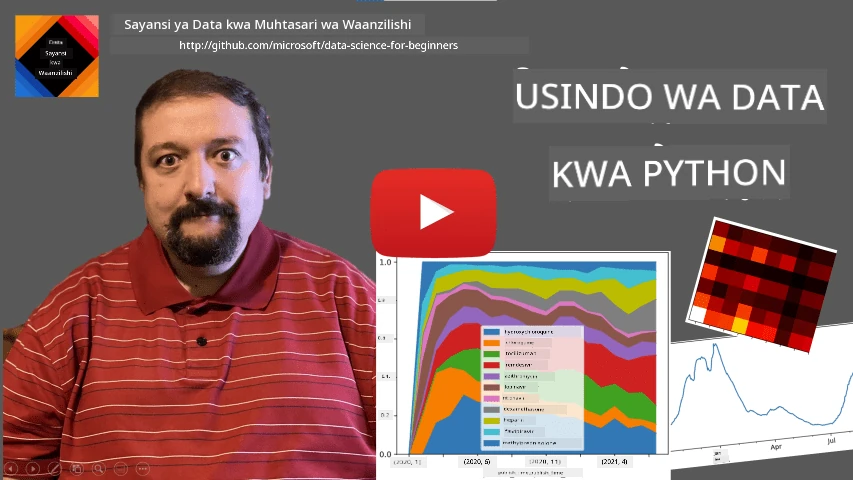
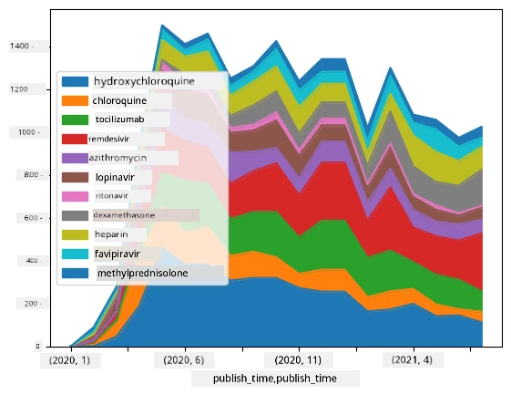

# Kufanya kazi na Data: Python na Maktaba ya Pandas

|  ](../../sketchnotes/07-WorkWithPython.png) |
| :-------------------------------------------------------------------------------------------------------: |
|                 Kufanya Kazi na Python - _Sketchnote na [@nitya](https://twitter.com/nitya)_                 |

[](https://youtu.be/dZjWOGbsN4Y)

Wakati hifadhidata zinatoa njia za ufanisi sana kuhifadhi data na kuziuliza kwa kutumia lugha za kuuliza, njia yenye kubadilika zaidi ya usindikaji data ni kuandika programu yako mwenyewe ya kudhibiti data. Katika kesi nyingi, kufanya kuuliza hifadhidata itakuwa njia bora zaidi. Hata hivyo, katika baadhi ya matukio ambapo usindikaji wa data wa kina unahitajika, haunawezi kufanyika kwa urahisi kwa kutumia SQL. 
Usindikaji wa data unaweza kuprogramiwa kwa lugha yoyote ya programu, lakini kuna baadhi ya lugha ambazo ni za kiwango cha juu zaidi kwa lengo la kufanya kazi na data. Wanasayansi wa data kawaida hupendelea mojawapo ya lugha zifuatazo:

* **[Python](https://www.python.org/)**, lugha ya programu yenye matumizi tofauti, ambayo mara nyingi huchukuliwa kuwa mojawapo ya chaguo bora kwa wanaoanza kutokana na urahisi wake. Python ina maktaba nyingi za ziada zinazoweza kusaidia kutatua matatizo mengi ya vitendo, kama vile kutoa data zako kutoka katika arifa ya ZIP, au kubadilisha picha kuwa rangi za kijivu. Mbali na sayansi ya data, Python pia hutumika mara nyingi kwa maendeleo ya wavuti. 
* **[R](https://www.r-project.org/)** ni chombo cha jadi kilichotengenezwa kwa lengo la usindikaji wa data za takwimu. Pia ina maktaba nyingi (CRAN), na hufanya kuwa chaguo zuri kwa usindikaji wa data. Hata hivyo, R si lugha ya programu ya matumizi mbalimbali, na hutumika kwa nadra nje ya nyanja ya sayansi ya data.
* **[Julia](https://julialang.org/)** ni lugha nyingine iliyotengenezwa mahsusi kwa sayansi ya data. Inalenga kutoa utendakazi bora zaidi kuliko Python, na hivyo kuwa chombo kizuri kwa majaribio ya kisayansi.

Katika somo hili, tutazingatia matumizi ya Python kwa usindikaji rahisi wa data. Tutachukua kuwa una uelewa wa msingi wa lugha hii. Ikiwa unataka mafunzo ya kina zaidi ya Python, unaweza kurejelea mojawapo ya rasilimali zifuatazo:

* [Jifunze Python kwa Njia ya Kufurahisha kwa Turtle Graphics na Fractals](https://github.com/shwars/pycourse) - Kozi fupi ya utangulizi kwa Python kwenye GitHub
* [Chukua Hatua Zako za Kwanza na Python](https://docs.microsoft.com/en-us/learn/paths/python-first-steps/?WT.mc_id=academic-77958-bethanycheum) Njia ya Kujifunza kwenye [Microsoft Learn](http://learn.microsoft.com/?WT.mc_id=academic-77958-bethanycheum)

Data inaweza kuja katika aina mbalimbali. Katika somo hili, tutaangazia aina tatu za data - **data ya jedwali**, **maandishi** na **picha**.

Tutazingatia mifano michache ya usindikaji data, badala ya kutoa muhtasari kamili wa maktaba zote zinazohusiana. Hii itakuwezesha kupata wazo kuu la kile kinachowezekana, na pia kuelewa wapi pa kupata suluhisho la matatizo yako unayohitaji.

> **Ushauri Muhimu Sana**. Unapohitaji kufanya operesheni fulani kwa data ambayo hujui jinsi ya kufanya, jaribu kuitafuta mtandaoni. [Stackoverflow](https://stackoverflow.com/) kawaida huwa na mifano mingi ya msimbo wa Python kwa kazi nyingi za kawaida. 


## [Jaribio la kabla ya somo](https://ff-quizzes.netlify.app/en/ds/quiz/12)

## Data ya Jedwali na Dataframes

Tayari umekutana na data za jedwali tulipokuwa tukizungumza kuhusu hifadhidata za uhusiano. Wakati una data nyingi, na ziko katika meza nyingi tofauti zenye uhusiano, ni wazi ina maana kutumia SQL kufanya kazi nazo. Hata hivyo, kuna matukio mengi ambapo tunapokuwa na jedwali la data, na tunahitaji kupata **uelewa** au **uelewa wa kina** juu ya data hii, kama vile mgawanyo, uhusiano kati ya thamani, n.k. Katika sayansi ya data, kuna matukio mengi ambapo tunahitaji kufanya mabadiliko fulani ya data ya awali, ikifuatiwa na uchoraji wa grafu. Hatua hizi mbili zinaweza kufanyika kwa urahisi kwa kutumia Python.

Kuna maktaba kuu mbili zinazosaidia sana Python kwa kazi na data za jedwali:
* **[Pandas](https://pandas.pydata.org/)** hakuwezesha kudhibiti kinachoitwa **Dataframes**, ambavyo vinafananishwa na meza za uhusiano. Unaweza kuwa na safu zenye majina, na kufanya operesheni tofauti juu ya safu, safu za kolamu na dataframes kwa ujumla. 
* **[Numpy](https://numpy.org/)** ni maktaba ya kufanya kazi na **tensors**, yaani **matindi** yenye vipimo zaidi. Matindi yana thamani za aina ile ile ya msingi, na ni rahisi zaidi kuliko dataframe, lakini yanatoa operesheni zaidi za kihisabati, na huleta mzigo mdogo zaidi.

Pia kuna maktaba zingine chache unazopaswa kujua:
* **[Matplotlib](https://matplotlib.org/)** ni maktaba inayotumiwa kwa uchoraji wa data na kuchora michoro
* **[SciPy](https://www.scipy.org/)** ni maktaba yenye baadhi ya kazi za kisayansi za ziada. Tayari tumekutana na maktaba hii tulipokuwa tukizungumza kuhusu nafasi na takwimu

Hapa kuna kipande cha msimbo ambacho mara nyingi utatumia kuleta maktaba haya mwanzoni mwa programu yako ya Python:
```python
import numpy as np
import pandas as pd
import matplotlib.pyplot as plt
from scipy import ... # unahitaji kubainisha vifurushi vidogo hasa unavyovihitaji
``` 

Pandas inalenga dhana chache za msingi.

### Msururu (Series)

**Series** ni mkusanyo wa thamani, sawa na orodha au array ya numpy. Tofauti kuu ni kwamba series pia ina **index**, na tunapofanya operesheni kwenye series (mfano, kuongeza), index huzingatiwa. Index inaweza kuwa nambari rahisi ya mstari (hiyo ndiyo index inayotumika kwa kawaida wakati wa kuunda series kutoka orodha au array), au inaweza kuwa na muundo tata, kama kipindi cha tarehe.

> **Kumbuka**: Kuna msimbo wa utangulizi wa Pandas katika daftari linaloambatana [`notebook.ipynb`](notebook.ipynb). Hapa tunatoa baadhi ya mifano, na ukaribishwa kabisa kuangalia daftari kamili.

Chukulia mfano: tunataka kuchambua mauzo ya duka letu la barafu. Hebu tungoje msururu wa nambari za mauzo (idadi ya vitu vilivyouzwa kila siku) kwa kipindi fulani cha muda:

```python
start_date = "Jan 1, 2020"
end_date = "Mar 31, 2020"
idx = pd.date_range(start_date,end_date)
print(f"Length of index is {len(idx)}")
items_sold = pd.Series(np.random.randint(25,50,size=len(idx)),index=idx)
items_sold.plot()
```


Sasa tuseme kwamba kila wiki tunandaa sherehe kwa marafiki, na tunachukua vifurushi 10 vya ziada vya barafu kwa sherehe hiyo. Tunaweza kuunda msururu mwingine, wenye index ya wiki, kuonyesha hilo:
```python
additional_items = pd.Series(10,index=pd.date_range(start_date,end_date,freq="W"))
```
Tunapoongeza misururu miwili pamoja, tunapata jumla ya idadi:
```python
total_items = items_sold.add(additional_items,fill_value=0)
total_items.plot()
```


> **Kumbuka** kwamba hatutumii sintaksi rahisi `total_items+additional_items`. Ikiwa tungeifanya, tungepata thamani nyingi za `NaN` (*Sio Nambari*) katika msururu uliopatikana. Hii ni kwa sababu kuna thamani zilizokosekana kwa baadhi ya pointi za index katika msururu wa `additional_items`, na kuongeza `Nan` kwa kitu kingine chochote husababisha `NaN`. Kwa hivyo tunahitaji kubainisha thamani ya `fill_value` wakati wa kuongeza.

Kwa misururu ya wakati, tunaweza pia **kufanya sampuli upya** msururu huo kwa vipindi tofauti vya wakati. Kwa mfano, tuseme tunataka kuhesabu wastani wa mauzo kila mwezi. Tunaweza kutumia msimbo ifuatayo:
```python
monthly = total_items.resample("1M").mean()
ax = monthly.plot(kind='bar')
```


### DataFrame

DataFrame ni mkusanyo wa misururu yenye index ile ile. Tunaweza kuunganisha misururu kadhaa pamoja kuwa DataFrame:
```python
a = pd.Series(range(1,10))
b = pd.Series(["I","like","to","play","games","and","will","not","change"],index=range(0,9))
df = pd.DataFrame([a,b])
```
Hii itaunda jedwali la wima kama hili:
|     | 0   | 1    | 2   | 3   | 4      | 5   | 6      | 7    | 8    |
| --- | --- | ---- | --- | --- | ------ | --- | ------ | ---- | ---- |
| 0   | 1   | 2    | 3   | 4   | 5      | 6   | 7      | 8    | 9    |
| 1   | I   | like | to  | use | Python | and | Pandas | very | much |

Tunaweza pia kutumia Series kama safu za kolamu, na kubainisha majina ya kolamu kwa kutumia kamusi:
```python
df = pd.DataFrame({ 'A' : a, 'B' : b })
```
Hii itatupa jedwali kama hili:

|     | A   | B      |
| --- | --- | ------ |
| 0   | 1   | I      |
| 1   | 2   | like   |
| 2   | 3   | to     |
| 3   | 4   | use    |
| 4   | 5   | Python |
| 5   | 6   | and    |
| 6   | 7   | Pandas |
| 7   | 8   | very   |
| 8   | 9   | much   |

**Kumbuka** kwamba tunaweza pia kupata mpangilio huu wa jedwali kwa kubadilisha jedwali la awali kwa kugeuza mistari na safu, mfano kwa kuandika 
```python
df = pd.DataFrame([a,b]).T.rename(columns={ 0 : 'A', 1 : 'B' })
```
Hapa `.T` inamaanisha operesheni ya kugeuza DataFrame, yaani kubadilisha mistari na safu, na operesheni ya `rename` inatuwezesha kubadilisha majina ya safu ili yaendane na mfano uliopita.

Hapa kuna baadhi ya operesheni muhimu tunaweza kufanya kwa DataFrames:

**Uchaguzi wa kolamu**. Tunaweza kuchagua kolamu moja moja kwa kuandika `df['A']` - operesheni hii inarudisha Series. Tunaweza pia kuchagua sehemu ya safu ndani ya DataFrame nyingine kwa kuandika `df[['B','A']]` - hii inarudisha DataFrame nyingine.

**Kuchuja** mistari fulani kwa kigezo. Kwa mfano, kuacha mistari tu yenye kolamu `A` kubwa kuliko 5, tunaweza kuandika `df[df['A']>5]`.

> **Kumbuka**: Njia ya kuchuja ni ifuatayo. Kauli `df['A']<5` inarudisha series ya boolean, ambayo inaonyesha kama kauli ni `True` au `False` kwa kila kipengele cha series ya awali `df['A']`. Wakati series ya boolean inapotumika kama index, inarudisha sehemu ya mistari katika DataFrame. Kwa hivyo si sahihi kutumia kauli za boolean za Python moja kwa moja, mfano kuandika `df[df['A']>5 and df['A']<7]` itakuwa kosa. Badala yake, unapaswa kutumia operesheni maalum ya `&` kwenye series za boolean, kwa kuandika `df[(df['A']>5) & (df['A']<7)]` (*mabano ni muhimu hapa*).

**Kuunda safu mpya zinazohesabika**. Tunaweza kwa urahisi kuunda safu mpya za DataFrame yetu kwa kutumia kauli yenye mantiki kama hii:
```python
df['DivA'] = df['A']-df['A'].mean() 
``` 
Mfano huu huhesabu utofauti wa A kutoka wastani wake. Kinachotokea hapa ni kwamba tunahesabu series, kisha kuipa upande wa kushoto, na kuunda safu nyingine. Kwa hivyo, hatuwezi kutumia operesheni zozote ambazo hazilingani na series, mfano, msimbo ufuatao ni mbaya:
```python
# Msimbo mbaya -> df['ADescr'] = "Chini" ikiwa df['A'] < 5 vinginevyo "Juu"
df['LenB'] = len(df['B']) # <- Matokeo mabaya
``` 
Mfano huu wa mwisho, ingawa ni sahihi kihisabati, hututoa matokeo mabaya, kwa sababu unapeleka urefu wa series `B` kwa thamani zote kwenye safu, badala ya urefu wa vipengele binafsi kama tulivyokusudia.

Ikiwa tunahitaji kufanya hesabu za kauli ngumu kama hizi, tunaweza kutumia kazi ya `apply`. Mfano wa mwisho unaweza kuandikwa kama ifuatavyo:
```python
df['LenB'] = df['B'].apply(lambda x : len(x))
# au
df['LenB'] = df['B'].apply(len)
```

Baada ya operesheni zilizo juu, tutakuwa na DataFrame ifuatayo:

|     | A   | B      | DivA | LenB |
| --- | --- | ------ | ---- | ---- |
| 0   | 1   | I      | -4.0 | 1    |
| 1   | 2   | like   | -3.0 | 4    |
| 2   | 3   | to     | -2.0 | 2    |
| 3   | 4   | use    | -1.0 | 3    |
| 4   | 5   | Python | 0.0  | 6    |
| 5   | 6   | and    | 1.0  | 3    |
| 6   | 7   | Pandas | 2.0  | 6    |
| 7   | 8   | very   | 3.0  | 4    |
| 8   | 9   | much   | 4.0  | 4    |

**Kuchagua mistari kulingana na nambari** inaweza kufanyika kwa kutumia `iloc`. Kwa mfano, kuchagua mistari 5 ya kwanza kutoka DataFrame:
```python
df.iloc[:5]
```

**Kukusanya pamoja (Grouping)** hutumika kupata matokeo yanayofanana na *jedwali la mzunguko* katika Excel. Tuseme tunataka kuhesabu wastani wa kolamu `A` kwa kila idadi ya `LenB`. Kisha tunaweza kupeleka DataFrame yetu kulingana na `LenB`, na kuitisha `mean`:
```python
df.groupby(by='LenB')[['A','DivA']].mean()
```
Ikiwa tunahitaji kuhesabu wastani na idadi ya vipengele katika kundi, tunaweza kutumia kazi ya `aggregate` ngumu zaidi:
```python
df.groupby(by='LenB') \
 .aggregate({ 'DivA' : len, 'A' : lambda x: x.mean() }) \
 .rename(columns={ 'DivA' : 'Count', 'A' : 'Mean'})
```
Hii inatupa jedwali ifuatayo:

| LenB | Count | Mean     |
| ---- | ----- | -------- |
| 1    | 1     | 1.000000 |
| 2    | 1     | 3.000000 |
| 3    | 2     | 5.000000 |
| 4    | 3     | 6.333333 |
| 6    | 2     | 6.000000 |

### Kupata Data


Tumeona jinsi ilivyo rahisi kutengeneza Series na DataFrames kutoka kwa vitu vya Python. Hata hivyo, data kwa kawaida huja katika fomati ya faili ya maandishi, au jedwali la Excel. Kwa bahati nzuri, Pandas inatupatia njia rahisi ya kupakia data kutoka diski. Kwa mfano, kusoma faili la CSV ni rahisi kama hii:
```python
df = pd.read_csv('file.csv')
```
Tutaona mifano zaidi ya kupakia data, ikijumuisha kuipeleka kutoka tovuti za nje, katika sehemu ya "Changamoto"


### Kuchapisha na Kuchora Mchoro

Mtaalamu wa Sayansi ya Data mara nyingi huhitaji kuchunguza data, hivyo ni muhimu kuweza kuionyesha kwa kuona. Wakati DataFrame ni kubwa, mara nyingi tunataka tu kuhakikisha tunafanya kila kitu kwa usahihi kwa kuchapisha mistari michache ya mwanzo. Hii inaweza kufanywa kwa kuitisha `df.head()`. Ikiwa unaendesha kutoka Jupyter Notebook, itachapisha DataFrame katika muundo mzuri wa jedwali.

Pia tumeona matumizi ya kipengele `plot` kuonyesha baadhi ya safu. Wakati `plot` ni muhimu sana kwa kazi nyingi, na inaunga mkono aina nyingi tofauti za michoro kupitia vigezo `kind=`, unaweza kila mara kutumia maktaba safi ya `matplotlib` kuchora kitu ngumu zaidi. Tutagusia uoneshaji wa data kwa undani katika somo tofauti za kozi.

Muhtasari huu unajumuisha dhana muhimu zaidi za Pandas, hata hivyo, maktaba ni tajiri sana, na hakuna kikomo cha kile unachoweza kufanya nayo! Sasa tuchukue maarifa haya kutatua tatizo fulani maalum.

## 🚀 Changamoto 1: Kuchambua Mgawanyo wa COVID

Tatizo la kwanza tutaloligusia ni mfano wa uenezaji wa janga la COVID-19. Ili kufanya hivyo, tutatumia data kuhusu idadi ya watu waliathirika katika nchi tofauti, inayotolewa na [Kituo cha Sayansi ya Mifumo na Uhandisi](https://systems.jhu.edu/) (CSSE) katika [Chuo Kikuu cha Johns Hopkins](https://jhu.edu/). Data ipo katika [Hifadhi hii ya GitHub](https://github.com/CSSEGISandData/COVID-19).

Kwa sababu tunataka kuonyesha jinsi ya kushughulikia data, tunakuomba ufungue [`notebook-covidspread.ipynb`](notebook-covidspread.ipynb) na kuisoma kutoka juu hadi chini. Unaweza pia kuendesha seli, na kutekeleza changamoto tulizokuachia mwishoni.


> Ikiwa hujui jinsi ya kuendesha msimbo katika Jupyter Notebook, angalia [makala hii](https://soshnikov.com/education/how-to-execute-notebooks-from-github/).

## Kufanya kazi na Data Isiyo na Muundo

Ingawa data mara nyingi huja katika muundo wa jedwali, katika baadhi ya matukio tunahitaji kushughulikia data zisizo na muundo mzuri, kwa mfano, maandishi au picha. Katika hali hii, ili kutumia mbinu za kusindika data tulizoziona hapo juu, tunahitaji kwa namna fulani **kutoa** data iliyojengwa vizuri. Hapa kuna mifano michache:

* Kutoa maneno muhimu kutoka maandishi, na kuona mara ngapi maneno hayo yanatokea
* Kutumia mitandao ya neva kutoa taarifa kuhusu vitu kwenye picha
* Kupata taarifa juu ya hisia za watu katika picha za video

## 🚀 Changamoto 2: Kuchambua Makala za COVID

Katika changamoto hii, tutaendelea na mada ya janga la COVID, na kuzingatia usindikaji wa makala za kisayansi kuhusu mada hii. Kuna Hifadhidata ya [CORD-19](https://www.kaggle.com/allen-institute-for-ai/CORD-19-research-challenge) zenye makala zaidi ya 7000 (wakati wa kuandika) kuhusu COVID, zinapatikana pamoja na metadata na muhtasari (na kwa takriban nusu yao pia kuna maandishi kamili yanayotolewa).

Mfano kamili wa kuchambua hifadhidata hii kwa kutumia huduma ya [Text Analytics for Health](https://docs.microsoft.com/azure/cognitive-services/text-analytics/how-tos/text-analytics-for-health/?WT.mc_id=academic-77958-bethanycheum) umeelezwa [katika chapisho hili la blogu](https://soshnikov.com/science/analyzing-medical-papers-with-azure-and-text-analytics-for-health/). Tutajadili toleo lililorahisishwa la uchambuzi huu.

> **NOTE**: Hatutoa nakala ya hifadhidata kama sehemu ya hifadhi hii. Huwezi kuhitaji kupakua faili [`metadata.csv`](https://www.kaggle.com/allen-institute-for-ai/CORD-19-research-challenge?select=metadata.csv) kwanza kutoka [hifadhidata hii kwenye Kaggle](https://www.kaggle.com/allen-institute-for-ai/CORD-19-research-challenge). Inaweza kuhitajika kujiandikisha kwenye Kaggle. Pia unaweza kupakua hifadhidata bila usajili [hapa](https://ai2-semanticscholar-cord-19.s3-us-west-2.amazonaws.com/historical_releases.html), lakini itajumuisha maandishi kamili yote pamoja na faili ya metadata.

Fungua [`notebook-papers.ipynb`](notebook-papers.ipynb) na usome kutoka juu hadi chini. Unaweza pia kuendesha seli, na kutekeleza changamoto tulizokuachia mwishoni.



## Kusindika Data za Picha

Hivi majuzi, mifano ya AI yenye nguvu imeundwa ambayo inaturuhusu kuelewa picha. Kuna kazi nyingi zinazoweza kutatuliwa kwa kutumia mitandao ya neva iliyofundishwa awali, au huduma za wingu. Mifano mingine ni:

* **Uainishaji wa Picha**, ambao unaweza kusaidia kukokotoa picha katika mojawapo ya darasa zilizowekwa kabla. Unaweza kwa urahisi kufundisha waainishaji wako wenyewe wa picha kwa kutumia huduma kama [Custom Vision](https://azure.microsoft.com/services/cognitive-services/custom-vision-service/?WT.mc_id=academic-77958-bethanycheum)
* **Utambuzi wa Vitu** kugundua vitu tofauti kwenye picha. Huduma kama [kompyuta mtazamo](https://azure.microsoft.com/services/cognitive-services/computer-vision/?WT.mc_id=academic-77958-bethanycheum) zinaweza kugundua idadi ya vitu kawaida, na unaweza kufundisha mfano wa [Custom Vision](https://azure.microsoft.com/services/cognitive-services/custom-vision-service/?WT.mc_id=academic-77958-bethanycheum) kugundua baadhi ya vitu maalum vya umuhimu.
* **Utambuzi wa Uso**, ikiwa ni pamoja na Utambuzi wa Umri, Jinsia na Hisia. Hii inaweza kufanywa kupitia [Face API](https://azure.microsoft.com/services/cognitive-services/face/?WT.mc_id=academic-77958-bethanycheum).

Huduma zote hizi za wingu zinaweza kuitwa kwa kutumia [Python SDKs](https://docs.microsoft.com/samples/azure-samples/cognitive-services-python-sdk-samples/cognitive-services-python-sdk-samples/?WT.mc_id=academic-77958-bethanycheum), na hivyo zinaweza kuingizwa kwa urahisi katika mtiririko wako wa uchunguzi data.

Hapa kuna mifano ya kuchunguza data kutoka vyanzo vya data za Picha:
* Katika chapisho la blogu [Jinsi ya Kujifunza Sayansi ya Data bila Kodisha](https://soshnikov.com/azure/how-to-learn-data-science-without-coding/) tunachunguza picha za Instagram, tukijaribu kuelewa ni nini kinachosababisha watu kutoa “likes” zaidi kwa picha. Kwanza tunatoa taarifa nyingi iwezekanavyo kutoka picha kwa kutumia [kompyuta mtazamo](https://azure.microsoft.com/services/cognitive-services/computer-vision/?WT.mc_id=academic-77958-bethanycheum), kisha tunatumia [Azure Machine Learning AutoML](https://docs.microsoft.com/azure/machine-learning/concept-automated-ml/?WT.mc_id=academic-77958-bethanycheum) kujenga mfano unaoweza kufasiriwa.
* Katika [Warsha za Masomo ya Uso](https://github.com/CloudAdvocacy/FaceStudies) tunatumia [Face API](https://azure.microsoft.com/services/cognitive-services/face/?WT.mc_id=academic-77958-bethanycheum) kutoa hisia za watu katika picha kutoka matukio, ili kujaribu kuelewa ni nini kinawafanya watu wawe na furaha.

## Hitimisho

Iwe tayari una data yenye muundo au isiyo na muundo, kwa kutumia Python unaweza kufanya hatua zote zinazohusiana na usindikaji na uelewa wa data. Hii labda ndiyo njia yenye kubadilika zaidi ya kusindika data, na ndio sababu wataalamu wengi wa sayansi ya data hutumia Python kama chombo chao kikuu. Kujifunza Python kwa undani labda ni wazo zuri ikiwa una nia ya dhati ya safari yako ya sayansi ya data!

## [Mtihani baada ya mhadhara](https://ff-quizzes.netlify.app/en/ds/quiz/13)

## Mapitio & Kujisomea

**Vitabu**
* [Wes McKinney. Python kwa Uchambuzi wa Data: Kusafisha Data kwa Pandas, NumPy, na IPython](https://www.amazon.com/gp/product/1491957662)

**Rasilimali Mtandaoni**
* Mafunzo rasmi ya [Dakika 10 hadi Pandas](https://pandas.pydata.org/pandas-docs/stable/user_guide/10min.html)
* [Nyaraka za Uoneshaji wa Pandas](https://pandas.pydata.org/pandas-docs/stable/user_guide/visualization.html)

**Kujifunza Python**
* [Jifunze Python kwa Njia ya Mchezo na Michoro ya Turtle na Fractals](https://github.com/shwars/pycourse)
* [Chukua Hatua Zako za Kwanza na Python](https://docs.microsoft.com/learn/paths/python-first-steps/?WT.mc_id=academic-77958-bethanycheum) Njia ya Kujifunza katika [Microsoft Learn](http://learn.microsoft.com/?WT.mc_id=academic-77958-bethanycheum)

## Kazi ya Nyumbani

[Fanya utafiti wa kina zaidi kwa changamoto zilizo hapo juu](assignment.md)

## Sifa

Somo hili limeandikwa kwa upendo ♥️ na [Dmitry Soshnikov](http://soshnikov.com)

---

<!-- CO-OP TRANSLATOR DISCLAIMER START -->
**Kionyozo**:
Hati hii imetafsiriwa kwa kutumia huduma ya tafsiri ya AI [Co-op Translator](https://github.com/Azure/co-op-translator). Ingawa tunajitahidi kupata usahihi, tafadhali fahamu kwamba tafsiri za kiotomatiki zinaweza kuwa na makosa au upungufu wa usahihi. Hati ya asili katika lugha yake halisi inapaswa kuchukuliwa kama chanzo cha mamlaka. Kwa taarifa muhimu, tafsiri ya kitaalamu inayofanywa na binadamu inapendekezwa. Hatutojibu kwa kuelewa vibaya au tafsiri potofu zinazotokea kutokana na matumizi ya tafsiri hii.
<!-- CO-OP TRANSLATOR DISCLAIMER END -->