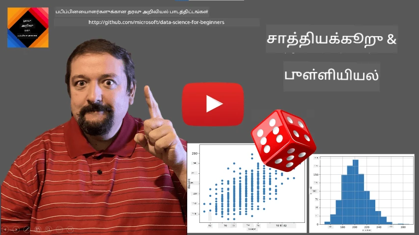
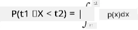
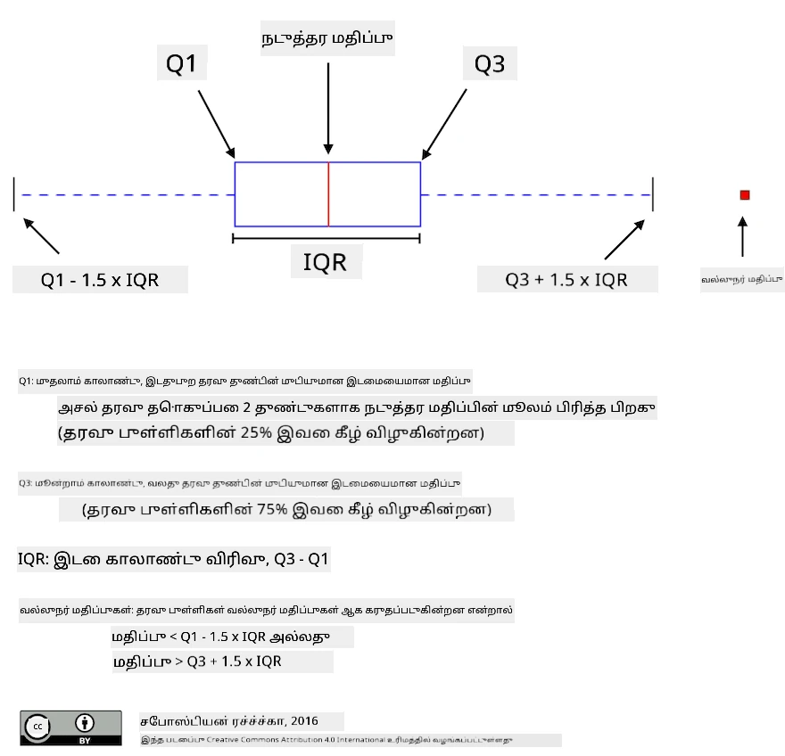
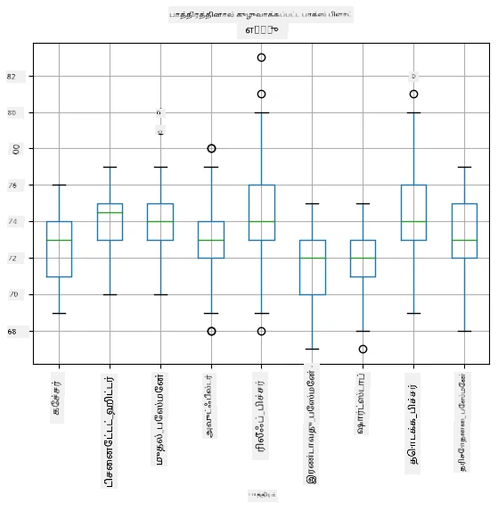
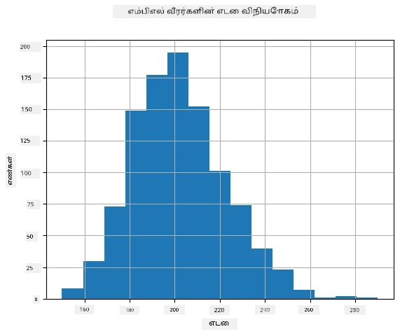
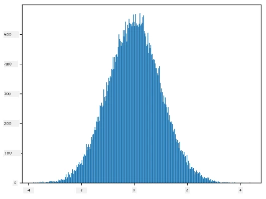
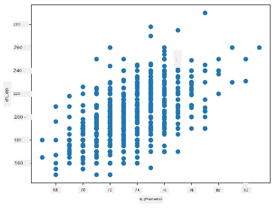

# 통계학 மற்றும் சாத்தியக்கூறு குறித்த சுருக்கமான அறிமுகம்

| வழங்கிய ஸ்கெட்ச் நோட்டு ](../../sketchnotes/04-Statistics-Probability.png)|
|:---:|
| ஸ்டாட்டிஸ்டிக்ஸ் மற்றும் சாத்தியக்கூறு - _[@nitya](https://twitter.com/nitya) வழங்கிய ஸ்கெட்ச் நோட்டு_ |

ஸ்டாட்டிஸ்டிக்ஸ் மற்றும் சாத்தியக்கூறு ஆய்வுகள் கணிதத்தின் இரண்டு நெருக்கமான பகுதிகள், அவை தரவியல் அறிவியலை மிகவும் பாதிக்கும். கணிதத்தில் ஆழமான அறிவை இல்லாமல் தரவுடன் வேலை செய்ய சாத்தியமானது, ஆனால் குறைந்தது சில அடிப்படைக் கருத்துக்களை அறிந்து கொள்வது மிகச்சிறந்தது. இங்கு ஒரு சுருக்கமான அறிமுகம் வழங்கப்பட்டிருக்கிறது, இது உங்களுக்கு துவக்க உதவும்.

[](https://youtu.be/Z5Zy85g4Yjw)


## [முன்னுரை வினாடி-வினா](https://ff-quizzes.netlify.app/en/ds/quiz/6)

## சாத்தியக்கூறு மற்றும் சீரற்ற மாறிலிகள்

**சாத்தியக்கூறு** என்பது 0 மற்றும் 1 கொண்டுள்ள ஒரு எண் ஆகும், இது ஒரு **நிகழ்வு** எவ்வளவு சாத்தியமுள்ளதாக இருக்கிறது என்பதை வெளிப்படுத்தும். இது ஒரு நிகழ்வுக்கு வழியாயிருக்கும் நேர்மறை விளைவுகளின் எண்ணிக்கை, அனைத்து விளைவுகளும் சம அளவு கவனிக்கபட்டால், மொத்த விளைவுகளின் எண்ணிக்கையால் భాగிக்கப்பட்டு வரையறுக்கப்படும். உதाहरणமாக, எமது ஒரு கறுக்கரடியை எறுக்கும் போது, எண் ஜோடியாக வருவதற்கான சாத்தியக்கூறு 3/6 = 0.5 ஆகும்.

நிகழ்வுகள் பற்றி பேசும்போது, நாங்கள் **சீரற்ற மாறிலிகள்** ஐப் பயன்படுத்துகிறோம். உதாரணமாக, கறுக்கரடியை எறுகையில் வரும் எண்ணை பிரதிநிதித்துவப்படுத்தும் சீரற்ற மாறி 1 முதல் 6 வரை மதிப்புகளை எடுக்கலாம். 1 முதல் 6 வரையிலான எண்கள் தொகுதியை **மாதிரி வலைவாசகம்** என அழைக்கின்றோம். ஒரு சீரற்ற மாறி ஒரு குறிப்பிட்ட மதிப்பை எடுக்கிறதென சாத்தியக்கூறு பற்றி பேசலாம், உதாரணத்திற்கு P(X=3)=1/6.

முந்தைய உதாரணத்தில் உள்ள சீரற்ற மாறி **அறைகுறி** என அழைக்கப்படுகிறது, ஏனெனில் இதன் மாதிரிவலைவாசகம் எண்ணிக்கையுடனானது, அதன் மதிப்புகள் தனித்தனியாக எண்ணப்படக்கூடியவை. மாதிரிவலைவாசகம் உண்மை எண்களின் ஒரு வரம்பாகவோ அல்லது முழு உண்மை எண்கள் தொகையாகவோ இருக்கக்கூடிய சூழ்நிலைகள் உள்ளன. அத்தகைய மாறிலிகள் **தரவாகமுள்ள** என அழைக்கப்படுகின்றன. ஒரு நல்ல உதாரணம் பஸ்சின் வருகை நேரம் ஆகும்.

## சாத்தியக்கூறு பகிர்வு

தருகைவிட அறைகுறி மாறிலிகளின் நிலையத்தில், ஒவ்வொரு நிகழ்வின் சாத்தியக்கூறை P(X) என்ற செயல்பாட்டால் எளிதாக வரையறுக்கலாம். மாதிரிவலைவாசக S இல் உள்ள ஒவ்வொரு மதிப்புக்கு *s* இது 0 முதல் 1 வரை எண் கொடுக்கும், இதன் பெறுபவங்கள் அனைத்தும் P(X=s) இன் மொத்தம் 1 ஆகும்.

சராசரி அறைகுறி பகிர்வு மிகப்பெரிய அறிமுகமானது, இதில் மாதிரிவலைவாசக N உறுப்புகளைக் கொண்டது, ஒவ்வொன்றுக்கும் சமமான சாத்தியக்கூறு 1/N இருப்பது.

தரவாகமுள்ள மாறிலியில் மதிப்புகள் [a,b] என்ற இடைவெளியிலிருந்து எடுக்கப்பட்டு வரையறுக்கப்படும்போது அல்லது உண்மை எண்களின் முழு தொகையிலிருந்து எடுக்கும்போது சாத்தியக்கூறு பகிர்வை வரையறுக்குவது கடினம். பஸ்சின் வருகை நேரம் போன்ற சூழ்நிலையை எடுத்துக்கொள்ளுங்கள். உண்மையில், ஒவ்வொரு துல்லியமான வருகை நேரத்திலும் *t*, பஸ் அந்த நேரத்தில் வருவதாகும் சாத்தியக்கூறு 0 தான்!

> இப்போது நீங்கள் தெரிந்து கொண்டீர்கள் 0 சாத்தியக்கூறுடைய நிகழ்வுகள் நடக்கின்றன, பெரும்பாலும்! குறைந்தது பஸ் வந்த நேரங்களில் அப்படியே நேர்கிறது!

ஒரு மாறிலி ஒரு குறிப்பிட்ட மதிப்புகளுக்குள் இருப்பதற்கான சாத்தியக்கூறை மட்டுமே பேசலாம், உதாரணத்திற்கு P(t<sub>1</sub>&le;X&lt;t<sub>2</sub>). இவ்வாறாக சாத்தியக்கூறு பகிர்வு **சாத்தியக்கூறு அடர்த்தி செயல்பாடு** p(x) என்றால் விவரிக்கப்படுகிறது, எனவே


  
தரவாகமுள்ள நிலையான பகிர்விற்கு வடிவுரை **தரவாகமுள்ள நிலையான** என அழைக்கப்படுகிறது, இது ஒரு காலிய இடைவெளியில் வரையறுக்கப்படுகிறது. மதிப்பு X நீளம் l உள்ள இடைவெளியில் விருந்து பெறுவதற்கான சாத்தியக்கூறு l உடன் நேர்மறை தொடர்புடையது மற்றும் 1 வரை உயர்கிறது.

மற்றொரு முக்கிய பகிர்வு **சாதாரண பகிர்வு** ஆகும், அதைப் பின்வரும் விவரிப்பில் விரிவாகப் பேசுவோம்.

## சராசரி, வேறுபாடு மற்றும் நிலை உதிர்வு

சீரற்ற மாறிலி X இன் n மாதிரிகளை அடுக்கமாக எடுத்துக்கொள்ளுங்கள்: x<sub>1</sub>, x<sub>2</sub>, ..., x<sub>n</sub>. நாம் **சராசரி** (அல்லது **அரித்மெட்டிக் சராசரி**) மதிப்பை சாந்த பிரிவுக்கேற்ப (x<sub>1</sub>+x<sub>2</sub>+...+x<sub>n</sub>)/n இல் வரையறுக்கலாம். மாதிரியின் அளவை எழுப்பும்போது (n&rarr;&infin; இல் எல்லைக்கு செல்லும்போது), அந்த பகிர்வின் சராசரி (அல்லது **எதிர்பார்ப்பு**) பெறப்படும். எதிர்பார்ப்பை **E**(x) என குறிக்கிறோம்.

> எந்த அறைகுறி பகிர்விற்கும் மதிப்புகள் {x<sub>1</sub>, x<sub>2</sub>, ..., x<sub>N</sub>} மற்றும் சரியான சாத்தியக்கூறுகள் p<sub>1</sub>, p<sub>2</sub>, ..., p<sub>N</sub> க்கான எதிர்பார்ப்பு E(X) = x<sub>1</sub>p<sub>1</sub> + x<sub>2</sub>p<sub>2</sub> + ... + x<sub>N</sub>p<sub>N</sub> ஆக இருக்கும் என்பதை காட்ட முடியும்.

மதிப்புகள் எவ்வளவு பரவியுள்ளன என்பதை கண்டறிய வேறுபாடு &sigma;<sup>2</sup> = &sum;(x<sub>i</sub> - &mu;)<sup>2</sup>/n இல் கணக்கிடலாம், இங்கே &mu; என்பது சராசரி. &sigma; என்பது **நிலை உதிர்வு**, மற்றும் &sigma;<sup>2</sup> என்பது **வேறுபாடு** ஆகும்.

## மோடு, மத்திய மற்றும் குவார்டைல்கள்

சில சமயங்களில், சராசரி தரவுக்கான "சாதாரண" மதிப்பை போதுமான அளவு பிரதிபலிக்காது. சில உயர்ந்த மதிப்புகள் பலமாக இருந்தால் சராசரியை பாதிக்கக்கூடும். மற்றொரு மிக நல்ல குறிக்கோள் **மத்திய** ஆகும், அதாவது தரவு புள்ளிகளில் பாதி அதற்கு கீழாகவும், மற்ற பாதி மேலாகவும் இருக்கும் மதிப்பாகும்.

தரவின் பகிர்வை புரிந்துகொள்ள **குவார்டைல்கள்** பற்றி பேசுவது உதவும்:

* முதல் குவார்டைல் அல்லது Q1 என்பது 25% தரவு அதற்கு கீழே இருக்கும் மதிப்பாகும்
* மூன்றாம் குவார்டைல் அல்லது Q3 என்பது 75% தரவு அதற்கு கீழே இருக்கும் மதிப்பாகும்

கிராபியமாக நாம் மத்திய மற்றும் குவார்டைல்கள் உறவுகளை **பாக்ஸ் பிளாட்** என்ற வரைபடத்தில் காண்பிக்கலாம்:



இங்கு நாம் **இணைக்குவாரியாக்கப்பட்ட பரப்பு** IQR=Q3-Q1 மற்றும் **அதிகபட்ச மதிப்புகள்** என்று அழைக்கப்படும் மதிப்புகளை கணக்கிடலாம், அவை [Q1-1.5*IQR, Q3+1.5*IQR] வரம்புகளை மீறுகின்றன.

செருகுமாறு பல மதிப்புகளைக் கொண்ட ஒரு நிலையான பகிர்வுக்கு மிகவும் "சாதாரண" மதிப்பு மிகவும் அடிக்கடி தோன்றும் மதிப்பாகும், அதுவே **மோடு** ஆகும். இது அடிக்கடி வகைமைகளைச் சார்ந்த தரவுகளுக்கு பயன்படுத்தப்படுகிறது, உதாரணமாக வண்ணங்களைப் பாருங்கள். நாம் இரண்டு அணிகளைக் கொண்டு இருப்பதாகக் கொள்ளுங்கள் - ஒருவர் சிவப்பை விரும்புவோர், மற்றோர் நீலத்தை விரும்புவோர். வண்ணங்களை எண்களால் குறியிடினால், விருப்ப வண்ணங்களுக்கான சராசரி மதிப்பு ஆரஞ்சு-பச்சை வரையில் இருக்கும், இது எந்த அணியின் விருப்பத்தையும் அழகாக காட்டாது. ஆனால் மோடு ஒரு வண்ணமாகவோ அல்லது இரு வண்ணங்களாகவும் இருக்கும், இரு வண்ணங்களின் வாக்குகள் சமமாக இருந்தால் (அதிகப்படியான மாதிரியை **பலமோடு** என அழைக்கிறோம்).

## உண்மை உலகின் தரவு

நாம் உண்மையான வாழ்க்கையிலிருந்து பெறும் தரவு சீரற்ற மாறிலிகள் அல்ல, ஏனெனில் நாம் தெரியாத முடிவுடன் பரிசோதனைகள் நடத்தவில்லை. உதாரணமாக, பீச்பால் வீரர்களின் குழுவையும், அவர்களது உடல் தகவல்களையும் எடுத்துக்கொள்ளுங்கள், உயரம், எடை மற்றும் வயது போன்றவை. அவை எல்லாம் பூரணமாக சீரற்றமில்லை, ஆனாலும் அதே கணிதக் கருத்துக்களை பயன்படுத்தலாம். உதாரணமாக, ஒரு மக்களின் எடைகளின் தொடர் ஒரு சீரற்ற மாறிலிலிருந்து எடுத்த மதிப்புகளாக கருதலாம். கீழே [பீச்பால் பந்துபந்தர்கள்](http://mlb.mlb.com/index.jsp) லிருந்து எடுக்கப்பட்ட 20 முதல் மதிப்புகள் உடைய வரிசை உள்ளது:

```
[180.0, 215.0, 210.0, 210.0, 188.0, 176.0, 209.0, 200.0, 231.0, 180.0, 188.0, 180.0, 185.0, 160.0, 180.0, 185.0, 197.0, 189.0, 185.0, 219.0]
```

> **குறிப்பு**: இந்த தரவுத்தொகுப்புடன் வேலை செய்யும் உதாரணத்தைக் காண [இணைக்கப்பட்ட நோட்புக்](notebook.ipynb) பார்க்கவும். இந்த பாடத்தில் பல சவால்கள் உள்ளன; அவற்றை அந்த நோட்புக்கில் குறியீட்டை சேர்ப்பதன் மூலம் நிறைவேற்றலாம். தரவுகளில் எப்படி இயங்குவது தெரியவில்லை என்றால், கவலைப்பட வேண்டாம் - நாம் பின்னர் Python மூலம் தரவுடன் வேலை செய்வதை மீண்டும் காண்போம். நீங்கள் Jupyter நோட்புக்கில் குறியீட்டை எப்படி இயக்குவது தெரியவில்லை என்றால், [இந்த கட்டுரை](https://soshnikov.com/education/how-to-execute-notebooks-from-github/)னைக் காணவும்.

இது எங்கள் தரவுக்கான சராசரி, மத்திய மற்றும் குவார்டைல்கள் கொண்ட பாக்ஸ் பிளாட்:


எங்கள் தரவு ஒரு பல்வேறு வீரர் **பங்கு** பற்றிய தகவலை கொண்டதால், பங்கின்படி பாக்ஸ் பிளாட் செய்யலாம் - இது பங்குகளுக்கு இடையேயான அளவில்லாத வேறுபாடுகளை நமக்கு காட்டும். இம்முறை உயரத்தை எடுத்துக்கொள்ளலாம்:



இந்த வரைபடம், சுதந்தர பந்துபந்தர் ஒருவர் உயரம் இரண்டாம் நிலை பந்துபந்தரின் உயரத்தைவிட அதிகமாக உள்ளது என்பதை సూచிக்கிறது. இந்த பாடத்தில் பின்னர் நாம் இந்த ஊகத்தைக் கட்டுப்படுத்தி சோதிப்பதையும், எங்கள் தரவு பொருத்தமானவையாக உள்ளதா என்பதை எப்படி பரிசோதிப்பதையும் கற்றுக்கொள்வோம்.

> உண்மையான உலக தரவுடன் பணியாற்றும்போது, அனைத்து தரவுப் புள்ளிகளும் ஒரு சாத்தியக்கூறு பகிர்விலிருந்து எடுத்த மாதிரிகள் எனக் கருதப்படுவதாக நாம் எண்ணுகிறோம். இந்த எண்ணம் இயந்திரக் கற்றல் தொழில்நுட்பங்களை பயன்படுத்தி முன்னறிவிக்கப்பட்ட மாதிரிகளை கட்டுவதற்கு உதவும்.

எங்கள் தரவின் பகிர்வை காண **ஹிஸ்டோகிராம்** எனப்படும் விளக்கப்படத்தை வரையலாம். X-அச்சில் பல்வேறு எடை இடைவெளிகள் (கூறப்படுபவை **பின்கள்**) இருக்கும், மற்றும் சில வழுக்கைக்கருந்துகளின் எண்ணிக்கை கொடுக்கப்படும்.



இந்த ஹிஸ்டோகிராமிலிருந்து அனைவரும் ஒரு சராசரி எடையைச் சுற்றி மையமாக்கப்பட்டிருப்பதைப் பார்க்கலாம், அதில் இருந்து விரியும்போது எடைகள் குறைவாக இருக்கின்றன. அதாவது பீச்பால் வீரரின் எடை சராசரி எடையிலிருந்து மிகவும் வித்தியாசமாக இருப்பது மிகவும் சாத்தியக்குறைவு. எடையின் வேறுபாடுகள் எடைகள் சராசரி மதிப்பிலிருந்து எப்படி வேறுபடக்கூடியது என்பதை காட்டுகிறது.

> மற்ற மக்களின் எடைகள் எடுத்துக் கொள்ளப்பட்டால், பீச்பால் லீக் அல்லாதவர்கள், பகிர்வு வேறுபடக்கூடியது. ஆனால் பகிர்வின் வடிவம் அதே மாதிரியாக இருக்கும், ஆனால் சராசரி மற்றும் வேறுபாடு மாறும். ஆகவே, எங்கள் மாதிரியை பீச்பால் வீரர்களில் பயிற்சி செய்தால், கல்லூரி மாணவர்களுக்கு தவறான முடிவுகளை வழங்கக்கூடும், ஏனெனில் அடிப்படை பகிர்வு வேறுபட்டது.

## சாதாரண பகிர்வு

மேலே கண்ட எடை பகிர்வு மிகவும் சாதாரணமானது, மற்றும் பல உண்மை உலக அளவைகள் இதே வகை பகிர்வை பின்பற்றுகின்றன, ஆனால் வேறுபட்ட சராசரி மற்றும் வேறுபாடுகளுடன். இதை **சாதாரண பகிர்வு** என அழைக்கின்றனர், இது கணக்கியல் கணக்குகளில் மிக முக்கியப் பங்கு வகிக்கிறது.

சாதாரண பகிர்வை பயன்படுத்தி சாத்தியக்கூறான எடைகளை உருவாக்குவது சரியான வழி. சராசரி எடை `mean` மற்றும் நிலை உதிர்வு `std` தெரிந்தால், 1000 எடை மாதிரிகளை கீழ்காணும் முறையில் உருவாக்கலாம்:
```python
samples = np.random.normal(mean,std,1000)
``` 

உருவாக்கிய மாதிரிகளின் ஹிஸ்டோகிராம் வரையப்பட்டால் மேலுள்ள படத்தைப் போன்ற உருவம் காணப்படும். மாதிரிகளின் எண்ணிக்கையை மற்றும் பின்களின் எண்ணிக்கையை அதிகரித்தால், ஒருத்தப்படிவமான சாதாரண பகிர்வு உருவ மாறு வருகிறது:



*சாதாரண பகிர்வு mean=0 மற்றும் std.dev=1*

## நம்பிக்கை இடைவெளிகள்

பீச்பால் வீரர்களின் எடைகள் பற்றி பேசும் போது நாம் ஒரு **சீரற்ற மாறி W** உள்ளது என கருத்ததாகும், இது அனைத்து பீச்பால் வீரர்களின் (அதாவது **மக்கள் தொகை**) எடைகளின் சரியான சாத்தியக்கூறு பகிர்வுடன் பொருந்தும். எங்கள் எடைகளின் தொடர் மக்கள் தொகையின் ஒரு துணைக்கூட்டமாகவும் கருதப்படுகிறது, அதனை **மாதிரி** என அழைக்கின்றோம். ஒரு விருப்பமான கேள்வி; மக்கள் தொகையின் பகிர்வின் பண்புகளை, அதாவது சராசரி மற்றும் வேறுபாடு தெரிந்து கொள்ள முடியுமா?

எளிய பதில் எங்கள் மாதிரியின் சராசரி மற்றும் வேறுபாட்டைக் கணக்கிடுவதாக இருக்கும். எனினும் எங்கள் சீரற்ற மாதிரி முழுமையான மக்கள்தொகையை சரியாக பிரதிபலிக்காதபோதும் இருக்கக்கூடும். இதனால் **நம்பிக்கை இடைவெளி** பற்றி பேச வேண்டும்.

> **நம்பிக்கை இடைவெளி** என்பது எங்கள் மாதிரிக்குக் கொடுக்கப்பட்ட மக்கள்தொகையின் உண்மையான சராசரியின் மதிப்பீடு ஆகும், இது ஒரு குறிப்பிட்ட சாத்தியக்கூறை (அல்லது **நம்பிக்கை அளவு**) கொண்டது.

நாம் எங்கள் பகிர்விலிருந்து X<sub>1</sub>, ..., X<sub>n</sub> மாதிரிகள் கொண்டதாகக் கொள்ளவும். ஒவ்வொரு முறையும் மாதிரி எடுத்தால் வெவ்வேறு சராசரி மதிப்புகள் &mu; பெறப்படும். ஆக &mu; ஒரு சீரற்ற மாறியாக கருதப்படும். நம்பிக்கை அளவு p கொண்ட நம்பிக்கை இடைவெளி (L<sub>p</sub>, R<sub>p</sub>) என்பது **P**(L<sub>p</sub>&leq;&mu;&leq;R<sub>p</sub>) = p எனத்தான் வரையறுக்கப்படுகிறது, அதாவது சராசரி மதிப்பு அந்த இடைவெளியில் வருவதற்கான சாத்தியக் குறிமு p ஆகும்.

இந்த நம்பிக்கை இடைவெளிகள் எப்படி கணக்கிடப்படுகின்றன என்பதில் விரிவாக விவாதிப்பதற்கு இங்கு இடமில்லை. சில கூடுதல் தகவல்கள் [விக்கிப்பீடியாவில்](https://en.wikipedia.org/wiki/Confidence_interval) கிடைக்கின்றன. சுருக்கமாக, மக்கள் தொகையின் உண்மையான சராசரியுடன் ஒப்பிடுகையில் கணக்கிடப்பட்ட மாதிரி சராசரியின் பகிர்வை நாங்கள் வரையறுக்கின்றோம், இதனை **பள்ளி மாணவர் பகிர்வு** என அழைக்கிறோம்.
> **ஆசிரியமான தகவல்**: மாணவர் பகிர்வு மதிப்பீடு வில்லியம் சீலி கோஸெட் என்னும் கணிதவியலாளர் பெயரால் பெயரிடப்பட்டுள்ளது, அவர் தனது கட்டுரையை "மாணவர்" என்ற புகாரலிங்கத்தில் வெளியிட்டுள்ளார். அவர் கினஸ்ஸு பியூரியில் பணியாற்றினார், மற்றும், ஒரு பதிப்பின் படி, அவரது வேலைதாரர் பொதுமக்கள் தணிக்கைச் சோதனைகளை இயற்றி கச்சா பொருட்களின் தரத்தை தீர்மானிப்பதை அறிய விரும்பவில்லை.

நாம் நமது மக்கள் தொகையின் சராசரி &mu;-ஐ நம்பிக்கையுடன் p கணக்கிட விரும்பினால், மாணவர் பகிர்வின் *(1-p)/2-ஆம் சதவீதம்* A-ஐ எடுக்க வேண்டும், இது அட்டவணைகளில் இருந்து எடுக்கப்படலாம் அல்லது புள்ளியியல் மென்பொருள் (எ.கா. Python, R, போன்றவை) இல் உள்ள சில கட்டமைக்கப்பட்ட செயல்பாடுகளைப் பயன்படுத்தி கணக்கிடப்படலாம். பின்னர் &mu;-க்கு இடைப்பட்ட பகுதி X&pm;A*D/&radic;n என வழங்கப்படும், இங்கு X மாதிரியில் பெறப்பட்ட சராசரி, D என்பது தரநிலை மாற்றம் ஆகும்.

> **குறிப்பு**: மாணவர் பகிர்விற்கு முக்கியமான ஒரு கருத்தான [சுதந்திர நிலைகள்](https://en.wikipedia.org/wiki/Degrees_of_freedom_(statistics)) பற்றி விவாதத்தை நாம் தவிர்க்கிறோம். இந்த கருத்தை ஆராய மேலும் முழுமையான புள்ளியியல் புத்தகங்களை பார்க்கலாம்.

எடைகளுக்கும் உயரங்களுக்கும் நம்பிக்கை இடைப்பட்ட பகுதி கணக்கிடும் உதாரணம் [இணைப்பு நோட்புக்](notebook.ipynb) இல் கொடுக்கப்பட்டுள்ளது.

| p | எடை சராசரி |
|-----|-----------|
| 0.85 | 201.73±0.94 |
| 0.90 | 201.73±1.08 |
| 0.95 | 201.73±1.28 |

நம்பிக்கை வாய்ப்பு அதிகமான போதும், நம்பிக்கை இடைப்பட்ட பகுதி பரவலாக இருக்கும் என்பதை கவனிக்கவும்.

## கருதுகோள் சோதனை

நமது பேஸ்பால் வீரர்கள் தரவுத்தொகுப்பில் பல்வேறு வீரர் பங்குகள் உள்ளன, அவை கீழே தொகுக்கப்பட்டுள்ளன ([இணைப்பு நோட்புக்](notebook.ipynb) இல் இந்த அட்டவணை எப்படி கணக்கிடப்படுகிறது என்பதைக் காணலாம்):

| பங்கு | உயரம் | எடை | எண்ணிக்கை |
|------|--------|--------|-------|
| பிடிப்பவர் | 72.723684 | 204.328947 | 76 |
| நியமிக்கப்பட்ட தாக்குநர் | 74.222222 | 220.888889 | 18 |
| முதலாம் அடிக்கடி | 74.000000 | 213.109091 | 55 |
| வெளிநிலை வீரர் | 73.010309 | 199.113402 | 194 |
| உதவி பிச்சர் | 74.374603 | 203.517460 | 315 |
| இரண்டாம் அடிக்கடி | 71.362069 | 184.344828 | 58 |
| குறுகிய இடைவெளி | 71.903846 | 182.923077 | 52 |
| தொடக்க பிச்சர் | 74.719457 | 205.163636 | 221 |
| மூன்றாம் அடிக்கடி | 73.044444 | 200.955556 | 45 |

நமக்கு தென்படுவது, முதலாம் அடிக்கடியோர் உயரம் இரண்டாம் அடிக்கடியோர் உயரத்தைவிட உயரமாக உள்ளது. ஆகையால், நாம் முடிவு எடுக்க விரும்பலாம், **முதலாம் அடிக்கடியோர் இரண்டாம் அடிக்கடியோரைக் காட்டிலும் உயரமானவர்கள்** என.

> இந்த அறிக்கை **கருதுகோள்** என அழைக்கப்படுகிறது, ஏனெனில் இந்த உண்மை உண்மையிலேயே இருக்கிறதா என்பதைக் நாம் அறியவில்லை.

எனினும், எப்போதும் இதன் முடிவுக்கு வர முடியாது. மேலே உள்ள விவாதத்திலிருந்து, ஒவ்வொரு சராசரிக்கும் நம்பிக்கை இடைப்பட்ட பகுதி இருப்பதை அறிவோம், அதுவே புள்ளியியல் தவறாக இருக்கலாம் என்பதைக் காட்டுகிறது. நமக்கு எங்கள் கருதுகோளை சோதிக்க சில முறையான வழிகள் தேவை.

முதலாம் மற்றும் இரண்டாம் அடிக்கடியோரின் உயரங்களுக்கு வேறுபட்ட நம்பிக்கை இடைப்பட்ட பகுதிகளை கணக்கிடுவோம்:

| நம்பிக்கை | முதலாம் அடிக்கடி | இரண்டாம் அடிக்கடி |
|------------|---------------|----------------|
| 0.85 | 73.62..74.38 | 71.04..71.69 |
| 0.90 | 73.56..74.44 | 70.99..71.73 |
| 0.95 | 73.47..74.53 | 70.92..71.81 |

எங்கும் இடைப்பட்ட பகுதிகள் மோதவில்லை என்பதைக் காண முடிகிறது. இதனால் எங்கள் கருதுகோள் சரி என்பதைக் நிரூபிக்கிறது.

குடும்பமாக, நாம் தீர்க்கும் பிரச்சனை **இரு புள்ளியியல் பகிர்வுகளும் ஒரே மாதிரியாக உள்ளனவா**, அல்லது குறைந்தது ஒரே அளவுருக்களைப் பகிர்கிறதா என்பதைப் பார்ப்பதே ஆகும். பகிர்வு அடிப்படையில், நாம் அதற்கு வெவ்வேறு சோதனைகளைப் பயன்படுத்த வேண்டும். எங்கள் பகிர்வுகள் சாதாரணம் என்பதை தெரிந்தாலும், நாம் **[மாணவர் t-சோதனை](https://en.wikipedia.org/wiki/Student%27s_t-test)** பயன்படுத்தலாம்.

மாணவர் t-சோதனையில், **t-மதிப்பு** என்றதை கணக்கிடுகிறோம், இது சராசரிகளில் உள்ள வேறுபாட்டை வேறுபாடு கொண்டு காட்டுகிறது. t-மதிப்பு **மாணவர் பகிர்வை** பின்பற்றுவதை காட்டுகிறது, இதனால் தகுந்த நம்பிக்கை மட்டத்திற்கு பொருந்தும் நெருக்கமான மதிப்பை பெற முடியும் (இதனை கணக்கிடலாம் அல்லது எண் அட்டவணைகளில் காணலாம்). பின்னர் t-மதிப்பை அந்த மதிப்புடன் ஒப்பிட்டு கருதுகோளை ஏற்றவோ மறுக்கவோ முடிவு செய்கிறோம்.

Python இல், **SciPy** தொகுப்பை பயன்படுத்தலாம், அதில் `ttest_ind` செயல்பாடு உள்ளது (பல புள்ளியியல் செயல்பாடுகளுக்குக் கூட!). இது நமக்கு t-மதிப்பை கணக்கிடுகிறது மற்றும் நம்பிக்கை p-மதிப்பைத் திருப்பி விடுகிறது, எனவே நாம் சுலபமாக முடிவை வரையலாம்.

உதாரணமாக, முதலாம் மற்றும் இரண்டாம் அடிக்கடியோரின் உயரங்களை ஒப்பிட்டு பெறப்பட்ட முடிவுகள்:
```python
from scipy.stats import ttest_ind

tval, pval = ttest_ind(df.loc[df['Role']=='First_Baseman',['Height']], df.loc[df['Role']=='Designated_Hitter',['Height']],equal_var=False)
print(f"T-value = {tval[0]:.2f}\nP-value: {pval[0]}")
```
```
T-value = 7.65
P-value: 9.137321189738925e-12
```
எங்கள் நிலைமையில், p-மதிப்பு மிகவும் குறைவு, இது முதலாம் அடிக்கடியோர் உயரமானவர்கள் என்பதற்கு பல ஆதாரங்களை வழங்குகிறது.

மேலும் பலவிதமான கருதுகோள்களை நாம் சோதிக்கலாம், உதாரணங்கள்:
* கொடுக்கப்பட்ட மாதிரி புள்ளி எந்த பகிர்வையும் பின்பற்றுகிறதா என்பதை நிரூபிக்க. நமது நிலையில், உயரங்கள் சாதாரண பகிர்வாகப் பரிசீலிக்கப்படுகின்றன, ஆனால் அது புள்ளியியல் சான்றுடன் உறுதிப்படுத்தப்பட வேண்டும்.
* மாதிரியின் சராசரி மதிப்பு ஏதாவது முன்கூட்டியே தீர்மானிக்கப்பட்ட மதிப்புடன் பொருந்துகிறதா என்பதை நிரூபிக்க.
* பல மாதிரிகளின் சராசரிகளை ஒப்பிட (எ.கா., வெவ்வேறு வயதுப் பிரிவுகளில் மகிழ்ச்சி அளவில் உள்ள வேறுபாடுகள் என்ன).

## பெரிய எண்கள் சட்டம் மற்றும் மைய வரம்பு தீர்மானம்

சாதாரண பகிர்வு முக்கியமானதானது என்பது அதன் பெயரில் உள்ள **மைய வரம்பு தீர்மானத்தால்** ஆகும். பெரும் மாதிரி N இடம்பெற்றுள்ளன X<sub>1</sub>, ..., X<sub>N</sub>, எந்த பகிர்விலிருந்தும் &mu;, &sigma;<sup>2</sup> என்ற சராசரி மற்றும் வேறுபாட்டுள்ளன. பெரிய N-க்கு (அதாவது N&rarr;&infin;), சராசரி &Sigma;<sub>i</sub>X<sub>i</sub> சாதாரணமாக பகிரப்படும், சராசரி &mu; மற்றும் வேறுபாடு &sigma;<sup>2</sup>/N ஆக இருக்கும்.

> மைய வரம்பு தீர்மானத்தை வேறு வகையில் சொல்லவேண்டுமானால், எந்த பகிர்வானாலும், எந்தயொரு அடிக்கடி மதிப்புகளின் சராசரி எடுக்கப்பட்டாலும், அது சாதாரண புள்ளியியலுக்கு வருவதாக பயனுள்ளது.

மேலும், N&rarr;&infin; ஆக வேறுபாடு வரும்போது மாதிரி சராசரி &mu;-க்கு சமமாகும் சாத்தியகம் 1 ஆகிறது. இதேவை **பெரிய எண்கள் சட்டம்** என அழைக்கப்படுகிறது.

## கூட்டுச் சுழற்சி மற்றும் தொடர்பு

தரவு அறிவியலில் ஒன்று செய்கிறதென்றால், தரவுகளுக்கு இடையே உறவுகளை கண்டறிவதுதான். இரண்டு தொடர்கள் ஒரே நேரத்தில் ஒத்த நடந்துகொண்டும் (எ.கா. இரண்டும் ஏற்றத்திலும் அல்லது இறங்குதிலும் இருக்கிறது), அல்லது ஒன்று ஏறும்போது மற்றொன்று இறங்கும் போல் இருப்பினும், அவை **தேடுபாடு** (correlate) ஆகும். அதாவது, இரண்டு தொடர்களுக்கு இடையேயான தொடர்பு இருக்கிறது.

> தேடுபாடு எப்போதும் காரண உறவு என்பதை இருக்க வைக்காது; சில நேரங்களில் இரண்டு மாறிலிகள் வெளிப்புற காரணத்தால் சார்ந்ததா கா இருந்தும், இது சீரற்ற வாய்ப்பாக இரண்டு தொடர்கள் தொடர்புள்ளன என்றவாறு இருக்கலாம். இருப்பினும் உறுதியான கணிதம் அடிப்படையிலான தேடுபாடு என்றால் அவை தொடர்புடைய இருப்பதாகும்.

கணிதமுறை விதியாக, இரண்டு அலைவரிசைகளின் உறவை காட்டும் பிரதான கருத்து **கூட்டுச் சுழற்சி** ஆகும், இவ்வாறு கணக்கிடப்படுகிறது: Cov(X,Y) = **E**\[(X-**E**(X))(Y-**E**(Y))\]. இரு மாறிலியின் சராசரிகளிலிருந்து விலகலைவே கணக்கிட்டு, அவற்றின் பெருக்கலை எடுத்தல். இரு மாறிலிகள் ஒரே நேரத்தில் விலகினால், பெருக்கல் எப்போதும் நேர்மறையான மதிப்பு, இது நேர்மறை கூட்டுச் சுழற்சிக்கு வழிவகுக்கும். ஒரே நேரத்தில் விலகாமல் இருந்தால் (எ.கா. ஒன்று சராசரிக்கு கீழே செல்லும்போது மற்றொன்று மேல் போகுவது போன்ற), எப்போதும் எதிர்மறை மதிப்புகள் வரும், இது எதிர்மறை கூட்டுச் சுழற்சியை அளிக்கும். விலகல்கள் சார்ந்தில்லாதால், அவை சுமார் பூஜ்ஜியமாகச் சேரும்.

கூட்டுச் சுழற்சியின் முழுமையான மதிப்பு தொடர்பின் அளவைத் தெரிவிக்காது, ஏனெனில் அது மதிப்புகளின் அளவுக்கு சார்ந்தது. இதன் அளவுருவாக, கூட்டுச் சுழற்சியை இரு மாறிலிகளின் தரநிலை மாற்றத்தால் வகுத்து **தொடர்பு** பெறுகிறோம். இது எப்போதும் [-1,1] வரம்பில் இருக்கும். 1 என்பது பலமான நேர்மறை தொடர்பை, -1 என்பது பலமான எதிர்மறை தொடர்பை, 0 என்பது தொடர்பில்லாத நிலையை குறிக்கிறது.

**உதாரணம்**: மேலே கூறிய பேஸ்பால் வீரர்களின் எடையும் உயரமும் தொடர்பை கணக்கிடுவோம்:
```python
print(np.corrcoef(weights,heights))
```
 பின்னர், நமக்கு **தொடர்பு அட்டவணை** கிடைக்கும்:
```
array([[1.        , 0.52959196],
       [0.52959196, 1.        ]])
```

> தொடர்பு அட்டவணை C எந்த எண்ணிக்கை உள்ள அலைவரிசைகளுக்குமான S<sub>1</sub>, ..., S<sub>n</sub> உருவாக்கப்படலாம். C<sub>ij</sub> என்பது S<sub>i</sub> மற்றும் S<sub>j</sub> இடையேயான தொடர்பு மதிப்பு. முனை உயிரடிப்பாக 1 உள்ளது (அது S<sub>i</sub> -க்கான தன்னிச்சையான தொடர்பு).

எங்கள் நிலையில், மதிப்பு 0.53 காட்டுகிறது எடையும் உயரமும் ஒருகாலத்தில் தொடர்புடையன. நாம் ஒரு மதிப்பின் எதிர்ப்பாக மற்ற மதிப்பை இடம் படுத்தி வெளியேற்றும் வரைபடம் பார்க்கலாம்:



> தொடர்பு மற்றும் கூட்டுச் சுழற்சி குறித்து மேலும் உதாரணங்கள் [இணைப்பு நோட்புக்](notebook.ipynb) இல் உள்ளன.

## முடிவு

இந்த பிரிவில் நாம் கற்றுக் கொண்டோம்:

* தரவின் அடிப்படையான புள்ளியியல் பண்புகள், உதாரணமாக சராசரி, வேறுபாடு, விதி மற்றும் குவார்டில்கள்
* வெவ்வேறு வகையான புள்ளியியல் பகிர்வுகள், சாதாரண பகிர்வு உட்பட
* வெவ்வேறு பண்புகளுக்கு இடையேயான தொடர்பை கண்டறிதல்
* சில கருதுகோள்களை நிரூபிக்கக் கணிதம் மற்றும் புள்ளியியலின் வலுவான கருவிகளைப் பயன்படுத்துதல்
* தரவுத்தொகுப்புக்கு ஏற்ப புள்ளியியல் மாறிலிக்கு நம்பிக்கை இடைப்பகுதிகளை கணக்கிடுதல்

இவை, வாய்ப்பு மற்றும் புள்ளியியலில் உள்ள தலைப்புகளின் முழுமையான பட்டியல்ல, ஆனால் இந்த பாடத்தில் ஒரு நல்ல இருவழிப் பிறந்தலை நமக்கு வழங்கும்.

## 🚀 சவால்

நோட்புக் உள்ள மாதிரி கோடுகளை பயன்படுத்தி இந்தப் பிற கருத்துக்களை சோதிக்க:

1. முதலாம் அடிக்கடியோர் இரண்டாம் அடிக்கடியர்களை விட முதியவர்கள்
2. முதலாம் அடிக்கடியோர் மூன்றாம் அடிக்கடியர்களைக் காட்டிலும் உயரமானவர்கள்
3. குறுகிய இடைப்பட்டோர் இரண்டாம் அடிக்கடியர்களைவிட உயரமானவர்கள்

## [வழக்கறிஞர் பின்செயல் வினாடி வினா](https://ff-quizzes.netlify.app/en/ds/quiz/7)

## மதிப்பாய்வு மற்றும் சுயபடிப்பு

வாய்ப்பு மற்றும் புள்ளியியல் மிகப் பளு பரப்பான தலைப்பாகும், இதற்கான தனி பாடக்குறிப்பும் தேவை. நீங்கள் கொஞ்சம் கூடுதலாக இந்த கோட்பாட்டினைப் பற்றி அறிய விரும்பினால், கீழ்க்காணும் புத்தகங்களை தொடர்ந்து படிக்கலாம்:

1. [Carlos Fernandez-Granda](https://cims.nyu.edu/~cfgranda/) நியூயார்க் பல்கலைக்கழகத்திலிருந்து சிறந்த சொற்று குறிப்புகள் உள்ளன [Probability and Statistics for Data Science](https://cims.nyu.edu/~cfgranda/pages/stuff/probability_stats_for_DS.pdf) (ஆன்லைனில் கிடைக்கும்)
1. [Peter and Andrew Bruce. Practical Statistics for Data Scientists.](https://www.oreilly.com/library/view/practical-statistics-for/9781491952955/) [[R இல் மாதிரி குறியீடு](https://github.com/andrewgbruce/statistics-for-data-scientists)]. 
1. [James D. Miller. Statistics for Data Science](https://www.packtpub.com/product/statistics-for-data-science/9781788290678) [[R இல் மாதிரி குறியீடு](https://github.com/PacktPublishing/Statistics-for-Data-Science)]

## பணிகள்

[சிறிய நீரிழிவு ஆய்வு](assignment.md)

## கிரெடிட்ஸ்

இந்த பாடத்தை ♥️ உடன் [Dmitry Soshnikov](http://soshnikov.com) எழுதியுள்ளார்.

---

<!-- CO-OP TRANSLATOR DISCLAIMER START -->
**மறுப்பு**:
இந்த ஆவணம் AI மொழிபெயர்ப்பு சேவை [Co-op Translator](https://github.com/Azure/co-op-translator) பயன்படுத்தி மொழிபெயர்க்கப்பட்டுள்ளது. நாங்கள் துல்லியத்திற்காக முயற்சி செய்துள்ளோம், ஆனால் தானாக செய்யப்படும் மொழிபெயர்ப்புகளில் பிழைகள் அல்லது தவறுகள் இருக்கலாம் என்பதை கவனத்தில் கொள்ளவும். அசல் ஆவணம் அதன் தாய்மொழியில் அதிகாரப்பூர்வ ஆதாரமாக கருதப்பட வேண்டும். முக்கியமான தகவல்களுக்கு, தொழில்நுட்பமான மனித மொழிபெயர்ப்பு பரிந்துரைக்கப்படுகிறது. இந்த மொழிபெயர்ப்பைப் பயன்படுத்துவதால் ஏற்படும் எந்த தவறான புரிதல்கள் அல்லது தவறான விளக்கத்திற்கும் நாங்கள் பொறுப்பில்வில்லை.
<!-- CO-OP TRANSLATOR DISCLAIMER END -->