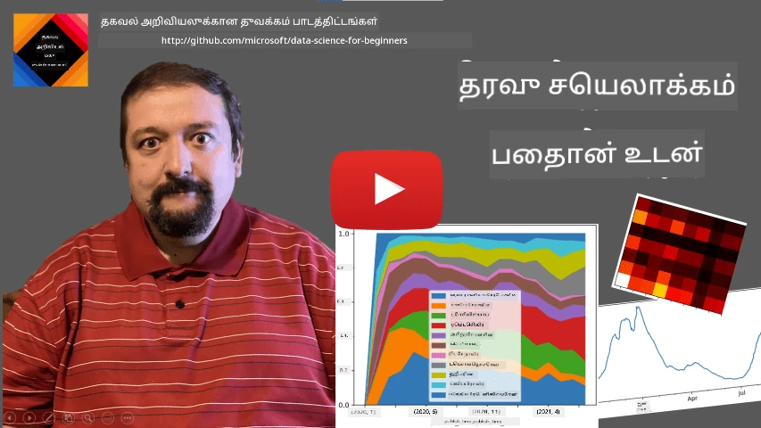
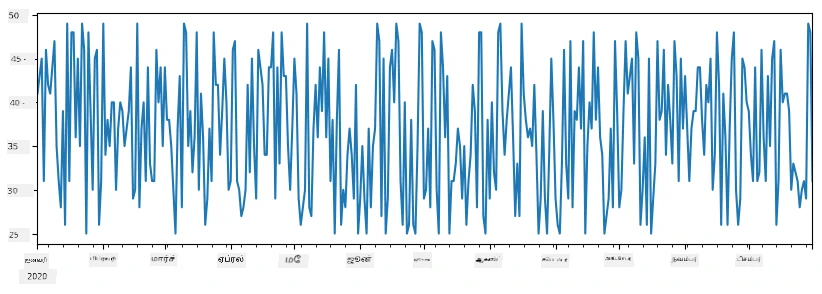
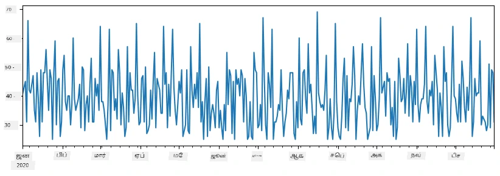
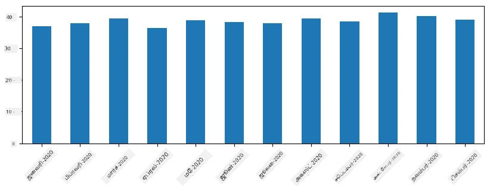
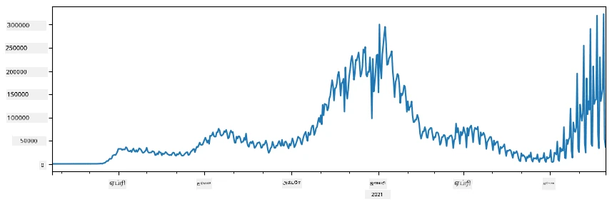
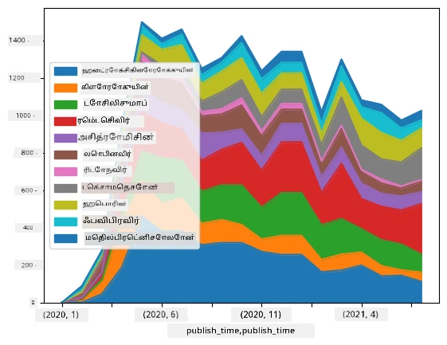

# தரவுடன் பணியாற்றல்: Python மற்றும் Pandas நூலகம்

|  ](../../sketchnotes/07-WorkWithPython.png) |
| :-------------------------------------------------------------------------------------------------------: |
|                 Python உடன் வேலை செய்வது - _Sketchnote by [@nitya](https://twitter.com/nitya)_                 |

[](https://youtu.be/dZjWOGbsN4Y)

தரவுத்தளங்கள் தரவை சேமிக்கவும் கேள்விப்படிகளை செய்முறை மொழிகளைக் கொண்டு கேட்கவும் மிகவும் திறமையான வழிகளை வழங்கினாலும், தரவை கையாள வேண்டிய மிக தாழ்வான மற்றும் சுதந்திரமான வழி உங்கள் சொந்தத் திட்டத்தை எழுதி அதன் மூலம் தரவை செயலாக்குதலே ஆகும். பல சூழல்களில், தரவுத்தளக் கேள்வி செய்வது பலவீனமான வழியாக இருக்கும். ஆனால் சிலச் சூழல்களில், அதிக சிக்கலான தரவு செயலாக்கம் தேவைப்படும் போது அது எளிதில் SQL கொண்டு செய்ய முடியாது. 
தரவு செயலாக்கத்தை எந்தத் திட்டமிடல் மொழியிலும் எழுத இயலும், ஆனால் தரவுடன் வேலை செய்வதில் குறிப்பாக மேல்நிலை பிரிவுகளில் சில மொழிகள் உள்ளன. தரவியல் விஞ்ஞானிகள் பொதுவாக பின்வரும் மொழிகளில் ஒன்றைப் பயன்படுத்த விரும்புகிறார்கள்:

* **[Python](https://www.python.org/)**, பொதுவான பயன்பாட்டிற்கான திட்டமிடல் மொழி, அதன் எளிய தன்மையால் ஆரம்பிகளுக்கு சிறந்த விருப்பங்களில் ஒன்று என கருதப்படுகிறது. Python க்கு பல கூடுதல் நூலகங்கள் உள்ளன, அவை உங்கள் தரவு ZIP ஆர்கைவிலிருந்து எடுக்க உதவாது மட்டுமல்ல, படத்தை கிரேஸ்கேல் மாற்றவும் உதவுகின்றன. தரவைப் பற்றிய அறிவியலை தவிர Python வலை கோப்புரத்திலும் பெரிதும் பயன்படுத்தப்படுகிறது. 
* **[R](https://www.r-project.org/)** என்பது பாரம்பரியமான பெட்டி, புள்ளியியல் தரவு செயலாக்கத்தை மனதில் வைத்து உருவாக்கப்பட்டது. அதிலும் பெரிய நூலக சேமிப்பகம் (CRAN) உள்ளது, இது தரவு செயலாக்கத்திற்கு நல்ல தேர்வு ஆகும். ஆனால் R என்பது பொதுவான பயன்பாட்டுக்கான திட்டமிடல் மொழி அல்ல, மற்றும் தரவியல் துறைக்கு வெளியே அரிதாகப் பயன்படுத்தப்படுகிறது.
* **[Julia](https://julialang.org/)** மற்றொரு மொழி தான் தரவியல் அறிவியலுக்காக குறிப்பாக உருவாக்கப்பட்டது. இது Python விட சிறப்பு செயல்திறனைக் கொடுப்பதற்காக திட்டமிடப்பட்டது, அறிவியல் பரிசோதனைகளுக்கான சிறந்த கருவியாகும்.

இந்த பாடத்தில், எளிய தரவு செயலாக்கத்திற்கு Python பயன்படுத்துவதை கவனித்துக் கொள்ளப்போகிறோம். மொழியில் அடிப்படையான பரிச்சயத்தை கொண்டதாக நினைக்கிறோம். Python இன் விரிவான பயணத்திற்கு கீழ்க்காணும் ஆதாரங்களைப் பார்க்கலாம்:

* [Turtle Graphics மற்றும் Fractals உடன் Python கற்றுக்கொள்ளவும்](https://github.com/shwars/pycourse) - GitHub அடிப்படையிலான உரைந்த அறிமுகப் பாடவியல்
* [Python உடன் உங்கள் முதல் படிகளை எடுக்கவும்](https://docs.microsoft.com/en-us/learn/paths/python-first-steps/?WT.mc_id=academic-77958-bethanycheum) [Microsoft Learn](http://learn.microsoft.com/?WT.mc_id=academic-77958-bethanycheum) இல் கற்றல் பாதை

தரவுகள் பல்வேறு வடிவங்களில் இருக்க முடியும். இந்தக் பாடத்தில், நாம் மூன்று தரவு வடிவங்களைப் பார்க்கப்போகிறோம் - **அட்டவணைத் தரவு**, **உரை** மற்றும் **படங்கள்**.

நாம் பல இணைப்புகளைக் கொடுப்பதற்குப் பதிலாக சில தரவு செயலாக்க உதாரணங்களுக்கே கவனம் செலுத்தப்போகிறோம். இது நீங்கள் என்ன செய்யக்கூடியது என்பதைப் புரிந்துகொள்ள உதவுகிறது மற்றும் உங்கள் பிரச்சினைகளுக்கு தீர்வுகளை எங்கே காண்பது என்பதைக் கற்றுக்கொள்ள உதவும்.

> **மிகவும் பயனுள்ள ஆலோசனை**. நீங்கள் செய்யவேண்டிய குறிப்பிட்ட செயல்பாட்டை நீங்கள் எப்படி செய்யமுடியும் எனப் தெரியாவிட்டால், அதை இணையத்தில் தேட முயலுங்கள். [Stackoverflow](https://stackoverflow.com/) பைத்தான் பல வழக்கமான பணிகளுக்கான பல பயனுள்ள குறியீடு உதாரணங்களை வழங்குகிறது. 


## [முன்-பாடம் குயிஸ்](https://ff-quizzes.netlify.app/en/ds/quiz/12)

## அட்டவணை தரவு மற்றும் Dataframes

நாம் தொடர்புடைய தரவுத்தளங்களை பற்றி பேசும்போது நீங்களே அட்டவணை தரவுடன் சந்தித்திருக்கிறீர்கள். பெரிய தரவுகள் பல இணைக்கப்பட்ட அட்டவணைகளில் இருக்கும் போது, SQL பயன்படுத்துவது உண்மையில் நல்லது. ஆனால் பல சந்தர்ப்பங்களில், நாம் தரவு அட்டவணையைப் பெற்றிருக்கிறோம், அதைக் கொண்டு நாம் சில **புரிதல்கள்** அல்லது **உள்ளடக்கங்கள்** பெற வேண்டும், உதாரணமாக விநியோகம், மதிப்புகளுக்கிடையேயான தொடர்பு போன்றவை. தரவியல் அறிவியலில், பலவித சந்தர்புகளில் மூல தரவுகளில் மாற்றங்களைச் செய்து, பின்னர் காட்சிப்படுத்துதலுக்குப் பிறகு செய்வது தேவையானது. இந்த இரு படிகள் Python கொண்டு எளிதாக செய்யக்கூடியவை.

Python இல் அட்டவணை தரவை கையாள உதவும் முக்கியமான இரண்டு நூலகங்கள் உள்ளன:
* **[Pandas](https://pandas.pydata.org/)** என்பது **Dataframes** எனப்படும் அவற்றின் அட்டைத் தொழில்நுட்ப அட்டவணைகளுக்குச் சமமானவற்றை கையாள உதவுகிறது. நீங்கள் பெயரிடப்பட்ட நெடுவரிசைகள் வைத்துக் கொள்ளலாம் மற்றும் வரிசை, நெடுவரிசை மற்றும் Dataframes இல் பொதுவாக வெவ்வேறு பணிகளை செய்யலாம். 
* **[Numpy](https://numpy.org/)** என்பது **tensors** அல்லது பல பரிமாண **அறை** வுகளை கையாளும் நூலகம். அறைகளில் அனைத்தும் ஒரே வகையான தரவுகளைக் கொண்டிருக்கும், இது dataframe உங்கள் தொழில்நுட்பத்தை விட எளிமையானதாக இருப்பது போல, ஆனால் அதிக கணித செயலாக்கவையும் குறைவான நெருக்கடியையும் அளிக்கிறது.

நீங்கள் அறிந்திருக்க வேண்டிய மற்ற சில நூலகங்களும் உள்ளன:
* **[Matplotlib](https://matplotlib.org/)** என்பது தரவு காட்சி மற்றும் வரைபடங்களை வரைதல் பயன்படுத்தப்படும் நூலகம்
* **[SciPy](https://www.scipy.org/)** என்பது கூடுதலான அறிவியல் செயல்பாடுகளை கொண்ட நூலகம். நாம் முன்னர் இது பற்றி புள்ளியியல் மற்றும் அபாயத்தைப் பேசும்போது சந்தித்தோம்

Python திட்டத்தின் ஆரம்பத்தில் கீழ்காணும் குறியீடு மூலம் நாம் இந்நூலகங்களை இறக்குமதி செய்கிறோம்:
```python
import numpy as np
import pandas as pd
import matplotlib.pyplot as plt
from scipy import ... # நீங்கள் தேவையான சரியான துணை-பெகேஜ்களை குறிப்பிட வேண்டும்
``` 

Pandas இல் சில அடிப்படை பார்வைகள் உள்ளன.

### வரிசைகள் (Series)

**Series** என்பது மதிப்புகளின் வரிசை, பட்டியலோ numpy array போலவே. முக்கிய வேறுபாடு அது ஒரு **index** உடையதாக இருக்கும், மற்றும் நாம் series இல் செயல்படும்போது (எ.கா., கூட்டம் செய்யும்போது), index கருதப்படும். Index என்பது எளிய முழுமைக் க்கெண் வரிசை நாட்கள் தொகை (Series ஐ பட்டியல் அல்லது array இருந்து உருவாக்கும் போது இயல்பாகவே பயன்படும் index) அல்லது சிக்கலான அமைப்பு, உதாரணமாக தேதிக் கால இடைவேளையாக இருக்கலாம்.

> **குறிப்பு**: ஆவணத்துடன் இருக்கும் குறிப்புகள் உள்ள notebook [`notebook.ipynb`](notebook.ipynb) இல் சில அறிமுக Pandas குறியீடுகள் உள்ளன. இங்குக் சில எடுத்துக்காட்டுகளையே நாங்கள் குறிப்பிட்டுள்ளோம், மேலும் முழு notebook ஐப் பார்க்க வரவேற்கப்படுகிறீர்கள்.

உதாரணமாக நினைக்கலாம்: நமது ஐஸ் க்ரீம் கடையின் விற்பனையை பகுப்பாய்வு செய்ய விரும்புகிறோம். ஒரு காலகட்டத்திற்கு விற்பனை எண்ணிக்கை வரிசையை (ஒவ்வொரு நாளும் விற்பனை செய்யப்பட்ட பொருட்களின் எண்ணிக்கை) உருவாக்குவோம்:

```python
start_date = "Jan 1, 2020"
end_date = "Mar 31, 2020"
idx = pd.date_range(start_date,end_date)
print(f"Length of index is {len(idx)}")
items_sold = pd.Series(np.random.randint(25,50,size=len(idx)),index=idx)
items_sold.plot()
```


இப்போது ஒவ்வொரு வாரமும் நாங்கள் நண்பர்களுக்கான ஒரு பார்ட்டி ஏற்பாடு செய்கிறோம், அதற்காக கூடுதல் 10 ஐஸ் க்ரீம் பாக்கெட்டுகளை எடுத்துக் கொள்கிறோம். இதனை காட்டும் வரிசையை வார வாரம் index கொண்டு உருவாக்கலாம்:
```python
additional_items = pd.Series(10,index=pd.date_range(start_date,end_date,freq="W"))
```
எருகு இரண்டு வரிசைகளையும் கூட்டும்போது, மொத்த எண்ணிக்கை பெறப்படும்:
```python
total_items = items_sold.add(additional_items,fill_value=0)
total_items.plot()
```


> **குறிப்பு** நாம் நேரடி தொகுப்பு `total_items+additional_items` என்ற திறன் மொழியைப் பயன்படுத்தவில்லை. அது நடந்திருந்தால், முடிவில் வீரியமான `NaN` (*எண் அல்ல*) மதிப்புகளைக் காணத்தக்கதாயிருக்கும். இது எதற்கு என்றால் `additional_items` வரிசையில் சில index இடங்களில் பத்தியான மதிப்புகள் இல்லை என்பதும், `Nan` ஐ எந்த எண்ணியைக்கும் கூட்டும் போது `NaN` பிரதி வரும் என்பதுமான காரணத்தால் ஆகும். ஆகவே கூட்டும் போது `fill_value` என்ற அலகினை குறிப்பிடுவது அவசியம்.

கால தேவைகள் கொண்ட இந்த வரிசைகளை நாம் வேறு வேறு நேர இடைவெளிகளுக்கு **மீண்டும் மாதிரிப் படுத்தலாம்**. உதாரணமாக மாதந்தொறும் சராசரி விற்பனையை கணக்கிட விரும்பினால், கீழே உள்ள குறியீட்டை பயன்படுத்தலாம்:
```python
monthly = total_items.resample("1M").mean()
ax = monthly.plot(kind='bar')
```


### DataFrame

DataFrame என்பது பொதுவாக ஒரே Index கொண்ட பல Series களின் தொகுப்பாகும். சில Series களை ஒன்றாக சேர்த்து DataFrame உருவாக்கலாம்:
```python
a = pd.Series(range(1,10))
b = pd.Series(["I","like","to","play","games","and","will","not","change"],index=range(0,9))
df = pd.DataFrame([a,b])
```
இது கீழ்காணும் வரிசை அட்டவணையை உருவாக்கும்:
|     | 0   | 1    | 2   | 3   | 4      | 5   | 6      | 7    | 8    |
| --- | --- | ---- | --- | --- | ------ | --- | ------ | ---- | ---- |
| 0   | 1   | 2    | 3   | 4   | 5      | 6   | 7      | 8    | 9    |
| 1   | I   | like | to  | use | Python | and | Pandas | very | much |

நாம் Series களை நெடுவரிசைகளாகவும் பயன்படுத்தலாம், மேலும் அட்டவணை களின் பெயர்களை அகராதி கொண்டு குறிப்பிடலாம்:
```python
df = pd.DataFrame({ 'A' : a, 'B' : b })
```
இது கீழ்காணும் அட்டவணையை தரும்:

|     | A   | B      |
| --- | --- | ------ |
| 0   | 1   | I      |
| 1   | 2   | like   |
| 2   | 3   | to     |
| 3   | 4   | use    |
| 4   | 5   | Python |
| 5   | 6   | and    |
| 6   | 7   | Pandas |
| 7   | 8   | very   |
| 8   | 9   | much   |

**குறிப்பு** நாம் இப்போது முன்பு கொண்ட அட்டவணையை மாற்றி (`transpose`) இதோடு ஒப்பிடலாம், உதாரணமாக
```python
df = pd.DataFrame([a,b]).T.rename(columns={ 0 : 'A', 1 : 'B' })
```
இங்கு `.T` என்பது DataFrame ஐ மாற்றும் செயலில் பயன்படுத்தப்படுகிறது, அதாவது வரிசைகள் மற்றும் நெடுவரிசைகள் மாற்றப்படுகிறது, மேலும் `rename` மூலம் நெடுவரிசைகளை முன்பு எடுத்துக்காட்டிற்கு பொருந்தும் வகையில் பெயரிட முடியும்.

DataFrames க்கு செய்யக்கூடிய சில முக்கிய செயல்பாடுகள்:

**நெடுவரிசை தெரிவு**. தனி நெடுவரிசைகளை `df['A']` என்று எழுதி தெரிவு செய்யலாம் - இது Seriesஐ தரும். மேலும் சில நெடுவரிசைகள் தொகுப்பை `df[['B','A']]` என்ற முறையில் தேர்வு செய்யலாம் - இது மற்றொரு DataFrame ஐ தரும்.

**தேர்வு செய்வது** தகுந்த வரிப்பட்டியலை மட்டும் இடம் பெற. உதாரணமாக, நெடுவரிசை `A` ஐ 5 ரூபாய்க்கும் மேற்பட்ட வரிகளை மட்டும் புறतடுக்க `df[df['A']>5]` என எழுத்தலாம்.

> **குறிப்பு**: தேர்வு செய்யும் முறை பின்வருமாறு. வெளிப்பாடு `df['A']<5` ஒரு பூலிய வரிசை தருகிறது, இது அசலான `df['A']` என்பதன் ஒவ்வொரு உறுப்பிற்கும் அது `True` ஆகுமா அல்லது `False` ஆகுமா எனக் காட்டுகிறது. பூலிய வரிசை ஒரு Index ஆகப் பயன்படுத்தப்படும்போது, அது DataFrame இல் சார்ந்த வரிசைகள் ஒன்றுசேர்கிறது. ஆகவே சீரற்ற பைத்தான் பூலிய வெளிப்பாடு, உதாரணமாக `df[df['A']>5 and df['A']<7]` தவறானது. பதிலாக, பூலிய வரிசையில் சிறப்பு `&` செயல்பாட்டைப் பயன்படுத்தி, `df[(df['A']>5) & (df['A']<7)]` என்று எழுதியல் (*வரிசைகள் முக்கியம்*).

**புதிய கணக்கிடக்கூடிய நெடுவரிசைகளை உருவாக்குதல்**. நமது DataFrame க்கு எளிதாகக் கணக்கிடக்கூடிய புதிதான நெடுவரிசைகள் உருவாக்கலாம் இந்த மாதிரி விளக்கமான வெளிப்பாடுகளைக் கொண்டு:
```python
df['DivA'] = df['A']-df['A'].mean() 
``` 
இந்த எடுத்துக்காட்டு A இன் சராசரி மதிப்பிலிருந்து வேறுபாட்டை கணக்கிடுகிறது. இங்கு நாம் ஒரு Series ஐ கம்பியுடன் உருவாக்கி அதை இடதுபுறம் நெடுவரிசையாக ஒதுக்கீடு செய்கிறோம். எனவே Series க்கு பொருந்தாத எந்த செயல்களையும் பயன்படுத்த முடியாது, உதாரணமாக கீழ்க்காணும் குறியீடு தவறானது:
```python
# தவறான குறியீடு -> df['ADescr'] = "குறைவு" என்றால் df['A'] < 5 இல்லை என்றால் "உயர்"
df['LenB'] = len(df['B']) # <- தவறான முடிவு
``` 
இறுதிப் படைப்பு, இலக்கண ரீதியாக சரியாக இருந்தாலும், நமது நோக்கமிற்கு மாறாக, ஒவ்வொரு உறுப்பின் நீளத்தை அல்ல, Series B யின் மொத்த நீளத்தை நெடுவரிசை மெதுவாக ஒதுக்கிகிறது, எனவே தவறு.

சிக்கலான வெளிப்பாடுகளை கணக்கிட விரும்பினால், `apply` செயலியை பயன்படுத்தலாம். கடைசி எடுத்துக்காட்டை பின்வருமாறு எழுதலாம்:
```python
df['LenB'] = df['B'].apply(lambda x : len(x))
# அல்லது
df['LenB'] = df['B'].apply(len)
```

மேலே கூறிய செயல்பாட்டுக்குப் பிறகு, நமக்கு கீழ்காணும் DataFrame கிடைக்கும்:

|     | A   | B      | DivA | LenB |
| --- | --- | ------ | ---- | ---- |
| 0   | 1   | I      | -4.0 | 1    |
| 1   | 2   | like   | -3.0 | 4    |
| 2   | 3   | to     | -2.0 | 2    |
| 3   | 4   | use    | -1.0 | 3    |
| 4   | 5   | Python | 0.0  | 6    |
| 5   | 6   | and    | 1.0  | 3    |
| 6   | 7   | Pandas | 2.0  | 6    |
| 7   | 8   | very   | 3.0  | 4    |
| 8   | 9   | much   | 4.0  | 4    |

**எண்களை அடிப்படையாகக் கொண்டு வரிசைகளைத் தேர்வு செய்தல்** `iloc` கட்டமைப்பைப் பயன்படுத்தி செய்யலாம். உதாரணமாக, DataFrame இல் முதல் 5 வரிசைகளை தேர்வுசெய்ய:
```python
df.iloc[:5]
```

**குழு கட்டமைப்புகள்** Excel இல் உள்ள *pivot tables* போன்ற முடிவுகளை பெற பயன்படும். உதாரணமாக நெடுவரிசை `LenB` இன் ஒவ்வொரு மதிப்புக்கும் நெடுவரிசை `A` இன் சராசரி மதிப்பை கணக்கிட விரும்பினால், `LenB` உடன் DataFrame ஐ குழுவாக்கி, `mean` செயலியைப் பயன்படுத்தலாம்:
```python
df.groupby(by='LenB')[['A','DivA']].mean()
```
ஒரே குழுவில் சராசரி மற்றும் உறுப்புகள் எண்ணிக்கை இரண்டும் தேவைப்படின், சிக்கலான `aggregate` செயலியை பயன்படுத்தலாம்:
```python
df.groupby(by='LenB') \
 .aggregate({ 'DivA' : len, 'A' : lambda x: x.mean() }) \
 .rename(columns={ 'DivA' : 'Count', 'A' : 'Mean'})
```
இதனால் கீழ்காணும் அட்டவணை கிடைக்கும்:

| LenB | எண்ணிக்கை | சராசரி     |
| ---- | ---------- | ----------- |
| 1    | 1          | 1.000000    |
| 2    | 1          | 3.000000    |
| 3    | 2          | 5.000000    |
| 4    | 3          | 6.333333    |
| 6    | 2          | 6.000000    |

### தரவைப் பெறுதல்


Python பொருட்களிலிருந்து Series மற்றும் DataFrames உருவாக்க எளிமையானது என்பதை நாமாய் பார்த்துவிட்டோம். எனினும், தரவு பொதுவாக ஒரு உரை கோப்பு அல்லது Excel அட்டவணை வடிவத்தில் வரும். அதற்கெதிராக, Pandas எங்களுக்கு தரவுகளை வட்டு இயக்கியில் இருந்து எப்படிப் போர்த்துவது என்பது ஒரு எளிய வழியை வழங்குகிறது. உதாரணமாக, CSV கோப்பை வாசிப்பது இவ்வளவுதான் எளிமை:
```python
df = pd.read_csv('file.csv')
```
"சவால்" பிரிவில் வெளிப்புற வலைத்தளங்களிலிருந்து தரவை பெறுதல் உட்பட, தரவை போர்த்தும் பல எடுத்துக்காட்டுகளை நாம் பார்க்கப்போகிறோம்


### அச்சிடல் மற்றும் வரைபடம் வரைவல்

ஒரு தரவியல் விஞ்ஞானி பெரும்பாலும் தரவை ஆய்வு செய்ய வேண்டும், அதனால் அதை பார்வையிட முடியும் என்பது முக்கியம். DataFrame பெரியதாயினும், பல நேரங்களில் நாம் அனைத்தும் சரியாக நடக்கின்றனவா என்று உறுதி செய்யும் நோக்கில் சில முதல் வரிசைகளை அச்சிட விரும்புகிறோம். இது `df.head()` என்பதை அழுத்துவதன் மூலம் செய்யலாம். நீங்கள் Jupyter Notebook-இல் இதை இயக்கினால், DataFrame ஒரு அழுத்தமான அட்டவணை வடிவில் அச்சிடப்படும்.

சில நெடுவரிசைகளை காண்பிக்க, `plot` அம்சத்தின் பயன்பாட்டையும் நாம்வீட்டுள்ளோம். `plot` பல பணிகளுக்கு மிக பயனுள்ளதாக இருக்கிறது, மற்றும் `kind=` ஆகும் அளவுருவை மையமாக கொண்டு பல்வேறு வரைபட வகைகளை ஆதரிக்கிறது; நீங்கள் எப்போதும் `matplotlib` நூலகத்தை நேரடியாக பயன்படுத்தி முறைசாரா கடினமான வரைபடங்களை வரைய முடியும். தரவு காட்சி பற்றி தனி பாடங்களில் விரிவாகப் பேசுவோம்.

இந்த பார்வை Pandas இன் மிக முக்கியமான கருத்துக்களை உள்ளடக்கியது, ஆனால், நூலகம் மிகச் செற்றது, நீங்கள் இதனுடன் செய்யக்கூடியவை எல்லைக்கு வரம்பில்லை! இப்போது குறிப்பிட்ட பிரச்சனையை தீர்க்க இதை பயன்படுத்துவோம்.

## 🚀 சவால் 1: COVID பரவலை பகுப்பாய்வு செய்தல்

முதன்மை பிரச்சினை நாம் கவனம் செலுத்தப்போகும் COVID-19 தொற்று பரவல் மாதிரியாகும். அதற்காக, வெவ்வேறு நாடுகளிலுள்ள பாதிக்கப்பட்ட நபர்களின் எண்ணிக்கையைப் பற்றிய தரவுகளை, [Center for Systems Science and Engineering](https://systems.jhu.edu/) (CSSE), [Johns Hopkins University](https://jhu.edu/) வழங்கும். தரவுத்தொகுப்பு [இந்த GitHub Repository](https://github.com/CSSEGISandData/COVID-19) யில் கிடைக்கிறது.

தரவு எப்படி கையாள்வது என்பதை göstறுவதை நோக்கி, [`notebook-covidspread.ipynb`](notebook-covidspread.ipynb)-ஐ திறந்து பின்புறம் வாசிக்க அழைக்கிறோம். நீங்கள் செல்லமைப்புகளை இயக்கு கூடும், நான் முடிவில் நீங்கள் செய்ய ஊடுருவியும் சவால்களை விடுத்துள்ளோம்.



> Jupyter Notebook-ல் குறியீட்டை இயக்க எப்படி என தெரியவில்லை என்றால், [இந்தக் கட்டுரையை](https://soshnikov.com/education/how-to-execute-notebooks-from-github/) பாருங்கள்.

## கட்டமைக்கப்படாத தரவுடன் வேலை செய்யல்

தரவு பெரும்பாலும் அட்டவணை வடிவில் வரும் என்றாலும், சில நாட்களில் நாம் கட்டமைக்கப்படாத தரவுகளை உள்ளடக்க வேண்டும், உதாரணமாக உரை அல்லது படங்கள். இந்நிலையில், மேலே பார்ந்த தரவு செயலாக்க தொழில்நுட்பங்களைப் பயன்படுத்த, நாம் எப்படியாவது கட்டமைக்கப்பட்ட தரவை **திரட்ட** வேண்டியுள்ளது. சில எடுத்துக்காட்டுகள்:

* உரையிலிருந்து முக்கியச் சொற்களை திரட்டி அவை எத்தனை முறை தோன்றுகின்றன என்பதை காண்பது
* படத்தில் உள்ள பொருட்களை பற்றிய தகவல்களை neural networks பயன்படுத்தி எடுக்குதல்
* வீடியோ கேமரா கேட்பில் உள்ள மக்களின் உணர்வுகளைப் பெறுதல்

## 🚀 சவால் 2: COVID ஆய்வுக் கட்டுரைகளை பகுப்பாய்வு செய்தல்

இந்த சவாலை COVID தொற்றுநிலைபேறின் தலைப்பில் தொடர்கிறோம், மற்றும் இந்தப்பொருளில் உள்ள அறிவியல் கட்டுரைகளை செயலாக்க சுற்றிலும் கவனம் செலுத்துகிறோம். [CORD-19 Dataset](https://www.kaggle.com/allen-institute-for-ai/CORD-19-research-challenge) COVID பற்றிய 7000-க்கும் மேற்பட்ட (எழுதும் நேரத்தில்) ஆராய்ச்சி கட்டுரைகள், மேட்டாடேட்டா மற்றும் சுருக்கங்களுடன் (அரை கட்டுரைகளுக்கு முழு உரையும் வழங்கப்பட்டுள்ளது) கிடைக்கிறது.

[Text Analytics for Health](https://docs.microsoft.com/azure/cognitive-services/text-analytics/how-tos/text-analytics-for-health/?WT.mc_id=academic-77958-bethanycheum) அறிவுக்கோள் சேவையைப் பயன்படுத்தி இந்த தரவுத்தொகுப்பை பகுப்பாய்வு செய்த ஒரு முழு எடுத்துக்காட்டு [இந்த வலைப்பதிவில்](https://soshnikov.com/science/analyzing-medical-papers-with-azure-and-text-analytics-for-health/) விளக்கப்பட்டுள்ளது. எங்களால் சரளப்படுத்தப்பட்ட பகுப்பாய்வையும் விவாதிப்போம்.

> **குறிப்பு**: இந்த தொகுப்பின் ஒரு பிரதியை இந்த தொகுப்பில் வழங்கவில்லை. முதலில் [இந்த Kaggle தரவுத்தொகுப்பில்](https://www.kaggle.com/allen-institute-for-ai/CORD-19-research-challenge?select=metadata.csv) உள்ள [`metadata.csv`](https://www.kaggle.com/allen-institute-for-ai/CORD-19-research-challenge?select=metadata.csv) கோப்பை பதிவிறக்கம் செய்ய வேண்டும். Kaggle இல் பதிவு அவசியமாக இருக்கலாம். பதிவு இல்லாமல் பதிவிறக்கம் செய்ய [இங்கே](https://ai2-semanticscholar-cord-19.s3-us-west-2.amazonaws.com/historical_releases.html) இருந்தும் பதிவிறக்க முடியும், ஆனால் அது முழு உரைகளும் உள்ளடங்கும், metadata கோப்புக்கு கூடுதலாக.

[`notebook-papers.ipynb`](notebook-papers.ipynb)-ஐ திறந்து தொடர்ந்து வாசிக்கவும். செல்லமைப்புகளை இயக்கு கூடும், நீங்கள் முடிவில் செய்யுமாறு விட்டுச் சென்ற சவால்களை செய்யவும்.



## படத் தரவை செயலாக்குதல்

சமீபத்தில், படங்களை புரிந்துகொள்ள நமக்கு அனுமதிக்கும் மிகவும் வலுவான AI மாதிரிகள் உருவாக்கப்பட்டுள்ளன. முன்கூட்டியே பயிற்று பெற்ற neural networkகள் அல்லது மேகம் சேவைகள் மூலம் பல பணிகளைத் தீர்க்க முடியும். சில எடுத்துக்காட்டுகள்:

* **பட வகைப்படுத்தல்**, இது ஓர் உருவாக்கப்பட்ட வகைபாடுகளில் படங்களை வகைப்படுத்த உதவும். நீங்கள் [Custom Vision](https://azure.microsoft.com/services/cognitive-services/custom-vision-service/?WT.mc_id=academic-77958-bethanycheum) போன்ற சேவைகள் பயன்படுத்தி உங்கள் சொந்த பட வகைப்பாளர்களை எளிதில் பயிற்றுவிக்கலாம்
* **பொருள் கண்டறிதல்** படத்தில் பல பொருட்களை கண்டறிய. [computer vision](https://azure.microsoft.com/services/cognitive-services/computer-vision/?WT.mc_id=academic-77958-bethanycheum) போன்ற சேவைகள் சில பொதுவான பொருட்களை கண்டறிய முடியும், மற்றும் [Custom Vision](https://azure.microsoft.com/services/cognitive-services/custom-vision-service/?WT.mc_id=academic-77958-bethanycheum) மூலம் உங்கள் தேவைக்கு ஏற்ப சில சிறப்பு பொருட்களை கண்டறிய பயிற்றுவிக்கலாம்.
* **முகம் கண்டறிதல்**, வயது, பாலினம் மற்றும் உணர்வு கண்டறிதலை உட்பட. இது [Face API](https://azure.microsoft.com/services/cognitive-services/face/?WT.mc_id=academic-77958-bethanycheum) மூலம் செய்யக்கூடும்.

இந்த மேகம் சேவைகள் அனைத்தும் [Python SDKகளை](https://docs.microsoft.com/samples/azure-samples/cognitive-services-python-sdk-samples/cognitive-services-python-sdk-samples/?WT.mc_id=academic-77958-bethanycheum) பயன்படுத்தி அழைக்கப்படலாம் மற்றும் எனவே உங்கள் தரவு ஆய்வு பணிசூழலில் எளிதில் இணைக்கப்படலாம்.

படத் தரவுகளிலிருந்து தரவு ஆய்வு செய்த சில எடுத்துக்காட்டு கீழே இவை:
* வலைப்பதிவுத் கட்டுரை [எப்படி குறியீடு இல்லாமல் தரவியலைக் கற்றுக்கொள்வது](https://soshnikov.com/azure/how-to-learn-data-science-without-coding/) இல், Instagram புகைப்படங்களை ஆய்வு செய்து, மக்கள் ஏன் ஒரு புகைப்படம் மீது அதிகமான விருப்பங்களை அளிக்கிறார்கள் என்பதை புரிந்துகொள்கிறோம். முதலில் [computer vision](https://azure.microsoft.com/services/cognitive-services/computer-vision/?WT.mc_id=academic-77958-bethanycheum) பயன்படுத்தி படங்களிலிருந்து சாத்தியமான அளவு தகவலை திரட்டி, பின்னர் [Azure Machine Learning AutoML](https://docs.microsoft.com/azure/machine-learning/concept-automated-ml/?WT.mc_id=academic-77958-bethanycheum) கொண்டு விளக்கக்கூடிய மாதிரியை கட்டியமைக்கிறோம்.
* [Facial Studies Workshop](https://github.com/CloudAdvocacy/FaceStudies) இல் [Face API](https://azure.microsoft.com/services/cognitive-services/face/?WT.mc_id=academic-77958-bethanycheum) பயன்படுத்தி நிகழ்வுகளின் புகைப்படங்களில் உள்ள மக்களின் உணர்வுகளை சேகரித்து, மக்கள் எதனால் மகிழ்ச்சியடைகிறார்கள் என்பதை புரிந்துகொள்ள முயல்கிறோம்.

## முடிவு

கட்டமைக்கப்பட்ட அல்லது கட்டமைக்கப்படாத தரவு உங்களிடம் இருந்தாலும்கூட, Python ஐப் பயன்படுத்தி தரவு செயலாக்கம் மற்றும் புரிதலில் உள்ள அனைத்து படிகளையும் செய்ய முடியும். இது மிகவும் சுதந்திரமான தரவு செயலாக்க வழி ஆகும், அதுதான் பெரும்பாலான தரவியலை அறிவாளிகள் Python-ஐ அவரது முதன்மை கருவியாக பயன்படுத்துவதன் காரணமாகும். உங்கள் தரவியல் பயணத்தில் நீங்கள் கடுமையாக இருப்பின் Python-ஐ ஆழமாக கற்றுக்கொள்வது நல்ல எண்ணமாக இருக்கும்!

## [பாடநிறுத்தம் பிறகு விடைத் தேர்வு](https://ff-quizzes.netlify.app/en/ds/quiz/13)

## விமர்சனம் & சுயபடிப்பு

**புத்தகங்கள்**
* [Wes McKinney. Python for Data Analysis: Data Wrangling with Pandas, NumPy, and IPython](https://www.amazon.com/gp/product/1491957662)

**ஆன்லைன் வளங்கள்**
* அதிகாரபூர்வ [10 நிமிடங்களில் Pandas கற்றல்](https://pandas.pydata.org/pandas-docs/stable/user_guide/10min.html) பயிற்சி
* [Pandas காட்சிப்படுத்தல் 문서](https://pandas.pydata.org/pandas-docs/stable/user_guide/visualization.html)

**Python கற்றல்**
* [Turtle Graphics மற்றும் Fractals கொண்ட ஒரு பொழுதுபோக்கு முறையில் Python கற்றல்](https://github.com/shwars/pycourse)
* [Python முதலில் படித் தொடக்கம்](https://docs.microsoft.com/learn/paths/python-first-steps/?WT.mc_id=academic-77958-bethanycheum) [Microsoft Learn](http://learn.microsoft.com/?WT.mc_id=academic-77958-bethanycheum) இல் கற்றல் பாதை

## பணிவகுப்பு

[மேலே உள்ள சவால்களுக்கு மேலும் விரிவான தரவு ஆய்வு செய்யவும்](assignment.md)

## கடவுச்சொற்கள்

இந்த பாடத்தை ♥️ உடன் [Dmitry Soshnikov](http://soshnikov.com) எழுதியுள்ளார்

---

<!-- CO-OP TRANSLATOR DISCLAIMER START -->
**மறுப்பு**:
இந்த ஆவணம் AI மொழிபெயர்ப்பு சேவை [Co-op Translator](https://github.com/Azure/co-op-translator) பயன்படுத்தி மொழிபெயர்க்கப்பட்டுள்ளது. நாங்கள் துல்லியத்திற்காக முயற்சி செய்துள்ளோம், ஆனால் தானாக செய்யப்படும் மொழிபெயர்ப்புகளில் பிழைகள் அல்லது தவறுகள் இருக்கலாம் என்பதை கவனத்தில் கொள்ளவும். அசல் ஆவணம் அதன் தாய்மொழியில் அதிகாரப்பூர்வ ஆதாரமாக கருதப்பட வேண்டும். முக்கியமான தகவல்களுக்கு, தொழில்நுட்பமான மனித மொழிபெயர்ப்பு பரிந்துரைக்கப்படுகிறது. இந்த மொழிபெயர்ப்பைப் பயன்படுத்துவதால் ஏற்படும் எந்த தவறான புரிதல்கள் அல்லது தவறான விளக்கத்திற்கும் நாங்கள் பொறுப்பில்வில்லை.
<!-- CO-OP TRANSLATOR DISCLAIMER END -->