# மேகவணிகியில் தரவுத் அறிவியல்: "குறைந்த குறியீடு/குறியீடு இல்லை" வழி

| ](../../sketchnotes/18-DataScience-Cloud.png)|
|:---:|
| மேகவணிகியில் தரவுத் அறிவியல்: குறைந்த குறியீடு - _Sketchnote by [@nitya](https://twitter.com/nitya)_ |

உள்ளடக்கக் கட்டமைப்பு:

- [மேகவணிகியில் தரவுத் அறிவியல்: "குறைந்த குறியீடு/குறியீடு இல்லை" வழி](#மேகவணிகியில்-தரவுத்-அறிவியல்-குறைந்த-குறியீடுகுறியீடு-இல்லை-வழி)
  - [முன்-வகுப்பு வினாக்களம்](#முன்-வகுப்பு-வினாக்களம்)
  - [1. அறிமுகம்](#1-அறிமுகம்)
    - [1.1 Azure மெஷின் லெர்னிங் என்றால் என்ன?](#11-azure-மெஷின்-லெர்னிங்-என்றால்-என்ன)
    - [1.2 இதய வியாதி தோல்வி பற்றிய முன்னறிவிப்பு திட்டம்:](#12-இதய-வியாதி-தோல்வி-முன்னறிவிப்பு-திட்டம்)
    - [1.3 இதய வியாதி தரவு தொகுப்பு:](#13-இதய-வியாதி-தரவு-தொகுப்பு)
  - [2. Azure ML студியோவில் குறைந்த குறியீடு/குறியீடு இல்லா பயிற்சி](#2-azure-ml-ஸ்டுடியோவில்-குறைந்த-குறியீடுகுறியீடு-இல்லா-மாதிரி-பயிற்சி)
    - [2.1 Azure ML பணியிடம் உருவாக்குதல்](#21-azure-ml-பணியிடம்-உருவாக்குதல்)
    - [2.2 கணினி வளங்கள்](#22-கணினி-வளங்கள்)
      - [2.2.1 உங்கள் கணினி வளங்களுக்கு சரியான விருப்பங்களை தேர்ந்தெடுக்குதல்](#221-உங்கள்-கணினி-வளங்களுக்கு-சரியான-விருப்பங்களை-தேர்வு-செய்தல்)
      - [2.2.2 கணினி கிளஸ்டர் உருவாக்குதல்](#222-கணினி-கிளஸ்டர்-உருவாக்குதல்)
    - [2.3 தரவு தொகுப்பை ஏற்றுதல்](#23-தரவுத்தொகுப்பு-ஏற்றுதல்)
    - [2.4 AutoML உடன் குறைந்த குறியீடு/குறியீடு இல்லா பயிற்சி](#24-குறைந்த-குறியீடுகுறியீடு-இல்லா-automl-மூலம்-பயிற்சி)
  - [3. குறைந்த குறியீடு/குறியீடு இல்லா மாதிரி பிரசாரம் மற்றும் ஒட்டுமொத்த பயன்பாடு](#3-குறைந்த-குறியீடுகுறியீடு-இல்லா-மாதிரி-நிலைப்படுத்தல்-மற்றும்-இடைமுக-உபயோகிப்பது)
    - [3.1 மாதிரி பிரசாரம்](#31-மாதிரி-நிலைப்படுத்தல்)
    - [3.2 ஒட்டுமொத்த பயன்பாடு](#32-இடைமுக-உபயோகம்)
  - [🚀 சவால்](#-challenge)
  - [பாடம் பிறகு வினாக்களம்](#பாடம்-பின்வரும்-வினாடி-வினா)
  - [அளவுரு மற்றும் சுயபாடம்](#review--self-study)
  - [பணி](#பணியுரை)
  
## [முன்-வகுப்பு வினாக்களம்](https://ff-quizzes.netlify.app/en/ds/quiz/34)

## 1. அறிமுகம்
### 1.1 Azure மெஷின் லெர்னிங் என்றால் என்ன?

Azure மேகவணிகம் 200 க்கு மேற்பட்ட தயாரிப்புகள் மற்றும் மேகவணிக சேவைகளை கொண்டுள்ளது, இது உங்களுக்கு புதிய தீர்வுகளை உருவாக்க உதவுவதற்காக வடிவமைக்கப்பட்டுள்ளது.
தரவு அறிவியல் ஆராய்ச்சியாளர்கள் தரவை ஆராய்ச்சி செய்து முன் செயலாக்கம் செய்து, பல விதமான மாதிரி பயிற்சி அல்கொரிதங்களை முயற்சி செய்யும் போது அதிக நேரத்தை செலவழிக்கின்றனர். இந்த பணிகள் நேரம் எடுத்துக் கொள்ளும் மற்றும் பெரும்பாலும் விலையுயர்ந்த கணினி உபகரணங்களை சரியான முறையில் பயன்படுத்தமாட்டார்கள்.

[Azure ML](https://docs.microsoft.com/azure/machine-learning/overview-what-is-azure-machine-learning?WT.mc_id=academic-77958-bethanycheum&ocid=AID3041109) என்பது மேகவணிகத்தில் இயங்கும் கணினி கற்றல் தீர்வுகளை உருவாக்க மற்றும் இயக்க உருவாக்கப்பட்ட ஒரு மேகவணிகத்தளம். இது தரவை தயார் செய்வது, மாதிரிகளை பயிற்றுவிப்பது, முன்னறிவிப்பு சேவைகளை வெளியிடுதல் மற்றும் அவற்றின் பயன்பாட்டை கண்காணிப்பதில் உதவும் பலவகை அம்சங்கள் மற்றும் திறன்களை கொண்டுள்ளது. முக்கியத்துவமாக, இது மாதிரிகளை பயிற்றுவிக்கும் போது நேரம் செலவழிக்கும் பணிகளை தானாகச் செய்யด์தல் மூலம் அவர்களின் செயல்திறனை அதிகரிக்க உதவுகிறது; மேலும் பெரும் தரவுகளின் அளவுக்கு ஏற்ப மேகவணிகத்தில் கணினி வளங்களை திறம்பட அளவில் பயன்படுத்தவும், நீங்கள் பயன்படுத்தும் நேரத்தில் மட்டுமே செலவுகளை ஏற்படுத்தவும் உதவுகிறது.

Azure ML அனைவருக்கும் தேவையான கருவிகளைக் கொண்டுள்ளது, அது:

- **Azure Machine Learning Studio**: மாதிரி பயிற்சி, பிரசாரம், தானியங்கு செயல்படுத்தல், கண்காணிப்பு மற்றும் சொத்துகளின் முகாமை குறைந்த குறியீடு மற்றும் குறியீடு இல்லா விருப்பங்களுடன் செய்யும் ஒரு வலைத்தளம். இது Azure Machine Learning SDK உடன் ஒருங்கிணைக்கப்பட்டுள்ளது.
- **Jupyter Notebooks**: விரைந்து மாதிரிகளை முன்மொழிந்து சோதனை செய்ய.
- **Azure Machine Learning Designer**: மூலம், குறைந்த குறியீடு சூழலில் இழுத்து வீசும் முறையில் பரிசோதனைகள் செய்ய, பின்னர் குழாய்களை பிரசாரம் செய்ய.
- **தானியங்கு மெஷின் லெர்னிங் UI (AutoML)**: மெஷின் கற்றல் மாதிரி உருவாக்க பணிகளை தானாகச் செய்து உயர் அளவு, திறன் மற்றும் உற்பத்தித் தொழில்திறன் பெறும் மாதிரிகளை கட்டமைக்க உதவும், மாதிரி தரத்தை பராமரிக்கும்.
- **தரவு லேபிளிங்**: தரவை தானாக லேபிள் செய்ய உதவும் உதவும் கருவி.
- **Visual Studio Code க்கான மெஷின் லெர்னிங் நீட்டிப்பு**: முழுமையான மேம்பாட்டு சூழலை வழங்கி மெஷின் லெர்னிங் திட்டங்களை கட்டமைக்க மற்றும் நிர்வகிக்க.
- **மேஷின் லெர்னிங் CLI**: Azure ML வளங்களை கட்டளை வரியில் நிர்வகிக்க கட்டளைகள்.
- **திறந்த மூலமாக உள்ள PyTorch, TensorFlow, Scikit-learn மற்றும் பல ஒன்றிணைப்பு**: பயிற்சி, பிரசாரம் மற்றும் முழு விளைவு மெஷின் கற்றல் செயல்முறையை நிர்வகிக்க.
- **MLflow**: உங்கள் மெஷின் கற்றல் பரிசோதனைகளின் வாழ்க்கைசுழற்சியை நிர்வகிக்க திறந்த மூல நூலகம். **MLFlow Tracking** என்பது MLflow இன் ஒரு கூறாகும், இது உங்கள் பயிற்சி ஓட்டத்தில் மதிப்பெண்கள் மற்றும் மாதிரி தழுவல்களை பதிவு செய்கிறது, உங்கள் பரிசோதனை சூழலுக்கு பொறுத்தது இல்லாமல்.

### 1.2 இதய வியாதி தோல்வி முன்னறிவிப்பு திட்டம்:

திறமை மற்றும் அறிவைச் சோதிக்க திட்டங்களை உருவாக்குவது மிகச் சிறந்த வழி என்பது சந்தேகமில்லாது உண்மை. இந்தப் பாடத்தில், Azure ML Studio இல் இதய தோல்வி தாக்கங்களை முன்னறிவிப்பதற்கான தரவுத் அறிவியல் திட்டத்தை இரண்டு விதமாகப் பார்க்கப்போகிறோம்: குறைந்த குறியீடு/குறியீடு இல்லா வழி மற்றும் Azure ML SDK வழியாக; கீழ்காணும் திட்ட வரைபடத்தில் காணப்படுகின்றது:

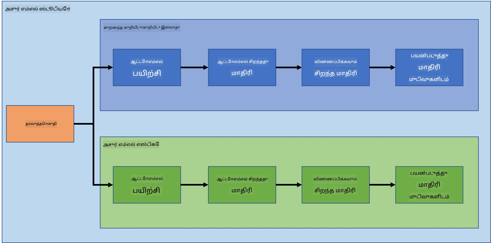

ஒவ்வொரு வழிக்கும் தங்கள் நன்மைகளும் அக்கறைகளும் உள்ளன. குறைந்த குறியீடு/குறியீடு இல்லா வழி என்பது GUI (கிராஃபிகல் யூசர் இடைமுகம்) உடன் தொடர்பு கொண்டதால் தொடங்க எளிது; இதில் குறியீட்டு அறிவு தேவையில்லை. இந்த முறையால் திட்டத்தின் பொதுவான சாத்தியக்கூறுகளை வேகமாக சோதிக்கவும், POC (பிரூஃப் ஆஃப் கண்ட்செப்ட்) உருவாக்கவும் முடியும். இருப்பினும், திட்டம் வளர்ந்து கொண்டிருக்கும் போது, மற்றும் தயாரிப்பிற்கான தயாரிப்பாக உருவாக்க வேண்டுமெனில் GUI மூலமாக வளங்களை உருவாக்குவது சாத்தியமில்லை. அனைத்து வளங்களையும் நிரல் மூலம் தானாகச் செய்ய, மாதிரியை பிரசாரம் செய்ய Azure ML SDK கையாளுவது மிக அவசியம்.

|                   | குறைந்த குறியீடு/குறைந்த குறியீடு இல்லை | Azure ML SDK              |
|-------------------|------------------|---------------------------|
| குறியீட்டு திறமை  | தேவையில்லை       | தேவையானது                |
| உருவாக்க நேரம்   | வேகமாகவும் எளிதாகவும் | குறியீட்டு திறம்படிருந்தால் தான் |
| தயாரிப்பு நிலை   | இல்லை           | ஆம்                      |

### 1.3 இதய வியாதி தரவு தொகுப்பு: 

இதயம் தொடர்புடைய நோய்கள் (CVDகள்) உலகளவில் முதற்கட்ட மரண காரணியாகும்; அனைத்து மரணங்களின் 31% ஆகும். புகையிலை பயன்படுத்தல், ஆரோக்கியமில்லாத உணவுக் கடைபிடிப்புகள், உடற்பயிற்சி இழப்பு மற்றும் மதுமதிப்பு போன்ற சுற்றுப்புற மற்றும் பழக்கவழக்கக் காரணிகள், மதிப்பீட்டு மாதிரிகளுக்கான கூறுகளாக பயன்படுத்தப்படலாம். ஹை ரிஸ்க் நபர்களில் தாக்கங்களை தடுப்பதில் இதற்கு மதிப்பீட்டை மதிப்பிடும் திறன் மிகவும் பயனுள்ளதாக இருக்கும்.

காகிள் முதல் பார்வைக்கு வெளியிடப்பட்டுள்ள [இதய தோல்வி தரவு தொகுப்பு](https://www.kaggle.com/andrewmvd/heart-failure-clinical-data) இதற்காகப் பயன்படுத்தப் போகின்றோம். இன்று தொகுப்பை பதிவிறக்கலாம். இது 13 வரிசைகளைக் கொண்ட ஒரு அட்டவணைத் தரவுதோறும் (12 கூறுகள் மற்றும் 1 இலக்கு மாறி) 299 வரிசைகள் உள்ளன.

|    | மாறிநாம்               | வகை            | விளக்கம்                                                  | உதாரணம்          |
|----|------------------------|----------------|----------------------------------------------------------|-------------------|
| 1  | age                    | எண்காணி        | நோயாளியின் வயது                                          | 25                |
| 2  | anaemia                | பூலியன்        | சிவப்பு இரத்த அணுக்கள் அல்லது ஹீமோகுளோபின் குறைவு        | 0 அல்லது 1         |
| 3  | creatinine_phosphokinase | எண்காணி       | இருதய இரத்தத்தில் உள்ள CPK என்சைமை நிலை                | 542               |
| 4  | diabetes               | பூலியன்        | நோயாளிக்கு நீர்விள்ளை இருக்கிறதா?                        | 0 அல்லது 1         |
| 5  | ejection_fraction      | எண்காணி        | ஒவ்வொரு நெடுங்குழற்சியில் இரத்தவெளியேற்றம் சதவீதம்      | 45                |
| 6  | high_blood_pressure    | பூலியன்        | நோயாளிக்கு உயர் இரத்த அழுத்தமா?                          | 0 அல்லது 1         |
| 7  | platelets              | எண்காணி        | இரத்தத்தில் உள்ள தகடு அளவு                                | 149000            |
| 8  | serum_creatinine       | எண்காணி        | இரத்தத்தில் உள்ள சிலந்த ரசாயனம் அளவு                     | 0.5               |
| 9  | serum_sodium           | எண்காணி        | இரத்தத்தில் உள்ள சிலந்த சோடியம் அளவு                     | jun               |
| 10 | sex                    | பூலியன்        | பெண் அல்லது ஆண்                                           | 0 அல்லது 1         |
| 11 | smoking                | பூலியன்        | நோயாளி புகைப்பதா?                                        | 0 அல்லது 1         |
| 12 | time                   | எண்காணி        | தொடர்ச்சிப் பராமரிப்பு கால அளவு (நாட்கள்)                 | 4                 |
|----|------------------------|----------------|----------------------------------------------------------|-------------------|
| 21 | DEATH_EVENT [இலக்கு]  | பூலியன்        | நோயாளி காலமானவரா பயனுள்ள பராமரிப்பு காலத்தில்?           | 0 அல்லது 1         |

தரவுத்தொகுப்பைப் பெற்றதும் Azure இல் திட்டத்தை துவக்கலாம்.

## 2. Azure ML ஸ்டுடியோவில் குறைந்த குறியீடு/குறியீடு இல்லா மாதிரி பயிற்சி
### 2.1 Azure ML பணியிடம் உருவாக்குதல்
Azure ML இல் மாதிரியை பயிற்றுவிக்க முதலில் ایک Azure ML பணியிடம் உருவாக்க பரிந்துரைக்கப்படுகிறது. பணியிடம் Azure Machine Learning க்கான மேல் நிலை வளமாகும், இது நீங்கள் உருவாக்கும் எல்லா பொருட்களை ஒரே இடத்தில் சேகரிக்க உதவுகிறது. பணியிடம் அனைத்து பயிற்சி ஓட்டங்களின் வரலாற்றைக் கொண்டிருக்கிறது, அதில் பதிவு செய்யப்பட்ட தகவல்கள், அளவுகோல்கள், வெளியீடு மற்றும் உங்கள் குறியீடுகளின் ஸ்னாப்ஷாட் அடங்கும். இது எந்த பயிற்சி ஓட்டம் சிறந்த மாதிரியை உருவாக்கியது என நீங்கள் அறிய உதவும். [மேலும் அறியவும்](https://docs.microsoft.com/azure/machine-learning/concept-workspace?WT.mc_id=academic-77958-bethanycheum&ocid=AID3041109)

உங்களுடைய இயக்க முறைமைக்கு பொருந்தக்கூடிய அதிகபட்ச பயனுள்ள உலாவி பயன்படுத்த பரிந்துரைக்கப்படுகிறது. கீழ்காணும் உலாவிகள் ஆதரிக்கப்படுகின்றன:

- Microsoft Edge (புதிய Microsoft Edge, சமீபத்திய பதிப்பு, பழைய Edge அல்ல)
- Safari (சமீபத்திய பதிப்பு, Mac மட்டுமே)
- Chrome (சமீபத்திய பதிப்பு)
- Firefox (சமீபத்திய பதிப்பு)

Azure Machine Learning பயன்படுத்த, உங்கள் Azure சந்தாவயத்தினுள் பணியிடம் உருவாக்குங்கள். இதன் மூலம் தரவுகள், கணினி வளங்கள், குறியீடு, மாதிரிகள் மற்றும் பிற பொருட்களை நிர்வகிக்க முடியும்.

> **_குறிப்பு:_** Azure Machine Learning பணியிடம் உங்கள் சந்தாவயத்தில் இருக்கும் வரை உங்களிடம் குறைந்த அளவிலான தரவு சேமிப்பு கட்டணம் வரலாம்; எனவே பணியிடம் தேவையில்லாமல் இருந்தால் அதை நீக்க பரிந்துரைக்கப்படுகின்றது.

1. உங்கள் Azure சந்தாவயத்துடன் தொடர்புடைய Microsoft அக்கவுண்ட் மூலம் [Azure போர்ட்டல்](https://ms.portal.azure.com/) லில் உள்நுழைக.
2. **＋Create a resource** என்பதை தெரிவுசெய்க
   
   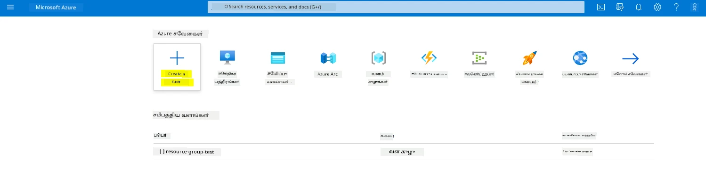

   Machine Learning தேடிச் சேகரிப்பில் இருந்து Machine Learning செங்குத்தைக் கிளிக் செய்க

   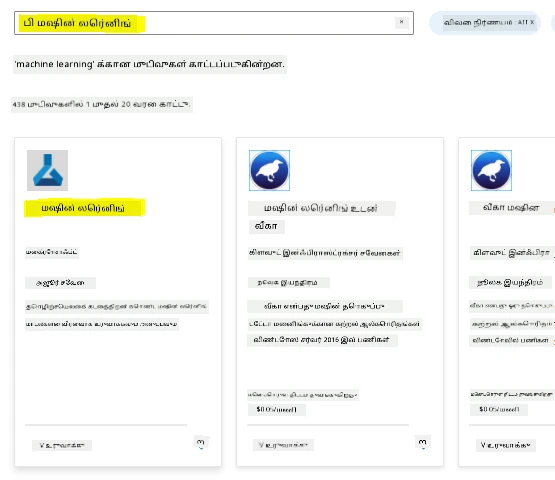

   உருவாக்கும் பொத்தானை அழுத்துக

   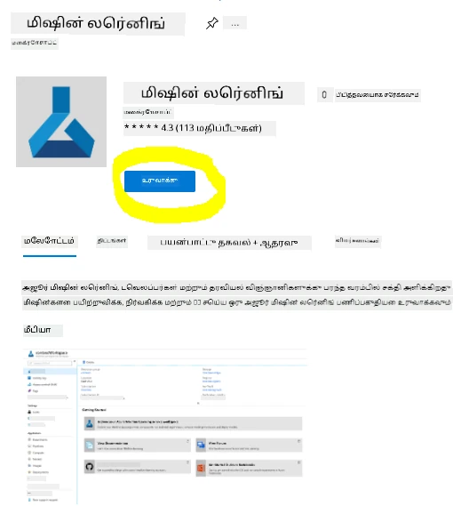

   கீழ்க்காணும் அமைப்புகளை பூர்த்தி செய்க:
   - சந்தா: உங்கள் Azure சந்தா
   - வள குழு: ஒரு வள குழுவை உருவாக்கு அல்லது தேர்ந்தெடு
   - பணியிடம் பெயர்: உங்கள் பணியிடம் குறிக்க தனித்துவமான பெயர்
   - பிராந்தியம்: உங்களுக்கே அருகிலுள்ள புவியியல் பிராந்தியம்
   - சேமிப்புக் கணக்கு: உங்கள் பணியிடத்திற்காக புதிய இயல்புநிலை சேமிப்புக் கணக்கை நோட்டு
   - விசை வோல்ட்: உங்கள் பணியிடத்திற்கான புதிய இயல்புநிலை விசை வோல்டைப் பாருங்கள்
   - பயன்பாட்டு அறிவுரைகள்: உங்கள் பணியிடத்திற்கான புதிய இயல்புநிலை பயன்பாட்டு அறிவுரைகள் வளத்தை நோட்டு
   - கன்டெய்னர் பதிவகம்: இல்லை (ஒரு மாதிரி கன்டெய்னருக்கு பிரசாரம் செய்யும் போது தானாக உருவாக்கப் படும்)

    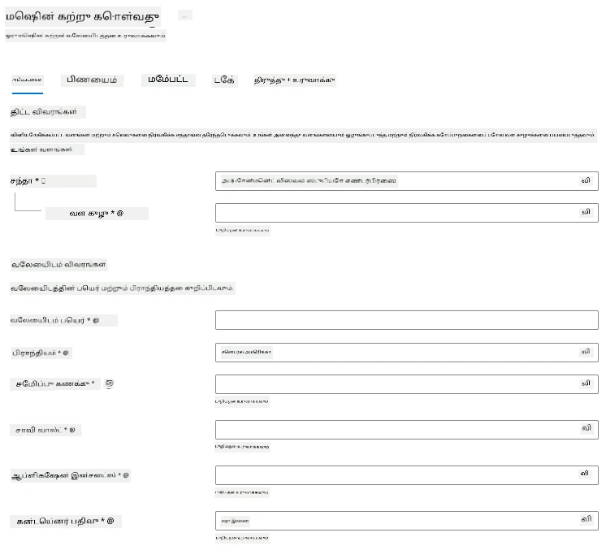

   - உருவாக்க + சுயலோபம் செய்யவும், பின்னர் உருவாக்க பொத்தானை அழுத்தவும்
3. உங்கள் பணியிடம் உருவாகும் வரை காத்திருங்கள் (சில நிமிடங்கள் ஆகலாம்). பிறகு போர்ட்டலில் அதைத் தேர்வு செய்க. திருமதி மேலாண்மை Azure சேவையிலிருந்து காணலாம்.
4. உங்கள் பணியிடத்தின் கண்ணோட்டப் பக்கத்தில், Azure Machine Learning ஸ்டுடியோவைத் தொடங்குங்கள் (அல்லது ஒரு புதிய உலாவி தாவலை திறந்து https://ml.azure.com க்கு செல்லவும்) மற்றும் உங்கள் Microsoft கணக்குடன் உள்நுழைக. கேட்டால், உங்கள் Azure விவரக்கோவை மற்றும் சந்தாவைத் தேர்ந்தெடுக்கவும், Azure Machine Learning பணியிடத்தையும் தெரிவுசெய்க.
   
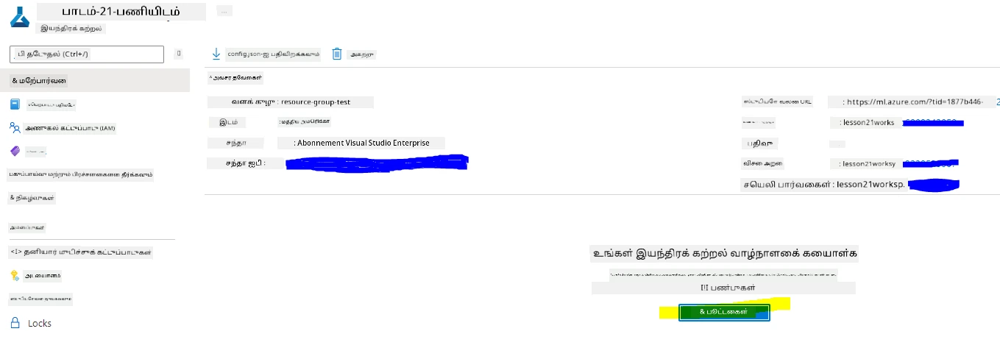

5. Azure Machine Learning ஸ்டுடியோவில், இடது மேல் பகுதியில் ☰ ஐகானைக் கிளிக் செய்து இடையே உள்ள பல பக்கங்களை பார்வையிடவும். இந்தப் பக்கங்களைக் கொண்டு பணியிட வளங்களை நிர்வகிக்கலாம்.

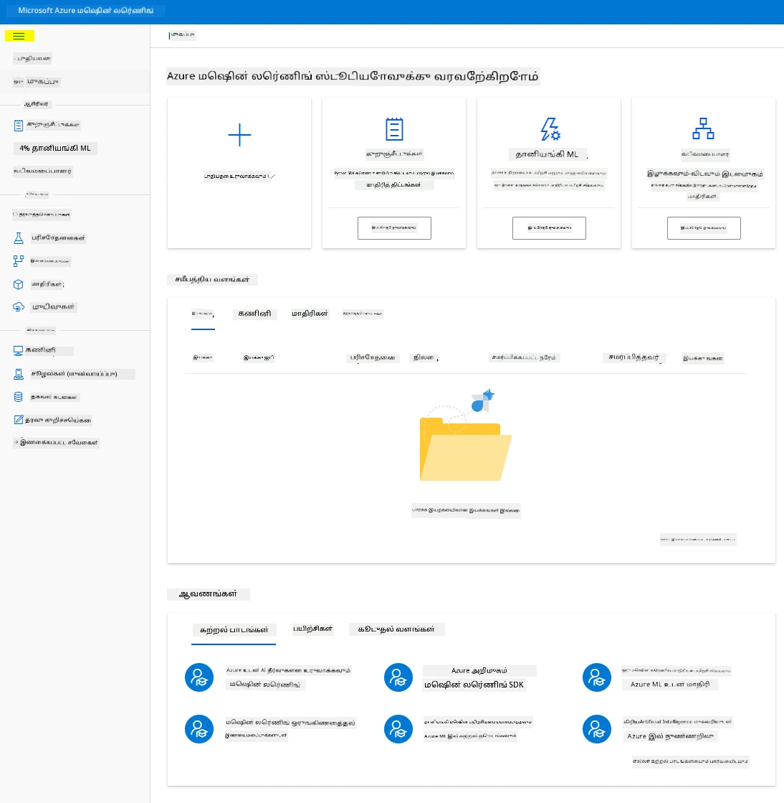

Azure போர்ட்டல் மூலம் பணியிடத்தை நிர்வகிக்கலாம், ஆனால் தரவுத்துறை ஆய்வாளர்கள் மற்றும் மெஷின் லெர்னிங் செயல்பாட்டு பொறியாளர்களுக்கு Azure Machine Learning ஸ்டுடியோ மேல் கவனம் கொண்ட பயனர் இடைமுகத்தை வழங்குகிறது.

### 2.2 கணினி வளங்கள்

கணினி வளங்கள் என்பவை மேகவணிகத்தில் உள்ள, மாதிரி பயிற்சி மற்றும் தரவுத் 탐험 செயல்முறைகள் இயங்கும் வளங்கள். நீங்கள் உருவாக்கக்கூடிய நான்குவித கணினி வளங்கள் உள்ளன:

- **கணினி பொருத்தங்கள் (Compute Instances)**: தரவு அறிவியலாளர்கள் தரவுகளுடன் மற்றும் மாதிரிகளுடன் பணியாற்ற பயன்படும் மேம்பாட்டு பணியிடங்கள். இது ஒரு வேர்ச்சுவல் மெஷின் (VM) உருவாக்கவும், குறிப்பேட்டைப் பைப்பு தொடங்கவும் உள்ளடக்குகிறது. நீங்கள் பின்னர் குறிப்பேட்டிலிருந்து கணினி கிளஸ்டரை அழைத்து மாதிரியை பயிற்றுவிக்கலாம்.
- **கணினி கிளஸ்டர்கள் (Compute Clusters)**: பரிசோதனை குறியீடுகளை தேவையானபோது செயலாக்கும் அளவீட்டுடன் VMகளின் தொகுப்புகள். மாதிரி பயிற்சி செய்ய இதைப் பயன்படுத்துவீர்கள். கணினி கிளஸ்டர்கள் சிறப்பு GPU அல்லது CPU வளங்களையும் பயன்படுத்தக்கூடும்.
- **முன்னறிவிப்பு கிளஸ்டர்கள் (Inference Clusters)**: உங்கள் பயிற்றுவிக்கப்பட்ட மாதிரிகளைக் கொண்ட முன்னறிவிப்பு சேவைகளை பிரசாரம் செய்யும் இலக்குகள்.
- **இணைக்கப்பட்ட கணினி**: Virtual Machines அல்லது Azure Databricks கிளஸ்டர்கள் போன்ற உள்ள Azure கணினி வளங்களை இணைக்கும்.

#### 2.2.1 உங்கள் கணினி வளங்களுக்கு சரியான விருப்பங்களை தேர்வு செய்தல்

கணினி வளங்களை உருவாக்கும்போது கவனிக்க வேண்டிய சில முக்கிய அம்சங்கள் உள்ளன, அவை முக்கிய முடிவுகளை எடுத்துக் கொள்ள உதவும்.

**உங்களுக்கு CPU அல்லது GPU தேவையா?**

CPU (மைய செயலி) என்பது கணினி திட்டங்களை செயல்படுத்தும் மின்னணு колாட்சியமாகும். GPU (விருப்பான செயலி) என்பது மிக உயர்ந்த வீதத்தில் கிராபிக்ஸ் தொடர்புடைய குறியீடுகளை இயக்கும் மின்னணு சப்ளெக்கியான பாதுகாப்பு இயக்கி ஆகும்.

CPU மற்றும் GPU கட்டுமானத்தில் முக்கிய வேறுபாடு CPU விரைவாக பல்வேறு பணிகளை நிர்வகிக்க இருப்பதுதான் (CPU மணி வேகத்தின் மூலம் அளவிடப்படுகிறது), ஆனால் ஒரே நேரத்தில் இயங்க கூடிய செயல்பாடுகள் வரம்பு உள்ளது. GPUகள் இணையான கணினி கையாள்வதற்கு வடிவமைக்கப்பட்டுள்ளன, அதனால் ஆழமான கற்றல் பணிகளுக்கு மிகவும் உகந்தவை.

| CPU                                     | GPU                         |
|-----------------------------------------|-----------------------------|
| குறைந்த செலவு                          | அதிகமான செலவு              |
| குறைந்த இணைந்த செயல்பாட்டுத்தரம்      | அதிக இணைந்த செயல்பாட்டுத்தரம் |
| ஆழ்கற்றல் மாதிரிகளை பயிற்சியில் மெதுவாக உள்ளது | ஆழ்கற்றலுக்கு சிறந்தது       |

**கிளஸ்டர் அளவு**

பெரிய கிளஸ்டர்கள் அதிக செலவு ஆகும் ஆனால் சிறந்த பதிலளிப்பை அளிக்கும். எனவே உங்கள் நேரம் அதிகம் ஆனால் பணம் குறைவெனில் சிறிய கிளஸ்டருடன் துவங்க வேண்டும். மாறாக, பணம் அதிகம் ஆனால் நேரம் குறைவெனில் பெரிய கிளஸ்டரைத் தொடங்க வேண்டும்.

**VM அளவு**

நேரம் மற்றும் பட்ஜெட் கட்டுப்பாடுகளின் அடிப்படையில், RAM, காட்சி, கோர் மற்றும் மணி வேக அளவுகளை மாற்றலாம். இவை அனைத்தையும் அதிகரிப்பது செலவாகி இருப்பதுடன் சிறந்த செயல்திறனை ஏற்படுத்தும்.

**மேற்கோள் அல்லது குறைந்த முன்னுரிமை எடுத்துக்காட்டுகள்?**

குறைந்த முன்னுரிமை எடுத்துக்காட்டு என்பது தற்காலிகமாக நிறுத்தக்கூடியது என்பதை குறிக்கிறது: மைக்ரோசாஃப்ட் அமிழி இந்த வளங்களை மற்ற பணிக்கு ஒதுக்கக்கூடும், அதனால் வேலை இடைநீக்கம் அடையும். ஒதுக்கப்பட்ட எடுத்துக்காட்டு அல்லது இடைநீக்கம் இல்லாதது என்பது உங்கள் அனுமதியின்றி வேலை நிறுத்தப்படவில்லை. இது நேரம் மற்றும் பணத்துக்கான மற்றுப் பரிசீலனை ஆகும், இடைநீக்கம் அடையும் எடுத்துக்காட்டுகள் குறைந்த செலவு தான்.

#### 2.2.2 கணினி கிளஸ்டர் உருவாக்குதல்

நாம் முன்னர் உருவாக்கிய [Azure ML வேலைப்பகுதியில்](https://ml.azure.com/) க்கணினிக்கு செல்லவும், இப்போது நாம் கொஞ்சம் முன்பு விவாதித்த கணினி வளங்களை காணலாம் (கணினி எடுத்துக்காட்டுக்கள், கணினி கிளஸ்டர்கள், கூற்று கிளஸ்டர்கள் மற்றும் இணைக்கப்பட்ட கணினி). இந்த திட்டத்திற்காக, மாதிரி பயிற்சிக்காக கணினி கிளஸ்டர் தேவைப்படும். ஸ்டூடியோவில், "Compute" மெனுவில் கிளிக் செய்து, பிறகு "Compute cluster" தாவலைத் தேர்வு செய்த பின் "+ New" பொத்தானை அழுத்தி கணினி கிளஸ்டரை உருவாக்கவும்.

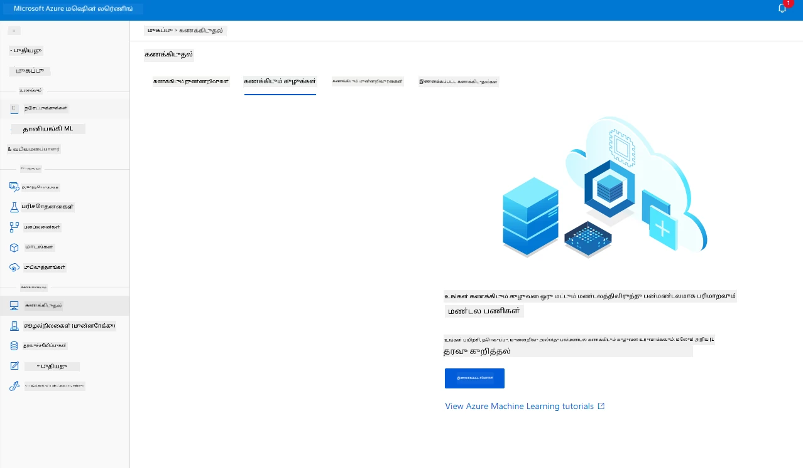

1. உங்கள் விருப்பங்களை தேர்வு செய்யவும்: ஒதுக்கப்பட்டது மற்றும் குறைந்த முன்னுரிமை, CPU அல்லது GPU, VM அளவு மற்றும் கோர் எண் (இந்த திட்டத்திற்கான இயல்புநிலை அமைப்புகளை மாற்ற தேவையில்லை).
2. அடுத்த பொத்தானை அழுத்தவும்.

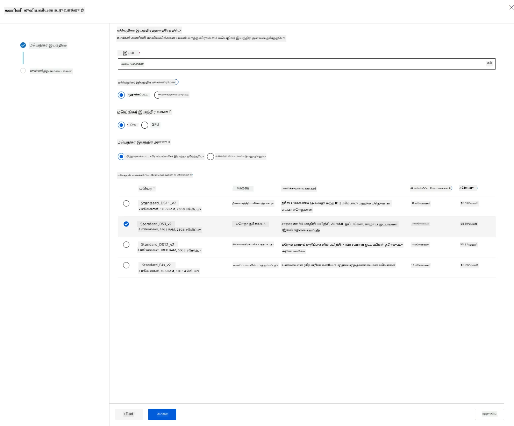

3. கிளஸ்டருக்கு கணினி பெயரை கொடுக்கவும்.
4. உங்கள் விருப்பங்களை தேர்வு செய்யவும்: குறைந்தபட்ச/அதிகபட்ச தொடுப்புகள், அளவில்லாமல் குறைக்குமுன் இயங்காத நேரம், SSH அணுகல். குறைந்தபட்ச தொடுப்புகள் 0 என்றால் கிளஸ்டர் கரைவகையில் பணம் சேமிக்கலாம். அதிகபட்ச தொடுப்புகள் அதிகமெனில் பயிற்சி குறைத்து முடியும். அதிகபட்ச தொடுப்புகள் 3 என்று பரிந்துரைக்கப்படுகிறது.
5. "Create" பொத்தானை அழுத்தவும். இது சில நிமிடங்கள் எடுக்கும்.

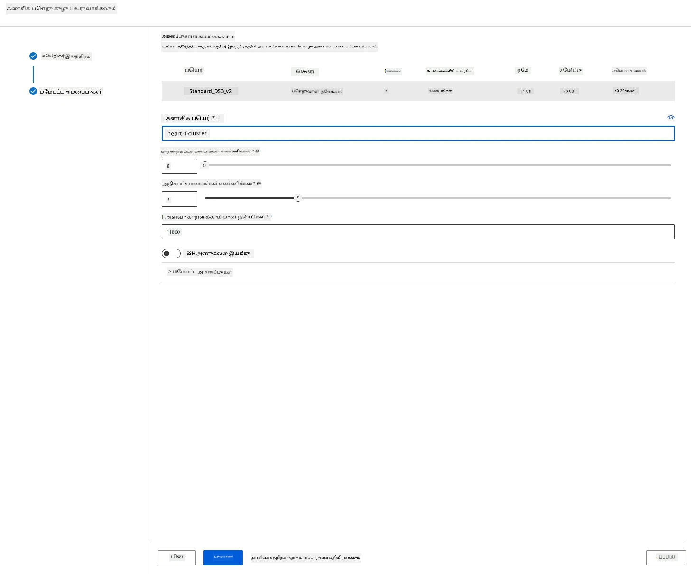

சூப்பர்! இப்போது கணினி கிளஸ்டர் உருவாக்கப்பட்டுள்ளது, நாம் Azure ML ஸ்டூடியோவில் தரவை ஏற்ற வேண்டும்.

### 2.3 தரவுத்தொகுப்பு ஏற்றுதல்

1. முன்னர் உருவாக்கிய [Azure ML வேலைப்பகுதியில்](https://ml.azure.com/) க்குள்ள "Datasets" ஐ இடது மெனுவில் கிளிக் செய்து "+ Create dataset" பொத்தானை அழுத்தி ஒரு தரவுத்தொகுப்பை உருவாக்கவும். "From local files" விருப்பத்தை தேர்வு செய்து, முன்னர் நாங்கள் பதிவிறக்கிய கேகிள் தரவுத்தொகுப்பை தேர்வு செய்யவும்.

   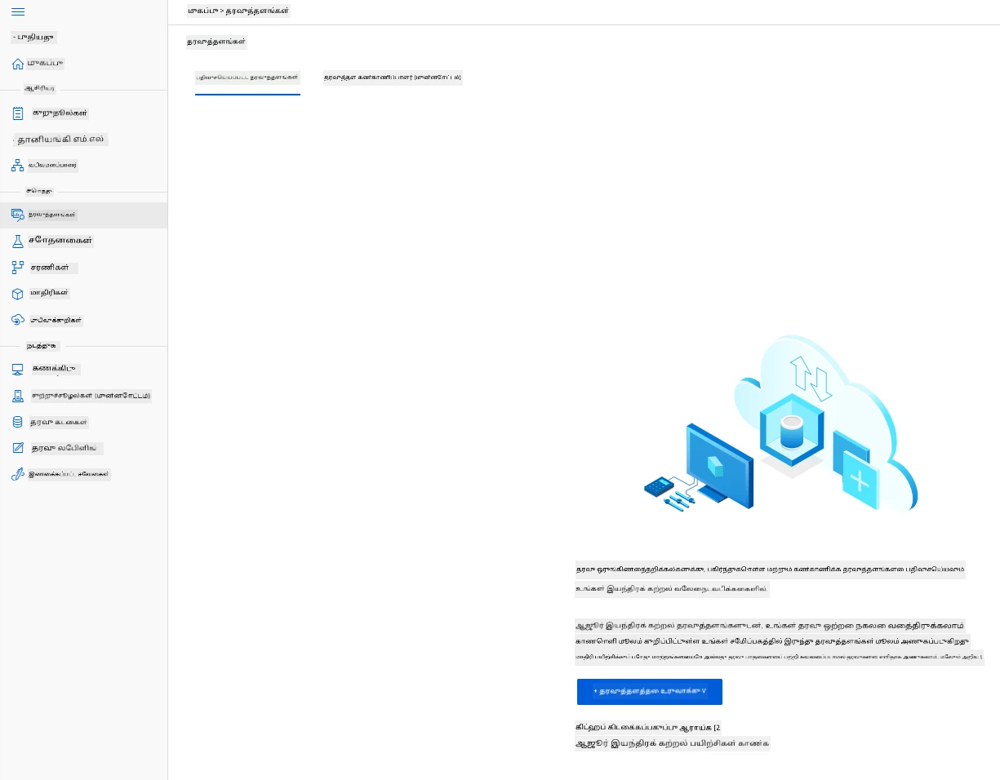

2. உங்கள் தரவுத்தொகுப்புக்கு பெயர், வகை மற்றும் விளக்கம் கொடுக்கவும். அடுத்து கிளிக் செய்யவும். கோப்பிலிருந்து தரவை பதிவேற்றவும். அடுத்து கிளிக் செய்யவும்.

   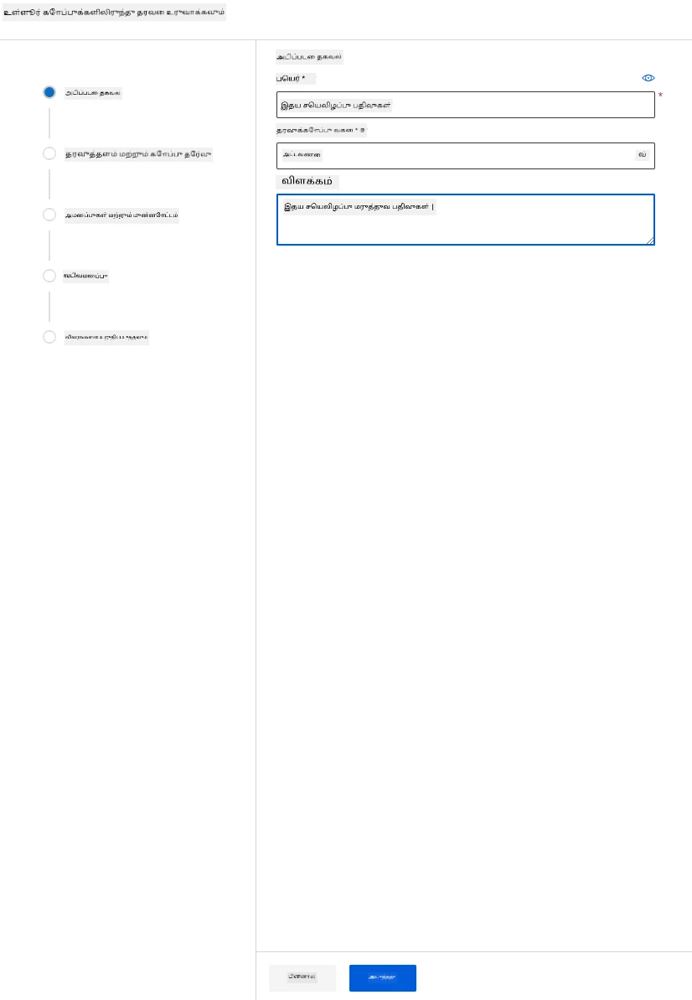

3. Schema இல் anaemia, diabetes, high blood pressure, sex, smoking மற்றும் DEATH_EVENT போன்ற அம்சங்களுக்கான தரவுவகுப்பை Boolean ஆக மாற்றவும். அடுத்து கிளிக் செய்யவும், பிறகு Create кнопку அழுத்தவும்.

   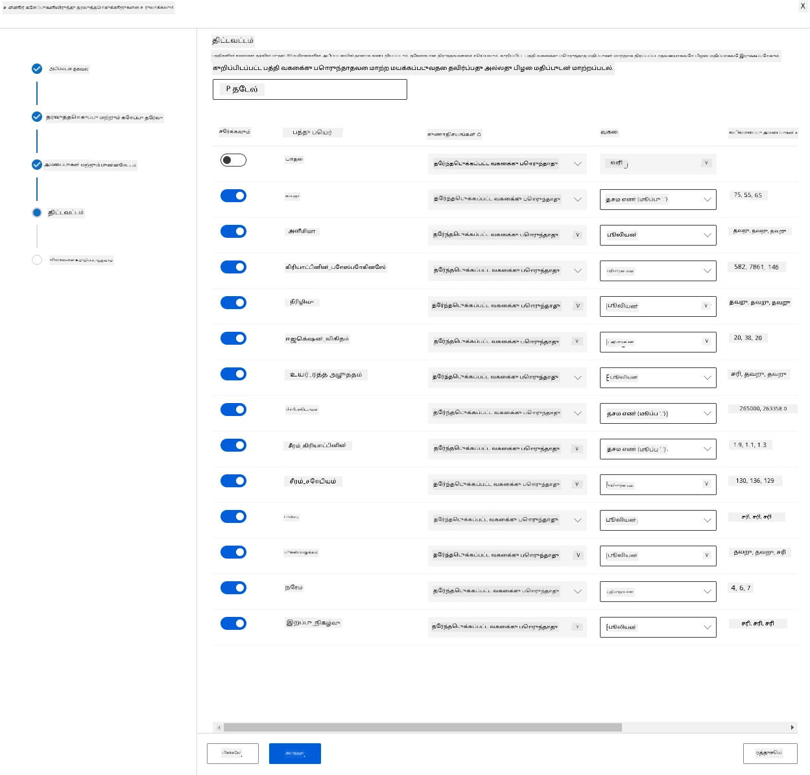

சிறந்தது! இப்போது தரவுத்தொகுப்பு தயார் மற்றும் கணினி கிளஸ்டர் உருவாக்கப்பட்டுள்ளது, மாதிரியின் பயிற்சியை தொடங்கலாம்!

### 2.4 குறைந்த குறியீடு/குறியீடு இல்லா AutoML மூலம் பயிற்சி

பாரம்பரிய இயந்திரக் கற்றல் மாதிரி உருவாக்கம் வளங்கள் அதிகமாக தேவை, குறிப்பிட்ட துறை அறிவும், மாதிரிகளை உருவாக்கும் மற்றும் ஒப்பீடு செய்யும் நேரமும் அதிகமாகும்.
தானாக இயந்திரக் கற்றலை (AutoML) என்பது ஐந்து நேரத்தைக் குறைக்கும், மீள்கூட்டும் பணிகளை தானாகச் செய்யும் செயல்முறை ஆகும். இது தரவுத்துறையாளர், பகுப்பாய்வாளர் மற்றும் டெவலப்பர்களுக்கு உயர் அளவிலான, திறமையான மற்றும் உற்பத்தியுடைய ML மாதிரிகளை உருவாக்க அனுமதிக்கிறது, மாதிரி தரத்தினை பாதுகாத்து. இது தயாரிப்பு தயாராகும் நேரத்தை கூடிய எளிதிலும் திறம்படவும் குறைக்கிறது. [மேலும் படிக்கவும்](https://docs.microsoft.com/azure/machine-learning/concept-automated-ml?WT.mc_id=academic-77958-bethanycheum&ocid=AID3041109)

1. முன்னர் உருவாக்கிய [Azure ML வேலைப்பகுதியில்](https://ml.azure.com/) "Automated ML" ஐ இடது மெனுவில் கிளிக் செய்து நீங்கள் சமீபத்தில் பதிவேற்றிய தரவுத்தொகுப்பை தேர்ந்தெடுக்கவும். அடுத்து கிளிக் செய்யவும்.

   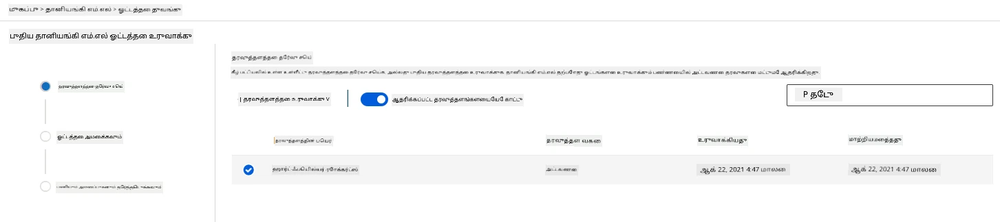

2. புதிய பரிசோதனை பெயர், இலக்கு ப ستون் (DEATH_EVENT) மற்றும் நாம் உருவாக்கிய கணினி கிளஸ்டரை உள்ளிடவும். அடுத்து கிளிக் செய்யவும்.

   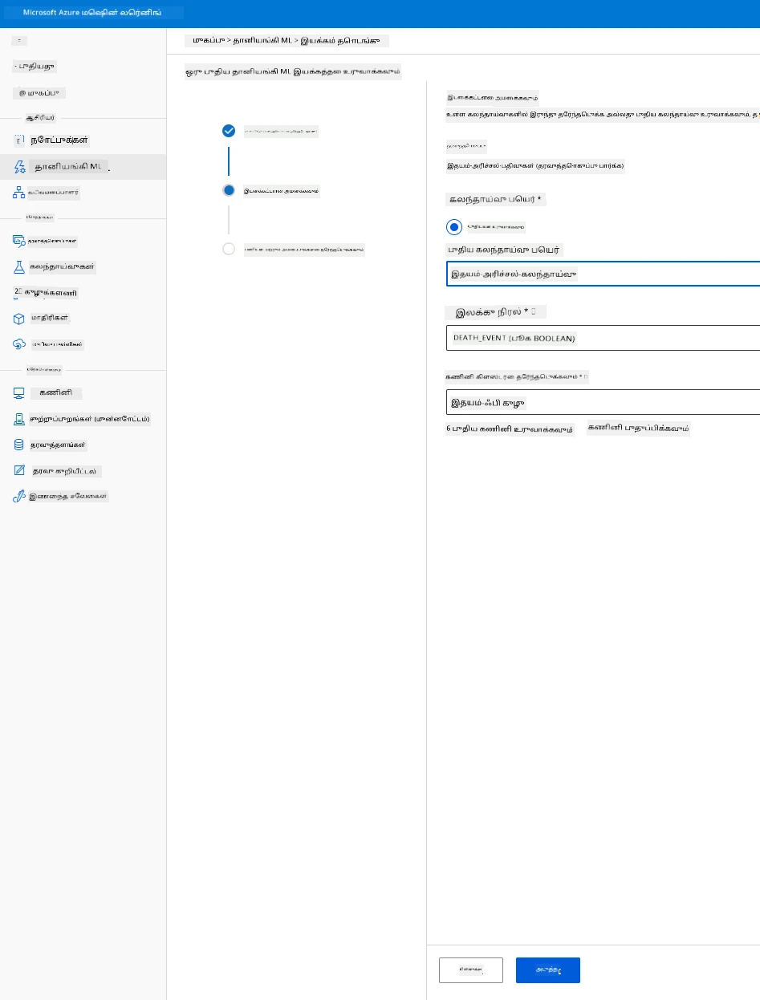

3. "Classification" தேர்வு செய்து Finish அழுத்தவும். இது 30 நிமிடங்கள் முதல் 1 மணி நேரம் வரை எடுக்கலாம் உங்கள் கணினி கிளஸ்டர் அளவை பொருத்து.

   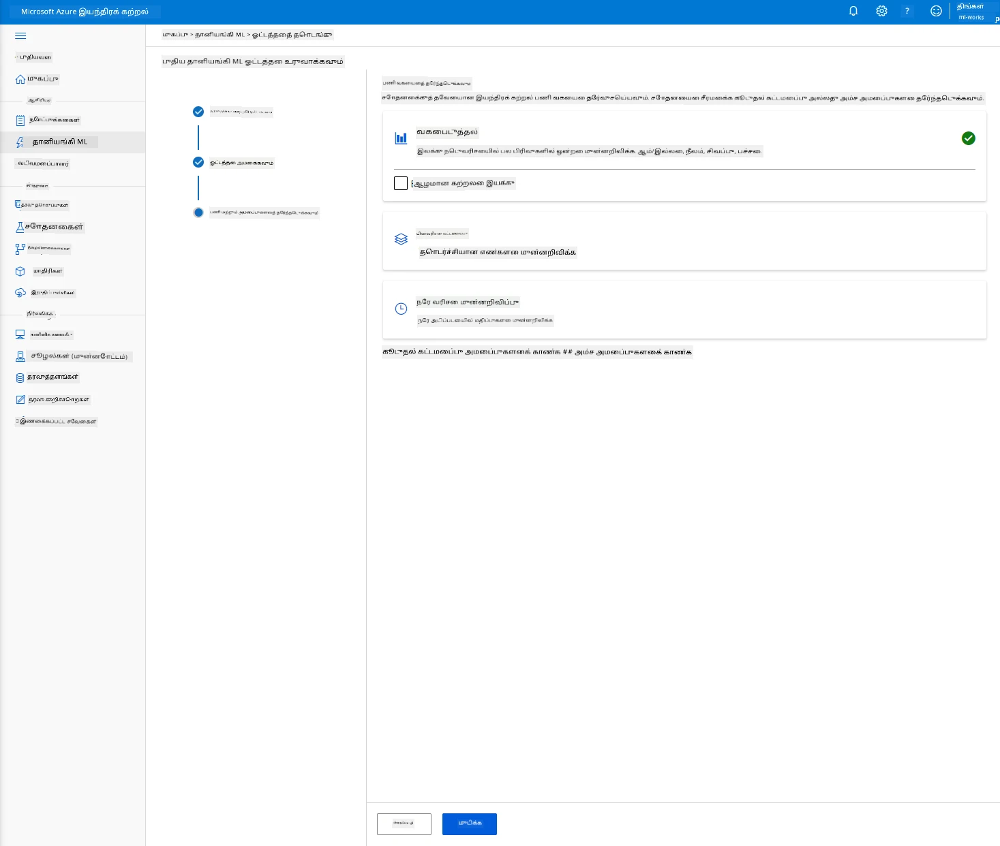

4. ஓட்டம் முடிந்ததும், "Automated ML" தாவலை கிளிக் செய்து உங்கள் ஓட்டத்தை திறந்து "Best model summary" அட்டையில் அல்கோரிதம் கிளிக் செய்யவும்.

   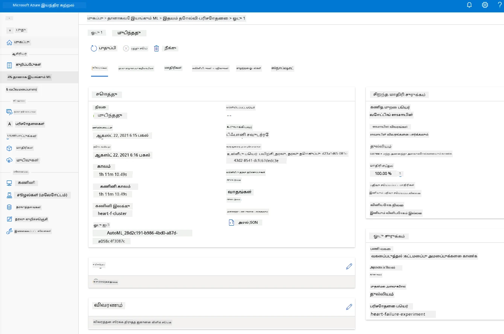

இங்கு AutoML உருவாக்கிய சிறந்த மாதிரியின் விரிவான விளக்கத்தை காணலாம். மேலும் "Models" தாவலில் பிற மாதிரிகளையும் ஆராயலாம். "Explanations" ( முன் பார்வை பொத்தான் ) இல் சில நிமிடங்கள் செலவழித்து மாதிரிகளை ஆராயவும். நீங்கள் தேர்ந்தெடுக்க விரும்பும் மாதிரியை தேர்வு செய்தபின் (இங்கு AutoML தேர்ந்த சிறந்த மாதிரி), எப்படி அதை நிலைப்படுத்துவது என்று பார்ப்போம்.

## 3. குறைந்த குறியீடு/குறியீடு இல்லா மாதிரி நிலைப்படுத்தல் மற்றும் இடைமுக உபயோகிப்பது
### 3.1 மாதிரி நிலைப்படுத்தல்

தானியங்கி இயந்திரக் கற்றல் இடைமுகம் சிறந்த மாதிரியை வலை சேவையாக சில படிகள் மூலம் நிலைப்படுத்த அனுமதிக்கிறது. நிலைப்படுத்தல் எனப்படுவது, புதிய தரவுகளின் அடிப்படையில் சாத்தியமான முன்கூட்டியலில் மாதிரி உதவுவதற்கான ஒருங்கிணைப்பாகும். இத்திட்டத்திற்காக, வலை சேவையில் நிலைப்படுத்துவது மருத்துவ பயன்பாடுகள் சுவாச நோயின் ஆபத்தை நேரடி முன்கூட்டியலில் கணிக்க மாதிரியை பயன்படுத்த முடியும்.

சிறந்த மாதிரி விளக்கத்தில் "Deploy" பொத்தானை கிளிக் செய்யவும்.

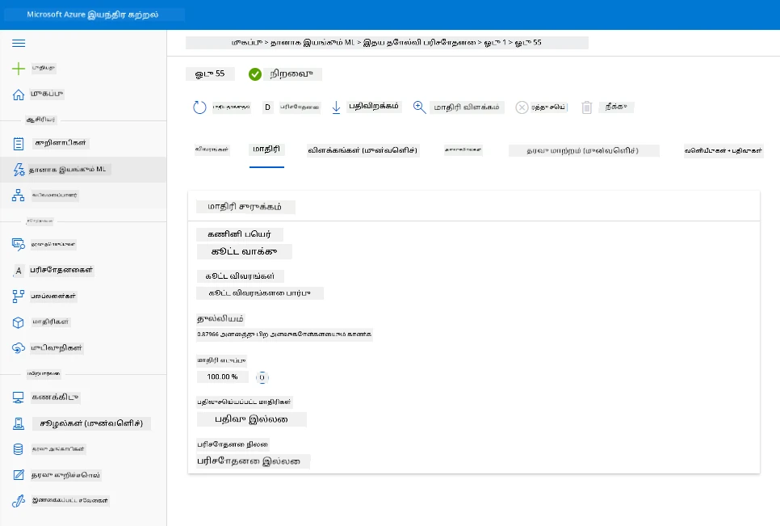

15. பெயர், விளக்கம், கணினி வகை (Azure Container Instance), அங்கீகாரம் இயக்கப்பட்டது என்பதை உள்ளிட்டும் “Deploy” அழுத்தவும். இந்த படி சுமார் 20 நிமிடங்கள் எடுக்கும். நிலைப்படுத்தல் செயல்முறை பல படிகளை உட்படுத்தும் மாதிரி பதிவு, வளங்கள் உருவாக்கம் மற்றும் வலை சேவைக்கான அமைப்புகள். நிலைப்படுத்தல் நிலை "Healthy" என்றால் அது இயங்குகிறது. நிலையை சரிபார்க்க "Refresh periodically" தேர்வு செய்யவும்.

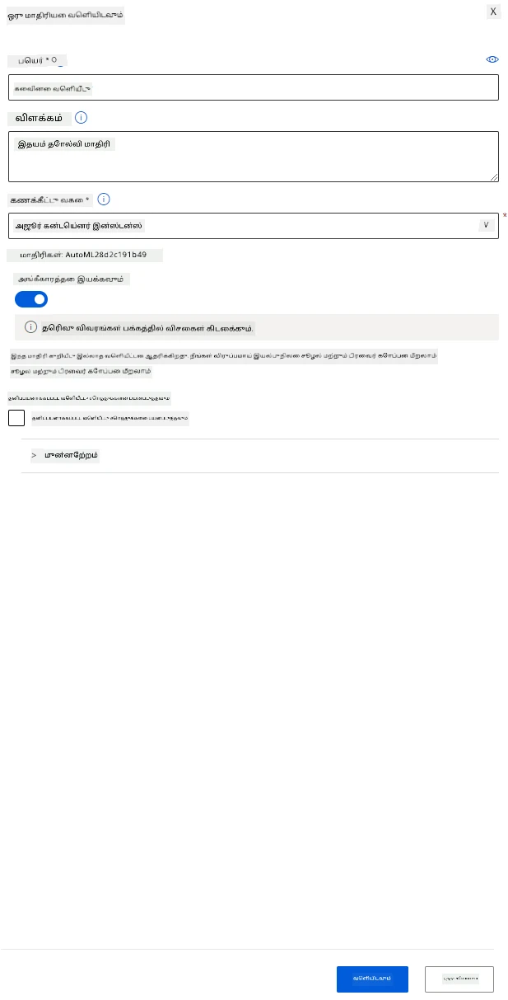

16. நிலைப்படுத்தப்பட்ட பிறகு, Endpoint தாவலை கிளிக் செய்து நீங்கள் நிலைப்படுத்திய இடைமுகத்தைத் தேர்வு செய்யவும். இங்கு இந்த இடைமுகத்தை பற்றி அனைத்தும் காணலாம்.

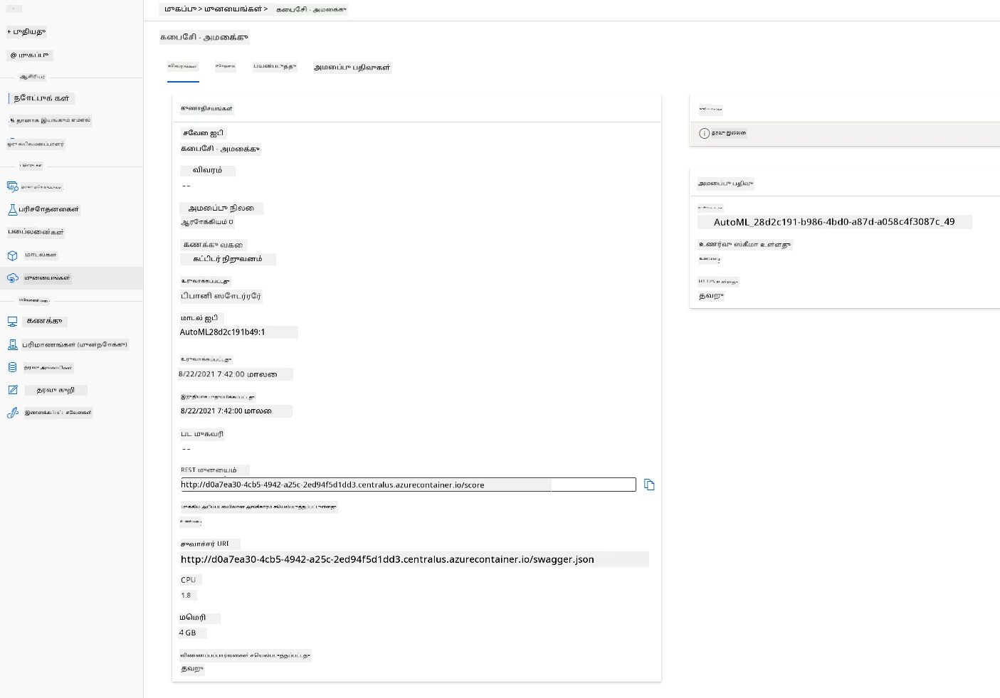

அற்புதம்! இப்போது மாதிரி நிலைப்படுத்தப்பட்டது, இடைமுக உபயோகிப்பைத் தொடங்கலாம்.

### 3.2 இடைமுக உபயோகம்

"Consume" தாவலை கிளிக் செய்யவும். REST endpoint மற்றும் python ஸ்கிரிப்ட் உண்டு. python குறியீட்டை வாசிக்க சில நேரம் எடுத்துக் கொள்ளவும்.

இந்த ஸ்கிரிப்ட் நேரடியாக உங்கள் உள்ளூர் இயந்திரத்தில் இயக்க முடியும் மற்றும் உங்கள் இடைமுகத்தை உபயோகிக்கும்.

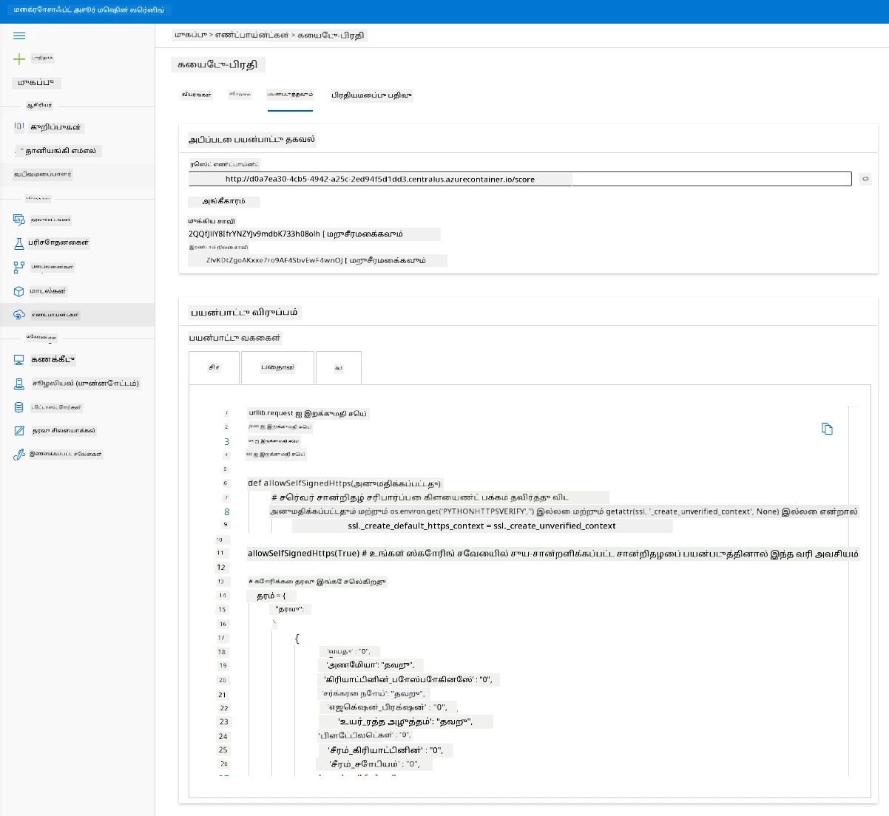

இந்த 2 கோடுகளை கவனிக்கவும்: 

```python
url = 'http://98e3715f-xxxx-xxxx-xxxx-9ec22d57b796.centralus.azurecontainer.io/score'
api_key = '' # இந்த தள சேவைக்கு API விசையுடன் மாற்றவும்
```
 `url` மாறிலி consume தாவலில் காணப்படும் REST இடைமுகத்தைச் சொல்கிறது, மற்றும் `api_key` மாறிலி அடையாளப்பெறும் விசையைச் சொல்லுகிறது (அங்கீகாரம் இயக்கப்பட்டிருக்கும் பட்சத்தில்). இதுதான் ஸ்கிரிப்ட் இடைமுகத்தை எப்படி பயன்படுத்துவதை காட்டுகிறது.

18. ஸ்கிரிப்ட் இயக்கும்போது, கீழ்காணும் வெளியீடு காணப்படும்:
    ```python
    b'"{\\"result\\": [true]}"'
    ```
 இதன் பொருள் வழங்கப்பட்ட தரவுக்கான இதய செயலிழப்பு முன்கூட்டியம் உண்மையானது என்பதுதான். ஸ்கிரிப்ட் தானாக உருவாக்கிய தரவு அனைத்தும் இயல்புநிலை 0 மற்றும் false என்ற நிலையில் உள்ளது. கீழ்க்கண்ட மாதிரி உள்ளீட்டுடன் தரவை மாற்றலாம்:

```python
data = {
    "data":
    [
        {
            'age': "0",
            'anaemia': "false",
            'creatinine_phosphokinase': "0",
            'diabetes': "false",
            'ejection_fraction': "0",
            'high_blood_pressure': "false",
            'platelets': "0",
            'serum_creatinine': "0",
            'serum_sodium': "0",
            'sex': "false",
            'smoking': "false",
            'time': "0",
        },
        {
            'age': "60",
            'anaemia': "false",
            'creatinine_phosphokinase': "500",
            'diabetes': "false",
            'ejection_fraction': "38",
            'high_blood_pressure': "false",
            'platelets': "260000",
            'serum_creatinine': "1.40",
            'serum_sodium': "137",
            'sex': "false",
            'smoking': "false",
            'time': "130",
        },
    ],
}
```
 ஸ்கிரிப்ட் திரும்ப அளிக்கும் :
    ```python
    b'"{\\"result\\": [true, false]}"'
    ```

வாழ்த்துக்கள்! நீங்கள் மாதிரியை நிலைப்படுத்தியதும் Azure ML இல் பயிற்சி செய்ததும் வெற்றிகரமாக முடிந்தன!

> **_குறிப்பு:_** திட்டம் முடிந்ததும் அனைத்து வளங்களையும் நீக்க மறவாதீர்கள்.

## 🚀 சவால்

AutoML உருவாக்கிய உச்ச மாதிரிகளுக்கான விளக்கங்களை மற்றும் விவரங்களை கவனமாக பாருங்கள். சிறந்த மாதிரி ஏன் மற்றவற்றை விட சிறந்தது என்பதை புரிந்துகொள்ள முயற்சி செய்யுங்கள். எது எந்த அல்கோரிதங்கள் ஒப்பிடப்பட்டன? அவற்றுக்கிடையேயான வேறுபாடுகள் என்ன? இந்த முறை சிறந்தது ஏன் சிறப்பாக செயல்படுகிறது?

## [பாடம் பின்வரும் வினாடி வினா](https://ff-quizzes.netlify.app/en/ds/quiz/35)

## மதிப்பாய்வும் தன்னுடைய படிப்பும்

இந்த பாடத்தில் நீங்கள் குறைந்த குறியீடு/குறியீடு இல்லா முறையில் இதய செயலிழப்பு ஆபத்தை கணிக்க மாதிரியை பயிற்சி செய்ய, நிலைப்படுத்த, உபயோகிப்பது எப்படி என்பதை கற்றுக் கொண்டீர்கள். இதுவரை செய்யவில்லை என்றால், AutoML உருவாக்கிய மாதிரி விளக்கங்களில் மேலும் ஆழமாக செல்லவும் மற்றும் சிறந்த மாதிரி ஏன் மற்ற மாதிரிகளை விட சிறந்தது என்பதைக் குழப்பிக்கொள்ளவும்.

குறைந்த குறியீடு/குறியீடு இல்லா AutoML பற்றி மேலும் விரிவாக அறிய, இந்த [ஆவணம்](https://docs.microsoft.com/azure/machine-learning/tutorial-first-experiment-automated-ml?WT.mc_id=academic-77958-bethanycheum&ocid=AID3041109) வாசிக்கவும்.

## பணியுரை

[Azure ML இல் குறைந்த குறியீடு/குறியீடு இல்லா தரவியல் திட்டம்](assignment.md)

---

<!-- CO-OP TRANSLATOR DISCLAIMER START -->
**மறுப்பு**:
இந்த ஆவணம் AI மொழிபெயர்ப்பு சேவை [Co-op Translator](https://github.com/Azure/co-op-translator) பயன்படுத்தி மொழிபெயர்க்கப்பட்டுள்ளது. நாங்கள் துல்லியத்திற்காக முயற்சி செய்துள்ளோம், ஆனால் தானாக செய்யப்படும் மொழிபெயர்ப்புகளில் பிழைகள் அல்லது தவறுகள் இருக்கலாம் என்பதை கவனத்தில் கொள்ளவும். அசல் ஆவணம் அதன் தாய்மொழியில் அதிகாரப்பூர்வ ஆதாரமாக கருதப்பட வேண்டும். முக்கியமான தகவல்களுக்கு, தொழில்நுட்பமான மனித மொழிபெயர்ப்பு பரிந்துரைக்கப்படுகிறது. இந்த மொழிபெயர்ப்பைப் பயன்படுத்துவதால் ஏற்படும் எந்த தவறான புரிதல்கள் அல்லது தவறான விளக்கத்திற்கும் நாங்கள் பொறுப்பில்வில்லை.
<!-- CO-OP TRANSLATOR DISCLAIMER END -->