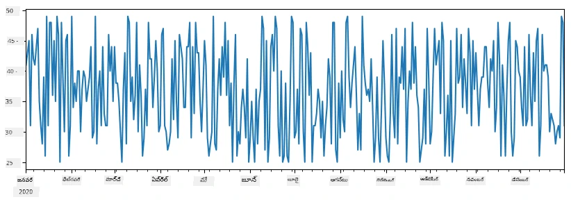
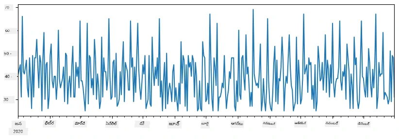
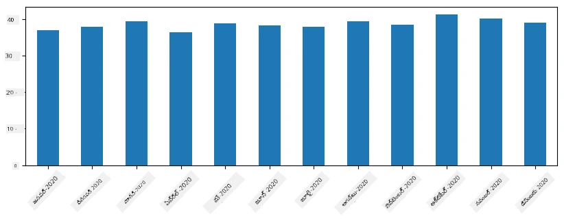
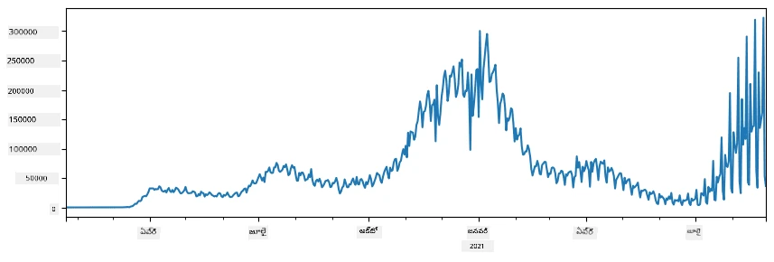
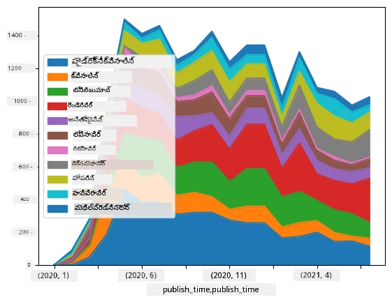

# డేటాతో పని చేయడం: పైన్తన్ మరియు పాండాస్ లైబ్రరీ

|  ](../../sketchnotes/07-WorkWithPython.png) |
| :-------------------------------------------------------------------------------------------------------: |
|                 పైన్తన్‌తో పని చేయడం - _Sketchnote by [@nitya](https://twitter.com/nitya)_                 |

[](https://youtu.be/dZjWOGbsN4Y)

డేటాబేసులు డేటాను నిల్వ చేసేందుకు మరియు వాటిని క్వెరీ భాషలను ఉపయోగించి ప్రశ్నించేందుకు చాలా సమర్థవంతమైన మార్గాలను అందించినప్పటికీ, డేటాను ప్రాసెస్ చేసే అత్యంత అనువర్తన మార్గం మీ స్వంత ప్రోగ్రామ్ రాయడం ద్వారా డేటాను మేనేజు చేయడమే. చాలా సందర్భాల్లో, డేటాబేస్ క్వెరీ చేయడం మరింత సమర్థవంతమైన మార్గం అవుతుంది. కానీ కొంత క్లిష్టమైన డేటా ప్రాసెసింగ్ అవసరమైతే, SQL ఉపయోగించి దీన్ని సులువుగా చేయలేము.
డేటా ప్రాసెసింగ్‌ను ఏదైనా ప్రోగ్రామింగ్ భాషలో ప్రోగ్రామ్ చేయవచ్చు, కానీ డేటాతో పని చేసే అంశంలో కొంత మంది భాషలు ఉన్నత స్థాయికి చెందినవిగా పరిగణించబడతాయి. డేటా శాస్త్రవేత్తలు సాధారణంగా క్రింది భాషలలో ఒకదానిని ప్రాధాన్యం ఇస్తారు:

* **[Python](https://www.python.org/)**, సాధారణ ఉద్దేశ్య ప్రోగ్రామింగ్ భాష, ఇది సులభత్వం కారణంగా మొదటి ప్రారంభం కోసం గొప్ప ఎంపికగా భావించబడుతుంది. పైన్తన్‌కు అనేక అదనపు లైబ్రరీలు ఉన్నాయి, అవి మీకు అనేక వ్యవహార కష్టాలను పరిష్కరించడంలో సహాయపడతాయి, ఉదాహరణకు ZIP ఆర్కైవ్ నుండి డేటాను తీయడం, లేదా చిత్రాన్ని గ్రేస్కేల్‌కు మార్చడం. డేటా సైన్స్ తలచికంటే, పైన్తన్ వెబ్ డెవలప్‌మెంట్‌లో కూడా తరచుగా ఉపయోగిస్తారు.
* **[R](https://www.r-project.org/)** గణాంక డేటా ప్రాసెసింగ్ దృష్టితో అభివృద్ధి చేయబడిన సంప్రదాయ టూల్ బాక్స్. ఇది పెద్ద లైబ్రరీ భాండాగారం (CRAN) కలిగి ఉంది, ఇది డేటా ప్రాసెసింగ్ కోసం మంచి ఎంపిక. అయితే R సాధారణ ఉద్దేశ్య ప్రోగ్రామింగ్ భాష కాదు, మరియు డేటా సైన్స్ డొమైన్లో తప్ప మరెక్కడా తరచుగా ఉపయోగించబడదు.
* **[Julia](https://julialang.org/)** డేటా సైన్స్ కోసమే ప్రత్యేకంగా అభివృద్ధి చేయబడిన మరో భాష. ఇది పైన్తన్ కంటే మెరుగైన పనితనాన్ని ఇవ్వాలని ఉద్దేశించబడింది, విద్యుత్ ప్రయోగాలకు గొప్ప సాధనం.

ఈ పాఠంలో, మనం సింపుల్ డేటా ప్రాసెసింగ్ కోసం పైన్తన్ ఉపయోగంపై దృష్టి పెట్టబోతున్నాం. భాష గురించి ప్రాథమిక పరిచయం ఉందని అనుకుంటున్నాం. మీరు పైన్తన్‌ను విస్తృతంగా తెలుసుకోవాలని కోరుకుంటే, క్రింది వనరులను చూడవచ్చు:

* [తురలరేఖల గ్రాఫిక్స్ మరియు ఫ్రాక్టల్స్ తో పైన్తన్ హాయిగా నేర్చుకోండి](https://github.com/shwars/pycourse) - GitHub ఆధారిత త్వరిత పరిచయ కోర్స్
* [పైన్తన్‌తో మీ మొదటి అడుగులు వేయండి](https://docs.microsoft.com/en-us/learn/paths/python-first-steps/?WT.mc_id=academic-77958-bethanycheum) [Microsoft Learn](http://learn.microsoft.com/?WT.mc_id=academic-77958-bethanycheum)లో లెర్నింగ్ పాథ్

డేటా అనేక రూపాల్లో వస్తుంది. ఈ పాఠంలో, మేము మూడు రూపాల డేటాను పరిశీలిస్తాము - **పట్టికా డేటా**, **పాఠ్యం** మరియు **చిత్రాలు**.

మేము అన్ని సంబంధిత లైబ్రరీల పూర్తి సమీక్ష కాకుండా కొన్ని డేటా ప్రాసెసింగ్ ఉదాహరణలపై దృష్టి పెట్టబోతున్నాం. దీన్ని మీరు అనుసరించడం ద్వారా ఏం సాధ్యం అవుతుందంటే ప్రాథమిక ఆలోచన తెలుసుకుంటారు, మరియు అవసరమైతే సమస్యలకు పరిష్కారాలు ఎక్కడెక్కడ కనుగొనాలో మీకు అవగాహన ఏర్పడుతుంది.

> **అత్యంత ఉపయోగకరమైన సలహా**. మీరు డేటాపై ఒక నిర్దిష్ట ఆపరేషన్ చేయాల్సివుంటే మరియు దానికి పద్ధతి తెలియకపోతే, ఇంటర్నెట్‌లో దాన్ని వెతకండి. [Stackoverflow](https://stackoverflow.com/)లో చాలా ఉపయోగకరమైన పైన్తన్ కోడ్ నమూనాలు ఉంటాయి చాలా సాధారణ పనుల కోసం.


## [పాఠం ముందస్తు క్విజ్](https://ff-quizzes.netlify.app/en/ds/quiz/12)

## పట్టికా డేటా మరియు డేటాఫ్రేమ్స్

మీరు రిలేషనల్ డేటాబేసుల గురించి మాట్లాడినప్పుడు ఇప్పటికే పట్టికా డేటా కలవుంది. మీరు చాలాసార్లు డేటా కలిగి ఉన్నప్పుడు, మరియు అది అనేక లింక్ చేసిన పట్టికల్లో ఉంటే, దాన్ని పని చేయడానికి SQL ఉపయోగించడం నిశ్చయంగా సమర్థవంతమే. అయితే, చాలాసార్లు మనకు ఒక డేటా పట్టిక ఉంటుంది, మరియు ఆ డేటా గురించి కొన్ని **అర్ధం** లేదా **అన్వేషణలు** పొందడం అవసరం పడుతుంది, ఉదాహరణకి పంపిణీ, విలువల మధ్య సంబంధం మొదలైనవి. డేటా సైన్స్ లో చాలా సందర్భాల్లో అసలు డేటానుండి కొంత మార్పులు చేసి, ఫిర్యాదు చేయడం అవసరం. ఈ రెండు దశలను పైన్తన్ ఉపయోగించి సులువుగా చేయవచ్చు.

పైన్తన్ లో మీకు పట్టికా డేటాతో పని చేయడంలో సహాయపడే రెండు అత్యంత ఉపయోగకరమైన లైబ్రరీలు ఉన్నాయి:
* **[Pandas](https://pandas.pydata.org/)** అనేది మీరు మేనిపులేట్ చేయగలిగే **డేటాఫ్రేమ్స్**కి అనుగుణమైనది, ఇవి రిలేషనల్ పట్టికలకు సమానం. మీరు పేరుతో కూడిన కాలమ్స్ కలిగి ఉండవచ్చు, మరియు మీరు వరుసలు, కాలమ్స్ మరియు డేటాఫ్రేమ్స్‌పై వేర్వేరు ఆపరేషన్లను చేయవచ్చు.
* **[Numpy](https://numpy.org/)** అనేది **టెన్సార్లతో**, అంటే బహుముఖ డైమెన్షనల్ **అర్రేలు**తో పని చేయడానికి ఉపయోగించే లైబ్రరీ. అర్రే అన్ని విలువలు ఒకే ప్రాథమిక రకమైనవి కలిగి ఉంటాయి, ఇది డేటాఫ్రేమ్ కంటే సరళమైనది, కానీ ఇది మరింత గణిత ఆపరేషన్లు అందిస్తుంది మరియు లోడ్ తక్కువగా ఉంటుంది.

మరిది మరిన్ని కొన్ని లైబ్రరీలను కూడా మీరు తెలుసుకోవాలి:
* **[Matplotlib](https://matplotlib.org/)** అనేది డేటా విజువలైజేషన్ మరియు గ్రాఫ్ చిత్రణ కోసం ఉపయోగించే లైబ్రరీ
* **[SciPy](https://www.scipy.org/)** అనేది అదనపు శాస్త్రీయ ఫంక్షన్లు కలిగిన లైబ్రరీ. మనం ఇప్పటికే ఈ లైబ్రరీని అవకాశాలు మరియు గణాంకాల గురించి మాట్లాడినప్పుడు చూశాము

ఈ క్రింది కోడ్ మీరు సాధారణంగా మీ పైన్తన్ ప్రోగ్రామ్ల ప్రారంభంలో ఆ లైబ్రరీలను ఇంటిగ్రేట్ చేయడానికి ఉపయోగిస్తారు:
```python
import numpy as np
import pandas as pd
import matplotlib.pyplot as plt
from scipy import ... # మీరు అవసరమైన సబ్ప్యాకేజీలను ఖచ్చితంగా సూచించాలి
``` 

పాండాస్ కింది కొన్ని మౌలిక ఆలోచనల చుట్టూ నిర్మించబడింది.

### సిరీస్ 

**సిరీస్** అనేది విలువల సుసంపన్న శ్రేణి, జాబితా లేదా నంపై అర్రేలా పోలి ఉంటుంది. ప్రధాన తేడా ఏమిటంటే సిరీస్‌కు ఒక **ఇండెక్స్** కూడా ఉంటుంది, మరియు మనం సిరీస్‌పై ఆపరేషన్లు (ఉదాహరణకు, జోడించటం) చేసినప్పుడు, ఇండెక్స్‌ను పరిగణలోకి తీసుకుంటారు. ఇండెక్స్ సాదారణంగా అంతర్జాతీయ వరుస సంఖ్యగా ఉండవచ్చు (సాధారణంగా జాబితా లేదా అర్రే నుండి సిరీస్ సృష్టించినప్పుడు డిఫాల్ట్‌గా ఉపయోగించే ఇండెక్స్), లేదా అది జటిలమైన నిర్మాణం, ఉదాహరణగా తేదీ వ్యవధి కూడా ఉండవచ్చు.

> **గమనిక**: కలిసి ఇచ్చిన నోట్బుక్ [`notebook.ipynb`](notebook.ipynb)లో కొంత ప్రవేశిక పాండాస్ కోడ్ ఉంది. మేము ఇక్కడ కొన్ని ఉదాహరణలనే వివరించాము, మరియు మీరు మొత్తం నోట్బుక్‌ను తప్పకుండా చూస్తే మంచిది.

ఒక ఉదాహరణను పరిగణించండి: మనం మా ఐస్‌క్రీమ్ దుకాణం అమ్మకాలను విశ్లేషించాలనుకొంటున్నాం. కొన్ని కాలం పాటు అమ్మిన ఐటమ్‌ల సంఖ్యను సూచించే సిరీస్ ను తయారు చేద్దాం:

```python
start_date = "Jan 1, 2020"
end_date = "Mar 31, 2020"
idx = pd.date_range(start_date,end_date)
print(f"Length of index is {len(idx)}")
items_sold = pd.Series(np.random.randint(25,50,size=len(idx)),index=idx)
items_sold.plot()
```


ఇప్పుడు ప్రస్తావిద్దాం, ప్రతి వారం మేము స్నేహితులకు పార్టీ నిర్వహిస్తున్నాము, మరియు పార్టీ కొరకు అదనంగా 10 ఐస్‌క్రీమ్ ప్యాక్స్ తీసుకుంటాము. దీనిని చూపించడానికి వారంతో ఇండెక్స్ ఉన్న మరో సిరీస్ తయారు చేద్దాం:
```python
additional_items = pd.Series(10,index=pd.date_range(start_date,end_date,freq="W"))
```
రెండు సిరీస్‌లను కలిపితే, మొత్తం సంఖ్య లభిస్తుంది:
```python
total_items = items_sold.add(additional_items,fill_value=0)
total_items.plot()
```


> **గమనిక**: మేము సాదారణ వాక్యరచన `total_items+additional_items` ఉపయోగించకపోతాము. అది చేస్తే, ఫలిత సిరీస్‌లో చాలా `NaN` (*Not a Number*) విలువలు వస్తాయి. ఇదే కారణం ఏమిటంటే, `additional_items` సిరీస్‌లో కొన్ని ఇండెక్స్ స్థానాలకు విలువలు లేవు, మరియు `NaN`ని ఏదైనా విలువతో కలిపితే, ఫలితంగా `NaN` వస్తుంది. అందుకే జోడించేటప్పుడు `fill_value` అనే పారామీటర్ ను వినియోగించాలి.

సమయ శ్రేణులతో, మేము వివిధ సమయ వ్యవధులతో సిరీస్‌ను **రీసాంపుల్** చేయొచ్చు. ఉదాహరణకు, నెలవారీ సగటు అమ్మకాల పరిమాణం గణించాలనుకుంటే, క్రింది కోడ్ ఉపయోగించవచ్చు:
```python
monthly = total_items.resample("1M").mean()
ax = monthly.plot(kind='bar')
```


### డేటాఫ్రేమ్

డేటాఫ్రేమ్ అనేది ప్రాముఖ్యంగా ఒకే ఇండెక్స్ కలిగిన సిరీస్‌ల సమాహారంగా ఉంటుంది. మనం కొన్ని సిరీస్‌లను కలిపి ఒక డేటాఫ్రేమ్ సృష్టించవచ్చు:
```python
a = pd.Series(range(1,10))
b = pd.Series(["I","like","to","play","games","and","will","not","change"],index=range(0,9))
df = pd.DataFrame([a,b])
```
ఇది ఇలా ఒక أفقی పట్టికను సృష్టిస్తుంది:
|     | 0   | 1    | 2   | 3   | 4      | 5   | 6      | 7    | 8    |
| --- | --- | ---- | --- | --- | ------ | --- | ------ | ---- | ---- |
| 0   | 1   | 2    | 3   | 4   | 5      | 6   | 7      | 8    | 9    |
| 1   | I   | like | to  | use | Python | and | Pandas | very | much |

మేము సిరీస్‌లను కాలమ్స్‌గా ఉపయోగించి, డిక్షనరీ ద్వారా కాలమ్ పేర్లను కూడా సూచించవచ్చు:
```python
df = pd.DataFrame({ 'A' : a, 'B' : b })
```
ఇది మనకు క్రింది పట్టికను ఇస్తుంది:

|     | A   | B      |
| --- | --- | ------ |
| 0   | 1   | I      |
| 1   | 2   | like   |
| 2   | 3   | to     |
| 3   | 4   | use    |
| 4   | 5   | Python |
| 5   | 6   | and    |
| 6   | 7   | Pandas |
| 7   | 8   | very   |
| 8   | 9   | much   |

**గమనిక**: మేము ఈ పట్టిక లేఅవుట్‌ను ముందస్తు పట్టికను ట్రాన్స్‌పోజ్ చేయడం ద్వారా కూడా పొందవచ్చు, ఉదాహరణకు 
```python
df = pd.DataFrame([a,b]).T.rename(columns={ 0 : 'A', 1 : 'B' })
```
ఇక్కడ `.T` డేటాఫ్రేమ్‌ను ట్రాన్స్‌పోజ్ చేసే ఆపరేషన్ అంటే వరుసలు మరియు కాలమ్స్ మార్చడం, మరియు `rename` ఆపరేషన్ మునుపటి ఉదాహరణకు అనుగుణంగా కాలమ్స్‌ను పేరు మార్చేందుకు ఉపయోగిస్తాయి.

ఇక్కడ కొన్ని అత్యంత ముఖ్యమైన ఆపరేషన్లు ఉన్నాయి, ఇవి డేటాఫ్రేమ్స్‌పై చేయొచ్చు:

**కాలమ్ ఎంపిక**. మనం `df['A']` రాయడం ద్వారా వ్యక్తిగత కాలమ్స్ ఎంచుకోవచ్చు - ఇది సిరీస్‌ని తిరిగి ఇస్తుంది. మనం `df[['B','A']]` రాయడం ద్వారా కొన్ని కాలమ్స్‌ను మరొక డేటాఫ్రేమ్‌కు ఎంచుకోవచ్చు - ఇది మరో డేటాఫ్రేమ్‌ను ఇస్తుంది.

**నిర్దిష్ట వరుసలు ఫిల్టరింగ్**. ఉదాహరణకి, కాలమ్ `A` విలువ 5 కంటే ఎక్కువ ఉన్న వాటినే మాత్రమే ఉంచాలంటే, మేము `df[df['A']>5]` అని రాయవచ్చు.

> **గమనిక**: ఫిల్టరింగ్ ఈ విధంగా పని చేస్తుంది. `df['A']<5` అనే వ్యక్తవ్యం ఒక బూలియన్ సిరీస్‌ను ఇస్తుంది, దీనిలో ప్రతి మూల్యం `True` లేదా `False` అని సూచిస్తుంది అసలు సిరీస్ `df['A']` యొక్క ప్రతి మూల్యానికి. ఈ బూలియన్ సిరీస్‌ను ఇండెక్స్‌గా ఉపయోగించినప్పుడు, అది డేటాఫ్రేమ్‌లోని వరుసల ఉపసమితి ఇస్తుంది. అందువల్ల ఏదైనా పైన్తన్ బూలియన్ వ్యక్తవ్యం ఉపయోగించడం సాధ్యం కాదు, ఉదాహరణకి `df[df['A']>5 and df['A']<7]` తప్పు. బదులు, బూలియన్ సిరీస్‌లపై ప్రత్యేక `&` ఆపరేషన్ ఉపయోగించి `df[(df['A']>5) & (df['A']<7)]` అని రాయాలి (*ధ्यानించండి బ్రాకెట్లున్నాయని*).

**కొత్త గణనీయమైన కాలమ్స్ సృష్టించడం**. మనం సులభంగా మన డేటాఫ్రేమ్ కోసం కొత్త గణించే కాలమ్స్ సృష్టించవచ్చు ఇలా సవ్య రీతిలో:
```python
df['DivA'] = df['A']-df['A'].mean() 
``` 
ఈ ఉదాహరణలో A యొక్క సగటు విలువ నుండి వైవృత్తిని లెక్కించడం జరుగుతుంది. ఇక్కడ నిజానికి ఏమవుతుంది అంటే, ఒక సిరీస్‌ను గణించి, ఆ సిరీస్‌ను ఎడమ వైపు అర్థం చేసుకుని మరో కాలమ్ సృష్టిస్తారు. అందువల్ల సిరీస్‌కు సంబంధించిన ఆపరేషన్లకంటే విరుద్ధంగా ఉండే ఏ ఆపరేషన్లు వాడకూడదు, ఉదాహరణకి క్రింది కోడ్ తప్పు:
```python
# తప్పు కోడ్ -> df['ADescr'] = "Low" if df['A'] < 5 else "Hi"
df['LenB'] = len(df['B']) # <- తప్పు ఫలితం
``` 
ఈ చివరి ఉదాహరణ, వాక్యరచన సరిగ్గా ఉన్నప్పటికీ, తప్పు ఫలితాన్ని ఇస్తుంది, ఎందుకంటే ఇది సిరీస్ `B` యొక్క పొడవును అన్ని కాలమ్ విలువలకు కేటాయిస్తుంది, మన ఉద్దేశ్యంగా ప్రతి మూల్యానికి పొడవును కేటాయించడం కాదు.

ఇలాంటి క్లిష్ట వ్యక్తవ్యతల కోసం, మనం `apply` ఫంక్షన్ ఉపయోగించవచ్చు. చివరి ఉదాహరణను ఇలా రాయవచ్చు:
```python
df['LenB'] = df['B'].apply(lambda x : len(x))
# లేదా
df['LenB'] = df['B'].apply(len)
```

పై ఆపరేషన్ల తరువాత, మనకు వచ్చే డేటాఫ్రేమ్ ఇలా ఉంటుంది:

|     | A   | B      | DivA | LenB |
| --- | --- | ------ | ---- | ---- |
| 0   | 1   | I      | -4.0 | 1    |
| 1   | 2   | like   | -3.0 | 4    |
| 2   | 3   | to     | -2.0 | 2    |
| 3   | 4   | use    | -1.0 | 3    |
| 4   | 5   | Python | 0.0  | 6    |
| 5   | 6   | and    | 1.0  | 3    |
| 6   | 7   | Pandas | 2.0  | 6    |
| 7   | 8   | very   | 3.0  | 4    |
| 8   | 9   | much   | 4.0  | 4    |

**సంఖ్య ఆధారంగా వరుసలను ఎంచుకోవడం** `iloc` నిర్మాణం ద్వారా చేయవచ్చు. ఉదాహరణకి, డేటాఫ్రేమ్ నుండి మొదటి 5 వరుసలను ఎంచుకోవాలంటే:
```python
df.iloc[:5]
```

**గ్రూపింగ్** Excelలో *పివెట్ టేబుల్స్* పెద్దలు పొందటానికి తరచుగా ఉపయోగిస్తారు. ఉదాహరణకి మనం `LenB` ఇనుము సంఖ్యకు ప్రతీ విలువ కోసం కాలమ్ `A` సగటును గణించాలనుకుంటే, మన డేటాఫ్రేమ్‌ను `LenB` ద్వారా గ్రూప్ చేసి `mean` పిలవచ్చు:
```python
df.groupby(by='LenB')[['A','DivA']].mean()
```
మనం గ్రూప్‌లో సగటు మరియు మూల్యాల సంఖ్య తెలుసుకోవాలని అయితే, మరింత క్లిష్టమైన `aggregate` ఫంక్షన్ వాడవచ్చు:
```python
df.groupby(by='LenB') \
 .aggregate({ 'DivA' : len, 'A' : lambda x: x.mean() }) \
 .rename(columns={ 'DivA' : 'Count', 'A' : 'Mean'})
```
మనం క్రింది పట్టికను పొందుతాము:

| LenB | Count | Mean     |
| ---- | ----- | -------- |
| 1    | 1     | 1.000000 |
| 2    | 1     | 3.000000 |
| 3    | 2     | 5.000000 |
| 4    | 3     | 6.333333 |
| 6    | 2     | 6.000000 |

### డేటా పొందడం


మనం Python వస్తువుల నుండి Series మరియు DataFrames‌ను నిర్మించడం ఎంత సులభమో చూశాం. అయితే, డేటా సాధారణంగా టెక్స్ట్ ఫైల్ లేదా Excel పట్టిక రూపంలో వస్తుంది. అదృష్టవశాత్, Pandas మాకు డిస్క్ నుండి డేటాను లోడ్ చేసే సరళమైన మార్గాన్ని అందిస్తుంది. ఉదాహరణకు, CSV ఫైల్ చదవడం ఈ విధంగా సులభం:
```python
df = pd.read_csv('file.csv')
```
మనం "పోటీ" విభాగంలో బాహ్య వెబ్ సైట్ల నుండి డేటాను పొందడం సహా డేటా లోడ్ చేసే మరిన్ని ఉదాహరణలను చూస్తాము


### ముద్రణ మరియు చిత్రణ

డేటా సైంటిస్ట్ తరచుగా డేటాను అన్వేషించాలి, కాబట్టి దాన్ని దృశ్యమానంగా చూడగలగడం ముఖ్యం. DataFrame పెద్దదైతే, మనం యథార్ధంగా ఉన్నదేనా అని నిర్ధారించుకోవడం కోసం మొదటి కొన్ని వరుసలను మాత్రమే ముద్రించాలి అనుకునే అవకాశాలు ఎక్కువ. దీన్ని `df.head()` ని పిలవడం ద్వారా చేయవచ్చు. మీరు Jupyter Notebook నుండి దీనిని నడుపుతున్నట్లయితే, అది DataFrameని చక్కని పట్టిక రూపంలో ముద్రిస్తుంది.

కొను కాలమ్స్‌ను గుర్తించడానికి `plot` ఫంక్షన్ ఉపయోగించడం కూడా చూశాం. `plot` అనేది అనేక పనులకు చాలా ఉపయోగకరమైనది, మరియు `kind=` పారామీటర్ ద్వారా అనేక వేరే గ్రాఫ్ రకాలని మద్దతు అందిస్తుంది, మీరు ఎప్పుడైనా మరింత క్లిష్టమైన దృశ్యకరణకు కাঁচా `matplotlib` లైబ్రరీని ఉపయోగించవచ్చు. డేటా దృశ్యకరణను వేర్వేరు పాఠ్యాంశల్లో వివరిస్తాము.

ఈ సమీక్ష Pandas యొక్క అత్యంత ముఖ్యమైన భావనలను కవర్ చేస్తుంది, అయినప్పటికీ, లైబ్రరీ బాగా సంపన్నమైనది, మరియు మీరు దానితో చేయగలిగే పనులకు ఎటువంటి పరిమితి లేదు! ఇప్పుడు ఈ జ్ఞానాన్ని ఒక నిర్దిష్ట సమస్య పరిష్కరించడానికి ఉపయోగిద్దాం.

## 🚀 పోటీ 1: COVID వ్యాప్తిని విశ్లేషించడం

మొదటి సమస్య మనం దృష్టి సారించేది COVID-19 వ్యాప్తి యొక్క అంటుకుంటున్న వ్యాధి నమూనా నిర్మాణం గురించి. దానికోసం, వివిధ దేశాలలో సోకిన వ్యక్తుల సంఖ్యపై డేటాను ఉపయోగిస్తాము, ఇది [Center for Systems Science and Engineering](https://systems.jhu.edu/) (CSSE) వద్ద [Johns Hopkins University](https://jhu.edu/) అందించినది. డేటా సెట్ [ఈ GitHub రిపోజిటరీ](https://github.com/CSSEGISandData/COVID-19) లో అందుబాటులో ఉంది.

మనం డేటాతో ఎలా పని చేయాలో చూపించాలనుకునే కారణంగా, మీరు [`notebook-covidspread.ipynb`](notebook-covidspread.ipynb) ను తెరిచి పైనుండి క్రిందవరకు చదవాలని ఆహ్వానిస్తున్నాము. మీరు సెల్స్ ని కూడా నడిపించి, మనం చివరికి వదిలిన కొంత ఛాలెంజ్‌లను కూడా చేయవచ్చు.



> మీరు Jupyter Notebookలో కోడ్ ఎలా నడుపాలో తెలియకపోతే, [ఈ వ్యాసం](https://soshnikov.com/education/how-to-execute-notebooks-from-github/)ను చూడండి.

## అసంరచిత డేటాతో పని చేయడం

డేటా చాలా సార్లు పట్టిక ఆకారంలో వస్తే కూడా, కొన్ని సందర్భాల్లో మనం తక్కువగా సరిగ్గా రూపొందించబడిన డేటాతో వ్యవహరించాల్సి ఉంటుంది, ఉదాహరణకు, టెక్స్ట్ లేదా చిత్రాలు. ఈ సందర్భంలో, పైన చూపించిన డేటా ప్రాసెసింగ్ సాంకేతికాలను వర్తింపజేయడానికి మనం ఏదో విధంగా **సంరచిత** డేటాను **ఎత్తుకురావాలి**. కొన్ని ఉదాహరణలు:

* టెక్స్ట్ నుండి ముఖ్య పదాలను (keywords) ఎత్తుకురావడం, అవి ఎన్ని సార్లు కనిపిస్తాయో చూడడం
* చిత్రంలోని వస్తువుల గురించి సమాచారం పొందడానికి న్యూరల్ నెట్‌వర్క్‌లను ఉపయోగించడం
* వీడియోకెమెరా ఫీడ్‌లోని ప్రజల భావోద్వేగాలపై సమాచారం పొందడం

## 🚀 పోటీ 2: COVID పత్రాలను విశ్లేషించడం

ఈ పోటీలో మనం COVID మహమ్మారి విషయం కొనసాగిస్తూ, సంబంధిత శాస్త్రీయ పత్రాలను ప్రాసెస్ చేయడంపై దృష్టి సారిస్తాము. [CORD-19 Dataset](https://www.kaggle.com/allen-institute-for-ai/CORD-19-research-challenge) COVID పై 7000 కన్నా ఎక్కువ (వ్రాస్తున్న సమయంలో) పత్రాలు మెటాడేటా మరియు సారాంశాలతో (అర్థ సటవంతుల్లో మిగిలిన వాటికి పూర్తి పాఠ్యాన్ని కూడా కలిగి) అందుబాటులో ఉన్నాయి.

[Text Analytics for Health](https://docs.microsoft.com/azure/cognitive-services/text-analytics/how-tos/text-analytics-for-health/?WT.mc_id=academic-77958-bethanycheum) సేవను ఉపయోగించి ఈ డేటా సెట్ విశ్లేషణ యొక్క పూర్తి ఉదాహరణ [ఈ బ్లాగ్ పోస్ట్](https://soshnikov.com/science/analyzing-medical-papers-with-azure-and-text-analytics-for-health/)లో వివరించబడింది. మేము ఈ విశ్లేషణ సాదా వెర్షన్‌ గురించి చర్చించబోతున్నాము.

> **గమనిక**: ఈ రిపోజిటరీ భాగంగా డేటాసెట్ కాపీని మేము అందించము. మీరు ముందుగా [Kaggle లో](https://www.kaggle.com/allen-institute-for-ai/CORD-19-research-challenge?select=metadata.csv) నుండి [`metadata.csv`](https://www.kaggle.com/allen-institute-for-ai/CORD-19-research-challenge?select=metadata.csv) ఫైలు డౌన్లోడ్ చేసుకోవాలి. Kaggleలో రిజిస్టర్అపై అవసరం ఉండొచ్చు. మీరు రిజిస్టర్అ లేకుండానే [ఇక్కడ](https://ai2-semanticscholar-cord-19.s3-us-west-2.amazonaws.com/historical_releases.html) నుండి డేటాసెట్ డౌన్లోడ్ చేసుకోవచ్చు, కానీ అది మెటాడేటాతో పాటు అన్ని పూర్తి పాఠ్యాలను కూడా కలిగి ఉంటుంది.

[`notebook-papers.ipynb`](notebook-papers.ipynb) తెరిచి పై నుండి క్రింద వరకు చదవండి. మీరు సెల్స్‌ని నడిపించి, చివరలో మిగిల్చిన కొన్ని ఛాలెంజిలను కూడా చేయవచ్చు.



## చిత్ర డేటాను ప్రాసెసింగ్ చేయడం

ఇటీవల, చిత్రాలను అర్థం చేసుకునే శక్తివంతమైన AI మోడల్స్ అభివృద్ధి అయ్యాయి. పూర్వపు శిక్షణ పొందిన న్యూరల్ నెట్‌వర్క్స్ లేదా క్లౌడ్ సేవలను ఉపయోగించి అనేక పనులను పరిష్కరించవచ్చు. కొన్ని ఉదాహరణలు:

* **చిత్ర వర్గీకరణ**, ఇది చిత్రాన్ని ముందుగా నిర్వచించిన తరగతులలో ఒకటిగా వర్గీకరించటానికి సహాయపడుతుంది. మీరు [Custom Vision](https://azure.microsoft.com/services/cognitive-services/custom-vision-service/?WT.mc_id=academic-77958-bethanycheum) వంటి సేవలను ఉపయోగించి మీ స్వంత చిత్ర వర్గీకరణలనూ సులభంగా శిక్షణ ఇవ్వవచ్చు
* **వస్తువు గుర్తింపు**, చిత్రంలో వివిధ వస్తువులను గుర్తించడానికి. [computer vision](https://azure.microsoft.com/services/cognitive-services/computer-vision/?WT.mc_id=academic-77958-bethanycheum) వంటి సేవలు కొన్ని సాధారణ వస్తువులను గుర్తించగలవు, మరియు [Custom Vision](https://azure.microsoft.com/services/cognitive-services/custom-vision-service/?WT.mc_id=academic-77958-bethanycheum) మోడల్‌ని కొన్ని నిర్దిష్ట ఆసక్తికరమైన వస్తువులను గుర్తించడానికి శిక్షణ ఇవ్వవచ్చు.
* **ముఖం గుర్తింపు**, వయస్సు, లింగం మరియు భావోద్వేగ గుర్తింపుతో సహా. ఇది [Face API](https://azure.microsoft.com/services/cognitive-services/face/?WT.mc_id=academic-77958-bethanycheum) ద్వారా చేయవచ్చు.

ఈ క్లౌడ్ సేవలన్నీ [Python SDKs](https://docs.microsoft.com/samples/azure-samples/cognitive-services-python-sdk-samples/cognitive-services-python-sdk-samples/?WT.mc_id=academic-77958-bethanycheum) ఉపయోగించి పిలవబడవచ్చు, అలా మీ డేటా అన్వేషణ వర్క్‌ఫ్లోలో సులభంగా చేర్చుకోవచ్చు.

చిత్ర డేటా మూలాల నుండి డేటాను అన్వేషించడాని కొన్ని ఉదాహరణలు:
* బ్లాగ్ పోస్ట్ [కోడింగ్ లేకుండా డేటా సైన్స్ నేర్చుకోవడం](https://soshnikov.com/azure/how-to-learn-data-science-without-coding/) లో మనం Instagram ఫోటోలు అన్వేషిస్తున్నాము, ప్రజలు ఫోటోకు ఎక్కువ లైక్స్ ఇవ్వడానికి ఏమి కారణమో అర్థం చేసుకునేందుకు. ముందు [computer vision](https://azure.microsoft.com/services/cognitive-services/computer-vision/?WT.mc_id=academic-77958-bethanycheum) ఉపయోగించి చిత్రాల నుండి ఎక్కువ సమాచారం తీసుకుంటాము, తరువాత [Azure Machine Learning AutoML](https://docs.microsoft.com/azure/machine-learning/concept-automated-ml/?WT.mc_id=academic-77958-bethanycheum) ఉపయోగించి వివరణాత్మక మోడల్ నిర్మిస్తాము.
* [Facial Studies Workshop](https://github.com/CloudAdvocacy/FaceStudies) లో మనం ఈవెంట్ల ఫోటోగ్రఫీలలో ప్రజల భావోద్వేగాలను తీసుకోవడానికి [Face API](https://azure.microsoft.com/services/cognitive-services/face/?WT.mc_id=academic-77958-bethanycheum) ను ఉపయోగిస్తాము, ప్రజలను సంతోషంగా చేసే అంశాలను అర్థం చేసుకునేందుకు.

## ముగింపు

మీరు ఇప్పటికే సంరచిత లేదా అసంరచిత డేటా ఉన్నా, Python ఉపయోగించి మీరు డేటా ప్రాసెసింగ్ మరియు అర్థం చేసుకోవడంలో అన్ని దశలను నిర్వహించవచ్చు. అది ఎక్కువ సాంవిధానికంగా డేటా ప్రాసెసింగ్ చేసే మార్గం కాగా, ఎక్కువ మంది డేటా సైంటిస్టులు Pythonను వారి ప్రాథమిక సాధనంగా ఉపయోగిస్తారు. మీరు మీ డేటా సైన్స్ ప్రయాణం గంభీరంగా తీసుకుంటే Python లో లోతుగా నేర్రుకోవడం మంచి ఆలోచన.

## [పఠన అనంతరం ప్రశ్నలు](https://ff-quizzes.netlify.app/en/ds/quiz/13)

## సమీక్ష & స్వీయ అధ్యయనం

**పుస్తకాలు**
* [Wes McKinney. Python for Data Analysis: Data Wrangling with Pandas, NumPy, and IPython](https://www.amazon.com/gp/product/1491957662)

**ఆన్లైన్ వనరులు**
* అధికారిక [10 నిమిషాలు లో Pandas](https://pandas.pydata.org/pandas-docs/stable/user_guide/10min.html) ఉపాధి
* [Pandas Visualisation పై డాక్యుమెంటేషన్](https://pandas.pydata.org/pandas-docs/stable/user_guide/visualization.html)

**Python నేర్చుకోవడం**
* [Turtle Graphics మరియు Fractals తో Pythonను సరదాగా నేర్చుకోండి](https://github.com/shwars/pycourse)
* [Python తో మొదటి అడుగులు](https://docs.microsoft.com/learn/paths/python-first-steps/?WT.mc_id=academic-77958-bethanycheum) Microsoft Learn వద్దలెర్నింగ్ పాత్

## అసైన్‌మెంట్

[పై పోటీలకు మరింత సవివరమైన డేటా అధ్యయనం చేయండి](assignment.md)

## క్రెడిట్స్

ఈ పాఠం ♥️ తో [Dmitry Soshnikov](http://soshnikov.com) తయారు చేశారు

---

<!-- CO-OP TRANSLATOR DISCLAIMER START -->
**అస్వీకరణ**:
ఈ పత్రం AI అనువాద సేవ [Co-op Translator](https://github.com/Azure/co-op-translator) ఉపయోగించి అనువదించబడింది. మేము ఖచ్చితత్వానికి ప్రయత్నిస్తున్నప్పటికీ, ఆటోమేటెడ్ అనువాదాలు తప్పులు లేదా అసమగ్రతలను కలిగి ఉండవచ్చు. దాని స్వదేశ భాషలో ఉన్న అసలు పత్రాన్ని అధికారం కలిగిన మూలంగా పరిగణించాలి. కీలకమైన సమాచారం కోసం, ప్రొఫెషనల్ మానవ అనువాదాన్ని సిఫారసు చేస్తాము. ఈ అనువాదం ఉపయోగం వల్ల కలిగే ఏవైనా అపార్థాలు లేదా తప్పుదారులు కోసం మేము బాధ్యత వహించము.
<!-- CO-OP TRANSLATOR DISCLAIMER END -->