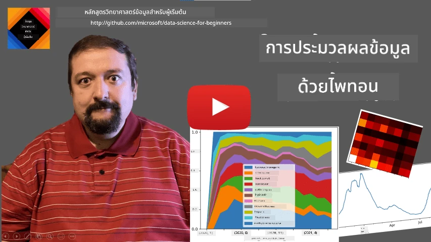
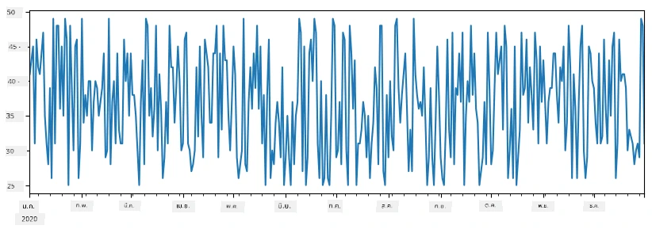
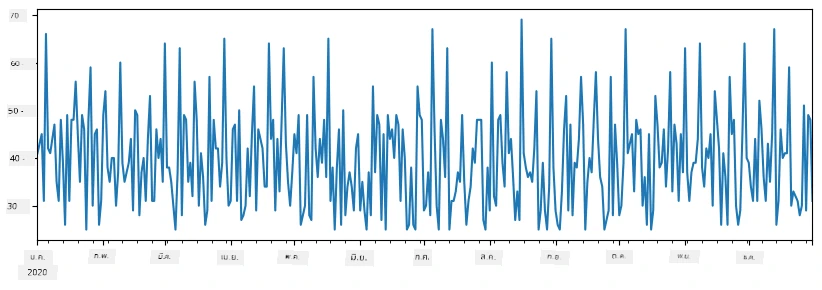
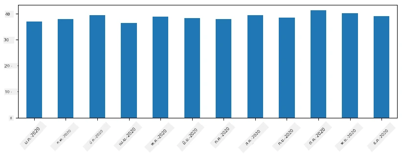
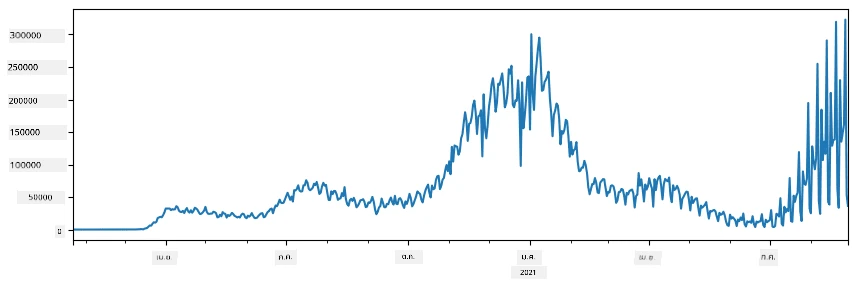
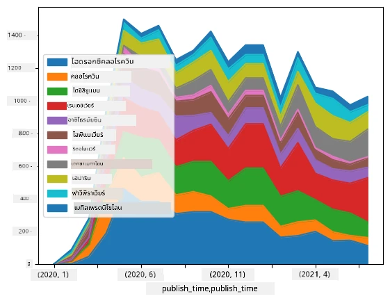

# การทำงานกับข้อมูล: Python และไลบรารี Pandas

|  ](../../sketchnotes/07-WorkWithPython.png) |
| :-------------------------------------------------------------------------------------------------------: |
|                 การทำงานกับ Python - _Sketchnote โดย [@nitya](https://twitter.com/nitya)_                   |

[](https://youtu.be/dZjWOGbsN4Y)

แม้ว่าฐานข้อมูลจะมีวิธีที่มีประสิทธิภาพมากในการจัดเก็บข้อมูลและสืบค้นข้อมูลโดยใช้ภาษาคิวรี วิธีที่ยืดหยุ่นที่สุดสำหรับการประมวลผลข้อมูลคือการเขียนโปรแกรมของคุณเองเพื่อจัดการข้อมูล ในหลายกรณี การใช้คิวรีฐานข้อมูลจะเป็นวิธีที่มีประสิทธิภาพกว่า อย่างไรก็ตามในบางกรณีที่ต้องการการประมวลผลข้อมูลที่ซับซ้อนมากขึ้น จะไม่สามารถทำได้ง่าย ๆ ด้วย SQL
การประมวลผลข้อมูลสามารถเขียนโปรแกรมได้ในทุกภาษาโปรแกรม แต่มีบางภาษาที่อยู่ในระดับสูงกว่าเกี่ยวกับการทำงานกับข้อมูล นักวิทยาศาสตร์ข้อมูลมักจะชอบใช้หนึ่งในภาษาต่อไปนี้:

* **[Python](https://www.python.org/)**, ภาษาโปรแกรมทั่วไปที่มักถูกพิจารณาว่าเป็นตัวเลือกที่ดีที่สุดสำหรับผู้เริ่มต้นเนื่องจากความเรียบง่าย Python มีไลบรารีเพิ่มเติมหลายตัวที่ช่วยแก้ไขปัญหาทางปฏิบัติหลายอย่างได้ เช่น การดึงข้อมูลของคุณจากไฟล์ ZIP หรือการแปลงรูปภาพให้เป็นระดับสีเทา นอกจากการทำวิทยาศาสตร์ข้อมูลแล้ว Python ยังถูกใช้บ่อยในงานพัฒนาเว็บด้วย
* **[R](https://www.r-project.org/)** เป็นชุดเครื่องมือแบบดั้งเดิมที่พัฒนาขึ้นโดยมุ่งเน้นการประมวลผลข้อมูลทางสถิติ และยังมีคลังไลบรารีขนาดใหญ่ (CRAN) ทำให้เป็นตัวเลือกที่ดีสำหรับการประมวลผลข้อมูล อย่างไรก็ตาม R ไม่ใช่ภาษาโปรแกรมทั่วไป และมักไม่ค่อยใช้ในนอกขอบเขตของวิทยาศาสตร์ข้อมูล
* **[Julia](https://julialang.org/)** เป็นอีกภาษาโปรแกรมที่พัฒนาขึ้นโดยเฉพาะสำหรับวิทยาศาสตร์ข้อมูล ถูกออกแบบมาเพื่อให้มีประสิทธิภาพดีกว่า Python ทำให้เป็นเครื่องมือที่ยอดเยี่ยมสำหรับการทดลองเชิงวิทยาศาสตร์

ในบทเรียนนี้ เราจะเน้นการใช้ Python สำหรับการประมวลผลข้อมูลแบบง่าย ๆ เราจะสมมติว่าคุณมีความรู้พื้นฐานเกี่ยวกับภาษาแล้ว หากคุณต้องการเรียนรู้ Python อย่างลึกซึ้งขึ้น คุณสามารถอ้างอิงแหล่งข้อมูลต่อไปนี้:

* [เรียนรู้ Python อย่างสนุกด้วยกราฟิกเต่าและแฟร็กทัล](https://github.com/shwars/pycourse) - หลักสูตรเบื้องต้นใน GitHub สำหรับการเขียนโปรแกรม Python
* [ก้าวแรกกับ Python](https://docs.microsoft.com/en-us/learn/paths/python-first-steps/?WT.mc_id=academic-77958-bethanycheum) เส้นทางการเรียนรู้บน [Microsoft Learn](http://learn.microsoft.com/?WT.mc_id=academic-77958-bethanycheum)

ข้อมูลสามารถมาในหลายรูปแบบ ในบทเรียนนี้ เราจะพิจารณารูปแบบข้อมูลสามแบบ — **ข้อมูลตาราง**, **ข้อความ** และ **รูปภาพ**

เราจะมุ่งเน้นตัวอย่างการประมวลผลข้อมูลบางอย่างแทนที่จะให้ภาพรวมทั้งหมดของไลบรารีที่เกี่ยวข้องทั้งหมด เพื่อให้คุณได้แนวคิดหลักของสิ่งที่เป็นไปได้ และมีความเข้าใจว่าจะหาวิธีแก้ไขปัญหาของคุณได้ที่ไหนเมื่อต้องการใช้

> **คำแนะนำที่มีประโยชน์ที่สุด** เมื่อคุณต้องการทำงานบางอย่างกับข้อมูลแต่ไม่รู้ว่าจะทำอย่างไร ลองค้นหาในอินเทอร์เน็ต [Stackoverflow](https://stackoverflow.com/) มักมีตัวอย่างโค้ด Python ที่เป็นประโยชน์สำหรับงานทั่วไปจำนวนมาก


## [แบบทดสอบก่อนเรียน](https://ff-quizzes.netlify.app/en/ds/quiz/12)

## ข้อมูลตารางและ Dataframes

คุณเคยพบข้อมูลตารางแล้วเมื่อตอนเราพูดถึงฐานข้อมูลเชิงสัมพันธ์ เมื่อคุณมีข้อมูลมากและเก็บอยู่ในหลายตารางเชื่อมโยงกัน การใช้ SQL สำหรับทำงานกับข้อมูลนั้นย่อมสมเหตุสมผลอย่างแน่นอน อย่างไรก็ตาม มีหลายกรณีที่เรามีตารางข้อมูล และต้องการได้ **ความเข้าใจ** หรือ **ข้อมูลเชิงลึก** เกี่ยวกับข้อมูลนี้ เช่น การแจกแจงความถี่ ความสัมพันธ์ระหว่างค่า เป็นต้น ในวิทยาศาสตร์ข้อมูล มีหลายกรณีที่เราต้องทำการแปลงข้อมูลต้นฉบับ และตามด้วยการแสดงข้อมูลทั้งสองขั้นตอนนี้สามารถทำได้ง่าย ๆ ด้วย Python

มีไลบรารีใน Python สองตัวที่มีประโยชน์มากสำหรับช่วยจัดการข้อมูลตาราง:
* **[Pandas](https://pandas.pydata.org/)** ช่วยให้คุณจัดการสิ่งที่เรียกว่า **Dataframes** ซึ่งเปรียบได้กับตารางเชิงสัมพันธ์ คุณสามารถมีชื่อคอลัมน์ และทำงานต่าง ๆ กับแถว คอลัมน์ และ Dataframes ได้อย่างทั่วไป
* **[Numpy](https://numpy.org/)** เป็นไลบรารีสำหรับทำงานกับ **เทนเซอร์** หรือ **arrays** หลายมิติ ซึ่งมีค่าในประเภทเดียวกันทั้งหมด และมันง่ายกว่า DataFrame แต่มีฟังก์ชันทางคณิตศาสตร์มากกว่าและลดภาระการประมวลผล

ยังมีไลบรารีอื่น ๆ อีกสองสามตัวที่คุณควรรู้:
* **[Matplotlib](https://matplotlib.org/)** เป็นไลบรารีที่ใช้สำหรับการแสดงผลข้อมูลและการพล็อตกราฟ
* **[SciPy](https://www.scipy.org/)** เป็นไลบรารีที่มีฟังก์ชั่นทางวิทยาศาสตร์เพิ่มเติม บางส่วนเราเคยเจอเมื่อพูดถึงความน่าจะเป็นและสถิติ

ต่อไปนี้เป็นตัวอย่างโค้ดที่คุณมักจะใช้เพื่อเรียกใช้งานไลบรารีเหล่านี้ตอนเริ่มต้นโปรแกรม Python ของคุณ:
```python
import numpy as np
import pandas as pd
import matplotlib.pyplot as plt
from scipy import ... # คุณต้องระบุซับแพ็กเกจที่ต้องการอย่างชัดเจน
``` 

Pandas มีแนวคิดพื้นฐานอยู่ไม่กี่อย่าง

### Series

**Series** คือชุดของค่าเรียงตามลำดับ คล้ายกับลิสต์หรือ numpy array ความแตกต่างหลักคือ series มี **index** และเมื่อเราทำงานกับ series (เช่นการบวก) จะพิจารณา index ด้วย Index อาจเป็นแค่หมายเลขแถวแบบเต็มจำนวนง่าย ๆ (ซึ่งเป็น index เริ่มต้นเมื่อสร้าง series จากลิสต์หรือ array) หรืออาจมีโครงสร้างซับซ้อน เช่น ช่วงเวลาของวันที่

> **หมายเหตุ**: มีโค้ดเบื้องต้นเกี่ยวกับ Pandas ในสมุดจด [`notebook.ipynb`](notebook.ipynb) ที่แนบมาด้วย เราแค่ยกตัวอย่างบางส่วนที่นี่ และคุณยินดีตรวจสอบสมุดจดฉบับเต็ม

ลองพิจารณาตัวอย่าง: เราต้องการวิเคราะห์ยอดขายร้านไอศกรีมของเรา มาสร้าง series ของจำนวนยอดขาย (จำนวนชิ้นที่ขายได้แต่ละวัน) ในช่วงเวลาหนึ่ง:

```python
start_date = "Jan 1, 2020"
end_date = "Mar 31, 2020"
idx = pd.date_range(start_date,end_date)
print(f"Length of index is {len(idx)}")
items_sold = pd.Series(np.random.randint(25,50,size=len(idx)),index=idx)
items_sold.plot()
```


สมมติว่าแต่ละสัปดาห์เราจัดงานปาร์ตี้ให้เพื่อน ๆ และเตรียมไอศกรีมเพิ่ม 10 แพ็คเพื่อใช้ในงาน เราสามารถสร้างอีก series หนึ่ง โดย index เป็นสัปดาห์ เพื่อแสดงสิ่งนี้:
```python
additional_items = pd.Series(10,index=pd.date_range(start_date,end_date,freq="W"))
```
เมื่อเราบวกสอง series เข้าด้วยกัน เราจะได้จำนวนรวม:
```python
total_items = items_sold.add(additional_items,fill_value=0)
total_items.plot()
```


> **หมายเหตุ** ว่าเราไม่ได้ใช้ไวยากรณ์ง่าย ๆ เช่น `total_items+additional_items` หากเราทำแบบนั้น เราจะได้รับค่าหลายค่า `NaN` (*Not a Number*) ใน series ผลลัพธ์ ซึ่งเป็นเพราะในบาง index ของ series `additional_items` ข้อมูลหายไป และเมื่อนำ `Nan` ไปรวมกับอย่างอื่นจะได้ `NaN` ดังนั้นเราต้องระบุพารามิเตอร์ `fill_value` ในการบวก

กับ series ตามเวลา เรายังสามารถ **resample** series ด้วยช่วงเวลาที่ต่างกันได้ เช่น สมมติว่าเราต้องการคำนวณค่าความหมายยอดขายรายเดือน เราสามารถใช้โค้ดดังนี้:
```python
monthly = total_items.resample("1M").mean()
ax = monthly.plot(kind='bar')
```


### DataFrame

DataFrame คือชุดของ series ที่มี index เหมือนกัน เราสามารถรวม series หลายตัวเข้าด้วยกันเป็น DataFrame:
```python
a = pd.Series(range(1,10))
b = pd.Series(["I","like","to","play","games","and","will","not","change"],index=range(0,9))
df = pd.DataFrame([a,b])
```
ซึ่งจะสร้างตารางแนวนอนแบบนี้:
|     | 0   | 1    | 2   | 3   | 4      | 5   | 6      | 7    | 8    |
| --- | --- | ---- | --- | --- | ------ | --- | ------ | ---- | ---- |
| 0   | 1   | 2    | 3   | 4   | 5      | 6   | 7      | 8    | 9    |
| 1   | I   | like | to  | use | Python | and | Pandas | very | much |

เรายังสามารถใช้ Series เป็นคอลัมน์ และระบุชื่อคอลัมน์โดยใช้พจนานุกรม:
```python
df = pd.DataFrame({ 'A' : a, 'B' : b })
```
ซึ่งจะได้ตารางแบบนี้:

|     | A   | B      |
| --- | --- | ------ |
| 0   | 1   | I      |
| 1   | 2   | like   |
| 2   | 3   | to     |
| 3   | 4   | use    |
| 4   | 5   | Python |
| 5   | 6   | and    |
| 6   | 7   | Pandas |
| 7   | 8   | very   |
| 8   | 9   | much   |

**หมายเหตุ** เรายังสามารถได้เค้าโครงตารางนี้โดยการสลับแถวและคอลัมน์ของตารางก่อนหน้า เช่น โดยการเขียน 
```python
df = pd.DataFrame([a,b]).T.rename(columns={ 0 : 'A', 1 : 'B' })
```
ที่ `.T` หมายถึงการสลับแถวและคอลัมน์ของ DataFrame และการดำเนินการ `rename` ช่วยให้เราตั้งชื่อคอลัมน์ให้ตรงกับตัวอย่างก่อนหน้า

นี่คือการดำเนินการที่สำคัญบางอย่างที่เราสามารถทำกับ DataFrames:

**การเลือกคอลัมน์** เราสามารถเลือกคอลัมน์เดี่ยวโดยเขียน `df['A']` — การดำเนินการนี้จะส่งคืน Series เราสามารถเลือกกลุ่มคอลัมน์บางส่วนเป็น DataFrame อีกตัวโดยเขียน `df[['B','A']]` — ซึ่งจะคืน DataFrame อีกตัว

**การกรอง** เฉพาะบางแถวโดยใช้เงื่อนไข ตัวอย่างเช่น การกรองเฉพาะแถวที่มีค่าคอลัมน์ `A` มากกว่า 5 เราสามารถเขียน `df[df['A']>5]`

> **หมายเหตุ** วิธีการกรองคือ การแสดง `df['A']<5` จะส่งคืน series บูลีนซึ่งระบุว่าเงื่อนไขเป็น `True` หรือ `False` สำหรับแต่ละสมาชิกของ `df['A']` เมื่อใช้ series บูลีนเหล่านี้เป็น index จะส่งคืนเฉพาะแถวที่เงื่อนไขเป็นจริง ดังนั้นจึงไม่สามารถใช้การแสดงเงื่อนไขบูลีน Python ธรรมดาได้ เช่น การเขียน `df[df['A']>5 and df['A']<7]` จะผิด ถูกต้องคือใช้การดำเนินการ `&` บน series บูลีนเช่น `df[(df['A']>5) & (df['A']<7)]` (*วงเล็บสำคัญ*)

**การสร้างคอลัมน์ที่คำนวณได้ใหม่** เราสามารถสร้างคอลัมน์คำนวณใหม่ใน DataFrame ได้ง่าย ๆ ด้วยนิพจน์ที่เข้าใจง่ายเช่นนี้:
```python
df['DivA'] = df['A']-df['A'].mean() 
``` 
ตัวอย่างนี้คำนวณความแตกต่างของ A จากค่าเฉลี่ย จริง ๆ แล้วเรากำลังคำนวณ series หนึ่ง แล้วกำหนด series นี้ให้กับด้านซ้าย ซึ่งสร้างคอลัมน์ใหม่ ดังนั้นจึงไม่สามารถใช้การดำเนินการที่ไม่เข้ากันกับ series ได้ เช่น โค้ดด้านล่างนี้ผิด:
```python
# โค้ดผิด -> df['ADescr'] = "Low" if df['A'] < 5 else "Hi"
df['LenB'] = len(df['B']) # <- ผลลัพธ์ผิด
``` 
ตัวอย่างหลังถึงแม้จะถูกไวยากรณ์ แต่ให้ผลลัพธ์ผิดเพราะมันกำหนดความยาวของ series `B` ให้กับค่าทุกค่าในคอลัมน์ ไม่ใช่ความยาวของสมาชิกแต่ละตัวอย่างที่เราต้องการ

หากเราต้องการคำนวณนิพจน์ซับซ้อนแบบนี้ เราสามารถใช้ฟังก์ชัน `apply` ตัวอย่างล่าสุดเขียนได้ดังนี้:
```python
df['LenB'] = df['B'].apply(lambda x : len(x))
# หรือ
df['LenB'] = df['B'].apply(len)
```

หลังจากดำเนินการดังกล่าว เราจะได้ DataFrame ดังนี้:

|     | A   | B      | DivA | LenB |
| --- | --- | ------ | ---- | ---- |
| 0   | 1   | I      | -4.0 | 1    |
| 1   | 2   | like   | -3.0 | 4    |
| 2   | 3   | to     | -2.0 | 2    |
| 3   | 4   | use    | -1.0 | 3    |
| 4   | 5   | Python | 0.0  | 6    |
| 5   | 6   | and    | 1.0  | 3    |
| 6   | 7   | Pandas | 2.0  | 6    |
| 7   | 8   | very   | 3.0  | 4    |
| 8   | 9   | much   | 4.0  | 4    |

**การเลือกแถวโดยใช้เลขลำดับ** สามารถทำได้โดยใช้ `iloc` ตัวอย่างเช่น เลือก 5 แถวแรกจาก DataFrame:
```python
df.iloc[:5]
```

**การจัดกลุ่ม** มักใช้เพื่อให้ได้ผลลัพธ์คล้ายกับ *pivot table* ใน Excel สมมติว่าเราต้องการคำนวณค่าเฉลี่ยของคอลัมน์ `A` สำหรับแต่ละหมายเลขของ `LenB` เราสามารถจัดกลุ่ม DataFrame โดย `LenB` และเรียกใช้ `mean`:
```python
df.groupby(by='LenB')[['A','DivA']].mean()
```
หากต้องการคำนวณค่าเฉลี่ยและจำนวนสมาชิกในกลุ่ม เราสามารถใช้ฟังก์ชัน `aggregate` ที่ซับซ้อนขึ้น:
```python
df.groupby(by='LenB') \
 .aggregate({ 'DivA' : len, 'A' : lambda x: x.mean() }) \
 .rename(columns={ 'DivA' : 'Count', 'A' : 'Mean'})
```
จะได้ตารางดังนี้:

| LenB | Count | Mean     |
| ---- | ----- | -------- |
| 1    | 1     | 1.000000 |
| 2    | 1     | 3.000000 |
| 3    | 2     | 5.000000 |
| 4    | 3     | 6.333333 |
| 6    | 2     | 6.000000 |

### การรับข้อมูล


เราได้เห็นแล้วว่าการสร้าง Series และ DataFrames จากออบเจ็กต์ Python เป็นเรื่องง่ายเพียงใด อย่างไรก็ตาม ข้อมูลมักจะมาในรูปแบบของไฟล์ข้อความ หรือ ตาราง Excel โชคดีที่ Pandas มอบวิธีง่ายๆ ให้เราโหลดข้อมูลจากดิสก์ ตัวอย่างเช่น การอ่านไฟล์ CSV ก็ง่ายเพียงนี้:
```python
df = pd.read_csv('file.csv')
```
เราจะเห็นตัวอย่างเพิ่มเติมเกี่ยวกับการโหลดข้อมูล รวมถึงการดึงข้อมูลจากเว็บไซต์ภายนอก ในส่วน "Challenge"


### การพิมพ์และการสร้างกราฟ

นักวิทยาศาสตร์ข้อมูลมักจะต้องสำรวจข้อมูล ดังนั้นจึงสำคัญที่จะสามารถมองเห็นข้อมูลได้ เมื่อ DataFrame มีขนาดใหญ่ หลายครั้งเราต้องการแค่ตรวจสอบว่าเราทำทุกอย่างถูกต้องโดยการพิมพ์แถวแรก ๆ ออกมา ซึ่งสามารถทำได้โดยเรียกใช้ `df.head()` หากคุณใช้งานจาก Jupyter Notebook มันจะแสดง DataFrame ในรูปแบบตารางที่สวยงาม

เรายังได้เห็นการใช้ฟังก์ชัน `plot` เพื่อแสดงผลข้อมูลบางคอลัมน์ ในขณะที่ `plot` มีประโยชน์มากสำหรับงานหลายอย่าง และรองรับกราฟหลายประเภทผ่านพารามิเตอร์ `kind=` คุณก็สามารถใช้ไลบรารี `matplotlib` ดิบ ๆ เพื่อสร้างกราฟที่ซับซ้อนกว่าได้ เราจะพูดถึงการสร้างภาพข้อมูลอย่างละเอียดในบทเรียนแยกต่างหาก

ภาพรวมนี้ครอบคลุมแนวคิดสำคัญที่สุดของ Pandas อย่างไรก็ตาม ไลบรารีนี้มีความหลากหลายมาก และไม่มีขีดจำกัดสำหรับสิ่งที่คุณจะทำกับมัน! ตอนนี้มาประยุกต์ความรู้นี้เพื่อแก้ปัญหาเฉพาะกันเถอะ

## 🚀 ความท้าทาย 1: การวิเคราะห์การแพร่ระบาดของ COVID

ปัญหาแรกที่เราจะมุ่งเน้นคือการสร้างแบบจำลองการแพร่ระบาดของ COVID-19 เพื่อทำเช่นนั้น เราจะใช้ข้อมูลจำนวนผู้ติดเชื้อในแต่ละประเทศ ซึ่งจัดทำโดย [Center for Systems Science and Engineering](https://systems.jhu.edu/) (CSSE) ใน [Johns Hopkins University](https://jhu.edu/) ชุดข้อมูลนี้มีอยู่ใน [GitHub Repository นี้](https://github.com/CSSEGISandData/COVID-19)

เนื่องจากเราต้องการสาธิตวิธีจัดการข้อมูล เราขอเชิญคุณเปิด [`notebook-covidspread.ipynb`](notebook-covidspread.ipynb) และอ่านจากบนลงล่าง คุณยังสามารถรันเซลล์ และทำความท้าทายที่เราทิ้งไว้ให้คุณที่ท้ายได้ด้วย



> หากคุณไม่ทราบวิธีรันโค้ดใน Jupyter Notebook กรุณาดูที่ [บทความนี้](https://soshnikov.com/education/how-to-execute-notebooks-from-github/)

## การทำงานกับข้อมูลที่ไม่มีโครงสร้าง

ขณะที่ข้อมูลมักมาในรูปแบบตาราง บางกรณีเราต้องจัดการกับข้อมูลที่มีโครงสร้างน้อยกว่า เช่น ข้อความหรือภาพ ในกรณีนี้ เพื่อใช้เทคนิคประมวลผลข้อมูลที่เราเห็นข้างต้น เราต้อง **ดึง** ข้อมูลที่มีโครงสร้างออกมา นี่คือตัวอย่างบางส่วน:

* การดึงคำสำคัญจากข้อความ และดูว่าคำสำคัญเหล่านั้นปรากฏบ่อยเพียงใด
* การใช้เครือข่ายประสาทเทียมเพื่อดึงข้อมูลเกี่ยวกับวัตถุบนภาพ
* การได้ข้อมูลเกี่ยวกับอารมณ์ของผู้คนจากกล้องวิดีโอ

## 🚀 ความท้าทาย 2: การวิเคราะห์เอกสารเกี่ยวกับ COVID

ในความท้าทายนี้ เราจะดำเนินต่อหัวข้อเกี่ยวกับการระบาดของ COVID โดยมุ่งเน้นไปที่การประมวลผลเอกสารทางวิทยาศาสตร์เกี่ยวกับเรื่องนี้ มี [ชุดข้อมูล CORD-19](https://www.kaggle.com/allen-institute-for-ai/CORD-19-research-challenge) ที่มีเอกสารมากกว่า 7000 ฉบับ (ในเวลาที่เขียน) เกี่ยวกับ COVID ซึ่งมาพร้อมกับเมตาดาต้าและบทคัดย่อ (และประมาณครึ่งหนึ่งในนั้นยังมีข้อความเต็มให้ด้วย)

ตัวอย่างเต็มของการวิเคราะห์ชุดข้อมูลนี้โดยใช้บริการความสามารถทางปัญญา [Text Analytics for Health](https://docs.microsoft.com/azure/cognitive-services/text-analytics/how-tos/text-analytics-for-health/?WT.mc_id=academic-77958-bethanycheum) ได้อธิบายไว้ [ในโพสต์บล็อกนี้](https://soshnikov.com/science/analyzing-medical-papers-with-azure-and-text-analytics-for-health/) เราจะพูดถึงเวอร์ชันที่ทำให้ง่ายของการวิเคราะห์นี้

> **หมายเหตุ**: เราไม่จัดเตรียมชุดข้อมูลนี้เป็นส่วนหนึ่งของที่เก็บนี้ คุณอาจจำเป็นต้องดาวน์โหลดไฟล์ [`metadata.csv`](https://www.kaggle.com/allen-institute-for-ai/CORD-19-research-challenge?select=metadata.csv) จาก [ชุดข้อมูลนี้บน Kaggle](https://www.kaggle.com/allen-institute-for-ai/CORD-19-research-challenge) การลงทะเบียนกับ Kaggle อาจจำเป็น คุณอาจดาวน์โหลดชุดข้อมูลโดยไม่ต้องลงทะเบียน [ได้ที่นี่](https://ai2-semanticscholar-cord-19.s3-us-west-2.amazonaws.com/historical_releases.html) แต่จะมีข้อความเต็มทั้งหมดนอกเหนือจากไฟล์เมตาดาต้า

เปิด [`notebook-papers.ipynb`](notebook-papers.ipynb) และอ่านจากบนลงล่าง คุณยังสามารถรันเซลล์ และทำความท้าทายที่เราทิ้งไว้ให้ที่ท้ายได้



## การประมวลผลข้อมูลภาพ

เมื่อเร็ว ๆ นี้ มีการพัฒนาโมเดล AI ที่ทรงพลังซึ่งช่วยให้เราเข้าใจภาพได้ มีงานหลากหลายที่สามารถแก้ไขได้โดยการใช้เครือข่ายประสาทเทียมที่เทรนมาแล้ว หรือบริการบนคลาวด์ ตัวอย่างได้แก่:

* **การจำแนกภาพ** ซึ่งช่วยให้คุณจัดหมวดหมู่ภาพเป็นหนึ่งในคลาสที่กำหนดไว้ล่วงหน้า คุณสามารถฝึกตัวจำแนกภาพของคุณเองได้อย่างง่ายดายโดยใช้บริการเช่น [Custom Vision](https://azure.microsoft.com/services/cognitive-services/custom-vision-service/?WT.mc_id=academic-77958-bethanycheum)
* **การตรวจจับวัตถุ** เพื่อระบุวัตถุต่าง ๆ ในภาพ บริการเช่น [computer vision](https://azure.microsoft.com/services/cognitive-services/computer-vision/?WT.mc_id=academic-77958-bethanycheum) สามารถตรวจจับวัตถุทั่วไปหลายชนิดได้ และคุณสามารถฝึกโมเดล [Custom Vision](https://azure.microsoft.com/services/cognitive-services/custom-vision-service/?WT.mc_id=academic-77958-bethanycheum) เพื่อระบุวัตถุพิเศษที่สนใจได้
* **การตรวจจับใบหน้า** รวมถึงการตรวจจับอายุ เพศ และอารมณ์ ซึ่งสามารถทำได้ผ่าน [Face API](https://azure.microsoft.com/services/cognitive-services/face/?WT.mc_id=academic-77958-bethanycheum)

บริการคลาวด์ทั้งหมดนั้นสามารถเรียกใช้ได้โดยใช้ [Python SDKs](https://docs.microsoft.com/samples/azure-samples/cognitive-services-python-sdk-samples/cognitive-services-python-sdk-samples/?WT.mc_id=academic-77958-bethanycheum) และดังนั้นสามารถผนวกเข้ากับเวิร์กโฟลว์การสำรวจข้อมูลของคุณได้อย่างง่ายดาย

นี่คือตัวอย่างของการสำรวจข้อมูลจากแหล่งข้อมูลภาพ:
* ในโพสต์บล็อก [How to Learn Data Science without Coding](https://soshnikov.com/azure/how-to-learn-data-science-without-coding/) เราสำรวจภาพถ่าย Instagram โดยพยายามเข้าใจว่าอะไรทำให้คนกดไลค์ภาพมากขึ้น เราเริ่มจากการดึงข้อมูลจากภาพให้มากที่สุดโดยใช้ [computer vision](https://azure.microsoft.com/services/cognitive-services/computer-vision/?WT.mc_id=academic-77958-bethanycheum) จากนั้นใช้ [Azure Machine Learning AutoML](https://docs.microsoft.com/azure/machine-learning/concept-automated-ml/?WT.mc_id=academic-77958-bethanycheum) เพื่อสร้างโมเดลที่ตีความได้
* ในงาน [Facial Studies Workshop](https://github.com/CloudAdvocacy/FaceStudies) เราใช้ [Face API](https://azure.microsoft.com/services/cognitive-services/face/?WT.mc_id=academic-77958-bethanycheum) เพื่อดึงอารมณ์ของผู้คนบนรูปถ่ายจากกิจกรรมต่าง ๆ เพื่อพยายามเข้าใจว่าอะไรทำให้คนมีความสุข

## สรุป

ไม่ว่าคุณจะมีข้อมูลที่มีโครงสร้างหรือไม่มีโครงสร้างแล้วก็ตาม ด้วย Python คุณสามารถทำทุกขั้นตอนที่เกี่ยวข้องกับการประมวลผลและความเข้าใจข้อมูลได้ นี่น่าจะเป็นวิธีที่ยืดหยุ่นที่สุดในการประมวลผลข้อมูล และนั่นคือเหตุผลที่นักวิทยาศาสตร์ข้อมูลส่วนใหญ่ใช้ Python เป็นเครื่องมือหลัก การเรียนรู้ Python อย่างลึกซึ้งเป็นความคิดที่ดีหากคุณจริงจังกับการเดินทางในสาขาวิทยาศาสตร์ข้อมูล!

## [แบบทดสอบหลังบรรยาย](https://ff-quizzes.netlify.app/en/ds/quiz/13)

## ทบทวน & การศึกษาด้วยตนเอง

**หนังสือ**
* [Wes McKinney. Python for Data Analysis: Data Wrangling with Pandas, NumPy, and IPython](https://www.amazon.com/gp/product/1491957662)

**แหล่งข้อมูลออนไลน์**
* บทเรียนอย่างเป็นทางการ [10 minutes to Pandas](https://pandas.pydata.org/pandas-docs/stable/user_guide/10min.html)
* [เอกสารเกี่ยวกับการแสดงผลของ Pandas](https://pandas.pydata.org/pandas-docs/stable/user_guide/visualization.html)

**การเรียนรู้ Python**
* [เรียนรู้ Python อย่างสนุกสนานด้วย Turtle Graphics และ Fractals](https://github.com/shwars/pycourse)
* [ก้าวแรกกับ Python](https://docs.microsoft.com/learn/paths/python-first-steps/?WT.mc_id=academic-77958-bethanycheum) เส้นทางการเรียนรู้บน [Microsoft Learn](http://learn.microsoft.com/?WT.mc_id=academic-77958-bethanycheum)

## การบ้าน

[ทำการศึกษาข้อมูลอย่างละเอียดสำหรับความท้าทายข้างต้น](assignment.md)

## เครดิต

บทเรียนนี้เขียนขึ้นด้วย ♥️ โดย [Dmitry Soshnikov](http://soshnikov.com)

---

<!-- CO-OP TRANSLATOR DISCLAIMER START -->
**ปฏิเสธความรับผิดชอบ**:
เอกสารนี้ได้รับการแปลโดยใช้บริการแปลภาษา AI [Co-op Translator](https://github.com/Azure/co-op-translator) ขณะที่เราพยายามให้ความถูกต้อง โปรดทราบว่าการแปลโดยอัตโนมัติอาจมีข้อผิดพลาดหรือความไม่ถูกต้อง เอกสารต้นฉบับในภาษาต้นทางควรถูกพิจารณาเป็นแหล่งข้อมูลที่เชื่อถือได้ สำหรับข้อมูลที่สำคัญ แนะนำให้ใช้การแปลโดยมนุษย์มืออาชีพ เราไม่รับผิดชอบต่อความเข้าใจผิดหรือการตีความที่ผิดพลาดที่เกิดขึ้นจากการใช้การแปลนี้
<!-- CO-OP TRANSLATOR DISCLAIMER END -->