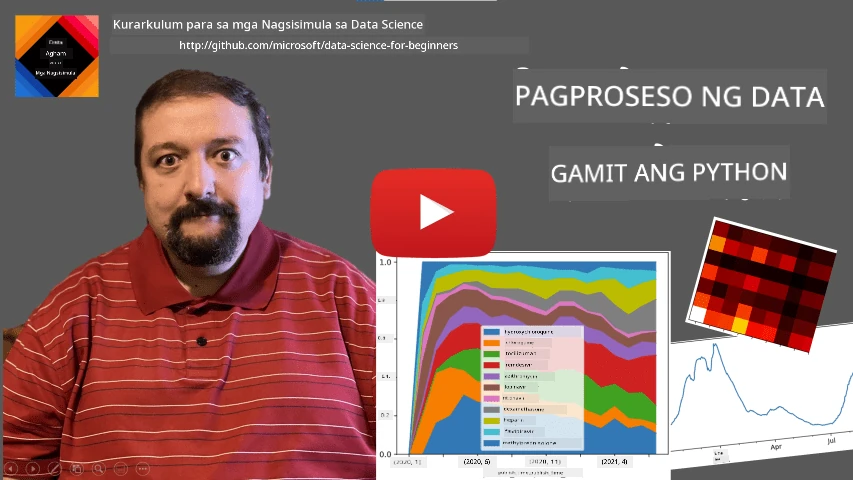
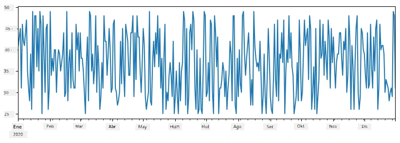
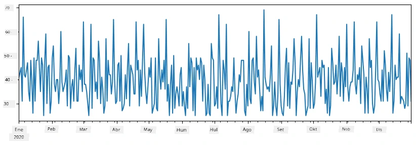
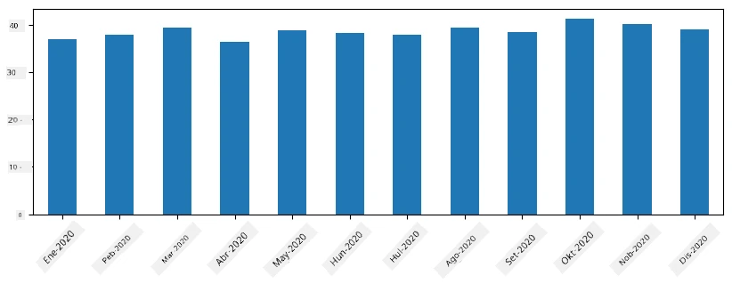
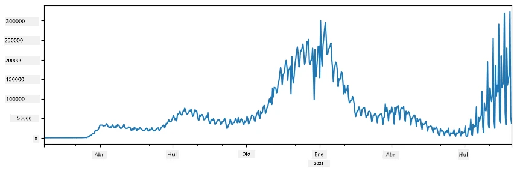

# Paggawa ng Trabaho sa Data: Python at ang Pandas Library

|  ](../../sketchnotes/07-WorkWithPython.png) |
| :-------------------------------------------------------------------------------------------------------: |
|                 Paggawa ng Trabaho sa Python - _Sketchnote ni [@nitya](https://twitter.com/nitya)_                 |

[](https://youtu.be/dZjWOGbsN4Y)

Habang ang mga database ay nag-aalok ng napakaepektibong mga paraan upang mag-imbak ng data at mag-query gamit ang mga query na wika, ang pinaka-mabisang paraan ng pagproseso ng data ay ang pagsusulat ng sarili mong programa upang manipulahin ang data. Sa maraming kaso, ang paggawa ng database query ay magiging mas epektibong paraan. Gayunpaman, sa ilang mga kaso kung kailan kailangan ang mas kumplikadong pagproseso ng data, hindi ito madaling magawa gamit ang SQL.
Ang pagproseso ng data ay maaaring i-program sa anumang programming language, ngunit may ilang mga wika na mas mataas ang antas pagdating sa pakikipagtrabaho sa data. Karaniwang pinipili ng mga data scientist ang isa sa mga sumusunod na wika:

* **[Python](https://www.python.org/)**, isang general-purpose programming language, na madalas itinuturing na isa sa mga pinakamahusay na opsyon para sa mga nagsisimula dahil sa pagiging simple nito. Maraming karagdagang mga library ang Python na makakatulong sa iyo na lutasin ang maraming praktikal na problema, tulad ng pagkuha ng iyong data mula sa ZIP archive, o pag-convert ng larawan sa grayscale. Bilang karagdagan sa data science, madalas ding ginagamit ang Python para sa web development.
* **[R](https://www.r-project.org/)** ay isang tradisyunal na toolbox na binuo para sa statistical na pagproseso ng data. Naglalaman din ito ng malaking repository ng mga library (CRAN), kaya ito ay magandang pagpipilian para sa pagproseso ng data. Gayunpaman, ang R ay hindi isang general-purpose programming language, at bihirang gamitin sa labas ng domain ng data science.
* **[Julia](https://julialang.org/)** ay isa pang wika na espesyal na binuo para sa data science. Layunin nitong magbigay ng mas magandang performance kaysa sa Python, kaya mahusay itong gamit para sa siyentipikong eksperimento.

Sa araling ito, tututok tayo sa paggamit ng Python para sa simpleng pagproseso ng data. Ipagpapalagay natin ang basic na pamilyaridad sa wika. Kung nais mo ng mas malalim na paglalakbay sa Python, maaari kang tumingin sa isa sa mga sumusunod na resources:

* [Matutunan ang Python sa Masayang Paraan gamit ang Turtle Graphics at Fractals](https://github.com/shwars/pycourse) - Mabilisang GitHub-based intro sa Python Programming
* [Simulan ang Iyong Mga Unang Hakbang sa Python](https://docs.microsoft.com/en-us/learn/paths/python-first-steps/?WT.mc_id=academic-77958-bethanycheum) Learning Path sa [Microsoft Learn](http://learn.microsoft.com/?WT.mc_id=academic-77958-bethanycheum)

Ang data ay maaaring dumating sa maraming anyo. Sa araling ito, pag-uusapan natin ang tatlong anyo ng data - **tabular data**, **teksto** at **mga larawan**.

Tututok tayo sa ilang mga halimbawa ng pagproseso ng data, sa halip na magbigay ng buong pangkalahatang ideya ng lahat ng kaugnay na mga library. Ito ay magpapahintulot sa iyo na makuha ang pangunahing ideya ng kung ano ang posible, at bibigyan ka ng pang-unawa kung saan hahanapin ang mga solusyon sa iyong mga problema kapag kailangan mo ito.

> **Pinaka-kapaki-pakinabang na payo**. Kapag kailangan mong magsagawa ng tiyak na operasyon sa data na hindi mo alam kung paano gawin, subukang maghanap nito sa internet. Karaniwan, maraming kapaki-pakinabang na sample na code sa Python para sa maraming tipikal na gawain sa [Stackoverflow](https://stackoverflow.com/).


## [Pre-lecture quiz](https://ff-quizzes.netlify.app/en/ds/quiz/12)

## Tabular Data at Dataframes

Nakilala mo na ang tabular data nang pinag-usapan natin ang relational databases. Kapag marami kang data, at ito ay nasa maraming magkakaugnay na mga talahanayan, tiyak na makatuwiran na gamitin ang SQL para gawin ang trabaho. Gayunpaman, maraming kaso kung kailan mayroon tayong isang talahanayan ng data, at kailangan nating magkaroon ng ilang **pag-unawa** o **insights** tungkol sa data na ito, tulad ng distribusyon, ugnayan ng mga halaga, at iba pa. Sa data science, maraming pagkakataon na kailangan nating magsagawa ng mga transformasyon sa orihinal na data, kasunod ang visualization. Parehong madaling gawin ang mga hakbang na ito gamit ang Python.

May dalawang pinaka-kapaki-pakinabang na mga library sa Python na makakatulong sa iyo sa paghawak ng tabular data:
* **[Pandas](https://pandas.pydata.org/)** ay nagbibigay-daan sa iyo upang manipulahin ang tinatawag na **Dataframes**, na katulad ng mga relational tables. Maaari kang magkaroon ng mga pangalan ng kolum, at magsagawa ng iba't ibang operasyon sa mga row, column, at mga dataframes sa pangkalahatan.
* **[Numpy](https://numpy.org/)** ay isang library para sa pakikipagtrabaho sa **tensors**, ibig sabihin ay multi-dimensional **arrays**. Ang array ay may mga halaga ng parehong uri, at ito ay mas simple kaysa sa dataframe, ngunit nag-aalok ng mas maraming matematikal na operasyon, at nagdudulot ng mas mababang overhead.

Mayroon ding ilang iba pang mga library na dapat mong malaman:
* **[Matplotlib](https://matplotlib.org/)** ay isang library na ginagamit para sa data visualization at pagguhit ng mga grap
* **[SciPy](https://www.scipy.org/)** ay isang library na may ilang karagdagang siyentipikong mga function. Nakilala na natin ang library na ito nang pag-usapan ang probabilidad at estadistika

Narito ang isang piraso ng code na karaniwang ginagamit upang i-import ang mga librariyang ito sa simula ng iyong Python na programa:
```python
import numpy as np
import pandas as pd
import matplotlib.pyplot as plt
from scipy import ... # kailangan mong tukuyin ang eksaktong sub-pakete na kailangan mo
``` 

Ang Pandas ay nakasentro sa ilang pangunahing konsepto.

### Series

**Series** ay isang sunud-sunod ng mga halaga, katulad ng listahan o numpy array. Ang pangunahing pagkakaiba ay ang series ay may isang **index**, at kapag nagpapatakbo tayo sa series (halimbawa, nagdaragdag), isinaalang-alang ang index. Ang index ay maaaring kasing-simpleng bilang ng hilera (ito ang default na index kapag gumawa ng series mula sa listahan o array), o maaari itong magkaroon ng mas kumplikadong istraktura, tulad ng interval ng petsa.

> **Tandaan**: May ilang panimulang Pandas na code sa kasamaang notebook [`notebook.ipynb`](notebook.ipynb). Dito ay inilalahad lamang ang ilan sa mga halimbawa, at malugod kang inaanyayahang tingnan ang buong notebook.

Isaalang-alang ang isang halimbawa: nais nating suriin ang mga benta ng ating ice-cream na lugar. Gumawa tayo ng series ng mga bilang ng benta (bilang ng mga item na naibenta bawat araw) para sa ilang panahon:

```python
start_date = "Jan 1, 2020"
end_date = "Mar 31, 2020"
idx = pd.date_range(start_date,end_date)
print(f"Length of index is {len(idx)}")
items_sold = pd.Series(np.random.randint(25,50,size=len(idx)),index=idx)
items_sold.plot()
```


Ngayon sabihin na bawat linggo ay nag-oorganisa tayo ng party para sa mga kaibigan, at kumukuha tayo ng dagdag na 10 pakete ng ice-cream para sa party. Maaari tayong gumawa ng isa pang series, na naka-index sa linggo, upang ipakita ito:
```python
additional_items = pd.Series(10,index=pd.date_range(start_date,end_date,freq="W"))
```
Kapag pinag-add natin ang dalawang series, makukuha natin ang kabuuang bilang:
```python
total_items = items_sold.add(additional_items,fill_value=0)
total_items.plot()
```


> **Tandaan** na hindi natin ginagamit ang simpleng syntax na `total_items+additional_items`. Kung ginawa natin iyon, makakatanggap tayo ng maraming `NaN` (*Not a Number*) na mga halaga sa resulta ng series. Ito ay dahil may mga nawawalang halaga para sa ilang index na puntos sa `additional_items` series, at kapag nagdagdag ng `NaN` sa anumang bagay ay nagreresulta ito sa `NaN`. Kaya kailangan nating tukuyin ang `fill_value` na parameter sa panahon ng pagdagdag.

Sa mga time series, maaari rin nating **i-resample** ang series gamit ang iba't ibang mga time interval. Halimbawa, sabihin na nais nating kalkulahin ang mean na dami ng benta buwan-buwan. Maaari nating gamitin ang sumusunod na code:
```python
monthly = total_items.resample("1M").mean()
ax = monthly.plot(kind='bar')
```


### DataFrame

Ang DataFrame ay isang koleksyon ng mga series na may parehong index. Maaari nating pagsamahin ang ilang mga series sa isang DataFrame:
```python
a = pd.Series(range(1,10))
b = pd.Series(["I","like","to","play","games","and","will","not","change"],index=range(0,9))
df = pd.DataFrame([a,b])
```
Ito ay gagawa ng isang horizontal na talahanayan na ganito:
|     | 0   | 1    | 2   | 3   | 4      | 5   | 6      | 7    | 8    |
| --- | --- | ---- | --- | --- | ------ | --- | ------ | ---- | ---- |
| 0   | 1   | 2    | 3   | 4   | 5      | 6   | 7      | 8    | 9    |
| 1   | I   | like | to  | use | Python | and | Pandas | very | much |

Maaari rin nating gamitin ang Series bilang mga kolum, at tukuyin ang mga pangalan ng kolum gamit ang diksyunaryo:
```python
df = pd.DataFrame({ 'A' : a, 'B' : b })
```
Ito ay magbibigay sa atin ng isang talahanayan na ganito:

|     | A   | B      |
| --- | --- | ------ |
| 0   | 1   | I      |
| 1   | 2   | like   |
| 2   | 3   | to     |
| 3   | 4   | use    |
| 4   | 5   | Python |
| 5   | 6   | and    |
| 6   | 7   | Pandas |
| 7   | 8   | very   |
| 8   | 9   | much   |

**Tandaan** na maaari rin nating makuha ang layout ng talahanayang ito sa pamamagitan ng pag-transpose ng naunang talahanayan, halimbawa sa pagsusulat ng 
```python
df = pd.DataFrame([a,b]).T.rename(columns={ 0 : 'A', 1 : 'B' })
```
Dito ang `.T` ay nangangahulugang operasyon ng pag-transpose ng DataFrame, ibig sabihin ang pagpapalit ng mga hilera at kolum, at ang `rename` na operasyon ay nagpapahintulot sa atin na palitan ang pangalan ng mga kolum upang tumugma sa naunang halimbawa.

Narito ang ilang mga pinaka-mahalagang operasyon na maaari nating gawin sa DataFrames:

**Pagpili ng kolum**. Maaari tayong pumili ng indibidwal na kolum sa pamamagitan ng pagsusulat ng `df['A']` - ang operasyong ito ay nagbabalik ng isang Series. Maaari rin tayong pumili ng subset ng mga kolum papunta sa isa pang DataFrame sa pamamagitan ng pagsusulat ng `df[['B','A']]` - ito ay nagbabalik ng isa pang DataFrame.

**Pag-filter** lamang ng ilang mga hilera ayon sa mga pamantayan. Halimbawa, upang mapanatili lamang ang mga hilera kung saan ang kolum `A` ay mas malaki sa 5, maaari nating isulat ang `df[df['A']>5]`.

> **Tandaan**: Ang paraan ng pag-filter ay ang sumusunod. Ang expression na `df['A']<5` ay nagbabalik ng boolean series, na nagsasaad kung ang expression ay `True` o `False` para sa bawat elemento ng orihinal na series `df['A']`. Kapag ginamit ang boolean series bilang index, ibinabalik nito ang subset ng mga hilera sa DataFrame. Kaya hindi pwedeng gumamit ng arbitrary Python boolean expression, halimbawa ang pagsusulat ng `df[df['A']>5 and df['A']<7]` ay mali. Sa halip, dapat gamitin ang espesyal na `&` na operasyon sa boolean series, isusulat ang `df[(df['A']>5) & (df['A']<7)]` (*mahalaga ang mga panaklong dito*).

**Paglikha ng mga bagong computable na kolum**. Madali tayong makalikha ng mga bagong computable na kolum para sa ating DataFrame gamit ang intuitive na expression tulad nito:
```python
df['DivA'] = df['A']-df['A'].mean() 
``` 
Ang halimbawang ito ay nagkalkula ng divergence ng A mula sa mean value nito. Ang tunay na nangyayari dito ay kinukwenta natin ang isang series, at pagkatapos ay iniaassign ang series na ito sa kaliwang bahagi, na lumilikha ng isa pang kolum. Kaya hindi natin pwedeng gamitin ang mga operasyon na hindi compatible sa series, halimbawa, ang code sa ibaba ay mali:
```python
# Mali na code -> df['ADescr'] = "Mababa" kung ang df['A'] < 5 kung hindi naman ay "Mataas"
df['LenB'] = len(df['B']) # <- Maling resulta
``` 
Ang huling halimbawa, bagama't tama ang sintaks, ay nagbibigay ng maling resulta, dahil inaassign nito ang haba ng series `B` sa lahat ng halaga sa kolum, at hindi ang haba ng bawat indibidwal na elemento gaya ng ating nilayon.

Kung kailangan nating magcompute ng mga kumplikadong expression tulad nito, maaari nating gamitin ang function na `apply`. Ang huling halimbawa ay maaaring isulat tulad ng sumusunod:
```python
df['LenB'] = df['B'].apply(lambda x : len(x))
# o
df['LenB'] = df['B'].apply(len)
```

Pagkatapos ng mga operasyon sa itaas, makakakuha tayo ng sumusunod na DataFrame:

|     | A   | B      | DivA | LenB |
| --- | --- | ------ | ---- | ---- |
| 0   | 1   | I      | -4.0 | 1    |
| 1   | 2   | like   | -3.0 | 4    |
| 2   | 3   | to     | -2.0 | 2    |
| 3   | 4   | use    | -1.0 | 3    |
| 4   | 5   | Python | 0.0  | 6    |
| 5   | 6   | and    | 1.0  | 3    |
| 6   | 7   | Pandas | 2.0  | 6    |
| 7   | 8   | very   | 3.0  | 4    |
| 8   | 9   | much   | 4.0  | 4    |

**Pagpili ng mga hilera base sa mga numero** ay maaaring gawin gamit ang `iloc` na konstruksyon. Halimbawa, upang pumili ng unang 5 hilera mula sa DataFrame:
```python
df.iloc[:5]
```

**Pagrupo** ay madalas gamitin upang makakuha ng resulta na katulad ng *pivot tables* sa Excel. Sabihin na nais nating kalkulahin ang mean na halaga ng kolum `A` para sa bawat bilang ng `LenB`. Maaari nating i-group ang ating DataFrame sa pamamagitan ng `LenB`, at tawagin ang `mean`:
```python
df.groupby(by='LenB')[['A','DivA']].mean()
```
Kung kailangan nating kalkulahin ang mean at bilang ng mga elemento sa grupo, maaari nating gamitin ang mas kumplikadong `aggregate` function:
```python
df.groupby(by='LenB') \
 .aggregate({ 'DivA' : len, 'A' : lambda x: x.mean() }) \
 .rename(columns={ 'DivA' : 'Count', 'A' : 'Mean'})
```
Ito ay nagbibigay sa atin ng sumusunod na talahanayan:

| LenB | Count | Mean     |
| ---- | ----- | -------- |
| 1    | 1     | 1.000000 |
| 2    | 1     | 3.000000 |
| 3    | 2     | 5.000000 |
| 4    | 3     | 6.333333 |
| 6    | 2     | 6.000000 |

### Pagkuha ng Data


Nakita na natin kung gaano kadaling bumuo ng Series at DataFrames mula sa mga Python na bagay. Gayunpaman, karaniwan ang data ay nanggagaling sa anyo ng text file, o Excel table. Sa kabutihang-palad, nag-aalok ang Pandas ng isang simpleng paraan upang mag-load ng data mula sa disk. Halimbawa, ang pagbabasa ng CSV file ay kasing dali nito:
```python
df = pd.read_csv('file.csv')
```
Makikita natin ang higit pang mga halimbawa ng pag-load ng data, kabilang ang pagkuha nito mula sa mga panlabas na website, sa seksyong "Challenge"


### Pag-print at Pag-plot

Madalas kailangan ng isang Data Scientist na siyasatin ang data, kaya mahalagang makita ito nang biswal. Kapag malaki ang DataFrame, kadalasan gusto lang nating siguraduhin na tama ang ginagawa natin sa pamamagitan ng pag-print ng unang ilang mga hilera. Magagawa ito sa pamamagitan ng pagtawag sa `df.head()`. Kung isinasagawa mo ito mula sa Jupyter Notebook, ipo-print nito ang DataFrame sa magandang tabular na anyo.

Nakita rin natin ang paggamit ng `plot` function upang i-visualize ang ilang column. Habang napaka-kapaki-pakinabang ng `plot` para sa maraming gawain, at sinusuportahan ang maraming iba't ibang uri ng graph sa pamamagitan ng parameter na `kind=`, palagi kang maaaring gumamit ng raw `matplotlib` library upang mag-plot ng mas kumplikadong bagay. Tatalakayin natin nang detalyado ang data visualization sa hiwalay na mga aralin.

Sinasaklaw ng overview na ito ang pinakamahalagang mga konsepto ng Pandas, gayunpaman, napakayaman ng library, at walang hangganan sa maaari mong gawin dito! Ngayon ay ilalapat natin ang kaalaman na ito para lutasin ang isang espesipikong problema.

## 🚀 Hamon 1: Pagsusuri ng Pagkalat ng COVID

Ang unang problema na tututukan natin ay ang pagmomodelo ng pagkalat ng epidemya ng COVID-19. Upang magawa iyon, gagamitin natin ang data ng bilang ng mga nahawaang indibidwal sa iba't ibang bansa, na ibinibigay ng [Center for Systems Science and Engineering](https://systems.jhu.edu/) (CSSE) sa [Johns Hopkins University](https://jhu.edu/). Available ang dataset sa [GitHub Repository na ito](https://github.com/CSSEGISandData/COVID-19).

Dahil nais nating ipakita kung paano harapin ang data, iniimbitahan ka naming buksan ang [`notebook-covidspread.ipynb`](notebook-covidspread.ipynb) at basahin ito mula sa simula hanggang dulo. Maaari mo ring patakbuhin ang mga cell, at gawan ang ilang mga hamon na iniwan namin para sa iyo sa dulo.



> Kung hindi mo alam kung paano patakbuhin ang code sa Jupyter Notebook, tingnan ang [artikulong ito](https://soshnikov.com/education/how-to-execute-notebooks-from-github/).

## Paggawa sa Hindi Istrakturadong Data

Bagaman madalas na dumarating ang data sa tabular na anyo, sa ilang mga kaso kailangan nating harapin ang hindi gaanong istrakturadong data, halimbawa, teksto o mga larawan. Sa kasong ito, upang magamit ang mga teknik sa pagproseso ng data na nakita natin sa itaas, kailangan nating **kunin** ang istrakturadong data. Narito ang ilang mga halimbawa:

* Pagkuha ng mga keyword mula sa teksto, at pagtingin kung gaano kadalas lumalabas ang mga keyword na iyon
* Paggamit ng mga neural network upang kunin ang impormasyon tungkol sa mga bagay sa larawan
* Pagkuha ng impormasyon tungkol sa mga emosyon ng mga tao sa video camera feed

## 🚀 Hamon 2: Pagsusuri ng mga Papel tungkol sa COVID

Sa hamong ito, ipagpapatuloy natin ang paksa ng pandemya ng COVID, at tututok sa pagproseso ng mga makabagong papel tungkol sa paksang ito. Mayroong [CORD-19 Dataset](https://www.kaggle.com/allen-institute-for-ai/CORD-19-research-challenge) na naglalaman ng higit sa 7000 (sa oras ng pagsulat) na mga papel tungkol sa COVID, kasama ang metadata at mga abstrakto (at para sa halos kalahati nito ay mayroong buong teksto rin).

Isang kompletong halimbawa ng pagsusuri sa dataset na ito gamit ang [Text Analytics for Health](https://docs.microsoft.com/azure/cognitive-services/text-analytics/how-tos/text-analytics-for-health/?WT.mc_id=academic-77958-bethanycheum) cognitive service ay inilalarawan [sa blog post na ito](https://soshnikov.com/science/analyzing-medical-papers-with-azure-and-text-analytics-for-health/). Tatalakayin natin ang pinasimpleng bersyon ng pagsusuring ito.

> **NOTE**: Hindi namin ibinibigay ang kopya ng dataset bilang bahagi ng repositoryong ito. Kailangan mo munang i-download ang [`metadata.csv`](https://www.kaggle.com/allen-institute-for-ai/CORD-19-research-challenge?select=metadata.csv) na file mula [sa dataset na ito sa Kaggle](https://www.kaggle.com/allen-institute-for-ai/CORD-19-research-challenge). Maaaring kinakailangan ang pagpaparehistro sa Kaggle. Maaari mo ring i-download ang dataset nang hindi nagrerehistro [mula dito](https://ai2-semanticscholar-cord-19.s3-us-west-2.amazonaws.com/historical_releases.html), ngunit kasama dito ang lahat ng buong teksto maliban sa metadata file.

Buksan ang [`notebook-papers.ipynb`](notebook-papers.ipynb) at basahin ito mula sa taas hanggang baba. Maaari mo ring patakbuhin ang mga cell, at gawan ang ilang mga hamon na iniwan namin para sa iyo sa dulo.


## Pagproseso ng Data ng Larawan

Kamakailan, nakabuo ng napakalakas na mga modelo ng AI na nagpapahintulot sa atin na maintindihan ang mga larawan. Maraming mga gawain ang maaaring malutas gamit ang mga pre-trained neural networks, o cloud services. Ilan sa mga halimbawa ay:

* **Image Classification**, na makakatulong sa iyong i-categorize ang larawan sa isa sa mga pre-defined na klase. Madali kang makakapagsanay ng sarili mong mga image classifier gamit ang mga serbisyo tulad ng [Custom Vision](https://azure.microsoft.com/services/cognitive-services/custom-vision-service/?WT.mc_id=academic-77958-bethanycheum)
* **Object Detection** upang matukoy ang iba't ibang mga bagay sa larawan. Ang mga serbisyo gaya ng [computer vision](https://azure.microsoft.com/services/cognitive-services/computer-vision/?WT.mc_id=academic-77958-bethanycheum) ay makakapagtukoy ng maraming karaniwang bagay, at maaari kang magsanay ng modelong [Custom Vision](https://azure.microsoft.com/services/cognitive-services/custom-vision-service/?WT.mc_id=academic-77958-bethanycheum) upang matukoy ang ilang partikular na mga bagay na interes.
* **Face Detection**, kabilang ang pagtukoy ng Edad, Kasarian at Emosyon. Magagawa ito gamit ang [Face API](https://azure.microsoft.com/services/cognitive-services/face/?WT.mc_id=academic-77958-bethanycheum).

Lahat ng mga serbisyong ito sa cloud ay maaaring tawagin gamit ang [Python SDKs](https://docs.microsoft.com/samples/azure-samples/cognitive-services-python-sdk-samples/cognitive-services-python-sdk-samples/?WT.mc_id=academic-77958-bethanycheum), kaya madali silang maisasama sa iyong workflow ng pag-explore ng data.

Narito ang ilang mga halimbawa ng pag-explore ng data mula sa mga pinagkukunan ng Image data:
* Sa blog post na [How to Learn Data Science without Coding](https://soshnikov.com/azure/how-to-learn-data-science-without-coding/) sinusuri namin ang mga larawan sa Instagram, sinusubukang maunawaan kung ano ang nagtutulak sa mga tao na magbigay ng higit pang likes sa isang larawan. Una naming kinukuha ang maraming impormasyon mula sa mga larawan gamit ang [computer vision](https://azure.microsoft.com/services/cognitive-services/computer-vision/?WT.mc_id=academic-77958-bethanycheum), pagkatapos ay ginagamit ang [Azure Machine Learning AutoML](https://docs.microsoft.com/azure/machine-learning/concept-automated-ml/?WT.mc_id=academic-77958-bethanycheum) upang bumuo ng interpretable na modelo.
* Sa [Facial Studies Workshop](https://github.com/CloudAdvocacy/FaceStudies) ginagamit namin ang [Face API](https://azure.microsoft.com/services/cognitive-services/face/?WT.mc_id=academic-77958-bethanycheum) upang kunin ang mga emosyon ng tao sa mga larawan mula sa mga kaganapan, upang subukang maunawaan kung ano ang nagpapasaya sa mga tao.

## Konklusyon

Kahit mayroon ka nang istrakturadong o hindi istrakturadong data, gamit ang Python maaari mong gawin ang lahat ng hakbang na may kaugnayan sa pagproseso at pag-unawa sa data. Marahil ito ang pinaka flexible na paraan ng pagproseso ng data, at ito ang dahilan kung bakit karamihan sa mga data scientist ay gumagamit ng Python bilang pangunahing kasangkapan nila. Ang pag-aaral ng Python nang malalim ay marahil isang magandang ideya kung seryoso ka sa iyong paglalakbay sa data science!

## [Post-lecture quiz](https://ff-quizzes.netlify.app/en/ds/quiz/13)

## Pagsusuri at Sariling Pag-aaral

**Mga Aklat**
* [Wes McKinney. Python for Data Analysis: Data Wrangling with Pandas, NumPy, and IPython](https://www.amazon.com/gp/product/1491957662)

**Mga Online na Mapagkukunan**
* Opisyal na [10 minutes to Pandas](https://pandas.pydata.org/pandas-docs/stable/user_guide/10min.html) na tutorial
* [Dokumentasyon tungkol sa Pandas Visualization](https://pandas.pydata.org/pandas-docs/stable/user_guide/visualization.html)

**Pag-aaral ng Python**
* [Matuto ng Python sa Masayang Paraan gamit ang Turtle Graphics at Fractals](https://github.com/shwars/pycourse)
* [Umpisahan ang Iyong Unang Hakbang sa Python](https://docs.microsoft.com/learn/paths/python-first-steps/?WT.mc_id=academic-77958-bethanycheum) Learning Path sa [Microsoft Learn](http://learn.microsoft.com/?WT.mc_id=academic-77958-bethanycheum)

## Takdang Aralin

[Gumawa ng mas detalyadong pag-aaral ng data para sa mga hamon sa itaas](assignment.md)

## Mga Pinagmulan

Ang araling ito ay isinulat nang may ♥️ ni [Dmitry Soshnikov](http://soshnikov.com)

---

<!-- CO-OP TRANSLATOR DISCLAIMER START -->
**Pagtatanggi**:
Ang dokumentong ito ay isinalin gamit ang serbisyo ng AI translation na [Co-op Translator](https://github.com/Azure/co-op-translator). Bagama't nagsusumikap kami para sa katumpakan, pakatandaan na ang awtomatikong pagsasalin ay maaaring maglaman ng mga pagkakamali o hindi pagkakatugma. Ang orihinal na dokumento sa orihinal nitong wika ang dapat ituring na pangunahing sanggunian. Para sa mahahalagang impormasyon, inirerekomenda ang propesyonal na pagsasalin ng tao. Hindi kami mananagot sa anumang maling pagkakaintindi o maling interpretasyon na nagmula sa paggamit ng pagsasaling ito.
<!-- CO-OP TRANSLATOR DISCLAIMER END -->