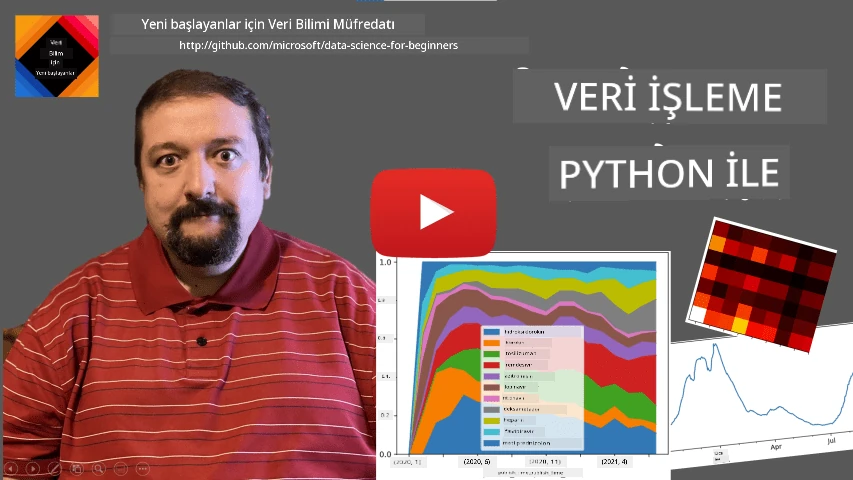
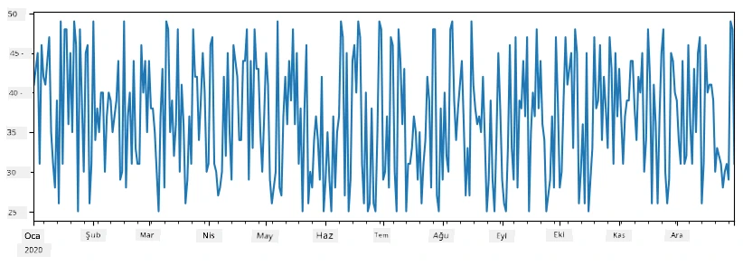
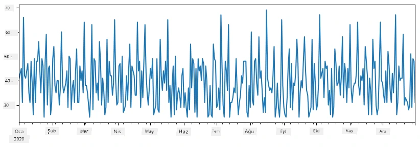
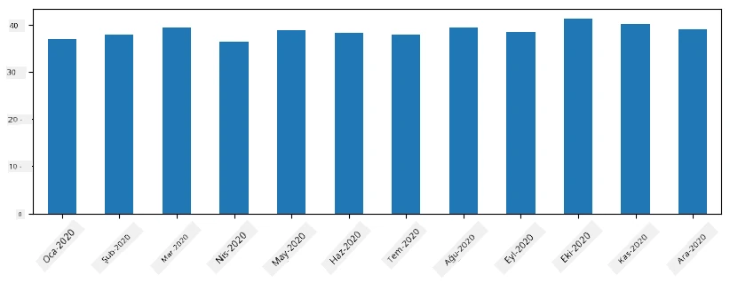
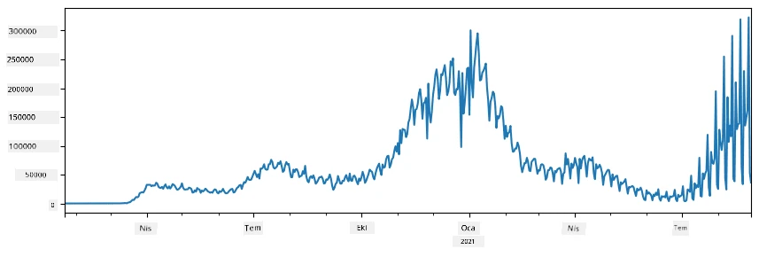
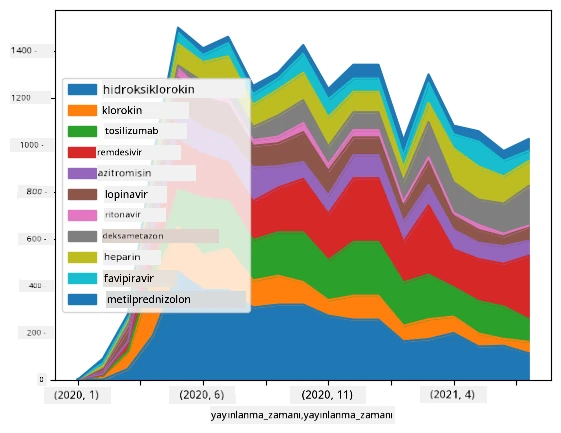

# Veri ile Çalışmak: Python ve Pandas Kütüphanesi

|  ](../../sketchnotes/07-WorkWithPython.png) |
| :-------------------------------------------------------------------------------------------------------: |
|                  Python ile Çalışmak - _Sketchnote by [@nitya](https://twitter.com/nitya)_                  |

[](https://youtu.be/dZjWOGbsN4Y)

Veritabanları verileri depolamak ve sorgulama dilleri kullanarak bunlara sorgular yapmak için çok verimli yollar sunarken, veriyi işlemek için en esnek yol kendi programınızı yazarak veriyi manipüle etmektir. Birçok durumda, veritabanı sorgusu yapmak daha etkili bir yol olabilir. Ancak, daha karmaşık veri işleme gerektiğinde, bu SQL kullanılarak kolayca yapılamaz.
Veri işleme herhangi bir programlama dilinde programlanabilir, ancak veriyle çalışmak açısından daha üst düzey bazı diller vardır. Veri bilimciler tipik olarak aşağıdaki dillerden birini tercih ederler:

* **[Python](https://www.python.org/)**, genel amaçlı bir programlama dili olup, basitliği nedeniyle genellikle yeni başlayanlar için en iyi seçeneklerden biri olarak kabul edilir. Python, ZIP arşivinden veri çıkarma veya resmi gri tonlamaya dönüştürme gibi birçok pratik problemi çözmenize yardımcı olabilecek birçok ek kütüphane içerir. Veri biliminin yanı sıra, Python web geliştirme için de sıkça kullanılır.
* **[R](https://www.r-project.org/)**, istatistiksel veri işleme düşünülerek geliştirilmiş klasik bir araç kutusudur. Ayrıca çok sayıda kütüphane deposu (CRAN) içerir ve bu yüzden veri işleme için iyi bir seçimdir. Ancak R genel amaçlı bir programlama dili değildir ve veri bilimi alanı dışında nadiren kullanılır.
* **[Julia](https://julialang.org/)**, özellikle veri bilimi için geliştirilmiş başka bir dildir. Python’dan daha iyi performans vermesi hedeflenmiştir ve bilimsel deneyler için mükemmel bir araçtır.

Bu derste, basit veri işleme için Python üzerine odaklanacağız. Dil hakkında temel bir tanıdıklık varsayacağız. Daha derin bir Python turu isterseniz, aşağıdaki kaynaklardan birine başvurabilirsiniz:

* [Kuru Baskı, Sürüngen Grafikler ve Fraktaller ile Eğlenceli Python Öğrenimi](https://github.com/shwars/pycourse) - GitHub tabanlı hızlı Python programlama tanıtım kursu
* [Python ile İlk Adımlarınızı Atın](https://docs.microsoft.com/en-us/learn/paths/python-first-steps/?WT.mc_id=academic-77958-bethanycheum) Microsoft Learn’daki Öğrenme Yolu

Veriler birçok biçimde olabilir. Bu derste, üç veri biçimini ele alacağız - **tablo verisi**, **metin** ve **resimler**.

İlgili tüm kütüphanelerin tam bir genel bakışını vermek yerine, birkaç veri işleme örneğine odaklanacağız. Bu size mümkün olanların ana fikrini verecek ve gerektiğinde problemlerinize çözüm bulmanız için nerelere bakacağınızı anlamanızı sağlayacaktır.

> **En yararlı tavsiye**. Veride gerçekleştirmek istediğiniz ancak nasıl yapacağınızı bilmediğiniz bir işlem olduğunda, internetten arama yapmayı deneyin. [Stackoverflow](https://stackoverflow.com/) genellikle birçok tipik görev için Python’da çok sayıda faydalı kod örneği içerir.


## [Derse Hazırlık Quiz'i](https://ff-quizzes.netlify.app/en/ds/quiz/12)

## Tablo Verileri ve Dataframe'ler

İlişkisel veritabanlarından bahsederken tablo verileriyle zaten tanışmıştık. Çok fazla veriniz varsa ve bunlar birçok farklı bağlı tabloda yer alıyorsa, SQL kullanmak kesinlikle mantıklıdır. Ancak birçok durumda elimizde bir tablo veri vardır ve bu veri hakkında dağılım, değerler arasındaki korelasyon gibi **anlama** veya **içgörü** elde etmemiz gerekir. Veri biliminde, orijinal verinin bazı dönüşümlerinin yapılması ve sonrasında görselleştirilmesi gereken çok durum vardır. Bu adımların ikisi de Python kullanılarak kolayca yapılabilir.

Python’da tablo verisiyle çalışmanıza yardımcı olan iki çok kullanışlı kütüphane vardır:
* **[Pandas](https://pandas.pydata.org/)**, ilişkisel tablolara benzer şekilde adlandırılmış sütunları olan ve satır, sütun ve dataframe üzerinde farklı işlemler yapmanızı sağlayan **Dataframe** adı verilen veri yapılarını manipüle etmenizi sağlar.
* **[Numpy](https://numpy.org/)**, yani çok boyutlu **diziler** üzerinde çalışmak için kullanılan bir kütüphanedir. Dizi aynı türdeki değerlere sahiptir ve dataframe’den daha basittir, ancak daha fazla matematiksel işlem sunar ve daha az yük getirir.

Ayrıca bilmeniz gereken birkaç başka kütüphane vardır:
* **[Matplotlib](https://matplotlib.org/)**, veri görselleştirme ve grafik çizimi için kullanılan bir kütüphanedir
* **[SciPy](https://www.scipy.org/)** ilave bazı bilimsel fonksiyonların bulunduğu bir kütüphanedir. Olasılık ve istatistik hakkında konuşurken bu kütüphaneyle daha önce karşılaşmıştık.

İşte bu kütüphaneleri Python programınızın başında tipik olarak içe aktarmak için kullanacağınız bir kod parçası:
```python
import numpy as np
import pandas as pd
import matplotlib.pyplot as plt
from scipy import ... # ihtiyacınız olan belirli alt paketleri belirtmeniz gerekir
``` 

Pandas birkaç temel kavram etrafında yoğunlaşır.

### Series 

**Series**, bir liste veya numpy dizisine benzeyen bir değer dizisidir. Ana fark, serinin ayrıca bir **indeksi** olmasıdır ve seriler üzerinde işlem yaparken (örneğin, toplama) indeks dikkate alınır. İndeks basit bir tam sayı satır numarası olabilir (liste veya diziden seri oluşturulduğunda varsayılan olarak kullanılan indeks budur) veya tarih aralığı gibi karmaşık bir yapıya sahip olabilir.

> **Not**: Eşlik eden defterde [`notebook.ipynb`](notebook.ipynb) bazı giriş düzeyinde Pandas kodları bulunmaktadır. Burada sadece bazı örnekleri ele alıyoruz ve tam defteri kesinlikle incelemeniz önerilir.

Örnek olarak düşünelim: dondurma dükkanımızın satışlarını analiz etmek istiyoruz. Bazı zaman aralıkları için satış sayıları dizisi (her gün satılan ürün sayısı) oluşturalım:

```python
start_date = "Jan 1, 2020"
end_date = "Mar 31, 2020"
idx = pd.date_range(start_date,end_date)
print(f"Length of index is {len(idx)}")
items_sold = pd.Series(np.random.randint(25,50,size=len(idx)),index=idx)
items_sold.plot()
```


Şimdi diyelim ki her hafta arkadaşlar için bir parti düzenliyoruz ve parti için ekstra 10 paket dondurma alıyoruz. Bunu göstermek için hafta bazında indekslenmiş başka bir seri oluşturabiliriz:
```python
additional_items = pd.Series(10,index=pd.date_range(start_date,end_date,freq="W"))
```
İki seriyi topladığımızda toplam sayıyı elde ederiz:
```python
total_items = items_sold.add(additional_items,fill_value=0)
total_items.plot()
```


> **Not** basit `total_items+additional_items` sözdizimini kullanmıyoruz. Eğer kullansaydık, oluşan seride çok sayıda `NaN` (*Sayısal Değil*) değeri olurdu. Çünkü `additional_items` serisinde bazı indeks noktaları için değerler eksik ve `NaN` herhangi bir değere eklendiğinde sonuç `NaN` olur. Dolayısıyla toplamada `fill_value` parametresini belirtmemiz gerekir.

Zaman serileri ile, farklı zaman aralıklarında seriyi **yeni örneklem** ile yeniden oluşturabiliriz. Örneğin, aylık ortalama satış hacmini hesaplamak isteyelim. Aşağıdaki kodu kullanabiliriz:
```python
monthly = total_items.resample("1M").mean()
ax = monthly.plot(kind='bar')
```


### DataFrame

Bir DataFrame temelde aynı indekse sahip bir seri koleksiyonudur. Birkaç seriyi birleştirip bir DataFrame oluşturabiliriz:
```python
a = pd.Series(range(1,10))
b = pd.Series(["I","like","to","play","games","and","will","not","change"],index=range(0,9))
df = pd.DataFrame([a,b])
```
Bu yatay bir tablo oluşturacaktır:
|     | 0   | 1    | 2   | 3   | 4      | 5   | 6      | 7    | 8    |
| --- | --- | ---- | --- | --- | ------ | --- | ------ | ---- | ---- |
| 0   | 1   | 2    | 3   | 4   | 5      | 6   | 7      | 8    | 9    |
| 1   | I   | like | to  | use | Python | and | Pandas | very | much |

Serileri sütun olarak da kullanabilir ve sözlük kullanarak sütun isimlerini belirtebiliriz:
```python
df = pd.DataFrame({ 'A' : a, 'B' : b })
```
Bu şu şekilde bir tablo oluşturur:

|     | A   | B      |
| --- | --- | ------ |
| 0   | 1   | I      |
| 1   | 2   | like   |
| 2   | 3   | to     |
| 3   | 4   | use    |
| 4   | 5   | Python |
| 5   | 6   | and    |
| 6   | 7   | Pandas |
| 7   | 8   | very   |
| 8   | 9   | much   |

**Not** önceki tabloyu transpoze ederek (satır ve sütunları değiştirerek) bu tablo düzenini de alabilirsiniz, örneğin:
```python
df = pd.DataFrame([a,b]).T.rename(columns={ 0 : 'A', 1 : 'B' })
```
Burada `.T` DataFrame’in transpoze işlemini, yani satırlar ile sütunların yer değiştirmesini temsil eder ve `rename` işlemi sütun isimlerini önceki örnekle eşleştirir.

DataFrame üzerinde yapabileceğimiz birkaç önemli işlem şunlardır:

**Sütun seçimi**. `df['A']` yazarak bireysel sütun seçebiliriz - bu işlem bir Seri döndürür. `df[['B','A']]` yazarak birkaç sütunun alt kümesini başka bir DataFrame olarak seçebiliriz.

**Sadece belirli satırların filtrelenmesi** kriterlere göre yapılabilir. Örneğin, `A` sütunu 5'ten büyük olan satırları bırakmak için `df[df['A']>5]` yazabiliriz.

> **Not**: Filtreleme şu şekilde çalışır. `df['A']<5` ifadesi, orijinal seri `df['A']`nin her elemanı için ifadenin `True` ya da `False` olduğunu gösteren bir boolean serisi döndürür. Boolean serisi indeks olarak kullanıldığında, DataFrame'de satırların bir alt kümesini döndürür. Bu yüzden `df[df['A']>5 and df['A']<7]` gibi rastgele Python boolean ifadeleri kullanmak yanlış olur. Bunun yerine boolean seriler üzerinde özel `&` işlemini kullanmalısınız, örneğin `df[(df['A']>5) & (df['A']<7)]` (*parantezler burada önemlidir*).

**Yeni hesaplanabilir sütunlar oluşturma**. Bu ifade gibi sezgisel ifadeler kullanarak DataFrame için kolayca yeni hesaplanabilir sütunlar oluşturabiliriz:
```python
df['DivA'] = df['A']-df['A'].mean() 
``` 
Bu örnek, A'nın ortalama değerinden sapmasını hesaplar. Aslında burada yaptığımız bir seri hesaplamak ve sonra bu seriyi sol tarafa atayarak başka bir sütun oluşturmaktır. Bu nedenle seri ile uyumlu olmayan işlemleri kullanamayız, örneğin aşağıdaki kod yanlıştır:
```python
# Yanlış kod -> df['ADescr'] = "Low" if df['A'] < 5 else "Hi"
df['LenB'] = len(df['B']) # <- Yanlış sonuç
``` 
Sonraki örnek, sözdizimi açısından doğru olmasına rağmen yanlış sonuç verir çünkü bunu yapmak yerine `B` serisinin uzunluğunu tüm sütun değerlerine atar, istediğimiz gibi her bireysel elemanın uzunluğunu değil.

Eğer böyle karmaşık ifadeler hesaplamamız gerekirse, `apply` fonksiyonunu kullanabiliriz. Son örnek şu şekilde yazılabilir:
```python
df['LenB'] = df['B'].apply(lambda x : len(x))
# veya
df['LenB'] = df['B'].apply(len)
```

Yukarıdaki işlemlerden sonra aşağıdaki DataFrame'e sahip oluruz:

|     | A   | B      | DivA | LenB |
| --- | --- | ------ | ---- | ---- |
| 0   | 1   | I      | -4.0 | 1    |
| 1   | 2   | like   | -3.0 | 4    |
| 2   | 3   | to     | -2.0 | 2    |
| 3   | 4   | use    | -1.0 | 3    |
| 4   | 5   | Python | 0.0  | 6    |
| 5   | 6   | and    | 1.0  | 3    |
| 6   | 7   | Pandas | 2.0  | 6    |
| 7   | 8   | very   | 3.0  | 4    |
| 8   | 9   | much   | 4.0  | 4    |

**Sayıya göre satır seçimi**, `iloc` yapısı kullanılarak yapılabilir. Örneğin, DataFrame’den ilk 5 satırı seçmek için:
```python
df.iloc[:5]
```

**Gruplama** genellikle Excel’deki *pivot tablolar* benzeri sonuç almak için kullanılır. Diyelim ki her bir `LenB` değeri için `A` sütununun ortalama değerini hesaplamak istiyoruz. O zaman DataFrame’imizi `LenB` ile gruplayıp `mean` fonksiyonunu çağırabiliriz:
```python
df.groupby(by='LenB')[['A','DivA']].mean()
```
Eğer grup içinde ortalama ve eleman sayısını hesaplamamız gerekiyorsa, daha karmaşık `aggregate` fonksiyonunu kullanabiliriz:
```python
df.groupby(by='LenB') \
 .aggregate({ 'DivA' : len, 'A' : lambda x: x.mean() }) \
 .rename(columns={ 'DivA' : 'Count', 'A' : 'Mean'})
```
Bize şu tabloyu verir:

| LenB | Count | Mean     |
| ---- | ----- | -------- |
| 1    | 1     | 1.000000 |
| 2    | 1     | 3.000000 |
| 3    | 2     | 5.000000 |
| 4    | 3     | 6.333333 |
| 6    | 2     | 6.000000 |

### Veri Alma


Seriler ve Veri Çerçevelerini Python nesnelerinden oluşturmanın ne kadar kolay olduğunu gördük. Ancak, veriler genellikle bir metin dosyası veya bir Excel tablosu biçiminde gelir. Neyse ki, Pandas verileri diskten yüklemek için bize basit bir yol sunar. Örneğin, CSV dosyasını okumak bu kadar basittir:
```python
df = pd.read_csv('file.csv')
```
Veri yükleme ile ilgili daha fazla örneği, dış web sitelerinden veri almayı da içeren "Challenge" bölümünde göreceğiz


### Yazdırma ve Grafik Çizme

Bir Veri Bilimcisi genellikle veriyi keşfetmek zorundadır, bu yüzden veriyi görselleştirebilmek önemlidir. DataFrame büyük olduğunda, çoğu zaman her şeyi doğru yaptığımızdan emin olmak için sadece ilk birkaç sırasını yazdırmak isteriz. Bu, `df.head()` çağrılarak yapılabilir. Jupyter Notebook'tan çalıştırıyorsanız, bu DataFrame'i güzel bir tablo biçiminde yazdıracaktır.

Bazı sütunları görselleştirmek için `plot` fonksiyonunun kullanımını da gördük. `plot` birçok görev için çok yararlıdır ve `kind=` parametresi aracılığıyla birçok farklı grafik türünü destekler, ancak her zaman daha karmaşık bir şeyi çizmek için ham `matplotlib` kütüphanesini kullanabilirsiniz. Veri görselleştirmeyi ayrı kurs derslerinde detaylı olarak ele alacağız.

Bu genel bakış Pandas'ın en önemli kavramlarını kapsamaktadır, ancak kütüphane çok zengindir ve onunla yapabileceklerinizin sınırı yoktur! Şimdi bu bilgiyi belirli bir problemi çözmek için uygulayalım.

## 🚀 Challenge 1: COVID Yayılımını Analiz Etme

Odaklanacağımız ilk problem COVID-19 salgınının yayılım modellemesidir. Bunu yapmak için, [Johns Hopkins Üniversitesi](https://jhu.edu/) bünyesindeki [Sistemler Bilimi ve Mühendisliği Merkezi](https://systems.jhu.edu/) (CSSE) tarafından sağlanan farklı ülkelerdeki enfekte bireylerin sayısı verilerini kullanacağız. Veri seti [bu GitHub Deposu](https://github.com/CSSEGISandData/COVID-19) üzerinden temin edilebilir.

Verilerle nasıl çalışılacağını göstermek istediğimiz için, [`notebook-covidspread.ipynb`](notebook-covidspread.ipynb) dosyasını açmanızı ve baştan sona okumanızı öneririz. Hücreleri çalıştırabilir ve sonunda sizin için bıraktığımız bazı zorlukları yapabilirsiniz.



> Jupyter Notebook'ta nasıl kod çalıştıracağınızı bilmiyorsanız, [bu makaleye](https://soshnikov.com/education/how-to-execute-notebooks-from-github/) göz atabilirsiniz.

## Yapılandırılmamış Veri ile Çalışmak

Veriler çok kez tabular biçimde gelir, ancak bazı durumlarda metin veya görüntü gibi daha az yapılandırılmış verilerle çalışmamız gerekir. Bu durumda, yukarıda gördüğümüz veri işleme tekniklerini uygulayabilmek için yapılandırılmış veriyi bir şekilde **çıkar**mamız gerekir. İşte birkaç örnek:

* Metinden anahtar kelimeleri çıkararak bu kelimelerin ne sıklıkta göründüğünü incelemek
* Görüntüdeki nesneler hakkında bilgi çıkarmak için sinir ağlarını kullanmak
* Video kamera görüntüsündeki kişilerin duyguları hakkında bilgi almak

## 🚀 Challenge 2: COVID Makalelerini Analiz Etme

Bu zorlukta, COVID pandemisi konusuna devam edeceğiz ve bu konuda bilimsel makalelerin işlenmesine odaklanacağız. COVID hakkında 7000’den fazla (yazım zamanı itibarıyla) makalenin meta verileri ve özetleri (yaklaşık yarısı için tam metin de sağlanmakta) ile birlikte mevcut olduğu [CORD-19 Veri Seti](https://www.kaggle.com/allen-institute-for-ai/CORD-19-research-challenge) bulunmaktadır.

Bu veri setini kullanarak [Text Analytics for Health](https://docs.microsoft.com/azure/cognitive-services/text-analytics/how-tos/text-analytics-for-health/?WT.mc_id=academic-77958-bethanycheum) bilişsel hizmeti ile gerçekleştirilen tam bir analiz örneği [bu blog yazısında](https://soshnikov.com/science/analyzing-medical-papers-with-azure-and-text-analytics-for-health/) anlatılmıştır. Biz bu analizden basitleştirilmiş bir versiyonu tartışacağız.

> **NOT:** Bu depoda veri setinin bir kopyası sağlanmamaktadır. Öncelikle [`metadata.csv`](https://www.kaggle.com/allen-institute-for-ai/CORD-19-research-challenge?select=metadata.csv) dosyasını [Kaggle'daki bu veri setinden](https://www.kaggle.com/allen-institute-for-ai/CORD-19-research-challenge) indirmeniz gerekebilir. Kaggle'a kayıt olmanız gerekebilir. Ayrıca kayıt olmadan [buradan](https://ai2-semanticscholar-cord-19.s3-us-west-2.amazonaws.com/historical_releases.html) veri setini indirebilirsiniz, ancak bu dosyada tüm tam metinler ve meta veri dosyası birlikte olacaktır.

[`notebook-papers.ipynb`](notebook-papers.ipynb) dosyasını açın ve baştan sona okuyun. Hücreleri çalıştırabilir ve sonunda sizin için bıraktığımız bazı zorlukları yapabilirsiniz.



## Görüntü Verisini İşleme

Son zamanlarda, görüntüleri anlamamızı sağlayan çok güçlü Yapay Zeka modelleri geliştirildi. Önceden eğitilmiş sinir ağları veya bulut servisleri kullanılarak çözülebilecek birçok görev vardır. Bazı örnekler şunlardır:

* **Görüntü Sınıflandırma**, görüntüyü önceden tanımlanmış sınıflardan birine kategorize etmeye yardımcı olabilir. [Custom Vision](https://azure.microsoft.com/services/cognitive-services/custom-vision-service/?WT.mc_id=academic-77958-bethanycheum) gibi servisler kullanarak kendi görüntü sınıflandırıcılarınızı kolayca eğitebilirsiniz.
* Görüntüdeki farklı nesneleri tespit etmek için **Nesne Tespiti**. [Computer vision](https://azure.microsoft.com/services/cognitive-services/computer-vision/?WT.mc_id=academic-77958-bethanycheum) gibi servisler birçok yaygın nesneyi algılayabilir ve [Custom Vision](https://azure.microsoft.com/services/cognitive-services/custom-vision-service/?WT.mc_id=academic-77958-bethanycheum) modeli belirli ilgi nesnelerini tespit etmek için eğitebilirsiniz.
* Yaş, Cinsiyet ve Duygu tespiti dahil olmak üzere **Yüz Tespiti**. Bu, [Face API](https://azure.microsoft.com/services/cognitive-services/face/?WT.mc_id=academic-77958-bethanycheum) ile yapılabilir.

Tüm bu bulut servisleri [Python SDK'ları](https://docs.microsoft.com/samples/azure-samples/cognitive-services-python-sdk-samples/cognitive-services-python-sdk-samples/?WT.mc_id=academic-77958-bethanycheum) kullanılarak çağrılabilir ve böylece veri keşif iş akışınıza kolayca entegre edilebilir.

İşte Görüntü veri kaynaklarından veri keşfine dair bazı örnekler:
* [Nasıl Kodlama Yapmadan Veri Bilimi Öğrenilir](https://soshnikov.com/azure/how-to-learn-data-science-without-coding/) blog yazısında, Instagram fotoğraflarını inceliyoruz ve insanların bir fotoğrafa daha çok beğeni vermesini sağlayan etkenleri anlamaya çalışıyoruz. Önce [computer vision](https://azure.microsoft.com/services/cognitive-services/computer-vision/?WT.mc_id=academic-77958-bethanycheum) kullanarak fotoğraflardan mümkün olduğunca çok bilgi çıkarıyoruz, ardından [Azure Machine Learning AutoML](https://docs.microsoft.com/azure/machine-learning/concept-automated-ml/?WT.mc_id=academic-77958-bethanycheum) kullanarak yorumlanabilir bir model oluşturuyoruz.
* [Facial Studies Workshop](https://github.com/CloudAdvocacy/FaceStudies) içinde, [Face API](https://azure.microsoft.com/services/cognitive-services/face/?WT.mc_id=academic-77958-bethanycheum) kullanarak etkinliklerden alınan fotoğraflarda insanların duygularını çıkarıyoruz ve insanların neyin onları mutlu ettiğini anlamaya çalışıyoruz.

## Sonuç

Yapılandırılmış veya yapılandırılmamış veriniz olsun, Python kullanarak veri işleme ve anlama ile ilgili tüm adımları gerçekleştirebilirsiniz. Muhtemelen veri işleme için en esnek yoldur ve bu nedenle veri bilimcilerin çoğunluğu Python'u birincil araç olarak kullanır. Veri bilim yolculuğunuzda ciddiseniz, Python'u derinlemesine öğrenmek iyi bir fikir olabilir!

## [Ders sonrası sınav](https://ff-quizzes.netlify.app/en/ds/quiz/13)

## Tekrar ve Kendi Kendine Çalışma

**Kitaplar**
* [Wes McKinney. Python for Data Analysis: Data Wrangling with Pandas, NumPy, and IPython](https://www.amazon.com/gp/product/1491957662)

**Çevrimiçi Kaynaklar**
* Resmi [10 minutes to Pandas](https://pandas.pydata.org/pandas-docs/stable/user_guide/10min.html) eğitimi
* [Pandas Görselleştirme Dokümantasyonu](https://pandas.pydata.org/pandas-docs/stable/user_guide/visualization.html)

**Python Öğrenme**
* [Eğlenceli Bir Yolla Python Öğrenin: Turtle Grafik ve Fraktallerle](https://github.com/shwars/pycourse)
* [Python ile İlk Adımlarınız](https://docs.microsoft.com/learn/paths/python-first-steps/?WT.mc_id=academic-77958-bethanycheum) Microsoft Learn'de Öğrenme Yolu [Microsoft Learn](http://learn.microsoft.com/?WT.mc_id=academic-77958-bethanycheum)

## Ödev

[Yukarıdaki zorluklar için daha detaylı veri incelemesi yapın](assignment.md)

## Teşekkür

Bu ders ❤️ ile [Dmitry Soshnikov](http://soshnikov.com) tarafından hazırlanmıştır

---

<!-- CO-OP TRANSLATOR DISCLAIMER START -->
**Feragatname**:
Bu belge, AI çeviri hizmeti [Co-op Translator](https://github.com/Azure/co-op-translator) kullanılarak çevrilmiştir. Doğruluk için çaba sarf etsek de, otomatik çevirilerin hata veya yanlışlık içerebileceğini lütfen unutmayınız. Orijinal belge, kendi dilinde yetkili kaynak olarak kabul edilmelidir. Kritik bilgiler için profesyonel insan çevirisi önerilir. Bu çevirinin kullanımı sonucu ortaya çıkabilecek yanlış anlamalardan veya yanlış yorumlamalardan sorumlu değiliz.
<!-- CO-OP TRANSLATOR DISCLAIMER END -->