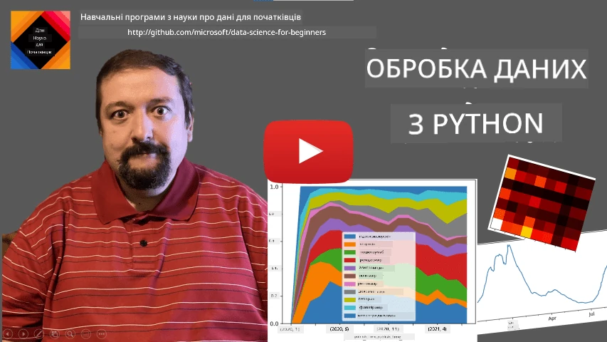
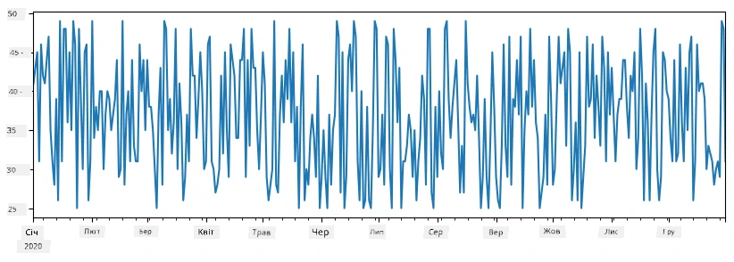
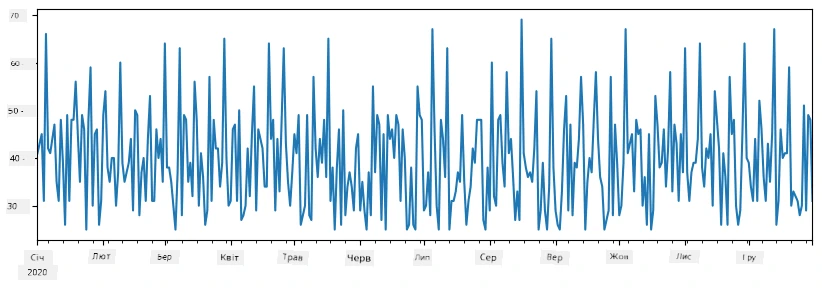
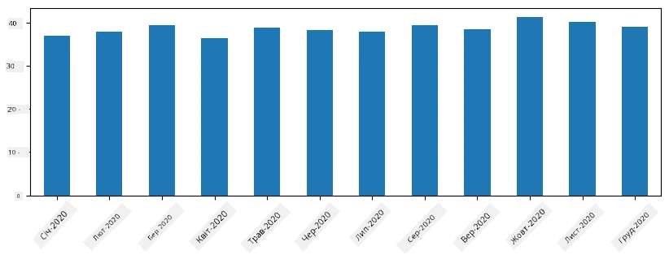
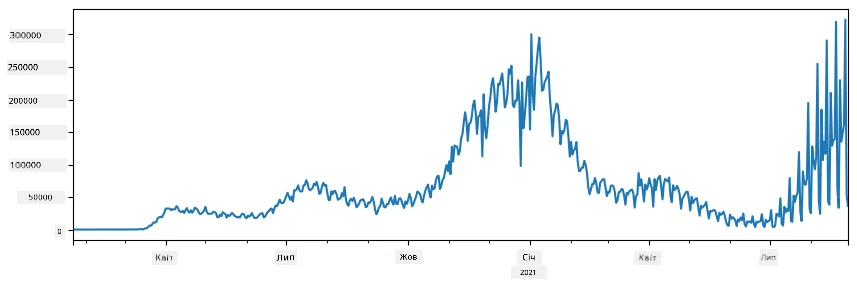
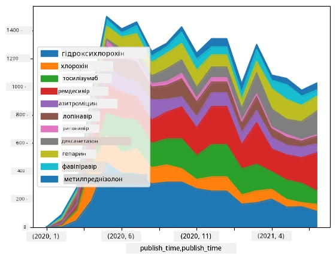

# Робота з даними: Python та бібліотека Pandas

|  ](../../sketchnotes/07-WorkWithPython.png) |
| :-------------------------------------------------------------------------------------------------------: |
|                 Робота з Python - _Sketchnote від [@nitya](https://twitter.com/nitya)_                 |

[](https://youtu.be/dZjWOGbsN4Y)

Хоча бази даних пропонують дуже ефективні способи зберігання даних і запитів до них за допомогою мов запитів, найгнучкішим способом обробки даних є написання власної програми для маніпуляції даними. У багатьох випадках виконання запиту до бази даних було б ефективнішим способом. Однак в деяких випадках, коли потрібна складніша обробка даних, це не завжди можна легко зробити за допомогою SQL.
Обробку даних можна програмувати на будь-якій мові програмування, але існують певні мови, які є вищого рівня щодо роботи з даними. Дані науковці зазвичай віддають перевагу одній із наступних мов:

* **[Python](https://www.python.org/)** — мова програмування загального призначення, яку часто вважають одним із найкращих варіантів для початківців через її простоту. Python має багато додаткових бібліотек, які можуть допомогти розв’язати багато практичних задач, таких як вилучення даних із ZIP архіву або конвертація зображення в відтінки сірого. Окрім науки про дані, Python часто використовується для веб-розробки.
* **[R](https://www.r-project.org/)** — традиційний набір інструментів, розроблений з урахуванням статистичної обробки даних. Він також містить велику бібліотеку (CRAN), що робить його гарним вибором для обробки даних. Проте R не є мовою програмування загального призначення і рідко використовується поза сферою науки про дані.
* **[Julia](https://julialang.org/)** — ще одна мова, розроблена спеціально для науки про дані. Вона має на меті забезпечити вищу продуктивність, ніж Python, що робить її чудовим інструментом для наукових експериментів.

У цьому уроці ми зосередимося на використанні Python для простої обробки даних. Ми припускаємо базове знайомство з мовою. Якщо ви хочете глибше ознайомитися з Python, ви можете звернутися до одного з наступних ресурсів:

* [Вивчайте Python весело з Turtle Graphics та Фракталами](https://github.com/shwars/pycourse) - швидкий вступний курс програмування на Python на GitHub
* [Зробіть перші кроки з Python](https://docs.microsoft.com/en-us/learn/paths/python-first-steps/?WT.mc_id=academic-77958-bethanycheum) навчальний шлях на [Microsoft Learn](http://learn.microsoft.com/?WT.mc_id=academic-77958-bethanycheum)

Дані можуть мати багато форм. У цьому уроці ми розглянемо три форми даних — **табличні дані**, **текст** і **зображення**.

Ми зосередимося на кількох прикладах обробки даних, замість того, щоб давати повний огляд усіх пов’язаних бібліотек. Це дозволить вам отримати основну ідею про те, що можливо зробити, і залишить розуміння, де шукати рішення ваших задач, коли вони знадобляться.

> **Найкорисніша порада**. Коли вам потрібно виконати певну операцію з даними, яку ви не знаєте, як зробити, спробуйте пошукати це в інтернеті. [Stackoverflow](https://stackoverflow.com/) зазвичай містить багато корисних прикладів коду на Python для багатьох типових задач.


## [Попередній тест](https://ff-quizzes.netlify.app/en/ds/quiz/12)

## Табличні дані та DataFrame

Ви вже стикалися з табличними даними, коли ми говорили про реляційні бази даних. Коли у вас багато даних, і вони розміщені в багатьох різних зв’язаних таблицях, безумовно має сенс використовувати SQL для роботи з ними. Проте існує багато випадків, коли у нас є таблиця з даними, і нам потрібно отримати певне **розуміння** або **інсайти** про ці дані, такі як розподіл, кореляція між значеннями тощо. У науці про дані часто потрібно виконувати деякі трансформації оригінальних даних, а потім візуалізувати їх. Обидва ці кроки легко здійснити за допомогою Python.

Існує дві найкорисніші бібліотеки в Python, які можуть допомогти вам працювати з табличними даними:
* **[Pandas](https://pandas.pydata.org/)** дозволяє вам маніпулювати так званими **DataFrame**, які є аналогом реляційних таблиць. Ви можете мати іменовані стовпці та виконувати різні операції з рядками, стовпцями і DataFrame загалом.
* **[Numpy](https://numpy.org/)** — це бібліотека для роботи з **тензорами**, тобто багатовимірними **масивами**. Масив має значення одного типу, і він простіший за DataFrame, але пропонує більше математичних операцій і створює менші накладні витрати.

Також існує кілька інших бібліотек, про які слід знати:
* **[Matplotlib](https://matplotlib.org/)** — бібліотека для візуалізації даних та побудови графіків
* **[SciPy](https://www.scipy.org/)** — бібліотека з додатковими науковими функціями. Ми вже стикалися з нею, коли говорили про ймовірність та статистику

Ось фрагмент коду, який ви зазвичай використовуватимете для імпорту цих бібліотек на початку вашої Python-програми:
```python
import numpy as np
import pandas as pd
import matplotlib.pyplot as plt
from scipy import ... # вам потрібно вказати точні підпакети, які вам потрібні
``` 

Pandas базується на кількох основних концепціях.

### Series

**Series** — це послідовність значень, схожа на список або масив numpy. Основна відмінність полягає в тому, що у Series також є **індекс**, і коли ми виконуємо операції над Series (наприклад, додаємо), індекс враховується. Індекс може бути таким простим, як числовий номер рядка (це індекс, який використовується за замовчуванням при створенні Series із списку або масиву), або він може мати складну структуру, таку як інтервал дат.

> **Примітка**: Існує деякий вступний код Pandas у супровідному ноутбуці [`notebook.ipynb`](notebook.ipynb). Тут ми лише наводимо деякі приклади, і вам обов’язково варто ознайомитися з повним ноутбуком.

Розглянемо приклад: ми хочемо проаналізувати продажі нашої крамниці морозива. Згенеруємо серію чисел продажу (кількість проданих штук кожного дня) за певний період часу:

```python
start_date = "Jan 1, 2020"
end_date = "Mar 31, 2020"
idx = pd.date_range(start_date,end_date)
print(f"Length of index is {len(idx)}")
items_sold = pd.Series(np.random.randint(25,50,size=len(idx)),index=idx)
items_sold.plot()
```


Тепер припустимо, що кожного тижня ми організовуємо вечірку для друзів і беремо додатково 10 упаковок морозива для вечірки. Ми можемо створити іншу серію, індексовану за тижнями, щоб це показати:
```python
additional_items = pd.Series(10,index=pd.date_range(start_date,end_date,freq="W"))
```
Коли ми складаємо дві серії, отримуємо загальну кількість:
```python
total_items = items_sold.add(additional_items,fill_value=0)
total_items.plot()
```


> **Зауважте**, що ми не просто використовуємо синтаксис `total_items+additional_items`. Якби так було, ми отримали б багато значень `NaN` (*Not a Number*) у результаті. Це тому, що в серії `additional_items` відсутні деякі значення для деяких індексів, і додавання `NaN` до будь-чого дає `NaN`. Тому нам потрібно вказати параметр `fill_value` під час додавання.

За допомогою часових рядів ми також можемо **перепробовувати** серію з різними часовими інтервалами. Наприклад, припустимо, що ми хочемо порахувати середній обсяг продажів щомісяця. Ми можемо використати такий код:
```python
monthly = total_items.resample("1M").mean()
ax = monthly.plot(kind='bar')
```


### DataFrame

DataFrame по суті є колекцією серій з однаковим індексом. Ми можемо поєднати кілька серій у DataFrame:
```python
a = pd.Series(range(1,10))
b = pd.Series(["I","like","to","play","games","and","will","not","change"],index=range(0,9))
df = pd.DataFrame([a,b])
```
Це створить горизонтальну таблицю такого вигляду:
|     | 0   | 1    | 2   | 3   | 4      | 5   | 6      | 7    | 8    |
| --- | --- | ---- | --- | --- | ------ | --- | ------ | ---- | ---- |
| 0   | 1   | 2    | 3   | 4   | 5      | 6   | 7      | 8    | 9    |
| 1   | I   | like | to  | use | Python | and | Pandas | very | much |

Ми також можемо використовувати Series як стовпці й задавати назви стовпців за допомогою словника:
```python
df = pd.DataFrame({ 'A' : a, 'B' : b })
```
Це дасть нам таблицю такого вигляду:

|     | A   | B      |
| --- | --- | ------ |
| 0   | 1   | I      |
| 1   | 2   | like   |
| 2   | 3   | to     |
| 3   | 4   | use    |
| 4   | 5   | Python |
| 5   | 6   | and    |
| 6   | 7   | Pandas |
| 7   | 8   | very   |
| 8   | 9   | much   |

**Зверніть увагу**, що ми також можемо отримати такий вигляд таблиці, транспонуючи попередню таблицю, наприклад, написавши
```python
df = pd.DataFrame([a,b]).T.rename(columns={ 0 : 'A', 1 : 'B' })
```
Тут `.T` означає операцію транспонування DataFrame, тобто заміну рядків і стовпців місцями, а операція `rename` дозволяє перейменувати стовпці, щоб вони відповідали попередньому прикладу.

Ось кілька найважливіших операцій, які ми можемо виконувати над DataFrame:

**Вибір стовпців**. Ми можемо вибирати окремі стовпці, написавши `df['A']` — ця операція повертає Series. Також можна вибрати підмножину стовпців у інший DataFrame, написавши `df[['B','A']]` — це поверне інший DataFrame.

**Фільтрація** лише певних рядків за певними критеріями. Наприклад, щоб залишити лише рядки зі стовпцем `A`, більшим за 5, можна написати `df[df['A']>5]`.

> **Примітка**: Як працює фільтрація, таке: вираз `df['A']<5` повертає булеву серію, яка вказує, чи є вираз `True` або `False` для кожного елемента оригінальної серії `df['A']`. Коли булева серія використовується як індекс, вона повертає підмножину рядків у DataFrame. Тому не можна використовувати довільний булевий вираз Python, наприклад, написати `df[df['A']>5 and df['A']<7]` було б помилкою. Замість цього слід використовувати спеціальну операцію `&` на булевих серіях, написавши `df[(df['A']>5) & (df['A']<7)]` (*дужки тут важливі*).

**Створення нових обчислюваних стовпців**. Ми можемо легко створити нові обчислювані стовпці в нашому DataFrame, використовуючи інтуїтивно зрозумілі вирази такого типу:
```python
df['DivA'] = df['A']-df['A'].mean() 
``` 
Цей приклад обчислює відхилення A від його середнього значення. Насправді тут ми обчислюємо серію, а потім присвоюємо цю серію лівій частині, створюючи інший стовпець. Отже, ми не можемо використовувати операції, несумісні з серіями, наприклад, код нижче є неправильним:
```python
# Неправильний код -> df['ADescr'] = "Low" if df['A'] < 5 else "Hi"
df['LenB'] = len(df['B']) # <- Неправильний результат
``` 
Останній приклад, хоча і синтаксично коректний, дає неправильний результат, оскільки присвоює довжину серії `B` всім значенням у стовпці, а не довжину кожного окремого елемента, як ми хотіли.

Якщо треба обчислити складні вирази такого типу, можна використовувати функцію `apply`. Останній приклад можна записати так:
```python
df['LenB'] = df['B'].apply(lambda x : len(x))
# або
df['LenB'] = df['B'].apply(len)
```

Після вищезазначених операцій ми отримаємо наступний DataFrame:

|     | A   | B      | DivA | LenB |
| --- | --- | ------ | ---- | ---- |
| 0   | 1   | I      | -4.0 | 1    |
| 1   | 2   | like   | -3.0 | 4    |
| 2   | 3   | to     | -2.0 | 2    |
| 3   | 4   | use    | -1.0 | 3    |
| 4   | 5   | Python | 0.0  | 6    |
| 5   | 6   | and    | 1.0  | 3    |
| 6   | 7   | Pandas | 2.0  | 6    |
| 7   | 8   | very   | 3.0  | 4    |
| 8   | 9   | much   | 4.0  | 4    |

**Вибір рядків за номером** можна здійснити за допомогою конструкції `iloc`. Наприклад, щоб вибрати перші 5 рядків із DataFrame:
```python
df.iloc[:5]
```

**Групування** часто використовується для отримання результату, подібного до *зведених таблиць* в Excel. Припустимо, ми хочемо порахувати середнє значення стовпця `A` для кожного значення `LenB`. Тоді ми можемо згрупувати DataFrame за `LenB` і викликати `mean`:
```python
df.groupby(by='LenB')[['A','DivA']].mean()
```
Якщо потрібно порахувати середнє та кількість елементів у групі, то можна використати більш складну функцію `aggregate`:
```python
df.groupby(by='LenB') \
 .aggregate({ 'DivA' : len, 'A' : lambda x: x.mean() }) \
 .rename(columns={ 'DivA' : 'Count', 'A' : 'Mean'})
```
Це дасть нам таку таблицю:

| LenB | Count | Mean     |
| ---- | ----- | -------- |
| 1    | 1     | 1.000000 |
| 2    | 1     | 3.000000 |
| 3    | 2     | 5.000000 |
| 4    | 3     | 6.333333 |
| 6    | 2     | 6.000000 |

### Отримання даних


Ми побачили, як легко створювати Series та DataFrame з об’єктів Python. Однак дані зазвичай надходять у вигляді текстового файлу або Excel-таблиці. На щастя, Pandas пропонує простий спосіб завантаження даних з диска. Наприклад, читання CSV-файлу таке саме просте:
```python
df = pd.read_csv('file.csv')
```
Ми побачимо більше прикладів завантаження даних, включаючи отримання їх з зовнішніх вебсайтів, у розділі "Виклик"


### Виведення на друк і візуалізація

Фахівцю з даних часто доводиться досліджувати дані, тому дуже важливо мати змогу їх візуалізувати. Коли DataFrame великий, часто хочеться просто переконатися, що ми все робимо правильно, вивівши кілька перших рядків. Це можна зробити викликом `df.head()`. Якщо ви запускаєте це в Jupyter Notebook, воно виведе DataFrame у гарному табличному вигляді.

Ми також бачили використання функції `plot` для візуалізації деяких стовпців. Хоча `plot` дуже корисний для багатьох завдань і підтримує багато різних типів графіків через параметр `kind=`, ви завжди можете використовувати базову бібліотеку `matplotlib` для побудови чогось складнішого. Ми докладно розглянемо візуалізацію даних у окремих уроках курсу.

Цей огляд охоплює найважливіші концепції Pandas, однак бібліотека дуже багата, і немає меж тому, що ви можете з нею робити! Давайте тепер застосуємо ці знання для розв’язання конкретної задачі.

## 🚀 Виклик 1: Аналіз розповсюдження COVID

Першою задачею, на якій ми зосередимось, є моделювання поширення епідемії COVID-19. Для цього ми використаємо дані про кількість інфікованих у різних країнах, надані [Center for Systems Science and Engineering](https://systems.jhu.edu/) (CSSE) при [Johns Hopkins University](https://jhu.edu/). Набір даних доступний у [цьому репозиторії GitHub](https://github.com/CSSEGISandData/COVID-19).

Оскільки ми хочемо показати, як працювати з даними, запрошуємо вас відкрити [`notebook-covidspread.ipynb`](notebook-covidspread.ipynb) і прочитати його від початку до кінця. Ви також можете виконувати комірки та розв’язувати деякі завдання, які ми залишили на кінець.



> Якщо ви не знаєте, як запускати код у Jupyter Notebook, ознайомтеся з [цією статтею](https://soshnikov.com/education/how-to-execute-notebooks-from-github/).

## Робота з неструктурованими даними

Хоча дані дуже часто мають табличну форму, у деяких випадках потрібно працювати з менш структурованими даними, наприклад, текстами або зображеннями. У такому випадку, щоб застосувати техніки обробки даних, які ми бачили вище, нам потрібно якимось чином **витягти** структуровані дані. Ось кілька прикладів:

* Витягування ключових слів з тексту і підрахунок, як часто вони зустрічаються
* Використання нейронних мереж для витягування інформації про об’єкти на зображенні
* Отримання інформації про емоції людей на відеопотоці з камери

## 🚀 Виклик 2: Аналіз наукових публікацій про COVID

У цьому виклику ми продовжимо тему пандемії COVID і зосередимось на обробці наукових праць з цього питання. Існує [CORD-19 Dataset](https://www.kaggle.com/allen-institute-for-ai/CORD-19-research-challenge) з понад 7000 (на момент написання) наукових робіт про COVID, доступних разом з метаданими та анотаціями (і приблизно для половини з них також наданий повний текст).

Повний приклад аналізу цього набору даних з використанням когнітивної служби [Text Analytics for Health](https://docs.microsoft.com/azure/cognitive-services/text-analytics/how-tos/text-analytics-for-health/?WT.mc_id=academic-77958-bethanycheum) описано [у цій публікації в блозі](https://soshnikov.com/science/analyzing-medical-papers-with-azure-and-text-analytics-for-health/). Ми обговоримо спрощену версію цього аналізу.

> **ПРИМІТКА**: Ми не надаємо копію набору даних як частину цього репозиторію. Спочатку вам може знадобитись завантажити файл [`metadata.csv`](https://www.kaggle.com/allen-institute-for-ai/CORD-19-research-challenge?select=metadata.csv) з [цього набору даних на Kaggle](https://www.kaggle.com/allen-institute-for-ai/CORD-19-research-challenge). Можлива реєстрація на Kaggle. Ви також можете завантажити набір даних без реєстрації [тут](https://ai2-semanticscholar-cord-19.s3-us-west-2.amazonaws.com/historical_releases.html), але він включатиме всі повні тексти окрім метаданих.

Відкрийте [`notebook-papers.ipynb`](notebook-papers.ipynb) і прочитайте його від початку до кінця. Ви також можете виконувати комірки та розв’язувати деякі завдання, які ми залишили на кінець.



## Обробка зображень

Нещодавно було розроблено дуже потужні моделі ШІ, які дозволяють нам розуміти зображення. Існує багато завдань, які можна розв’язувати за допомогою попередньо навчених нейронних мереж або хмарних сервісів. Ось кілька прикладів:

* **Класифікація зображень**, яка допомагає класифікувати зображення до однієї з заздалегідь визначених категорій. Ви можете легко навчити власні класифікатори зображень за допомогою сервісів, таких як [Custom Vision](https://azure.microsoft.com/services/cognitive-services/custom-vision-service/?WT.mc_id=academic-77958-bethanycheum)
* **Виявлення об’єктів** для розпізнавання різних об’єктів на зображенні. Сервіси на кшталт [computer vision](https://azure.microsoft.com/services/cognitive-services/computer-vision/?WT.mc_id=academic-77958-bethanycheum) можуть розпізнавати низку поширених об’єктів, і ви можете навчити модель [Custom Vision](https://azure.microsoft.com/services/cognitive-services/custom-vision-service/?WT.mc_id=academic-77958-bethanycheum) для виявлення деяких конкретних цікавих об’єктів.
* **Розпізнавання облич**, включно з визначенням віку, статі та емоцій. Це можна зробити через [Face API](https://azure.microsoft.com/services/cognitive-services/face/?WT.mc_id=academic-77958-bethanycheum).

Всі ці хмарні сервіси можна викликати за допомогою [Python SDK](https://docs.microsoft.com/samples/azure-samples/cognitive-services-python-sdk-samples/cognitive-services-python-sdk-samples/?WT.mc_id=academic-77958-bethanycheum), і таким чином вони легко інтегруються у ваш робочий процес аналізу даних.

Ось кілька прикладів вивчення даних із джерел зображень:
* У публікації блогу [Як вивчати Data Science без кодування](https://soshnikov.com/azure/how-to-learn-data-science-without-coding/) ми досліджуємо фотографії з Instagram, намагаючись зрозуміти, що змушує людей ставити більше лайків. Спочатку ми витягуємо якнайбільше інформації із зображень за допомогою [computer vision](https://azure.microsoft.com/services/cognitive-services/computer-vision/?WT.mc_id=academic-77958-bethanycheum), а потім використовуємо [Azure Machine Learning AutoML](https://docs.microsoft.com/azure/machine-learning/concept-automated-ml/?WT.mc_id=academic-77958-bethanycheum) для побудови інтерпретованої моделі.
* На [Facial Studies Workshop](https://github.com/CloudAdvocacy/FaceStudies) ми використовуємо [Face API](https://azure.microsoft.com/services/cognitive-services/face/?WT.mc_id=academic-77958-bethanycheum) для виявлення емоцій людей на фотографіях з подій, щоб спробувати зрозуміти, що робить людей щасливими.

## Висновок

Чи маєте ви структуровані чи неструктуровані дані, використовуючи Python, ви можете виконати всі етапи, пов’язані з обробкою і розумінням даних. Це, ймовірно, найгнучкіший спосіб обробки даних, і саме тому більшість фахівців з даних використовують Python як основний інструмент. Вивчення Python у глибину — це, мабуть, хороша ідея, якщо ви серйозно налаштовані на вашу подорож у сферу аналізу даних!

## [Тест після лекції](https://ff-quizzes.netlify.app/en/ds/quiz/13)

## Огляд і самостійне вивчення

**Книги**
* [Wes McKinney. Python for Data Analysis: Data Wrangling with Pandas, NumPy, and IPython](https://www.amazon.com/gp/product/1491957662)

**Онлайн-ресурси**
* Офіційний [10-хвилинний підручник Pandas](https://pandas.pydata.org/pandas-docs/stable/user_guide/10min.html)
* [Документація з візуалізації Pandas](https://pandas.pydata.org/pandas-docs/stable/user_guide/visualization.html)

**Вивчення Python**
* [Вивчайте Python весело з Turtle Graphics і фракталами](https://github.com/shwars/pycourse)
* [Зробіть перші кроки з Python](https://docs.microsoft.com/learn/paths/python-first-steps/?WT.mc_id=academic-77958-bethanycheum) навчальний шлях на [Microsoft Learn](http://learn.microsoft.com/?WT.mc_id=academic-77958-bethanycheum)

## Завдання

[Виконайте більш детальне вивчення даних для наведених викликів](assignment.md)

## Автори

Цей урок створено з ♥️ Дмитром Сошниковим (http://soshnikov.com)

---

<!-- CO-OP TRANSLATOR DISCLAIMER START -->
**Відмова від відповідальності**:
Цей документ було перекладено за допомогою сервісу штучного інтелекту для перекладу [Co-op Translator](https://github.com/Azure/co-op-translator). Хоча ми прагнемо до точності, будь ласка, майте на увазі, що автоматичні переклади можуть містити помилки або неточності. Оригінальний документ рідною мовою слід вважати авторитетним джерелом. Для критично важливої інформації рекомендується професійний людський переклад. Ми не несемо відповідальності за будь-які непорозуміння або неправильні тлумачення, що виникли внаслідок використання цього перекладу.
<!-- CO-OP TRANSLATOR DISCLAIMER END -->