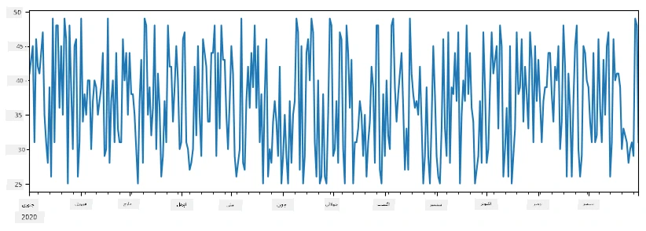
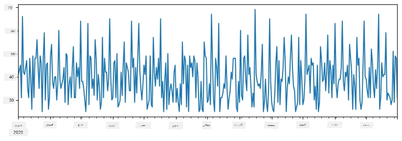
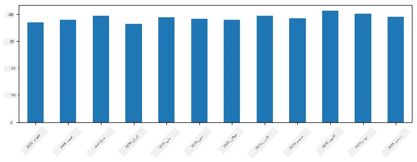
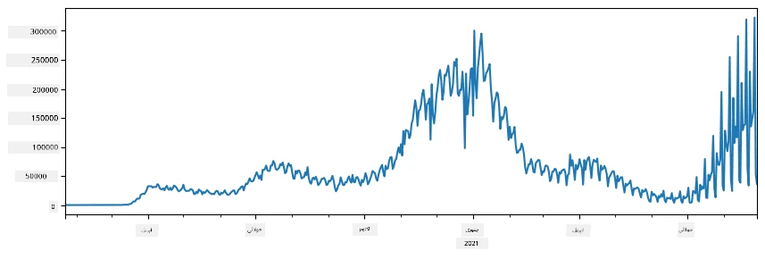
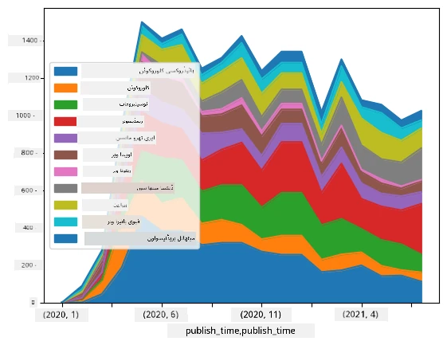

# ڈیٹا کے ساتھ کام کرنا: پائتھن اور پانڈاز لائبریری

|  ](../../sketchnotes/07-WorkWithPython.png) |
| :-------------------------------------------------------------------------------------------------------: |
|                 پائتھن کے ساتھ کام کرنا - _اسکیچنوٹ بذریعہ [@nitya](https://twitter.com/nitya)_                 |

[](https://youtu.be/dZjWOGbsN4Y)

جہاں ڈیٹا بیس ڈیٹا ذخیرہ کرنے اور کوئری لینگویجز کے ذریعے ان سے سوالات کرنے کے بہت مؤثر طریقے فراہم کرتے ہیں، سب سے زیادہ لچکدار طریقہ یہ ہے کہ آپ اپنا اپنا پروگرام لکھیں تاکہ ڈیٹا کو سنبھالا جا سکے۔ بہت سے معاملات میں، ڈیٹا بیس کوئری زیادہ مؤثر طریقہ ہوگی۔ تاہم، بعض صورتوں میں جب مزید پیچیدہ ڈیٹا پروسیسنگ کی ضرورت ہو، اسے آسانی سے SQL کے ذریعے نہیں کیا جا سکتا۔
ڈیٹا پروسیسنگ کسی بھی پروگرامنگ زبان میں پروگرام کی جا سکتی ہے، لیکن کچھ زبانیں ڈیٹا کے ساتھ کام کرنے کے لیے اعلیٰ سطح کی سمجھی جاتی ہیں۔ ڈیٹا سائنسدان عام طور پر درج ذیل زبانوں میں سے ایک کو ترجیح دیتے ہیں:

* **[پائتھن](https://www.python.org/)**، ایک عمومی مقصد کی پروگرامنگ زبان، جو اپنی سادگی کے باعث اکثر ابتدائ کے لیے بہتر انتخاب سمجھی جاتی ہے۔ پائتھن میں بہت سی اضافی لائبریریاں موجود ہیں جو آپ کو بہت سے عملی مسائل حل کرنے میں مدد دیتی ہیں، مثلاً ZIP آرکائیو سے ڈیٹا نکالنا، یا تصویر کو گرے اسکیل میں تبدیل کرنا۔ ڈیٹا سائنس کے علاوہ، پائتھن اکثر ویب ڈویلپمنٹ کے لیے بھی استعمال ہوتی ہے۔
* **[آر](https://www.r-project.org/)** ایک روایتی ٹول باکس ہے جو شماریاتی ڈیٹا پروسیسنگ کے لیے تیار کیا گیا ہے۔ اس میں لائبریریوں کا ایک بڑا ذخیرہ (CRAN) بھی موجود ہے، جو اسے ڈیٹا پروسیسنگ کے لیے اچھا انتخاب بناتا ہے۔ تاہم، آر عمومی مقصد کی پروگرامنگ زبان نہیں ہے، اور ڈیٹا سائنس کے علاوہ کم ہی استعمال ہوتی ہے۔
* **[جولیا](https://julialang.org/)** ایک اور زبان ہے جو خاص طور پر ڈیٹا سائنس کے لیے تیار کی گئی ہے۔ اس کا مقصد پائتھن کی نسبت بہتر کارکردگی دینا ہے، جو اسے سائنسی تجربات کے لیے بہترین اوزار بناتی ہے۔

اس سبق میں، ہم سادہ ڈیٹا پروسیسنگ کے لیے پائتھن کے استعمال پر توجہ دیں گے۔ ہم زبان کی بنیادی واقفیت فرض کریں گے۔ اگر آپ پائتھن کا گہرا تعارف چاہتے ہیں، تو آپ درج ذیل ذرائع کی طرف رجوع کر سکتے ہیں:

* [تفریحی انداز میں پائتھن سیکھیں، ٹرٹل گرافکس اور فراکٹلز کے ساتھ](https://github.com/shwars/pycourse) - گٹ ہب پر مبنی پائتھن پروگرامنگ کا فوری تعارف کورس
* [پائتھن کے ساتھ اپنے پہلے قدم اٹھائیں](https://docs.microsoft.com/en-us/learn/paths/python-first-steps/?WT.mc_id=academic-77958-bethanycheum) مائیکروسافٹ لرن پر لرننگ پاتھ

ڈیٹا کئی اشکال میں آ سکتا ہے۔ اس سبق میں، ہم تین قسم کے ڈیٹا پر غور کریں گے - **جدولی ڈیٹا**, **متن** اور **تصاویر**۔

ہم مختلف لائبریریوں کا مکمل جائزہ دینے کے بجائے چند ڈیٹا پروسیسنگ کی مثالوں پر توجہ دیں گے۔ اس سے آپ کو بنیادی تصور سمجھنے میں مدد ملے گی کہ کیا ممکن ہے، اور یہ سمجھ بھی ملے گی کہ جب آپ کو ضرورت ہو تو اپنے مسائل کے حل کہاں تلاش کرنا ہے۔

> **سب سے مفید نصیحت**۔ جب آپ کو ڈیٹا پر کوئی مخصوص عمل انجام دینا ہو اور آپ نہیں جانتے کہ کیسے کرنا ہے، تو انٹرنیٹ پر تلاش کرنے کی کوشش کریں۔ [Stackoverflow](https://stackoverflow.com/) عام طور پر بہت سے عام کاموں کے لیے پائتھن میں مفید کوڈ نمونے رکھتا ہے۔


## [سبق سے پہلے کوئز](https://ff-quizzes.netlify.app/en/ds/quiz/12)

## جدولی ڈیٹا اور ڈیٹافریم

آپ پہلے ہی جب ہم نے تعلقاتی ڈیٹا بیسز کے بارے میں بات کی تھی، تو آپ جدول نما ڈیٹا سے آشنا ہو چکے ہیں۔ جب آپ کے پاس بہت زیادہ ڈیٹا ہوتا ہے اور یہ مختلف جڑے ہوئے جدولوں میں ہوتا ہے، تو واقعی SQL کا استعمال اس پر کام کرنے کے لیے معقول ہوتا ہے۔ تاہم، بہت سی صورتوں میں جب ہمارے پاس ایک جدول کی شکل میں ڈیٹا ہوتا ہے، اور ہم اس ڈیٹا کے بارے میں کچھ **سمجھ** یا **بصیرت** حاصل کرنا چاہتے ہیں، جیسے تقسیم، اقدار کے درمیان تعلق وغیرہ۔ ڈیٹا سائنس میں بہت سے مواقع ہوتے ہیں جب ہمیں اصلی ڈیٹا کی کچھ تبدیلیاں کرنی پڑتی ہیں، اور پھر اس کی ویژولائزیشن کی جاتی ہے۔ یہ دونوں کام پائتھن کی مدد سے آسانی سے کیے جا سکتے ہیں۔

پائتھن میں دو سب سے زیادہ مفید لائبریریاں ہیں جو آپ کو جدول نما ڈیٹا سے نمٹنے میں مدد دے سکتی ہیں:
* **[Pandas](https://pandas.pydata.org/)** آپ کو وہ چیزیں سنبھالنے دیتا ہے جنہیں **ڈیٹافریم** کہا جاتا ہے، جو تعلقاتی جدولوں کی طرح ہوتے ہیں۔ آپ کے پاس نامزد کالم ہو سکتے ہیں، اور آپ قطاروں، کالموں اور عمومی طور پر ڈیٹافریم پر مختلف عمل انجام دے سکتے ہیں۔
* **[Numpy](https://numpy.org/)** تینسروں، یعنی کثیر الجہتی **ارے** کے ساتھ کام کرنے کے لیے ایک لائبریری ہے۔ ارے میں سبھی اقدار ایک ہی قسم کی ہوتی ہیں، اور یہ ڈیٹافریم کی نسبت آسان ہے، لیکن یہ زیادہ ریاضیاتی عمل فراہم کرتا ہے اور کم اضافی بوجھ پیدا کرتا ہے۔

چند دیگر لائبریریاں بھی ہیں جن سے آپ واقف ہونا چاہیں گے:
* **[Matplotlib](https://matplotlib.org/)** ایک لائبریری ہے جو ڈیٹا کی ویژولائزیشن اور گراف بنانے کے لیے استعمال ہوتی ہے
* **[SciPy](https://www.scipy.org/)** کچھ اضافی سائنسی فنکشنز کی لائبریری ہے۔ ہم اس لائبریری سے پہلے ہی احتمال اور شماریات کے بارے میں بات کرتے ہوئے مل چکے ہیں

یہاں ایک کوڈ کا ٹکڑا ہے جو آپ معمولاً اپنے پائتھن پروگرام کے شروع میں ان لائبریریوں کو امپورٹ کرنے کے لیے استعمال کریں گے:
```python
import numpy as np
import pandas as pd
import matplotlib.pyplot as plt
from scipy import ... # آپ کو مخصوص ذیلی پیکجز کی وضاحت کرنا ہوگی جن کی آپ کو ضرورت ہے
``` 

پانڈاز چند بنیادی تصورات کے گرد مرکوز ہے۔

### سیریز

**سیریز** اقدار کا ایک تسلسل ہے، جو ایک فہرست یا نمپائی ارے کی طرح ہے۔ اس کا بنیادی فرق یہ ہے کہ سیریز کا ایک **انڈیکس** بھی ہوتا ہے، اور جب ہم سیریز پر عمل کرتے ہیں (مثلاً، انہیں جمع کرتے ہیں)، تو انڈیکس کو بھی مدنظر رکھا جاتا ہے۔ انڈیکس جتنا سادہ ہو سکتا ہے، جیسے کہ عددی قطار نمبر (جو لسٹ یا ارے سے سیریز بنانے پر بطور ڈیفالٹ استعمال ہوتا ہے)، یا پیچیدہ ساخت رکھ سکتا ہے، جیسے تاریخ کا وقفہ۔

> **نوٹ**: ایک ابتدائی پانڈاز کا کوڈ ساتھ موجود نوٹ بک [`notebook.ipynb`](notebook.ipynb) میں موجود ہے۔ ہم یہاں صرف چند مثالیں پیش کرتے ہیں، اور آپ یقیناً مکمل نوٹ بک کو دیکھنے کے لیے خوش آمدید ہیں۔

ایک مثال پر غور کریں: ہم اپنی آئس کریم کی دکان کی فروخت کا تجزیہ کرنا چاہتے ہیں۔ آئیے کسی مدت کے لیے فروخت کی تعداد کی ایک سیریز تیار کرتے ہیں (روزانہ فروخت شدہ اشیاء کی تعداد):

```python
start_date = "Jan 1, 2020"
end_date = "Mar 31, 2020"
idx = pd.date_range(start_date,end_date)
print(f"Length of index is {len(idx)}")
items_sold = pd.Series(np.random.randint(25,50,size=len(idx)),index=idx)
items_sold.plot()
```


اب فرض کریں کہ ہر ہفتے ہم دوستوں کے لیے پارٹی کا اہتمام کرتے ہیں، اور پارٹی کے لیے اضافی 10 پیک آئس کریم لے جاتے ہیں۔ ہم ہفتہ وار انڈیکس والی ایک اور سیریز بنا سکتے ہیں تاکہ اسے ظاہر کیا جا سکے:
```python
additional_items = pd.Series(10,index=pd.date_range(start_date,end_date,freq="W"))
```
جب ہم دو سیریز کو ایک ساتھ جمع کرتے ہیں، تو ہمیں کل تعداد ملتی ہے:
```python
total_items = items_sold.add(additional_items,fill_value=0)
total_items.plot()
```


> **نوٹ** کہ ہم سادہ ترکیب `total_items+additional_items` استعمال نہیں کر رہے ہیں۔ اگر ہم ایسا کرتے، تو نتیجے میں بہت سی `NaN` (*نمبر نہیں*) کی قدریں ملتیں۔ اس کی وجہ یہ ہے کہ `additional_items` سیریز کے کچھ انڈیکس پوائنٹس کے لیے قدریں موجود نہیں ہیں، اور Nan کو کسی بھی چیز سے جمع کرنے کا نتیجہ `NaN` ہوتا ہے۔ اس لیے ہمیں جمع کرتے وقت `fill_value` پیرا میٹر بیان کرنا پڑتا ہے۔

وقت کی سیریز کے ساتھ، ہم مختلف وقت کے وقفوں کے ساتھ سیریز کو **ریسمپل** بھی کر سکتے ہیں۔ مثال کے طور پر، فرض کریں ہم ماہانہ اوسط فروخت کا حساب کرنا چاہتے ہیں۔ ہم درج ذیل کوڈ استعمال کر سکتے ہیں:
```python
monthly = total_items.resample("1M").mean()
ax = monthly.plot(kind='bar')
```


### ڈیٹافریم

ایک ڈیٹافریم بنیادی طور پر ایک ہی انڈیکس والی سیریز کا مجموعہ ہے۔ ہم کئی سیریز کو مل کر ایک ڈیٹافریم بنا سکتے ہیں:
```python
a = pd.Series(range(1,10))
b = pd.Series(["I","like","to","play","games","and","will","not","change"],index=range(0,9))
df = pd.DataFrame([a,b])
```
یہ ایک عمودی جدول بنائے گا:
|     | 0   | 1    | 2   | 3   | 4      | 5   | 6      | 7    | 8    |
| --- | --- | ---- | --- | --- | ------ | --- | ------ | ---- | ---- |
| 0   | 1   | 2    | 3   | 4   | 5      | 6   | 7      | 8    | 9    |
| 1   | I   | like | to  | use | Python | and | Pandas | very | much |

ہم سیریز کو کالم کے طور پر بھی استعمال کر سکتے ہیں، اور کالم کے نام ڈکشنری کے ذریعے مخصوص کر سکتے ہیں:
```python
df = pd.DataFrame({ 'A' : a, 'B' : b })
```
یہ ہمیں ایک جدول دے گا:

|     | A   | B      |
| --- | --- | ------ |
| 0   | 1   | I      |
| 1   | 2   | like   |
| 2   | 3   | to     |
| 3   | 4   | use    |
| 4   | 5   | Python |
| 5   | 6   | and    |
| 6   | 7   | Pandas |
| 7   | 8   | very   |
| 8   | 9   | much   |

**نوٹ** کہ ہم اس جدول کی ترتیب پچھلے جدول کو ٹرانسپوز کر کے بھی حاصل کر سکتے ہیں، مثلاً لکھ کر
```python
df = pd.DataFrame([a,b]).T.rename(columns={ 0 : 'A', 1 : 'B' })
```
یہاں `.T` کا مطلب ہے ڈیٹافریم کا ٹرانسپوز کرنا، یعنی قطاروں اور کالموں کو تبدیل کرنا، اور `rename` عمل ہمیں کالموں کو پچھلے مثال سے ہم آہنگ نام دینے کی اجازت دیتا ہے۔

یہاں چند اہم ترین عمل ہیں جو ہم ڈیٹافریمز پر انجام دے سکتے ہیں:

**کالم کا انتخاب**۔ ہم کالموں کو انفرادی طور پر `df['A']` لکھ کر منتخب کر سکتے ہیں - یہ عمل ایک سیریز واپس دیتا ہے۔ ہم کالموں کے ایک ذیلی سیٹ کو دوسرے ڈیٹافریم میں `df[['B','A']]` لکھ کر منتخب کر سکتے ہیں - یہ ایک دوسرا ڈیٹافریم واپس دیتا ہے۔

**صرف مخصوص قطاروں کو فلٹر کرنا**۔ مثال کے طور پر، کالم `A` کی قیمت 5 سے زیادہ والی قطاریں رکھنا ہو، تو ہم لکھیں `df[df['A']>5]`۔

> **نوٹ**: فلٹرنگ کا طریقہ کار کچھ یوں ہے۔ اظہار `df['A']<5` ایک Boolean سیریز واپس کرتا ہے، جو ظاہر کرتی ہے کہ کیا ہر عنصر کے لیے اظہار `True` یا `False` ہے۔ جب Boolean سیریز کو انڈیکس کے طور پر استعمال کیا جاتا ہے، تو یہ ڈیٹافریم میں قطاروں کا ذیلی مجموعہ واپس دیتا ہے۔ چنانچہ کسی بھی عام پائتھن Boolean اظہار کو استعمال کرنا ممکن نہیں ہے، مثلا، `df[df['A']>5 and df['A']<7]` غلط ہوگا۔ اس کے بجائے، آپ Boolean سیریز پر خاص `&` آپریٹر استعمال کریں، لکھ کر `df[(df['A']>5) & (df['A']<7)]` (*یہاں پر بریکٹ ضروری ہیں*)۔

**نئے قابل حساب کالمز بنانا**۔ ہم اپنے ڈیٹافریم کے لیے نیا قابل حساب کالم آسانی سے اس طرح بنا سکتے ہیں:
```python
df['DivA'] = df['A']-df['A'].mean() 
``` 
یہ مثال A کی اوسط سے اس کی انحراف کو حساب کرتی ہے۔ حقیقت میں ہم ایک سیریز کا حساب کر رہے ہیں، اور پھر اس سیریز کو بائیں ہاتھ کی طرف تفویض کر رہے ہیں، ایک اور کالم بناتے ہوئے۔ چنانچہ، ہم کوئی بھی ایسا عمل استعمال نہیں کر سکتے جو سیریز کے ساتھ موافق نہ ہو، مثلاً نیچے دیا گیا کوڈ غلط ہے:
```python
# غلط کوڈ -> df['ADescr'] = "کم" اگر df['A'] < 5 ورنہ "زیادہ"
df['LenB'] = len(df['B']) # <- غلط نتیجہ
``` 
آخری مثال، حالانکہ نحوی اعتبار سے درست ہے، غلط نتیجہ دیتی ہے، کیونکہ یہ سیریز `B` کی لمبائی کو کالم کے تمام اقدار پر تفویض کرتی ہے، بجائے اس کے کہ انفرادی عناصر کی لمبائی جیسی ہم نے ارادہ کیا تھا۔

اگر ہمیں پیچیدہ اظہار کا حساب کرنا ہو تو ہم `apply` فنکشن استعمال کر سکتے ہیں۔ آخری مثال کو یوں لکھا جا سکتا ہے:
```python
df['LenB'] = df['B'].apply(lambda x : len(x))
# یا
df['LenB'] = df['B'].apply(len)
```

مذکورہ بالا عمل کے بعد، ہمیں درج ذیل ڈیٹافریم ملے گا:

|     | A   | B      | DivA | LenB |
| --- | --- | ------ | ---- | ---- |
| 0   | 1   | I      | -4.0 | 1    |
| 1   | 2   | like   | -3.0 | 4    |
| 2   | 3   | to     | -2.0 | 2    |
| 3   | 4   | use    | -1.0 | 3    |
| 4   | 5   | Python | 0.0  | 6    |
| 5   | 6   | and    | 1.0  | 3    |
| 6   | 7   | Pandas | 2.0  | 6    |
| 7   | 8   | very   | 3.0  | 4    |
| 8   | 9   | much   | 4.0  | 4    |

**نمبر کے حساب سے قطاروں کا انتخاب** `iloc` کنسٹرکٹ استعمال کر کے کیا جا سکتا ہے۔ مثال کے طور پر، ڈیٹافریم کی پہلی 5 قطاریں منتخب کرنے کے لیے:
```python
df.iloc[:5]
```

**گروپ بندی** اکثر اس طرح کے نتائج حاصل کرنے کے لیے استعمال ہوتی ہے جیسے Excel میں *pivot tables* ہوتے ہیں۔ فرض کریں ہم کالم `A` کی مقدار کو `LenB` کی ہر مخصوص عددی مقدار کے لیے اوسط نکالنا چاہتے ہیں۔ پھر ہم اپنے ڈیٹافریم کو `LenB` کے لحاظ سے گروپ کر کے `mean` کال کر سکتے ہیں:
```python
df.groupby(by='LenB')[['A','DivA']].mean()
```
اگر ہمیں گروپ میں اوسط اور عناصر کی تعداد دونوں کا حساب چاہیے، تو ہم زیادہ پیچیدہ `aggregate` فنکشن استعمال کر سکتے ہیں:
```python
df.groupby(by='LenB') \
 .aggregate({ 'DivA' : len, 'A' : lambda x: x.mean() }) \
 .rename(columns={ 'DivA' : 'Count', 'A' : 'Mean'})
```
اس سے ہمیں درج ذیل جدول ملتا ہے:

| LenB | Count | Mean     |
| ---- | ----- | -------- |
| 1    | 1     | 1.000000 |
| 2    | 1     | 3.000000 |
| 3    | 2     | 5.000000 |
| 4    | 3     | 6.333333 |
| 6    | 2     | 6.000000 |

### ڈیٹا حاصل کرنا


ہم نے دیکھا ہے کہ Python اشیاء سے Series اور DataFrames تیار کرنا کتنا آسان ہے۔ تاہم، ڈیٹا عام طور پر ایک ٹیکسٹ فائل یا ایکسل ٹیبل کی صورت میں آتا ہے۔ خوش قسمتی سے، Pandas ہمیں ڈیٹا کو ڈسک سے لوڈ کرنے کا ایک آسان طریقہ فراہم کرتا ہے۔ مثال کے طور پر، CSV فائل پڑھنا اس قدر آسان ہے:
```python
df = pd.read_csv('file.csv')
```
 ہم "Challenge" سیکشن میں مزید ڈیٹا لوڈ کرنے کی مثالیں دیکھیں گے، بشمول اسے بیرونی ویب سائٹس سے حاصل کرنے کے۔


### پرنٹنگ اور پلاٹنگ

ایک Data Scientist کو اکثر ڈیٹا کو دریافت کرنا ہوتا ہے، اس لیے اسے قابلِ دید بنانا ضروری ہوتا ہے۔ جب DataFrame بڑا ہوتا ہے، تو اکثر ہم صرف یہ یقین کرنے کے لیے چاہتے ہیں کہ ہم سب کچھ صحیح کر رہے ہیں، پہلے چند قطاریں پرنٹ کر کے۔ یہ `df.head()` کال کر کے کیا جا سکتا ہے۔ اگر آپ Jupyter Notebook سے اسے چلا رہے ہیں، تو یہ DataFrame کو خوبصورت جدول کی شکل میں پرنٹ کرے گا۔

ہم نے کچھ کالمز کو دیکھنے کے لیے `plot` فنکشن کا استعمال بھی دیکھا ہے۔ جبکہ `plot` بہت سارے کاموں کے لیے مفید ہے، اور `kind=` پیرا میٹر کے ذریعے بہت سی مختلف گراف اقسام کی حمایت کرتا ہے، آپ ہمیشہ پیچیدہ گراف بنانے کے لیے خام `matplotlib` لائبریری استعمال کر سکتے ہیں۔ ہم ڈیٹا کی بصری نمائندگی کو تفصیل سے الگ کورس کے اسباق میں کور کریں گے۔

یہ جائزہ Pandas کے سب سے اہم تصورات کو کور کرتا ہے، تاہم، یہ لائبریری بہت وسیع ہے، اور آپ اس کے ساتھ جو کچھ بھی کرنا چاہتے ہیں اس کی کوئی حد نہیں ہے! آئیے اب اس علم کو کسی مخصوص مسئلے کو حل کرنے کے لیے استعمال کرتے ہیں۔

## 🚀 چیلنج 1: COVID پھیلاؤ کا تجزیہ

پہلا مسئلہ جس پر ہم توجہ مرکوز کریں گے وہ COVID-19 کی وباء کے پھیلاؤ کی ماڈلنگ ہے۔ اس کے لیے، ہم مختلف ممالک میں متاثرہ افراد کی تعداد کے بارے میں ڈیٹا استعمال کریں گے، جو [Center for Systems Science and Engineering](https://systems.jhu.edu/) (CSSE) نے [Johns Hopkins University](https://jhu.edu/) میں فراہم کیا ہے۔ ڈیٹا سیٹ [اس GitHub ریپوزٹری](https://github.com/CSSEGISandData/COVID-19) میں دستیاب ہے۔

چونکہ ہم یہ دکھانا چاہتے ہیں کہ ڈیٹا کے ساتھ کیسے کام کیا جائے، اس لیے آپ سے گزارش ہے کہ [`notebook-covidspread.ipynb`](notebook-covidspread.ipynb) کھولیں اور اسے اوپر سے نیچے تک پڑھیں۔ آپ سیلز کو بھی چلا سکتے ہیں، اور ہمارے چھوڑے ہوئے چیلنجز بھی حل کر سکتے ہیں۔



> اگر آپ کو معلوم نہیں کہ Jupyter Notebook میں کوڈ کیسے چلانا ہے، تو [اس مضمون](https://soshnikov.com/education/how-to-execute-notebooks-from-github/) کو دیکھیں۔

## غیر منظم شدہ ڈیٹا کے ساتھ کام کرنا

جب کہ ڈیٹا اکثر جدول کی شکل میں آتا ہے، بعض صورتوں میں ہمیں کم منظم شدہ ڈیٹا، جیسے کہ متن یا تصاویر، کے ساتھ کام کرنا پڑتا ہے۔ اس صورت میں، ڈیٹا پروسیسنگ کی تکنیکوں کو نافذ کرنے کے لیے ہمیں کسی طرح سے منظم شدہ ڈیٹا **نکالنا** ضروری ہوتا ہے۔ یہاں چند مثالیں ہیں:

* متن سے کلیدی الفاظ نکالنا، اور دیکھنا کہ وہ کلیدی الفاظ کتنی بار ظاہر ہوتے ہیں
* نیورل نیٹ ورکس کا استعمال کرتے ہوئے تصویر میں موجود اشیاء کی معلومات نکالنا
* ویڈیو کیمرا فیڈ میں لوگوں کے جذبات کی معلومات حاصل کرنا

## 🚀 چیلنج 2: COVID رپورٹس کا تجزیہ

اس چیلنج میں، ہم COVID وباء کے موضوع پر جاری رکھیں گے، اور اس موضوع پر سائنسی مقالوں کی پروسیسنگ پر توجہ مرکوز کریں گے۔ [CORD-19 Dataset](https://www.kaggle.com/allen-institute-for-ai/CORD-19-research-challenge) میں 7000 سے زائد (تاریخِ تحریر کے وقت) COVID مقالے دستیاب ہیں، میٹا ڈیٹا اور خلاصوں کے ساتھ (اور تقریباً نصف کے لیے مکمل متن بھی دستیاب ہے)۔

اس ڈیٹا سیٹ کا تجزیہ کرنے کی مکمل مثال [Text Analytics for Health](https://docs.microsoft.com/azure/cognitive-services/text-analytics/how-tos/text-analytics-for-health/?WT.mc_id=academic-77958-bethanycheum) کوگنیٹو سروس کا استعمال کرتے ہوئے [اس بلاگ پوسٹ میں](https://soshnikov.com/science/analyzing-medical-papers-with-azure-and-text-analytics-for-health/) بیان کی گئی ہے۔ ہم اس تجزیہ کا آسان ورژن بیان کریں گے۔

> **نوٹ**: ہم اس ذخیرہ میں ڈیٹا سیٹ کی نقل فراہم نہیں کرتے۔ آپ کو پہلے [اس Kaggle ڈیٹا سیٹ](https://www.kaggle.com/allen-institute-for-ai/CORD-19-research-challenge) سے [`metadata.csv`](https://www.kaggle.com/allen-institute-for-ai/CORD-19-research-challenge?select=metadata.csv) فائل ڈاؤن لوڈ کرنا ہوگی۔ Kaggle پر رجسٹریشن ضروری ہو سکتی ہے۔ آپ بغیر رجسٹریشن کے بھی اس ڈیٹا سیٹ کو [یہاں](https://ai2-semanticscholar-cord-19.s3-us-west-2.amazonaws.com/historical_releases.html) سے ڈاؤن لوڈ کر سکتے ہیں، لیکن اس میں تمام مکمل متون کے علاوہ میٹا ڈیٹا فائل شامل ہوگی۔

[`notebook-papers.ipynb`](notebook-papers.ipynb) کو کھولیں اور اسے اوپر سے نیچے پڑھیں۔ آپ سیلز بھی چلا سکتے ہیں، اور کچھ چیلنجز جو ہم نے آپ کے لیے چھوڑے ہیں، کر سکتے ہیں۔



## تصویر کے ڈیٹا کی پروسیسنگ

حال ہی میں، بہت طاقتور AI ماڈلز تیار کیے گئے ہیں جو ہمیں تصاویر کو سمجھنے کی اجازت دیتے ہیں۔ بہت سے کام ایسے ہیں جو پری ٹرینڈ نیورل نیٹ ورکس یا کلاؤڈ سروسز کا استعمال کر کے حل کیے جا سکتے ہیں۔ کچھ مثالیں یہ ہیں:

* **امیج کلاسفیکیشن**، جو آپ کی تصویر کو پہلے سے متعین شدہ کلاسوں میں سے ایک میں تقسیم کرنے میں مدد دیتی ہے۔ آپ آسانی سے اپنی خود کی تصویر کی درجہ بندی کے لیے [Custom Vision](https://azure.microsoft.com/services/cognitive-services/custom-vision-service/?WT.mc_id=academic-77958-bethanycheum) جیسی سروسز استعمال کر کے ٹرین کر سکتے ہیں۔
* **آبجیکٹ ڈیٹیکشن** تاکہ تصویر میں مختلف اشیاء کا پتہ لگایا جا سکے۔ [computer vision](https://azure.microsoft.com/services/cognitive-services/computer-vision/?WT.mc_id=academic-77958-bethanycheum) جیسی سروسز عام اشیاء کو ڈیٹیکٹ کر سکتی ہیں، اور آپ مخصوص دلچسپی کی اشیاء کے لیے [Custom Vision](https://azure.microsoft.com/services/cognitive-services/custom-vision-service/?WT.mc_id=academic-77958-bethanycheum) ماڈل ٹرین کر سکتے ہیں۔
* **چہرے کی شناخت**، بشمول عمر، صنف اور جذبات کی شناخت۔ یہ [Face API](https://azure.microsoft.com/services/cognitive-services/face/?WT.mc_id=academic-77958-bethanycheum) کے ذریعے کیا جا سکتا ہے۔

یہ تمام کلاؤڈ سروسز [Python SDKs](https://docs.microsoft.com/samples/azure-samples/cognitive-services-python-sdk-samples/cognitive-services-python-sdk-samples/?WT.mc_id=academic-77958-bethanycheum) کے ذریعے کال کی جا سکتی ہیں، اور اس طرح آپ کے ڈیٹا تلاش کے ورک فلو میں آسانی سے شامل کی جا سکتی ہیں۔

یہاں تصویر کے ڈیٹا ذرائع سے ڈیٹا دریافت کرنے کی چند مثالیں ہیں:
* بلاگ پوسٹ [کوڈنگ کے بغیر ڈیٹا سائنس کیسے سیکھیں](https://soshnikov.com/azure/how-to-learn-data-science-without-coding/) میں ہم انسٹاگرام کی تصاویر کا تجزیہ کرتے ہیں تاکہ سمجھ سکیں کہ لوگ کسی تصویر کو زیادہ لائیکس کیوں دیتے ہیں۔ ہم پہلے تصاویر سے زیادہ سے زیادہ معلومات نکالتے ہیں [computer vision](https://azure.microsoft.com/services/cognitive-services/computer-vision/?WT.mc_id=academic-77958-bethanycheum) کا استعمال کر کے، پھر [Azure Machine Learning AutoML](https://docs.microsoft.com/azure/machine-learning/concept-automated-ml/?WT.mc_id=academic-77958-bethanycheum) کے ذریعے سمجھنے والی ماڈل تیار کرتے ہیں۔
* [Facial Studies Workshop](https://github.com/CloudAdvocacy/FaceStudies) میں ہم[Face API](https://azure.microsoft.com/services/cognitive-services/face/?WT.mc_id=academic-77958-bethanycheum) استعمال کر کے واقعات کی تصاویر میں لوگوں کے جذبات نکالتے ہیں تاکہ سمجھ سکیں کہ لوگوں کو خوش کیا کرتا ہے۔

## نتیجہ

چاہے آپ کے پاس پہلے سے منظم شدہ ہو یا غیر منظم شدہ ڈیٹا، Python استعمال کرتے ہوئے آپ ڈیٹا پروسیسنگ اور سمجھ بوجھ کے تمام مراحل انجام دے سکتے ہیں۔ یہ شاید ڈیٹا پروسیسنگ کا سب سے زیادہ لچکدار طریقہ ہے، اور یہی وجہ ہے کہ زیادہ تر ڈیٹا سائنسدان Python کو اپنا بنیادی آلہ استعمال کرتے ہیں۔ اگر آپ اپنے ڈیٹا سائنس کے سفر کو سنجیدگی سے لیتے ہیں تو Python کو گہرائی سے سیکھنا ایک اچھا خیال ہے!

## [لیکچر کے بعد کا کوئز](https://ff-quizzes.netlify.app/en/ds/quiz/13)

## جائزہ اور خود کی تعلیم

**کتب**
* [Wes McKinney. Python for Data Analysis: Data Wrangling with Pandas, NumPy, and IPython](https://www.amazon.com/gp/product/1491957662)

**آن لائن وسائل**
* سرکاری [10 منٹ میں Pandas](https://pandas.pydata.org/pandas-docs/stable/user_guide/10min.html) سبق
* [Pandas Visualization کی دستاویزات](https://pandas.pydata.org/pandas-docs/stable/user_guide/visualization.html)

**Python سیکھنا**
* [Turtle Graphics اور Fractals کے ساتھ Python مزے سے سیکھیں](https://github.com/shwars/pycourse)
* [Python میں اپنے پہلے قدم اٹھائیں](https://docs.microsoft.com/learn/paths/python-first-steps/?WT.mc_id=academic-77958-bethanycheum) مائیکروسافٹ لرن پر لرننگ پاتھ (Microsoft Learn)

## اسائنمنٹ

[اوپر دئیے گئے چیلنجز کے لیے مزید تفصیلی ڈیٹا اسٹڈی کریں](assignment.md)

## شکریہ

یہ سبق ♥️ [Dmitry Soshnikov](http://soshnikov.com) نے تحریر کیا ہے۔

---

<!-- CO-OP TRANSLATOR DISCLAIMER START -->
**ڈس کلیمر**:
یہ دستاویز AI ترجمہ سروس [Co-op Translator](https://github.com/Azure/co-op-translator) کے ذریعے ترجمہ کی گئی ہے۔ جبکہ ہم درستگی کے لیے کوشاں ہیں، براہ کرم اس بات سے آگاہ رہیں کہ خودکار ترجمے میں غلطیاں یا عدم درستیاں ہو سکتی ہیں۔ اصل دستاویز اپنے مادری زبان میں مستند ماخذ سمجھی جائے گی۔ حساس معلومات کے لیے پیشہ ور انسانی ترجمہ کی سفارش کی جاتی ہے۔ اس ترجمے کے استعمال سے پیدا ہونے والی کسی بھی غلط فہمی یا غلط تشریح کی ذمہ داری ہم قبول نہیں کرتے۔
<!-- CO-OP TRANSLATOR DISCLAIMER END -->