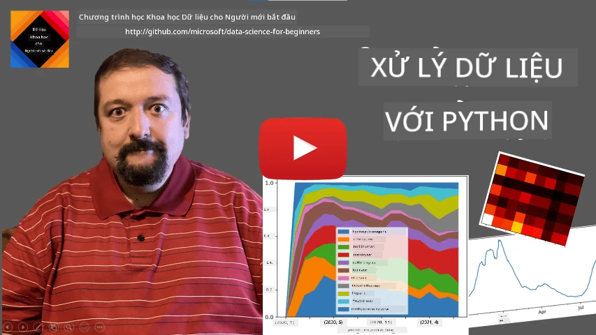
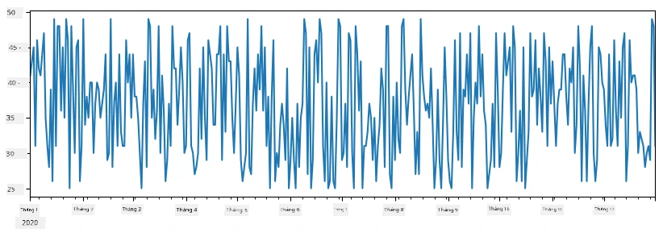
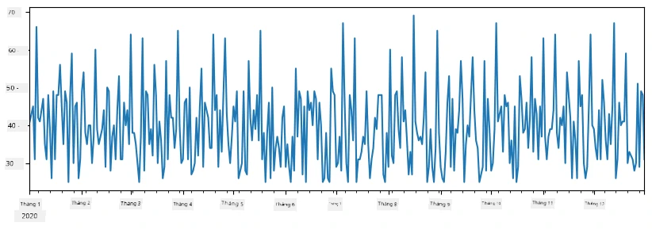
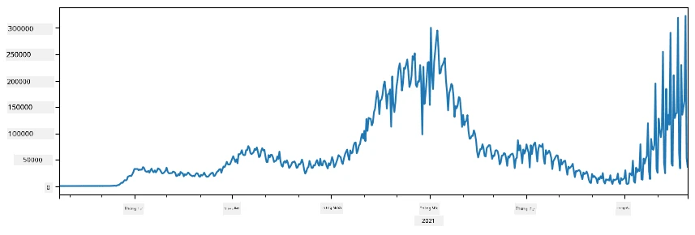

# Làm việc với Dữ liệu: Python và Thư viện Pandas

|  ](../../sketchnotes/07-WorkWithPython.png) |
| :-------------------------------------------------------------------------------------------------------: |
|                 Làm việc Với Python - _Sketchnote bởi [@nitya](https://twitter.com/nitya)_                 |

[](https://youtu.be/dZjWOGbsN4Y)

Trong khi các cơ sở dữ liệu cung cấp các cách rất hiệu quả để lưu trữ dữ liệu và truy vấn chúng bằng ngôn ngữ truy vấn, cách linh hoạt nhất để xử lý dữ liệu là viết chương trình của riêng bạn để thao tác dữ liệu. Trong nhiều trường hợp, thực hiện truy vấn cơ sở dữ liệu sẽ là cách hiệu quả hơn. Tuy nhiên trong một số trường hợp khi cần xử lý dữ liệu phức tạp hơn, điều đó không thể thực hiện dễ dàng bằng SQL.
Việc xử lý dữ liệu có thể được lập trình bằng bất kỳ ngôn ngữ lập trình nào, nhưng có những ngôn ngữ cấp cao hơn đối với làm việc với dữ liệu. Các nhà khoa học dữ liệu thường ưu tiên một trong các ngôn ngữ sau:

* **[Python](https://www.python.org/)**, một ngôn ngữ lập trình đa mục đích, thường được xem là một trong những lựa chọn tốt nhất cho người mới vì tính đơn giản của nó. Python có rất nhiều thư viện bổ sung giúp bạn giải quyết nhiều vấn đề thực tế, chẳng hạn như trích xuất dữ liệu từ tập tin nén ZIP, hoặc chuyển đổi hình ảnh sang dạng thang độ xám. Ngoài khoa học dữ liệu, Python cũng thường được sử dụng trong phát triển web.
* **[R](https://www.r-project.org/)** là bộ công cụ truyền thống được phát triển với việc xử lý dữ liệu thống kê trong tâm trí. Nó cũng chứa một kho thư viện lớn (CRAN), làm cho nó trở thành lựa chọn tốt để xử lý dữ liệu. Tuy nhiên, R không phải là một ngôn ngữ lập trình đa mục đích, và hiếm khi được sử dụng ngoài lĩnh vực khoa học dữ liệu.
* **[Julia](https://julialang.org/)** là một ngôn ngữ khác được phát triển đặc biệt cho khoa học dữ liệu. Nó nhằm mang lại hiệu năng tốt hơn Python, khiến nó trở thành công cụ tuyệt vời cho các thí nghiệm khoa học.

Trong bài học này, chúng ta sẽ tập trung vào việc sử dụng Python để xử lý dữ liệu đơn giản. Chúng ta sẽ giả định bạn đã biết các kiến thức cơ bản về ngôn ngữ này. Nếu bạn muốn một chuyến khám phá sâu hơn về Python, bạn có thể tham khảo một trong các tài nguyên sau:

* [Học Python một cách vui nhộn với Turtle Graphics và Fractals](https://github.com/shwars/pycourse) - Khóa học nhanh nhập môn Python trên GitHub
* [Những bước đầu tiên với Python](https://docs.microsoft.com/en-us/learn/paths/python-first-steps/?WT.mc_id=academic-77958-bethanycheum) Lộ trình học trên [Microsoft Learn](http://learn.microsoft.com/?WT.mc_id=academic-77958-bethanycheum)

Dữ liệu có thể có nhiều dạng khác nhau. Trong bài học này, chúng ta sẽ xem xét ba dạng dữ liệu - **dữ liệu bảng**, **văn bản** và **hình ảnh**.

Chúng ta sẽ tập trung vào một vài ví dụ về xử lý dữ liệu, thay vì đưa ra tổng quan đầy đủ về tất cả các thư viện liên quan. Điều này sẽ giúp bạn nắm được ý tưởng chính của những gì có thể làm được, và để bạn hiểu được nơi tìm giải pháp cho các vấn đề của mình khi cần.

> **Lời khuyên hữu ích nhất**. Khi bạn cần thực hiện một thao tác nào đó với dữ liệu mà bạn không biết làm thế nào, hãy thử tìm kiếm trên internet. [Stackoverflow](https://stackoverflow.com/) thường chứa rất nhiều mẫu mã hữu ích bằng Python cho nhiều nhiệm vụ điển hình.


## [Bài kiểm tra trước bài giảng](https://ff-quizzes.netlify.app/en/ds/quiz/12)

## Dữ liệu Bảng và Dataframes

Bạn đã từng gặp dữ liệu bảng khi chúng ta nói về cơ sở dữ liệu quan hệ. Khi bạn có nhiều dữ liệu, và nó nằm trong nhiều bảng liên kết khác nhau, thì chắc chắn việc sử dụng SQL để làm việc với nó là hợp lý. Tuy nhiên, có nhiều trường hợp khi chúng ta có một bảng dữ liệu, và cần thu thập một số **hiểu biết** hoặc **cái nhìn sâu sắc** về dữ liệu này, chẳng hạn như phân bố, mối tương quan giữa các giá trị, v.v. Trong khoa học dữ liệu, có rất nhiều trường hợp cần thực hiện một số biến đổi dữ liệu gốc, sau đó là trực quan hóa. Cả hai bước này đều có thể dễ dàng thực hiện bằng Python.

Có hai thư viện hữu ích nhất trong Python có thể giúp bạn xử lý dữ liệu bảng:
* **[Pandas](https://pandas.pydata.org/)** cho phép bạn thao tác với cái gọi là **Dataframes**, tương tự bảng quan hệ. Bạn có thể có các cột được đặt tên, và thực hiện các thao tác khác nhau trên hàng, cột và dataframe nói chung.
* **[Numpy](https://numpy.org/)** là thư viện để làm việc với **tensors**, tức là các **mảng** đa chiều. Mảng có các giá trị cùng kiểu dữ liệu cơ bản, và đơn giản hơn dataframe, nhưng nó cung cấp nhiều phép toán toán học hơn và tạo ra ít chi phí overhead hơn.

Cũng có một vài thư viện khác bạn nên biết đến:
* **[Matplotlib](https://matplotlib.org/)** là thư viện dùng cho trực quan hóa dữ liệu và vẽ biểu đồ
* **[SciPy](https://www.scipy.org/)** là thư viện chứa một số hàm khoa học bổ sung. Chúng ta đã từng gặp thư viện này khi nói về xác suất và thống kê

Dưới đây là đoạn mã bạn thường dùng để nhập các thư viện này ở đầu chương trình Python:
```python
import numpy as np
import pandas as pd
import matplotlib.pyplot as plt
from scipy import ... # bạn cần chỉ định chính xác các gói con mà bạn cần
``` 

Pandas xoay quanh một vài khái niệm cơ bản.

### Series

**Series** là một chuỗi các giá trị, tương tự như một danh sách hoặc mảng numpy. Sự khác biệt chính là series còn có **chỉ số (index)**, và khi bạn thao tác trên series (ví dụ, cộng chúng), chỉ số được tính đến. Chỉ số có thể đơn giản như số hàng kiểu số nguyên (đây là chỉ số mặc định khi tạo series từ danh sách hoặc mảng), hoặc có cấu trúc phức tạp hơn như khoảng thời gian ngày tháng.

> **Lưu ý**: Có một số code Pandas giới thiệu trong sổ tay kèm theo [`notebook.ipynb`](notebook.ipynb). Chúng tôi chỉ phác thảo vài ví dụ ở đây, và bạn chắc chắn có thể xem sổ tay đầy đủ.

Xem ví dụ: chúng ta muốn phân tích doanh số bán hàng của quán kem. Hãy tạo một dãy số doanh số (số món bán được mỗi ngày) trong một khoảng thời gian nhất định:

```python
start_date = "Jan 1, 2020"
end_date = "Mar 31, 2020"
idx = pd.date_range(start_date,end_date)
print(f"Length of index is {len(idx)}")
items_sold = pd.Series(np.random.randint(25,50,size=len(idx)),index=idx)
items_sold.plot()
```


Giả sử mỗi tuần chúng ta tổ chức một bữa tiệc cho bạn bè và mang thêm 10 hộp kem nữa. Chúng ta có thể tạo một series khác, được đánh chỉ số theo tuần, để biểu diễn điều đó:
```python
additional_items = pd.Series(10,index=pd.date_range(start_date,end_date,freq="W"))
```
Khi cộng hai series lại với nhau, chúng ta được tổng số:
```python
total_items = items_sold.add(additional_items,fill_value=0)
total_items.plot()
```


> **Lưu ý** rằng chúng ta không dùng cú pháp đơn giản `total_items+additional_items`. Nếu dùng, chúng ta sẽ nhận được nhiều giá trị `NaN` (*Not a Number*) trong series kết quả. Điều này vì có những giá trị thiếu sót ở một số điểm chỉ số trong series `additional_items`, và cộng `NaN` với bất cứ giá trị gì cũng ra `NaN`. Do đó chúng ta cần chỉ định tham số `fill_value` khi cộng.

Với chuỗi thời gian, ta cũng có thể **lấy mẫu lại (resample)** theo các khoảng thời gian khác nhau. Ví dụ, giả sử ta muốn tính giá trị trung bình doanh số theo tháng. Ta dùng đoạn mã sau:
```python
monthly = total_items.resample("1M").mean()
ax = monthly.plot(kind='bar')
```


### DataFrame

DataFrame về cơ bản là tập hợp các series có cùng chỉ số. Ta có thể kết hợp nhiều series lại thành một DataFrame:
```python
a = pd.Series(range(1,10))
b = pd.Series(["I","like","to","play","games","and","will","not","change"],index=range(0,9))
df = pd.DataFrame([a,b])
```
Điều này sẽ tạo ra một bảng ngang như sau:
|     | 0   | 1    | 2   | 3   | 4      | 5   | 6      | 7    | 8    |
| --- | --- | ---- | --- | --- | ------ | --- | ------ | ---- | ---- |
| 0   | 1   | 2    | 3   | 4   | 5      | 6   | 7      | 8    | 9    |
| 1   | I   | like | to  | use | Python | and | Pandas | very | much |

Chúng ta cũng có thể sử dụng Series làm cột, và chỉ định tên cột bằng từ điển:
```python
df = pd.DataFrame({ 'A' : a, 'B' : b })
```
Điều này tạo ra bảng như sau:

|     | A   | B      |
| --- | --- | ------ |
| 0   | 1   | I      |
| 1   | 2   | like   |
| 2   | 3   | to     |
| 3   | 4   | use    |
| 4   | 5   | Python |
| 5   | 6   | and    |
| 6   | 7   | Pandas |
| 7   | 8   | very   |
| 8   | 9   | much   |

**Lưu ý** rằng chúng ta cũng có thể có được bố cục bảng này bằng cách chuyển vị bảng trước đó, ví dụ viết 
```python
df = pd.DataFrame([a,b]).T.rename(columns={ 0 : 'A', 1 : 'B' })
```
Ở đây `.T` có nghĩa là thao tác chuyển vị DataFrame, tức là đổi hàng và cột, và thao tác `rename` cho phép đổi tên các cột cho phù hợp với ví dụ trước.

Đây là một vài thao tác quan trọng nhất mà ta có thể thực hiện trên DataFrame:

**Chọn cột**. Ta có thể chọn từng cột bằng cách viết `df['A']` - thao tác này trả về một Series. Ta cũng có thể chọn một tập con các cột vào DataFrame khác bằng cách viết `df[['B','A']]` - điều này trả về một DataFrame khác.

**Lọc** chỉ một số hàng dựa trên tiêu chí. Ví dụ, để giữ lại chỉ những hàng có giá trị cột `A` lớn hơn 5, ta viết `df[df['A']>5]`.

> **Lưu ý**: Cách lọc hoạt động như sau. Biểu thức `df['A']<5` trả về một series boolean, biểu thị giá trị đúng hay sai cho mỗi phần tử của series gốc `df['A']`. Khi series boolean được dùng làm chỉ số, nó trả về tập hợp con các hàng trong DataFrame. Do đó, không thể dùng biểu thức boolean Python tùy ý, ví dụ viết `df[df['A']>5 and df['A']<7]` sẽ sai. Thay vào đó, bạn nên dùng phép toán `&` trên các series boolean, viết `df[(df['A']>5) & (df['A']<7)]` (*dấu ngoặc rất quan trọng*).

**Tạo các cột mới có thể tính toán**. Ta có thể dễ dàng tạo cột tính toán mới cho DataFrame bằng biểu thức trực quan như sau:
```python
df['DivA'] = df['A']-df['A'].mean() 
``` 
Ví dụ này tính độ lệch của A khỏi giá trị trung bình của nó. Thực tế là chúng ta tính toán một series rồi gán nó cho bên trái, tạo ra một cột khác. Do đó, không thể dùng các thao tác không tương thích với series, ví dụ code dưới đây là sai:
```python
# Mã sai -> df['ADescr'] = "Low" nếu df['A'] < 5 else "Hi"
df['LenB'] = len(df['B']) # <- Kết quả sai
``` 
Ví dụ sau, mặc dù đúng cú pháp, cho kết quả sai vì nó gán độ dài của series `B` cho tất cả các giá trị trong cột, chứ không phải độ dài từng phần tử như mong muốn.

Nếu cần tính toán biểu thức phức tạp như vậy, ta có thể dùng hàm `apply`. Ví dụ cuối cùng có thể viết lại như sau:
```python
df['LenB'] = df['B'].apply(lambda x : len(x))
# hoặc
df['LenB'] = df['B'].apply(len)
```

Sau các thao tác trên, ta sẽ có DataFrame như sau:

|     | A   | B      | DivA | LenB |
| --- | --- | ------ | ---- | ---- |
| 0   | 1   | I      | -4.0 | 1    |
| 1   | 2   | like   | -3.0 | 4    |
| 2   | 3   | to     | -2.0 | 2    |
| 3   | 4   | use    | -1.0 | 3    |
| 4   | 5   | Python | 0.0  | 6    |
| 5   | 6   | and    | 1.0  | 3    |
| 6   | 7   | Pandas | 2.0  | 6    |
| 7   | 8   | very   | 3.0  | 4    |
| 8   | 9   | much   | 4.0  | 4    |

**Chọn hàng dựa trên số thứ tự** có thể dùng cấu trúc `iloc`. Ví dụ, chọn 5 hàng đầu tiên từ DataFrame:
```python
df.iloc[:5]
```

**Nhóm dữ liệu** thường dùng để lấy kết quả tương tự như *bảng tổng hợp (pivot tables)* trong Excel. Giả sử ta muốn tính giá trị trung bình của cột `A` ứng với từng giá trị `LenB`. Ta có thể nhóm DataFrame theo `LenB` rồi gọi hàm `mean`:
```python
df.groupby(by='LenB')[['A','DivA']].mean()
```
Nếu cần tính cả trung bình và số phần tử trong nhóm thì có thể dùng hàm `aggregate` phức tạp hơn:
```python
df.groupby(by='LenB') \
 .aggregate({ 'DivA' : len, 'A' : lambda x: x.mean() }) \
 .rename(columns={ 'DivA' : 'Count', 'A' : 'Mean'})
```
Điều này cho ta bảng kết quả sau:

| LenB | Count | Mean     |
| ---- | ----- | -------- |
| 1    | 1     | 1.000000 |
| 2    | 1     | 3.000000 |
| 3    | 2     | 5.000000 |
| 4    | 3     | 6.333333 |
| 6    | 2     | 6.000000 |

### Lấy dữ liệu


Chúng ta đã thấy việc tạo Series và DataFrames từ các đối tượng Python thật dễ dàng như thế nào. Tuy nhiên, dữ liệu thường ở dạng tệp văn bản hoặc bảng Excel. May mắn thay, Pandas cung cấp cho chúng ta một cách đơn giản để tải dữ liệu từ đĩa. Ví dụ, đọc tệp CSV đơn giản như thế này:
```python
df = pd.read_csv('file.csv')
```
Chúng ta sẽ xem thêm các ví dụ về tải dữ liệu, bao gồm lấy dữ liệu từ các trang web bên ngoài, trong phần "Thử thách"


### In ra và Vẽ biểu đồ

Một Nhà Khoa học Dữ liệu thường phải khám phá dữ liệu, vì vậy việc có thể trực quan hóa dữ liệu là rất quan trọng. Khi DataFrame lớn, nhiều khi chúng ta chỉ muốn chắc chắn rằng mọi việc đang được thực hiện đúng bằng cách in ra vài hàng đầu tiên. Việc này có thể làm bằng cách gọi `df.head()`. Nếu bạn chạy trong Jupyter Notebook, nó sẽ in DataFrame dưới dạng bảng rất đẹp.

Chúng ta cũng đã thấy cách sử dụng hàm `plot` để trực quan hóa một số cột. Mặc dù `plot` rất hữu ích cho nhiều nhiệm vụ, và hỗ trợ nhiều kiểu đồ thị khác nhau thông qua tham số `kind=`, bạn luôn có thể sử dụng thư viện `matplotlib` thô để vẽ các đồ thị phức tạp hơn. Chúng ta sẽ đi sâu vào trực quan dữ liệu cụ thể trong các bài học riêng biệt.

Bài tổng quan này bao gồm các khái niệm quan trọng nhất của Pandas, tuy nhiên, thư viện rất phong phú, và không có giới hạn với những gì bạn có thể làm với nó! Giờ hãy áp dụng kiến thức này để giải quyết một vấn đề cụ thể.

## 🚀 Thử thách 1: Phân tích sự lan truyền của COVID

Vấn đề đầu tiên chúng ta tập trung là mô hình hoá sự lây lan dịch bệnh COVID-19. Để làm điều đó, chúng ta sẽ sử dụng dữ liệu về số lượng người nhiễm ở các quốc gia khác nhau, do [Trung tâm Khoa học Hệ thống và Kỹ thuật](https://systems.jhu.edu/) (CSSE) tại [Đại học Johns Hopkins](https://jhu.edu/) cung cấp. Bộ dữ liệu có tại [Kho lưu trữ GitHub này](https://github.com/CSSEGISandData/COVID-19).

Vì chúng ta muốn minh họa cách xử lý dữ liệu, bạn hãy mở [`notebook-covidspread.ipynb`](notebook-covidspread.ipynb) và đọc từ trên xuống dưới. Bạn cũng có thể thực thi các ô và làm một số thử thách mà chúng tôi để lại cho bạn ở cuối.



> Nếu bạn chưa biết cách chạy code trong Jupyter Notebook, hãy xem [bài viết này](https://soshnikov.com/education/how-to-execute-notebooks-from-github/).

## Làm việc với dữ liệu không có cấu trúc

Mặc dù dữ liệu thường có dạng bảng, trong một số trường hợp chúng ta phải xử lý dữ liệu ít cấu trúc hơn, ví dụ như văn bản hoặc hình ảnh. Trong trường hợp này, để áp dụng các kỹ thuật xử lý dữ liệu mà chúng ta đã thấy ở trên, ta cần phải **trích xuất** dữ liệu có cấu trúc. Dưới đây là một vài ví dụ:

* Trích xuất các từ khóa từ văn bản, và xem tần suất xuất hiện của các từ khóa đó
* Sử dụng mạng neural để trích xuất thông tin về các đối tượng trong bức ảnh
* Lấy thông tin về cảm xúc của mọi người qua video camera

## 🚀 Thử thách 2: Phân tích các bài báo về COVID

Trong thử thách này, chúng ta sẽ tiếp tục với chủ đề đại dịch COVID, và tập trung vào xử lý các bài báo khoa học về chủ đề này. Có bộ dữ liệu [CORD-19 Dataset](https://www.kaggle.com/allen-institute-for-ai/CORD-19-research-challenge) với hơn 7000 (tại thời điểm viết) bài báo về COVID, có metadata và tóm tắt (và với khoảng một nửa trong số đó còn có bản đầy đủ).

Một ví dụ đầy đủ về phân tích bộ dữ liệu này sử dụng dịch vụ nhận thức [Text Analytics for Health](https://docs.microsoft.com/azure/cognitive-services/text-analytics/how-tos/text-analytics-for-health/?WT.mc_id=academic-77958-bethanycheum) được mô tả [trong bài viết blog này](https://soshnikov.com/science/analyzing-medical-papers-with-azure-and-text-analytics-for-health/). Chúng ta sẽ thảo luận phiên bản đơn giản hơn của phân tích này.

> **LƯU Ý**: Chúng tôi không cung cấp bản sao của bộ dữ liệu trong kho lưu trữ này. Bạn có thể cần tải trước tệp [`metadata.csv`](https://www.kaggle.com/allen-institute-for-ai/CORD-19-research-challenge?select=metadata.csv) từ [bộ dữ liệu trên Kaggle](https://www.kaggle.com/allen-institute-for-ai/CORD-19-research-challenge). Có thể yêu cầu đăng ký với Kaggle. Bạn cũng có thể tải bộ dữ liệu mà không cần đăng ký [tại đây](https://ai2-semanticscholar-cord-19.s3-us-west-2.amazonaws.com/historical_releases.html), nhưng nó sẽ bao gồm tất cả các bản đầy đủ ngoài tập tin metadata.

Mở [`notebook-papers.ipynb`](notebook-papers.ipynb) và đọc từ trên xuống dưới. Bạn cũng có thể chạy các ô và làm một số thử thách mà chúng tôi để lại cho bạn ở cuối.


## Xử lý dữ liệu hình ảnh

Gần đây, nhiều mô hình AI rất mạnh mẽ đã được phát triển giúp chúng ta hiểu được hình ảnh. Có nhiều nhiệm vụ có thể giải quyết thông qua các mạng neural đã được huấn luyện sẵn hoặc dịch vụ đám mây. Một số ví dụ bao gồm:

* **Phân loại hình ảnh**, giúp bạn phân loại hình ảnh vào một trong các lớp đã định nghĩa trước. Bạn có thể dễ dàng huấn luyện trình phân loại hình ảnh của riêng mình bằng các dịch vụ như [Custom Vision](https://azure.microsoft.com/services/cognitive-services/custom-vision-service/?WT.mc_id=academic-77958-bethanycheum)
* **Phát hiện đối tượng** để phát hiện các đối tượng khác nhau trong ảnh. Các dịch vụ như [computer vision](https://azure.microsoft.com/services/cognitive-services/computer-vision/?WT.mc_id=academic-77958-bethanycheum) có thể phát hiện nhiều đối tượng phổ biến, và bạn có thể huấn luyện mô hình [Custom Vision](https://azure.microsoft.com/services/cognitive-services/custom-vision-service/?WT.mc_id=academic-77958-bethanycheum) để phát hiện một số đối tượng cụ thể quan tâm.
* **Phát hiện khuôn mặt**, bao gồm phát hiện Tuổi, Giới tính và Cảm xúc. Việc này có thể thực hiện qua [Face API](https://azure.microsoft.com/services/cognitive-services/face/?WT.mc_id=academic-77958-bethanycheum).

Tất cả các dịch vụ đám mây này có thể được gọi thông qua [Python SDKs](https://docs.microsoft.com/samples/azure-samples/cognitive-services-python-sdk-samples/cognitive-services-python-sdk-samples/?WT.mc_id=academic-77958-bethanycheum), và do đó có thể dễ dàng tích hợp vào quy trình khám phá dữ liệu của bạn.

Dưới đây là một số ví dụ về khám phá dữ liệu từ nguồn dữ liệu hình ảnh:
* Trong bài viết blog [Học Khoa học Dữ liệu mà không cần viết code](https://soshnikov.com/azure/how-to-learn-data-science-without-coding/) chúng tôi khám phá ảnh Instagram, cố gắng hiểu điều gì khiến người ta thích một bức ảnh hơn. Trước tiên chúng tôi trích xuất càng nhiều thông tin từ các bức ảnh càng tốt bằng cách sử dụng [computer vision](https://azure.microsoft.com/services/cognitive-services/computer-vision/?WT.mc_id=academic-77958-bethanycheum), rồi sử dụng [Azure Machine Learning AutoML](https://docs.microsoft.com/azure/machine-learning/concept-automated-ml/?WT.mc_id=academic-77958-bethanycheum) để xây dựng mô hình dễ hiểu.
* Trong [Hội thảo Nghiên cứu Khuôn mặt](https://github.com/CloudAdvocacy/FaceStudies) chúng tôi sử dụng [Face API](https://azure.microsoft.com/services/cognitive-services/face/?WT.mc_id=academic-77958-bethanycheum) để trích xuất cảm xúc của người trong ảnh sự kiện, với mục đích hiểu điều gì làm mọi người vui vẻ.

## Kết luận

Cho dù bạn đã có dữ liệu có cấu trúc hay không có cấu trúc, sử dụng Python bạn có thể thực hiện tất cả các bước liên quan đến xử lý và hiểu dữ liệu. Đây có lẽ là cách xử lý dữ liệu linh hoạt nhất, và đó là lý do phần lớn các nhà khoa học dữ liệu sử dụng Python như công cụ chính của họ. Học Python sâu sắc có lẽ là một ý tưởng tốt nếu bạn nghiêm túc với hành trình khoa học dữ liệu của mình!

## [Bài kiểm tra sau bài giảng](https://ff-quizzes.netlify.app/en/ds/quiz/13)

## Ôn tập & Tự học

**Sách**
* [Wes McKinney. Python for Data Analysis: Data Wrangling with Pandas, NumPy, and IPython](https://www.amazon.com/gp/product/1491957662)

**Tài nguyên trực tuyến**
* Hướng dẫn chính thức [10 phút với Pandas](https://pandas.pydata.org/pandas-docs/stable/user_guide/10min.html)
* [Tài liệu về Trực quan hóa trong Pandas](https://pandas.pydata.org/pandas-docs/stable/user_guide/visualization.html)

**Học Python**
* [Học Python một cách vui nhộn với Turtle Graphics và Fractals](https://github.com/shwars/pycourse)
* [Bước đầu với Python](https://docs.microsoft.com/learn/paths/python-first-steps/?WT.mc_id=academic-77958-bethanycheum) trên [Microsoft Learn](http://learn.microsoft.com/?WT.mc_id=academic-77958-bethanycheum)

## Bài tập

[Thực hiện nghiên cứu dữ liệu chi tiết hơn cho các thử thách trên](assignment.md)

## Lời cảm ơn

Bài học này được tác giả với ♥️ bởi [Dmitry Soshnikov](http://soshnikov.com)

---

<!-- CO-OP TRANSLATOR DISCLAIMER START -->
**Tuyên bố miễn trừ trách nhiệm**:
Tài liệu này đã được dịch bằng dịch vụ dịch thuật AI [Co-op Translator](https://github.com/Azure/co-op-translator). Mặc dù chúng tôi cố gắng đảm bảo độ chính xác, xin lưu ý rằng bản dịch tự động có thể chứa lỗi hoặc sai sót. Tài liệu gốc bằng ngôn ngữ gốc nên được coi là nguồn tin chính thức. Đối với thông tin quan trọng, nên sử dụng dịch vụ dịch thuật chuyên nghiệp bởi con người. Chúng tôi không chịu trách nhiệm về bất kỳ hiểu lầm hoặc giải thích sai nào phát sinh từ việc sử dụng bản dịch này.
<!-- CO-OP TRANSLATOR DISCLAIMER END -->