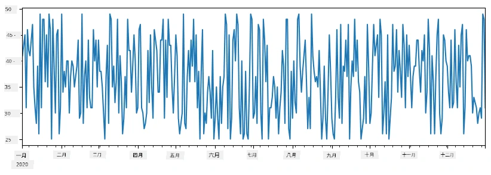
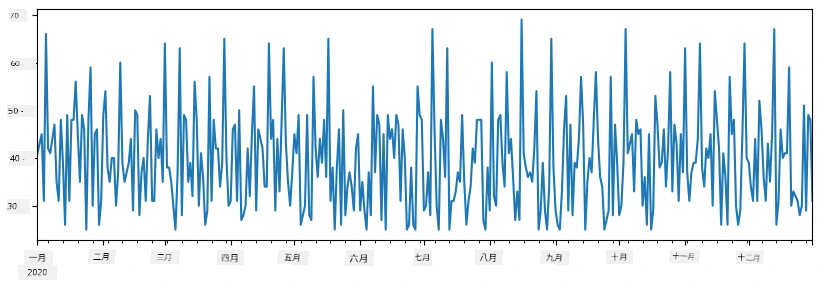
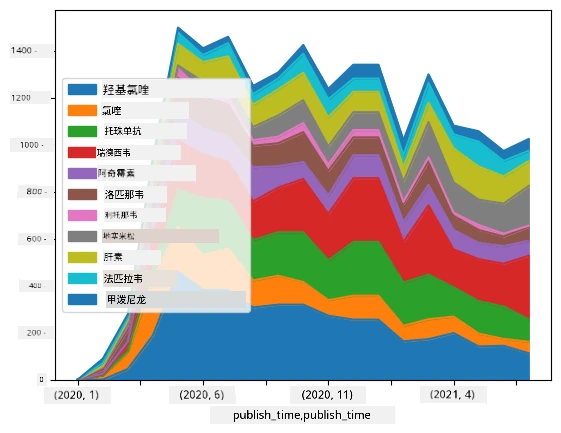

# 数据处理：Python 与 Pandas 库

|  制作的速写笔记 ](../../sketchnotes/07-WorkWithPython.png) |
| :-------------------------------------------------------------------------------------------------------: |
|                     使用 Python - _由 [@nitya](https://twitter.com/nitya) 制作的速写笔记_                    |

[](https://youtu.be/dZjWOGbsN4Y)

虽然数据库提供了非常高效的存储数据和使用查询语言查询数据的方式，但数据处理最灵活的方式是编写自己的程序来操作数据。在许多情况下，执行数据库查询会更有效。然而，有些情况需要更复杂的数据处理，使用 SQL 很难实现。  
数据处理可以用任何编程语言来编写，不过有些语言在处理数据方面有更高级的表现。数据科学家通常偏好以下几种语言：

* **[Python](https://www.python.org/)**，一种通用编程语言，通常因其简洁性被视为初学者的最佳选择之一。Python 拥有大量额外库，可以帮助解决许多实际问题，比如从 ZIP 压缩包中提取数据，或将图片转换为灰度图。除了数据科学之外，Python 也常用于网页开发。
* **[R](https://www.r-project.org/)** 是一个传统的工具箱，专门为统计数据处理开发。它还包含大型库仓库（CRAN），是进行数据处理的不错选择。然而，R 不是通用编程语言，在数据科学领域外很少使用。
* **[Julia](https://julialang.org/)** 是另一种专为数据科学开发的语言。它旨在比 Python 提供更好的性能，是科学实验的优秀工具。

本课将重点介绍使用 Python 进行简单数据处理。我们假设你对该语言有基本了解。如果你想更深入学习 Python，可以参考以下资源：

* [用 Turtle 图形和分形有趣地学习 Python](https://github.com/shwars/pycourse) - GitHub 上的 Python 编程快速入门课程
* [迈出 Python 的第一步](https://docs.microsoft.com/en-us/learn/paths/python-first-steps/?WT.mc_id=academic-77958-bethanycheum)，微软学习平台上的学习路径

数据可以有多种形式。本课将考虑三种数据形式——<strong>表格数据</strong>、<strong>文本</strong> 和 <strong>图像</strong>。

我们将重点介绍几种数据处理示例，而不是详尽介绍所有相关库。这有助于你掌握主要思想，并让你了解在需要时去哪里寻找解决方案。

> <strong>最有用的建议</strong>。当你需要对数据执行某种操作但不知道如何操作时，试着在网上搜索。[Stackoverflow](https://stackoverflow.com/) 通常包含很多关于典型任务的 Python 代码示例。 


## [课前测验](https://ff-quizzes.netlify.app/en/ds/quiz/12)

## 表格数据与数据框

当我们谈论关系型数据库时，你已经接触过表格数据。若数据量很大且包含多个相互关联的表，使用 SQL 处理数据显然更合适。不过，很多情况下仅有一张数据表，我们需要对数据获得一些<strong>理解</strong>或<strong>洞见</strong>，比如分布情况、值之间的相关性等。在数据科学中，常常需要对原始数据做一些变换，然后进行可视化。上述步骤都可以用 Python 轻松完成。

Python 中有两个非常有用的库可以帮助你处理表格数据：
* **[Pandas](https://pandas.pydata.org/)** 支持操作所谓的 **数据框（Dataframes）**，类似关系型表。你可以有命名列，并对行、列以及整体数据框执行各种操作。
* **[Numpy](https://numpy.org/)** 是用于处理 <strong>张量</strong>，即多维 <strong>数组</strong> 的库。数组内元素类型相同，结构比数据框简单，但提供更多数学运算，且占用开销更小。

另外还有几个你应该了解的库：
* **[Matplotlib](https://matplotlib.org/)** 用于数据可视化和绘图
* **[SciPy](https://www.scipy.org/)** 附加科学计算功能的库。我们在讲概率和统计时已经遇到过它

下面这段代码是你通常在 Python 程序开头导入上述库的写法：
```python
import numpy as np
import pandas as pd
import matplotlib.pyplot as plt
from scipy import ... # 你需要指定你需要的确切子包
``` 

Pandas 围绕几个基本概念展开。

### 序列（Series）

**Series** 是值的序列，类似列表或 numpy 数组。主要区别是序列还有一个<strong>索引</strong>，操作序列时（如相加）会考虑索引。索引可以是简单的整数行号（当从列表或数组创建序列时默认索引），也可以是复杂结构，比如日期区间。

> <strong>注</strong>：伴随教材中有一些基础 Pandas 代码，见 [`notebook.ipynb`](notebook.ipynb)。这里仅列举部分示例，你可以查看完整笔记本。

举个例子：我们想分析冰淇淋店的销售额。生成一个销售数量序列（每天售出数量）如下：

```python
start_date = "Jan 1, 2020"
end_date = "Mar 31, 2020"
idx = pd.date_range(start_date,end_date)
print(f"Length of index is {len(idx)}")
items_sold = pd.Series(np.random.randint(25,50,size=len(idx)),index=idx)
items_sold.plot()
```


假设每周我们为朋友举办派对，额外准备 10 包冰淇淋。可以创建另一个以周为索引的序列表示：
```python
additional_items = pd.Series(10,index=pd.date_range(start_date,end_date,freq="W"))
```
把两个序列相加，得到总数：
```python
total_items = items_sold.add(additional_items,fill_value=0)
total_items.plot()
```


> <strong>注意</strong>，这里没有使用简单写法 `total_items+additional_items`。若用简单写法，会得到很多 `NaN`（非数字）值。因为 `additional_items` 序列在某些索引处缺失值，而任何数加 `NaN` 仍为 `NaN`。所以相加时要指定 `fill_value` 参数。

对时间序列，还可以用不同时间间隔进行<strong>重采样</strong>。例如要计算月均销售量，可以用以下代码：
```python
monthly = total_items.resample("1M").mean()
ax = monthly.plot(kind='bar')
```


### 数据框（DataFrame）

数据框本质上是同一索引的多个序列集合。我们可以把几个序列合并为一个数据框：
```python
a = pd.Series(range(1,10))
b = pd.Series(["I","like","to","play","games","and","will","not","change"],index=range(0,9))
df = pd.DataFrame([a,b])
```
这会创建如下横向表格：
|     | 0   | 1    | 2   | 3   | 4      | 5   | 6      | 7    | 8    |
| --- | --- | ---- | --- | --- | ------ | --- | ------ | ---- | ---- |
| 0   | 1   | 2    | 3   | 4   | 5      | 6   | 7      | 8    | 9    |
| 1   | I   | like | to  | use | Python | and | Pandas | very | much |

也可以用序列作为列，通过字典指定列名：
```python
df = pd.DataFrame({ 'A' : a, 'B' : b })
```
生成如下表格：

|     | A   | B      |
| --- | --- | ------ |
| 0   | 1   | I      |
| 1   | 2   | like   |
| 2   | 3   | to     |
| 3   | 4   | use    |
| 4   | 5   | Python |
| 5   | 6   | and    |
| 6   | 7   | Pandas |
| 7   | 8   | very   |
| 8   | 9   | much   |

<strong>注意</strong>也可以通过转置上表得到这种布局，例如写成
```python
df = pd.DataFrame([a,b]).T.rename(columns={ 0 : 'A', 1 : 'B' })
```
这里 `.T` 表示转置操作，即行列转换，`rename` 操作用于重命名列使其匹配上述示例。

以下是我们常用的数据框操作：

<strong>选列</strong>。用 `df['A']` 选择单列返回序列。用 `df[['B','A']]` 选择多列返回数据框。

<strong>按条件过滤行</strong>。例如保留列 `A` 大于 5 的行，可以写 `df[df['A']>5]`。

> <strong>注意</strong>：过滤通过布尔序列实现。表达式 `df['A']<5` 返回布尔序列表示每个元素是否满足条件，布尔序列用作索引返回满足条件的行。不能使用普通布尔表达式，比如 `df[df['A']>5 and df['A']<7]` 是错误的。应使用专用的 `&` 运算符，写成 `df[(df['A']>5) & (df['A']<7)]`（括号很重要）。

<strong>创建可计算新列</strong>。可以用直观表达式轻松创建新列：
```python
df['DivA'] = df['A']-df['A'].mean() 
``` 
示例中计算了列 A 与其均值的差值。实际上是先计算出一个序列，然后赋值为新列。故不能用不支持序列的操作，例如，下面代码是错误写法：
```python
# 错误的代码 -> df['ADescr'] = "Low" if df['A'] < 5 else "Hi"
df['LenB'] = len(df['B']) # <- 错误的结果
``` 
该例语法正确，但返回错误结果，因为它将序列 `B` 的长度赋给所有单元格，而不是每个元素的长度。

若计算复杂表达式，可用 `apply` 函数。上述例子可写成：
```python
df['LenB'] = df['B'].apply(lambda x : len(x))
# 或者
df['LenB'] = df['B'].apply(len)
```

经过上述操作，我们将得到如下数据框：

|     | A   | B      | DivA | LenB |
| --- | --- | ------ | ---- | ---- |
| 0   | 1   | I      | -4.0 | 1    |
| 1   | 2   | like   | -3.0 | 4    |
| 2   | 3   | to     | -2.0 | 2    |
| 3   | 4   | use    | -1.0 | 3    |
| 4   | 5   | Python | 0.0  | 6    |
| 5   | 6   | and    | 1.0  | 3    |
| 6   | 7   | Pandas | 2.0  | 6    |
| 7   | 8   | very   | 3.0  | 4    |
| 8   | 9   | much   | 4.0  | 4    |

<strong>基于行号选择行</strong>，可用 `iloc`。比如选择前5行：
```python
df.iloc[:5]
```

<strong>分组</strong>常用于实现类似 Excel 数据透视表的功能。假设想对每个 `LenB` 值计算列 `A` 的均值，可以用 `LenB` 分组，再调用 `mean`：
```python
df.groupby(by='LenB')[['A','DivA']].mean()
```
如果要计算均值和组内元素数量，可用更复杂的 `aggregate` 函数：
```python
df.groupby(by='LenB') \
 .aggregate({ 'DivA' : len, 'A' : lambda x: x.mean() }) \
 .rename(columns={ 'DivA' : 'Count', 'A' : 'Mean'})
```
得到如下表：

| LenB | Count | Mean     |
| ---- | ----- | -------- |
| 1    | 1     | 1.000000 |
| 2    | 1     | 3.000000 |
| 3    | 2     | 5.000000 |
| 4    | 3     | 6.333333 |
| 6    | 2     | 6.000000 |

### 获取数据


我们已经看到，从Python对象构建Series和DataFrame是多么简单。然而，数据通常以文本文件或Excel表格的形式出现。幸运的是，Pandas为我们提供了一种简便的方法从磁盘加载数据。例如，读取CSV文件就像这样简单：
```python
df = pd.read_csv('file.csv')
```
我们将在“挑战”部分看到更多加载数据的例子，包括从外部网站抓取数据


### 打印和绘图

数据科学家经常需要探索数据，因此能够将其可视化非常重要。当DataFrame很大时，很多时候我们只想通过打印前几行来确认一切操作正确。这可以通过调用`df.head()`来完成。如果你在Jupyter Notebook中运行，它会以漂亮的表格形式打印DataFrame。

我们还见过使用`plot`函数来可视化某些列。虽然`plot`对许多任务非常有用，并且通过`kind=`参数支持多种图形类型，你也可以使用原生的`matplotlib`库绘制更复杂的图形。我们将在其他课程详细讲解数据可视化。

本概述涵盖了Pandas的大部分重要概念，然而，这个库功能丰富，你可以用它做的事情没有限制！现在让我们用这些知识解决具体问题。

## 🚀 挑战1：分析COVID传播

我们首先关注的问题是COVID-19流行病传播建模。为此，我们将使用约翰霍普金斯大学（[Johns Hopkins University](https://jhu.edu/)）[系统科学与工程中心](https://systems.jhu.edu/)（CSSE）提供的不同国家感染人数数据。数据集可在[此GitHub仓库](https://github.com/CSSEGISandData/COVID-19)找到。

由于我们想展示如何处理数据，邀请你打开[`notebook-covidspread.ipynb`](notebook-covidspread.ipynb)从头到尾阅读。你也可以执行代码单元，并完成我们在最后留下的挑战。


> 如果你不知道如何在Jupyter Notebook中运行代码，请查看[这篇文章](https://soshnikov.com/education/how-to-execute-notebooks-from-github/)。

## 处理非结构化数据

虽然数据经常以表格形式出现，但有些情况下我们需要处理较少结构化的数据，例如文本或图像。此时，要应用之前看到的数据处理技术，我们需要以某种方式<strong>提取</strong>结构化数据。这里有几个例子：

* 从文本中提取关键词，并统计关键词出现的频率
* 使用神经网络提取图像中对象的信息
* 从视频摄像头画面中获取人物情绪信息

## 🚀 挑战2：分析COVID论文

这次挑战我们将继续聚焦COVID疫情主题，处理相关科学论文。CORD-19数据集（[CORD-19 Dataset](https://www.kaggle.com/allen-institute-for-ai/CORD-19-research-challenge)）含有超过7000篇（撰写时）关于COVID的论文，提供元数据和摘要（大约一半论文也提供了全文）。

使用[Text Analytics for Health](https://docs.microsoft.com/azure/cognitive-services/text-analytics/how-tos/text-analytics-for-health/?WT.mc_id=academic-77958-bethanycheum)认知服务分析该数据集的完整示例，见[这篇博客文章](https://soshnikov.com/science/analyzing-medical-papers-with-azure-and-text-analytics-for-health/)。我们将讨论此分析的简化版本。

> <strong>注意</strong>：我们不提供数据集副本作为本仓库的一部分。你首先可能需要从[Kaggle上的数据集](https://www.kaggle.com/allen-institute-for-ai/CORD-19-research-challenge?select=metadata.csv)下载[`metadata.csv`](https://www.kaggle.com/allen-institute-for-ai/CORD-19-research-challenge?select=metadata.csv)文件。使用Kaggle可能需要注册。你也可以从[这里](https://ai2-semanticscholar-cord-19.s3-us-west-2.amazonaws.com/historical_releases.html)下载数据集（无需注册），但会包含全文和元数据文件。

打开[`notebook-papers.ipynb`](notebook-papers.ipynb)从头到尾阅读。你也可以执行代码单元，并完成我们在最后留下的挑战。



## 处理图像数据

最近，开发了非常强大的AI模型，使我们能够理解图像。有许多任务可以使用预训练神经网络或云服务解决。例子包括：

* <strong>图像分类</strong>，可以帮助你将图像归类到预定义类别之一。你可以使用如[Custom Vision](https://azure.microsoft.com/services/cognitive-services/custom-vision-service/?WT.mc_id=academic-77958-bethanycheum)等服务轻松训练自己的图像分类器
* <strong>物体检测</strong>，检测图像中的不同物体。像[计算机视觉](https://azure.microsoft.com/services/cognitive-services/computer-vision/?WT.mc_id=academic-77958-bethanycheum)服务能够检测许多常见物体，你也可以训练[Custom Vision](https://azure.microsoft.com/services/cognitive-services/custom-vision-service/?WT.mc_id=academic-77958-bethanycheum)模型来检测特定感兴趣物体。
* <strong>人脸检测</strong>，包括年龄、性别和情绪检测。可以通过[Face API](https://azure.microsoft.com/services/cognitive-services/face/?WT.mc_id=academic-77958-bethanycheum)完成。

所有这些云服务都可以通过[Python SDK](https://docs.microsoft.com/samples/azure-samples/cognitive-services-python-sdk-samples/cognitive-services-python-sdk-samples/?WT.mc_id=academic-77958-bethanycheum)调用，从而轻松融入数据探索工作流。

这里有一些使用图像数据源探索数据的例子：
* 在博客文章[如何无代码学习数据科学](https://soshnikov.com/azure/how-to-learn-data-science-without-coding/)中，我们探索Instagram照片，尝试理解什么因素令照片获得更多点赞。我们首先使用[计算机视觉](https://azure.microsoft.com/services/cognitive-services/computer-vision/?WT.mc_id=academic-77958-bethanycheum)提取尽可能多的图像信息，然后使用[Azure机器学习AutoML](https://docs.microsoft.com/azure/machine-learning/concept-automated-ml/?WT.mc_id=academic-77958-bethanycheum)构建可解释模型。
* 在[面部研究工作坊](https://github.com/CloudAdvocacy/FaceStudies)中，我们使用[Face API](https://azure.microsoft.com/services/cognitive-services/face/?WT.mc_id=academic-77958-bethanycheum)提取活动照片中人物的情绪，以尝试理解什么让人快乐。

## 结论

无论你已经拥有结构化还是非结构化数据，使用Python你都可以完成所有与数据处理和理解相关的步骤。这可能是数据处理最灵活的方式，这也是为何大多数数据科学家将Python作为主要工具的原因。如果你认真对待数据科学之路，深入学习Python是个好主意！

## [课后测验](https://ff-quizzes.netlify.app/en/ds/quiz/13)

## 复习与自学

<strong>书籍</strong>
* [Wes McKinney. Python数据分析：用Pandas、NumPy和IPython进行数据处理](https://www.amazon.com/gp/product/1491957662)

<strong>在线资源</strong>
* 官方[10分钟学Pandas](https://pandas.pydata.org/pandas-docs/stable/user_guide/10min.html)教程
* [Pandas可视化文档](https://pandas.pydata.org/pandas-docs/stable/user_guide/visualization.html)

**学习Python**
* [通过海龟绘图和分形以有趣方式学习Python](https://github.com/shwars/pycourse)
* 在[Microsoft Learn](http://learn.microsoft.com/?WT.mc_id=academic-77958-bethanycheum)上的[Python入门学习路径](https://docs.microsoft.com/learn/paths/python-first-steps/?WT.mc_id=academic-77958-bethanycheum)

## 作业

[对以上挑战进行更详细的数据研究](assignment.md)

## 致谢

本课由[Dmitry Soshnikov](http://soshnikov.com)满载 ♥️ 撰写

---

<!-- CO-OP TRANSLATOR DISCLAIMER START -->
**免责声明**：
本文件由 AI 翻译服务 [Co-op Translator](https://github.com/Azure/co-op-translator) 翻译完成。尽管我们力求准确，但请注意，自动翻译可能包含错误或不准确之处。原始语言版文件应视为权威来源。对于重要信息，建议使用专业人工翻译。我们对因使用本翻译而产生的任何误解或误释不承担责任。
<!-- CO-OP TRANSLATOR DISCLAIMER END -->