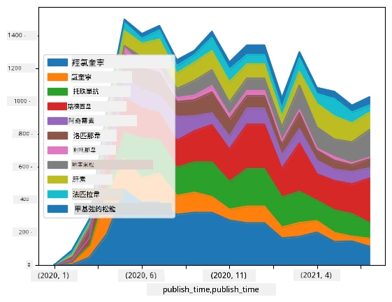

# 處理數據：Python 與 Pandas 庫

|  繪製 ](../../sketchnotes/07-WorkWithPython.png) |
| :-------------------------------------------------------------------------------------------------------: |
|                 使用 Python - _筆記手稿由 [@nitya](https://twitter.com/nitya) 繪製_                 |

[](https://youtu.be/dZjWOGbsN4Y)

雖然資料庫提供了非常有效的方式來儲存資料並使用查詢語言取用，但最靈活的資料處理方式是撰寫自己的程式來操作資料。在很多情況下，使用資料庫查詢會是一個較有效率的方式。然而，在有些需要更複雜資料處理的情況下，SQL 並不容易達成。  
資料處理可以用任何程式語言來撰寫，但有些語言在處理資料方面屬於較高階。資料科學家通常偏好以下其中一種語言：

* **[Python](https://www.python.org/)**，一種通用程式語言，因其簡潔易懂而常被視為初學者最佳選擇之一。Python 擁有許多附加函式庫，能幫助你解決許多實務問題，如從 ZIP 壓縮檔萃取資料，或將圖片轉為灰階。除了資料科學外，Python 也常用於網頁開發。  
* **[R](https://www.r-project.org/)** 是一個以統計資料處理為本的傳統工具箱。它也擁有龐大的函式庫倉庫 (CRAN)，使它成為資料處理的好選擇。但 R 並非通用程式語言，且很少用於資料科學以外的領域。  
* **[Julia](https://julialang.org/)** 是另一種專為資料科學開發的語言，意在提供比 Python 更佳的效能，非常適合科學實驗。  

本課程將聚焦於使用 Python 進行簡單資料處理。我們假設你具備基本的 Python 知識。如果你想更深入了解 Python，可以參考以下資源：

* [以海龜圖形與分形趣學 Python](https://github.com/shwars/pycourse) - GitHub 上快速入門 Python 程式設計課程  
* [開始使用 Python](https://docs.microsoft.com/en-us/learn/paths/python-first-steps/?WT.mc_id=academic-77958-bethanycheum) 微軟學習平台學習路徑  

資料有許多形式。本課程將考慮三種資料形式 — <strong>表格資料</strong>、<strong>文字</strong> 與 <strong>圖片</strong>。

我們將著重在幾個資料處理示例，而非全面介紹所有相關函式庫。這樣能讓你了解可行的主要方法，並知道未來需找解決方案時的方向。  

> <strong>最重要的建議</strong>：當你需要對資料執行某些不懂的方法時，嘗試上網搜尋。[Stackoverflow](https://stackoverflow.com/) 通常有很多有用的 Python 程式碼範例，涵蓋多數常見任務。  


## [課前測驗](https://ff-quizzes.netlify.app/en/ds/quiz/12)

## 表格資料與資料框

當我們談到關聯式資料庫時，你已經接觸過表格資料。當資料繁多且分散於多個相互關聯的表格中，使用 SQL 工作肯定更合理。然而，有很多情況是我們擁有一個資料表，想從中獲得關於資料的 <strong>理解</strong> 或 <strong>洞見</strong>，例如分佈、變數間的關聯等。在資料科學中，我們經常需要對原始資料做出轉換，接著做視覺化。上述兩步驟均可輕鬆用 Python 完成。  

Python 中有兩個最實用的函式庫可助你處理表格資料：
* **[Pandas](https://pandas.pydata.org/)** 允許你操作所謂的 <strong>資料框</strong>（Dataframes），類似關聯資料表。你可以設定命名欄位，並對列、欄及整體資料框執行不同操作。  
* **[Numpy](https://numpy.org/)** 是一個用於處理 <strong>張量</strong>，即多維 <strong>陣列</strong> 的函式庫。陣列中所有值具有相同底層型態，結構較資料框簡單，數學運算較多且負擔較小。  

還有幾個你應該了解的函式庫：
* **[Matplotlib](https://matplotlib.org/)** 是資料視覺化及繪圖函式庫  
* **[SciPy](https://www.scipy.org/)** 提供額外科學計算功能。我們在談論機率與統計時已接觸此函式庫  

以下是你通常在 Python 程式開頭用來匯入這些函式庫的程式碼：
```python
import numpy as np
import pandas as pd
import matplotlib.pyplot as plt
from scipy import ... # 你需要指定你需要的確切子包
``` 

Pandas 以幾個基本概念為核心。

### 系列 (Series)

**Series** 是一列值的序列，類似串列或 numpy 陣列。主要差別是系列有個 <strong>索引</strong>，對系列執行運算（例如加法）時會考慮索引。索引可以很簡單，比如整數行號（預設由串列或陣列建立系列時使用的索引），也可以有複雜結構，如日期區間。  

> <strong>注意</strong>：在附贈筆記本 [`notebook.ipynb`](notebook.ipynb) 中，有些 Pandas 的入門程式碼。我們此處僅概述部分範例，你完全可以查看完整筆記本。  

舉個例子：我們想分析冰淇淋店的銷售情況。生成一段期間內每日銷售量（售出商品數量）的系列：  

```python
start_date = "Jan 1, 2020"
end_date = "Mar 31, 2020"
idx = pd.date_range(start_date,end_date)
print(f"Length of index is {len(idx)}")
items_sold = pd.Series(np.random.randint(25,50,size=len(idx)),index=idx)
items_sold.plot()
```


假設每週我們都會為朋友聚會額外準備 10 包冰淇淋。我們可建立另一個以週為索引的系列，來展示此情況：  
```python
additional_items = pd.Series(10,index=pd.date_range(start_date,end_date,freq="W"))
```
兩個系列相加可得總數：  
```python
total_items = items_sold.add(additional_items,fill_value=0)
total_items.plot()
```


> <strong>注意</strong> 我們沒有用簡單語法 `total_items+additional_items`，因為這麼做會讓結果系列出現許多 `NaN`（非數值）值。原因是 `additional_items` 系列中某些索引有缺值，加上 `NaN` 會仍然是 `NaN`。因此，我們必須在加法時指明 `fill_value` 參數。  

對時間序列，我們也能以不同時間間隔 <strong>重取樣</strong>。例如，我們想算每月銷售量平均，可用如下程式碼：  
```python
monthly = total_items.resample("1M").mean()
ax = monthly.plot(kind='bar')
```


### 資料框 (DataFrame)

資料框本質上是具有相同索引的一組系列組合。我們可以將多個系列組合成資料框：  
```python
a = pd.Series(range(1,10))
b = pd.Series(["I","like","to","play","games","and","will","not","change"],index=range(0,9))
df = pd.DataFrame([a,b])
```
這會建立一個橫向表格如下：  
|     | 0   | 1    | 2   | 3   | 4      | 5   | 6      | 7    | 8    |
| --- | --- | ---- | --- | --- | ------ | --- | ------ | ---- | ---- |
| 0   | 1   | 2    | 3   | 4   | 5      | 6   | 7      | 8    | 9    |
| 1   | I   | like | to  | use | Python | and | Pandas | very | much |

我們也可以用系列當作欄，利用字典指定欄名：  
```python
df = pd.DataFrame({ 'A' : a, 'B' : b })
```
這會得到如下表格：

|     | A   | B      |
| --- | --- | ------ |
| 0   | 1   | I      |
| 1   | 2   | like   |
| 2   | 3   | to     |
| 3   | 4   | use    |
| 4   | 5   | Python |
| 5   | 6   | and    |
| 6   | 7   | Pandas |
| 7   | 8   | very   |
| 8   | 9   | much   |

<strong>注意</strong>，我們也可以透過轉置前一表格來得到這樣的欄列排版，例如寫成  
```python
df = pd.DataFrame([a,b]).T.rename(columns={ 0 : 'A', 1 : 'B' })
```
`.T` 表示將資料框轉置，即將行列互換，而 `rename` 可重命名欄位以符合前例。  

以下為資料框可執行的一些重要操作：

<strong>欄位選擇</strong>。我們可以用 `df['A']` 選取單一欄，該操作回傳一個系列。也能用 `df[['B','A']]` 選取多個欄，回傳另一資料框。  

<strong>根據條件篩選行</strong>。例如想保留欄 `A` 大於 5 的行，可寫成 `df[df['A']>5]`。  

> <strong>注意</strong>：篩選結果的運作方式如下：表達式 `df['A']<5` 會回傳一個布林系列，指出原系列中每個元素是否符合條件。以布林系列索引時，會回傳符合條件的資料框子集。因此不能直接用 Python 的一般布林運算，例如寫 `df[df['A']>5 and df['A']<7]` 是錯誤的。正確應用是使用 `&` 運算子，寫成 `df[(df['A']>5) & (df['A']<7)]`（<em>括號不可省略</em>）。  

<strong>建立新計算欄位</strong>。可使用直覺式表達式輕鬆為資料框建立新欄：  
```python
df['DivA'] = df['A']-df['A'].mean() 
``` 
此範例計算 A 欄與其平均值的偏差。實際上是在計算系列，再將該系列指派給左邊，形成新欄。因此，不能使用不支援系列的運算，下例即錯誤：  
```python
# 錯誤的程式碼 -> df['ADescr'] = "Low" 如果 df['A'] < 5 否則 "Hi"
df['LenB'] = len(df['B']) # <- 錯誤的結果
``` 
後者範例雖符合語法，但會產生錯誤結果，因為它將系列 B 的長度指派給所有欄位，而非我們想要的個別元素長度。  

若要計算像這樣的複雜表達式，可用 `apply` 函數。上例改寫如下：  
```python
df['LenB'] = df['B'].apply(lambda x : len(x))
# 或者
df['LenB'] = df['B'].apply(len)
```

以上操作完成後，我們會得到以下資料框：  

|     | A   | B      | DivA | LenB |
| --- | --- | ------ | ---- | ---- |
| 0   | 1   | I      | -4.0 | 1    |
| 1   | 2   | like   | -3.0 | 4    |
| 2   | 3   | to     | -2.0 | 2    |
| 3   | 4   | use    | -1.0 | 3    |
| 4   | 5   | Python | 0.0  | 6    |
| 5   | 6   | and    | 1.0  | 3    |
| 6   | 7   | Pandas | 2.0  | 6    |
| 7   | 8   | very   | 3.0  | 4    |
| 8   | 9   | much   | 4.0  | 4    |

<strong>用數字選取行</strong> 可以用 `iloc` 結構。例如，要選取前 5 行：  
```python
df.iloc[:5]
```

<strong>群組</strong> 經常用來達成類似 Excel 中 <em>樞紐分析表</em> 功能。假設想算同一個 `LenB` 下欄 `A` 的平均值，可透過依 `LenB` 分組並呼叫 `mean`：  
```python
df.groupby(by='LenB')[['A','DivA']].mean()
```
若想同時計算平均與組內元素數量，可用更複雜的 `aggregate` 函數：  
```python
df.groupby(by='LenB') \
 .aggregate({ 'DivA' : len, 'A' : lambda x: x.mean() }) \
 .rename(columns={ 'DivA' : 'Count', 'A' : 'Mean'})
```
結果為下表：  

| LenB | Count | Mean     |
| ---- | ----- | -------- |
| 1    | 1     | 1.000000 |
| 2    | 1     | 3.000000 |
| 3    | 2     | 5.000000 |
| 4    | 3     | 6.333333 |
| 6    | 2     | 6.000000 |

### 取得資料


我們已經看到從 Python 物件構建 Series 和 DataFrames 是多麼容易。然而，數據通常以文本文件或 Excel 表格的形式出現。幸運的是，Pandas 為我們提供了一種從磁碟載入數據的簡單方法。例如，讀取 CSV 文件就這麼簡單：
```python
df = pd.read_csv('file.csv')
```
我們將在「挑戰」部分看到更多載入數據的範例，包括從外部網站抓取數據


### 列印與繪圖

數據科學家經常需要探索數據，因此能夠視覺化數據非常重要。當 DataFrame 很大時，我們通常只想列印前幾行以確認一切是否正確。這可以通過呼叫 `df.head()` 完成。如果你是從 Jupyter Notebook 執行，它會以漂亮的表格形式列出 DataFrame。

我們也見過使用 `plot` 函數來視覺化某些欄位。雖然 `plot` 對許多任務很有用，且透過 `kind=` 參數支援多種圖表類型，但你也可以隨時使用原生 `matplotlib` 庫來繪製更複雜的圖形。我們會在後續課程中詳細介紹數據視覺化。

本概述涵蓋了 Pandas 的大多數重要概念，然而該庫功能非常豐富，你可以用它做的事不勝枚舉！現在，讓我們將這些知識應用到具體問題的解決中。

## 🚀 挑戰 1：分析 COVID 傳播

我們首先聚焦的問題是 COVID-19 疫情擴散的建模。為此，我們將使用約翰霍普金斯大學系統科學與工程中心（[Center for Systems Science and Engineering](https://systems.jhu.edu/) (CSSE)）提供的不同國家感染人數資料。資料集存放於[此 GitHub 倉庫](https://github.com/CSSEGISandData/COVID-19)。

因為我們想演示如何處理數據，邀請你打開 [`notebook-covidspread.ipynb`](notebook-covidspread.ipynb) 從上到下閱讀。你也可以執行儲存格，並挑戰我們最後留給你的練習。


> 如果你不知道如何在 Jupyter Notebook 中執行程式碼，可參考[這篇文章](https://soshnikov.com/education/how-to-execute-notebooks-from-github/)。

## 處理非結構化數據

雖然數據經常是以表格形式出現，但在某些情況下我們需要處理較不結構化的數據，例如文字或影像。此時，為了應用之前所學的數據處理技術，我們需要以某種方式<strong>提取</strong>結構化數據。以下是幾個範例：

* 從文本中提取關鍵詞，並觀察這些關鍵詞出現的頻率
* 使用神經網路從圖片中提取物件資訊
* 從影片鏡頭中獲取人物情緒資訊

## 🚀 挑戰 2：分析 COVID 研究論文

在這個挑戰中，我們將持續探討 COVID 疫情主題，並聚焦於處理相關科學論文。有一個 [CORD-19 資料集](https://www.kaggle.com/allen-institute-for-ai/CORD-19-research-challenge)，截至撰寫時超過7000篇與 COVID 相關的論文，含元數據與摘要（其中約一半也提供全文）。

使用 [Text Analytics for Health](https://docs.microsoft.com/azure/cognitive-services/text-analytics/how-tos/text-analytics-for-health/?WT.mc_id=academic-77958-bethanycheum) 認知服務分析此資料集的完整範例，描述於[這篇部落格文章](https://soshnikov.com/science/analyzing-medical-papers-with-azure-and-text-analytics-for-health/)。我們將探討該分析的簡化版本。

> <strong>注意</strong>：本倉庫不提供資料集複本。你需要先從[此 Kaggle 資料集](https://www.kaggle.com/allen-institute-for-ai/CORD-19-research-challenge?select=metadata.csv)下載 [`metadata.csv`](https://www.kaggle.com/allen-institute-for-ai/CORD-19-research-challenge?select=metadata.csv)文件。可能需要註冊 Kaggle 帳戶。你也可不經註冊從[此處](https://ai2-semanticscholar-cord-19.s3-us-west-2.amazonaws.com/historical_releases.html)下載，但此版本除了元數據文件外，還包含所有全文。

打開 [`notebook-papers.ipynb`](notebook-papers.ipynb) 從上到下閱讀。你也可以執行儲存格，並挑戰我們最後留給你的練習。



## 處理影像數據

近來，有非常強大的 AI 模型被開發出來，使我們能夠理解影像。有許多任務可以使用預訓練神經網路或雲端服務來解決。一些範例包括：

* <strong>影像分類</strong>，幫助你將影像分類至預先定義的類別。你也可以使用像 [Custom Vision](https://azure.microsoft.com/services/cognitive-services/custom-vision-service/?WT.mc_id=academic-77958-bethanycheum) 這類服務輕鬆訓練自有的影像分類器
* <strong>物件偵測</strong>，偵測影像中不同物件。像是 [computer vision](https://azure.microsoft.com/services/cognitive-services/computer-vision/?WT.mc_id=academic-77958-bethanycheum) 這類服務可偵測許多常見物件，而你也可以訓練 [Custom Vision](https://azure.microsoft.com/services/cognitive-services/custom-vision-service/?WT.mc_id=academic-77958-bethanycheum) 模型偵測某些特定感興趣的物件。
* <strong>人臉偵測</strong>，包括年齡、性別與情緒偵測。此功能可透過 [Face API](https://azure.microsoft.com/services/cognitive-services/face/?WT.mc_id=academic-77958-bethanycheum) 完成。

上述所有雲端服務皆可透過 [Python SDK](https://docs.microsoft.com/samples/azure-samples/cognitive-services-python-sdk-samples/cognitive-services-python-sdk-samples/?WT.mc_id=academic-77958-bethanycheum) 呼叫，因此可以輕鬆融入你的數據探索工作流程。

這裡有一些從影像資料來源探索數據的範例：
* 在部落格文章 [如何在不用寫程式的情況下學習資料科學](https://soshnikov.com/azure/how-to-learn-data-science-without-coding/) 中，我們探討 Instagram 照片，試圖了解什麼使人們對一張照片給予更多讚。過程中，我們先利用 [computer vision](https://azure.microsoft.com/services/cognitive-services/computer-vision/?WT.mc_id=academic-77958-bethanycheum) 從圖片提取盡可能多的資訊，接著用 [Azure Machine Learning AutoML](https://docs.microsoft.com/azure/machine-learning/concept-automated-ml/?WT.mc_id=academic-77958-bethanycheum) 建立可解釋模型。
* 在 [Facial Studies Workshop](https://github.com/CloudAdvocacy/FaceStudies) 我們使用 [Face API](https://azure.microsoft.com/services/cognitive-services/face/?WT.mc_id=academic-77958-bethanycheum) 從活動照片中擷取人物情緒，試圖了解什麼使人快樂。

## 結論

無論你已經擁有結構化或非結構化數據，使用 Python 都能完成與數據處理與理解相關的所有步驟。這很可能是最靈活的數據處理方式，這也是大多數數據科學家將 Python 作為主要工具的原因。如果你對數據科學歷程認真投入，深入學習 Python 應該是個好主意！

## [課後小測](https://ff-quizzes.netlify.app/en/ds/quiz/13)

## 複習與自學

<strong>書籍</strong>
* [Wes McKinney. Python for Data Analysis: Data Wrangling with Pandas, NumPy, and IPython](https://www.amazon.com/gp/product/1491957662)

<strong>線上資源</strong>
* 官方 [10 分鐘掌握 Pandas](https://pandas.pydata.org/pandas-docs/stable/user_guide/10min.html) 教程
* [Pandas 視覺化文件](https://pandas.pydata.org/pandas-docs/stable/user_guide/visualization.html)

**學習 Python**
* [用烏龜圖形與分形有趣學習 Python](https://github.com/shwars/pycourse)
* [Python 初學者入門](https://docs.microsoft.com/learn/paths/python-first-steps/?WT.mc_id=academic-77958-bethanycheum) 微軟學習路徑（Microsoft Learn）

## 作業

[為上述挑戰做更詳細的數據研究](assignment.md)

## 版權聲明

本課程由 [Dmitry Soshnikov](http://soshnikov.com) ♥️ 撰寫

---

<!-- CO-OP TRANSLATOR DISCLAIMER START -->
**免責聲明**：
本文件由 AI 翻譯服務 [Co-op Translator](https://github.com/Azure/co-op-translator) 翻譯而成。雖然我們致力於確保準確性，但請注意，機器自動翻譯可能包含錯誤或不準確之處。原始文件的母語版本應被視為權威來源。對於重要資訊，建議進行專業人工翻譯。我們不對因使用本翻譯而產生的任何誤解或誤釋承擔責任。
<!-- CO-OP TRANSLATOR DISCLAIMER END -->