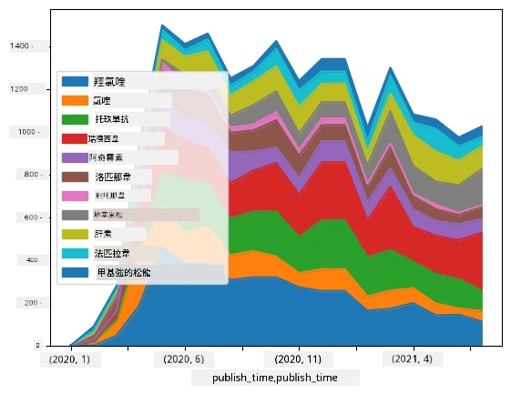

# 處理數據：Python 與 Pandas 函式庫

|  ](../../sketchnotes/07-WorkWithPython.png) |
| :-------------------------------------------------------------------------------------------------------: |
|                 使用 Python - _由 [@nitya](https://twitter.com/nitya) 製作的 Sketchnote_                 |

[](https://youtu.be/dZjWOGbsN4Y)

雖然資料庫提供非常有效的方式來存儲數據並使用查詢語言進行查詢，但最靈活的數據處理方式是撰寫自己的程式來操作數據。在許多情況下，使用資料庫查詢會是更有效的方法，但在某些需要更複雜數據處理的場合，SQL 並不容易完成這些工作。 
數據處理可以用任何程式語言來編程，但有些語言在處理數據方面層次較高。數據科學家通常偏好以下幾種語言：

* **[Python](https://www.python.org/)**，一種通用程式語言，因其簡潔性通常被認為是初學者的最佳選擇之一。Python 擁有許多附加函式庫，可以幫助解決眾多實際問題，例如從 ZIP 壓縮檔中提取數據，或將圖片轉換為灰階。Python 除了數據科學外，也經常用於網頁開發。 
* **[R](https://www.r-project.org/)** 是一套專為統計數據處理而設計的傳統工具箱。它也擁有龐大的函式庫（CRAN）存儲庫，使其成為數據處理的良好選擇。然而，R 不是通用程式語言，且在數據科學領域外較少使用。
* **[Julia](https://julialang.org/)** 是另一種專為數據科學開發的語言。其目的是提供比 Python 更優的性能，是科學實驗的極佳工具。

本課程將專注於使用 Python 進行簡單的數據處理。我們假設你對該語言已有基本了解。如果想更深入了解 Python，可以參考以下資源：

* [用海龜圖形與分形趣味學 Python](https://github.com/shwars/pycourse) - 基於 GitHub 的 Python 編程快速入門課程
* [你的第一步 Python 學習之路](https://docs.microsoft.com/en-us/learn/paths/python-first-steps/?WT.mc_id=academic-77958-bethanycheum) — Microsoft Learn 平台學習路徑

數據可以有多種形式。在本課程，我們會考慮三種數據形式—<strong>表格數據</strong>、<strong>文字</strong>及<strong>圖像</strong>。

我們會專注於數個數據處理示例，而非全面介紹所有相關函式庫。這讓你能抓住核心概念，並了解在需要時如何尋找解決方案。

> <strong>最有用的建議</strong>。當你需要執行某項數據操作卻不知如何下手時，嘗試在網路上搜尋。 [Stackoverflow](https://stackoverflow.com/) 通常包含大量 Python 範例程式碼，適用於許多常見任務。 


## [課前測驗](https://ff-quizzes.netlify.app/en/ds/quiz/12)

## 表格數據與資料框 (Dataframes)

對於關聯式數據庫的介紹中，你已經遇過表格數據。當數據量大且包含許多不同聯繫的表格時，使用 SQL 來處理數據絕對是合理的。然而，有很多情況下，我們有一張數據表，需要獲得關於這些數據的<strong>理解</strong>或<strong>洞察</strong>，例如分布、數值間的相關性等等。在數據科學中，經常需要對原始數據做轉換，並接著以視覺化呈現。這兩個步驟都可以用 Python 輕易完成。

在 Python 中，有兩個非常有用的函式庫能幫助你處理表格數據：
* **[Pandas](https://pandas.pydata.org/)** 允許你操作所謂的 **Dataframes**，與關聯式資料表類似。你可以擁有命名的欄位，並對列、欄及整個 Dataframe 執行不同操作。 
* **[Numpy](https://numpy.org/)** 是一個用於處理 <strong>張量</strong>（多維 <strong>陣列</strong>）的函式庫。陣列的所有元素類型相同，結構比 Dataframe 簡單，但是擁有更多數學運算功能，且造成的運算負擔較輕。

你還應該知道另外幾個函式庫：
* **[Matplotlib](https://matplotlib.org/)** 是用於數據視覺化與繪製圖表的函式庫
* **[SciPy](https://www.scipy.org/)** 提供一些額外的科學運算函式庫，我們在討論機率與統計時已經涉及過

下面是一段你一般會在 Python 程式開頭用來匯入這些函式庫的程式碼：
```python
import numpy as np
import pandas as pd
import matplotlib.pyplot as plt
from scipy import ... # 你需要指定你需要的確切子套件
``` 

Pandas 是圍繞幾個基本概念運作。

### 序列 (Series)

**Series** 是一組值的序列，類似於列表或 numpy 陣列。主要差別是 Series 具有<strong>索引值</strong>，當我們對 Series 進行運算（例如相加）時，索引會被考慮在內。索引可以是簡單的整數列號（在用列表或陣列建立 Series 時預設使用的索引），也可以是複雜結構，如日期區間。

> <strong>注意</strong>：附帶的筆記本檔 [`notebook.ipynb`](notebook.ipynb) 中包含一些初學 Pandas 的程式碼範例。我們此處只概述部分範例，你當然可以查看完整筆記本。

以一個例子說明：我們想分析冰淇淋店的銷售情況。生成一段銷售數量（每天售出數量）的序列如下：

```python
start_date = "Jan 1, 2020"
end_date = "Mar 31, 2020"
idx = pd.date_range(start_date,end_date)
print(f"Length of index is {len(idx)}")
items_sold = pd.Series(np.random.randint(25,50,size=len(idx)),index=idx)
items_sold.plot()
```


假設我們每週都組織一次朋友聚會，會額外備 10 盒冰淇淋。我們可以建立另一個以週為索引的 Series 來示範此情況：
```python
additional_items = pd.Series(10,index=pd.date_range(start_date,end_date,freq="W"))
```
兩個 Series 相加，得到總銷售數量：
```python
total_items = items_sold.add(additional_items,fill_value=0)
total_items.plot()
```


> <strong>注意</strong> 我們沒有使用 `total_items+additional_items` 這種簡單語法。若如此做，結果 Series 中會產生大量 `NaN`（非數值）值。原因是 `additional_items` 中某些索引存在缺失，`NaN` 與任何數相加結果仍為 `NaN`。因此需要在相加時指定 `fill_value` 參數。

對時間序列數據，我們還可以根據不同時間間隔重採樣。例如，我們想計算每月平均銷售量，可用以下程式碼：
```python
monthly = total_items.resample("1M").mean()
ax = monthly.plot(kind='bar')
```


### DataFrame

DataFrame 本質上是具有相同索引的多個 Series 集合。我們可以把幾個 Series 合在一起形成 DataFrame：
```python
a = pd.Series(range(1,10))
b = pd.Series(["I","like","to","play","games","and","will","not","change"],index=range(0,9))
df = pd.DataFrame([a,b])
```
此操作會生成類似下面的橫向表格：
|     | 0   | 1    | 2   | 3   | 4      | 5   | 6      | 7    | 8    |
| --- | --- | ---- | --- | --- | ------ | --- | ------ | ---- | ---- |
| 0   | 1   | 2    | 3   | 4   | 5      | 6   | 7      | 8    | 9    |
| 1   | I   | like | to  | use | Python | and | Pandas | very | much |

也可以用 Series 作為欄位，並用字典指定欄名：
```python
df = pd.DataFrame({ 'A' : a, 'B' : b })
```
這會產生如下表格：

|     | A   | B      |
| --- | --- | ------ |
| 0   | 1   | I      |
| 1   | 2   | like   |
| 2   | 3   | to     |
| 3   | 4   | use    |
| 4   | 5   | Python |
| 5   | 6   | and    |
| 6   | 7   | Pandas |
| 7   | 8   | very   |
| 8   | 9   | much   |

<strong>注意</strong> 我們也可以通過轉置前面的表格來獲得這種表格佈局，例如寫成
```python
df = pd.DataFrame([a,b]).T.rename(columns={ 0 : 'A', 1 : 'B' })
```
其中 `.T` 表示對 DataFrame 進行轉置操作，即變換列和行，而 `rename` 操作則允許我們重新命名欄位以符合之前的例子。

以下是一些 DataFrame 上最重要的操作：

<strong>欄位選擇</strong>。我們可以用 `df['A']` 選擇單一欄位，會回傳 Series。也可以選擇多欄位組成另一個 DataFrame，寫為 `df[['B','A']]`。

<strong>過濾</strong> 特定條件的列。例如，保留欄 `A` 大於 5 的行，可寫 `df[df['A']>5]`。

> <strong>注意</strong>：過濾的運作方式是這樣的。`df['A']<5` 會回傳布林 Series，表示原來 `df['A']` 每個元素是否為真 (True) 或假 (False)。當布林序列作為索引時，會回傳 DataFrame 中該條件為真的行子集。因此不能寫任意 Python 布林表達式，例如 `df[df['A']>5 and df['A']<7]` 是錯誤的。要使用布林 Series 的特殊運算符 `&`，寫成 `df[(df['A']>5) & (df['A']<7)]` (<em>括號很重要</em>)。

<strong>創建可計算的新欄位</strong>。我們可以用直觀的表達式輕鬆在 DataFrame 中新增可以計算的欄位：
```python
df['DivA'] = df['A']-df['A'].mean() 
``` 
此範例計算 A 欄與其平均值的差異。實際執行的是先計算一個 Series，然後將它賦值給左邊，形成另一欄位。因此不能使用不適合於 Series 的任意運算。例如，下面程式碼就是錯誤的：
```python
# 錯誤代碼 -> df['ADescr'] = "Low" 如果 df['A'] < 5 否則 "Hi"
df['LenB'] = len(df['B']) # <- 錯誤結果
``` 
儘管語法正確，但結果錯誤，因為它將 Series `B` 的長度賦予欄位所有值，而非我們預期中每個元素的長度。

若需計算複雜表達式，可以用 `apply` 函數。上述例子改寫如下：
```python
df['LenB'] = df['B'].apply(lambda x : len(x))
# 或者
df['LenB'] = df['B'].apply(len)
```

執行上述操作後，我們將得到如下 DataFrame：

|     | A   | B      | DivA | LenB |
| --- | --- | ------ | ---- | ---- |
| 0   | 1   | I      | -4.0 | 1    |
| 1   | 2   | like   | -3.0 | 4    |
| 2   | 3   | to     | -2.0 | 2    |
| 3   | 4   | use    | -1.0 | 3    |
| 4   | 5   | Python | 0.0  | 6    |
| 5   | 6   | and    | 1.0  | 3    |
| 6   | 7   | Pandas | 2.0  | 6    |
| 7   | 8   | very   | 3.0  | 4    |
| 8   | 9   | much   | 4.0  | 4    |

<strong>根據數字選擇行</strong> 可以用 `iloc` 語法。例如，選擇前 5 行：
```python
df.iloc[:5]
```

<strong>分組</strong>  常用於取得類似 Excel 透視表結果。假設我們想計算每一個 `LenB` 數值下 `A` 欄的平均值。把 DataFrame 依 `LenB` 分組，再呼叫 `mean`：
```python
df.groupby(by='LenB')[['A','DivA']].mean()
```
如果要計算平均值與群組內元素數量，則可用更複雜的 `aggregate` 函數：
```python
df.groupby(by='LenB') \
 .aggregate({ 'DivA' : len, 'A' : lambda x: x.mean() }) \
 .rename(columns={ 'DivA' : 'Count', 'A' : 'Mean'})
```
會得到以下表：

| LenB | Count | Mean     |
| ---- | ----- | -------- |
| 1    | 1     | 1.000000 |
| 2    | 1     | 3.000000 |
| 3    | 2     | 5.000000 |
| 4    | 3     | 6.333333 |
| 6    | 2     | 6.000000 |

### 取得數據


我們已經見識到從 Python 物件構造 Series 和 DataFrames 是多麼簡單。然而，數據通常以文字檔案或 Excel 表格的形式出現。幸運的是，Pandas 提供我們一種簡便的方法從磁碟載入數據。例如，讀取 CSV 檔案就這麼簡單：
```python
df = pd.read_csv('file.csv')
```
我們將會看到更多載入數據的例子，包括從外部網站獲取數據，在「挑戰」部分中展示


### 列印與繪圖

資料科學家經常需要探索數據，因此能夠視覺化是很重要的。當 DataFrame 很大時，很多時候我們只想透過列印前幾行來確保一切正確。這可以透過呼叫 `df.head()` 來完成。如果你在 Jupyter Notebook 中執行，它會以漂亮的表格形式列印出 DataFrame。

我們也看過使用 `plot` 函數來視覺化一些欄位。雖然 `plot` 對許多任務非常有用，並且透過 `kind=` 參數支援很多不同圖表類型，但你總可以使用原生 `matplotlib` 庫來繪製更複雜的東西。我們會在後續課程中詳細介紹資料視覺化。

這個概覽涵蓋了 Pandas 最重要的概念，然而，這個庫非常豐富，你可以用它做的事情沒有上限！現在讓我們將這些知識應用於解決具體問題。

## 🚀 挑戰 1：分析 COVID 傳播

我們將聚焦的第一個問題是 COVID-19 疫情傳播的建模。為此，我們會使用約翰霍普金斯大學系統科學與工程中心（CSSE）提供的不同國家感染人數數據。數據集可於 [該 GitHub 儲存庫](https://github.com/CSSEGISandData/COVID-19) 獲得。

既然我們想展示如何處理數據，邀請你打開 [`notebook-covidspread.ipynb`](notebook-covidspread.ipynb)，從頭到尾閱讀。你也可以執行程式碼區塊，完成我們在結尾留給你的挑戰。


> 如果你不知如何在 Jupyter Notebook 中運行程式碼，可以參考[這篇文章](https://soshnikov.com/education/how-to-execute-notebooks-from-github/)。

## 處理非結構化數據

雖然數據通常是表格式，但有些情況我們需要處理較不結構化的數據，如文字或影像。在這種情況下，要應用上述資料處理技巧，我們必須以某種方式<strong>提取</strong>結構化數據。以下是幾個例子：

* 從文字中提取關鍵詞，並觀察這些關鍵詞出現的頻率
* 使用神經網絡來提取影像中物體的資訊
* 從視頻監控畫面中獲取人物情緒訊息

## 🚀 挑戰 2：分析 COVID 相關論文

在此挑戰中，我們將繼續 COVID 疫情的主題，專注於處理相關的科學論文。存在一個 [CORD-19 資料集](https://www.kaggle.com/allen-institute-for-ai/CORD-19-research-challenge)，其中涵蓋了超過 7000 篇（撰寫時）的 COVID 論文，並包含元數據和摘要（約一半則提供全文）。

使用 [Text Analytics for Health](https://docs.microsoft.com/azure/cognitive-services/text-analytics/how-tos/text-analytics-for-health/?WT.mc_id=academic-77958-bethanycheum) 認知服務來分析該資料集的完整例子，描述於[這篇部落格文章](https://soshnikov.com/science/analyzing-medical-papers-with-azure-and-text-analytics-for-health/)。我們將討論簡化版本的分析。

> <strong>注意</strong>：此儲存庫不提供資料集副本。你可能需要先從 [Kaggle 的資料集](https://www.kaggle.com/allen-institute-for-ai/CORD-19-research-challenge) 下載 [`metadata.csv`](https://www.kaggle.com/allen-institute-for-ai/CORD-19-research-challenge?select=metadata.csv) 檔案。可能需註冊 Kaggle。你也可以不註冊，從[此處](https://ai2-semanticscholar-cord-19.s3-us-west-2.amazonaws.com/historical_releases.html)下載該資料集，但那裡包含元數據檔和全文。

打開 [`notebook-papers.ipynb`](notebook-papers.ipynb) 並從頭讀到尾。你同樣可以執行區塊，並完成我們在結尾留給你的挑戰。



## 處理影像數據

最近，強大的 AI 模型問世，讓我們能夠理解影像。有許多任務可以用預訓練神經網路或雲端服務解決。以下是幾例：

* <strong>影像分類</strong>，可幫助你將影像分類至預設類別之一。你可以使用 [Custom Vision](https://azure.microsoft.com/services/cognitive-services/custom-vision-service/?WT.mc_id=academic-77958-bethanycheum) 等服務輕鬆訓練自己的影像分類器
* <strong>物件偵測</strong>，在影像中識別不同物體。[computer vision](https://azure.microsoft.com/services/cognitive-services/computer-vision/?WT.mc_id=academic-77958-bethanycheum) 服務可偵測多種常見物件，也可以訓練 [Custom Vision](https://azure.microsoft.com/services/cognitive-services/custom-vision-service/?WT.mc_id=academic-77958-bethanycheum) 模型來識別特定物件。
* <strong>臉部偵測</strong>，包含年齡、性別及情緒偵測。可透過 [Face API](https://azure.microsoft.com/services/cognitive-services/face/?WT.mc_id=academic-77958-bethanycheum) 完成。

這些雲端服務均可透過 [Python SDKs](https://docs.microsoft.com/samples/azure-samples/cognitive-services-python-sdk-samples/cognitive-services-python-sdk-samples/?WT.mc_id=academic-77958-bethanycheum) 呼叫，因而能輕鬆地融入你的資料探索工作流程。

以下是一些從影像數據來源探索數據的例子：
* 在部落格文 [How to Learn Data Science without Coding](https://soshnikov.com/azure/how-to-learn-data-science-without-coding/) 中，我們探索 Instagram 照片，嘗試瞭解什麼因素會讓照片獲得更多讚。先利用 [computer vision](https://azure.microsoft.com/services/cognitive-services/computer-vision/?WT.mc_id=academic-77958-bethanycheum) 盡可能多地提取圖片資訊，再利用 [Azure Machine Learning AutoML](https://docs.microsoft.com/azure/machine-learning/concept-automated-ml/?WT.mc_id=academic-77958-bethanycheum) 建構可解釋模型。
* 在 [Facial Studies Workshop](https://github.com/CloudAdvocacy/FaceStudies) 中，我們使用 [Face API](https://azure.microsoft.com/services/cognitive-services/face/?WT.mc_id=academic-77958-bethanycheum) 從活動照片中提取人物的情緒，以嘗試理解什麼使人感到快樂。

## 結論

無論你已有結構化或非結構化數據，都能利用 Python 執行與數據處理與理解相關的所有步驟。這應該是最具彈性的數據處理方法，這也是多數資料科學家將 Python 作為主要工具的原因。如果你真正嚴肅看待資料科學旅程，深入學習 Python 大概是個好主意！

## [課後測驗](https://ff-quizzes.netlify.app/en/ds/quiz/13)

## 複習與自學

<strong>書籍</strong>
* [Wes McKinney. Python for Data Analysis: Data Wrangling with Pandas, NumPy, and IPython](https://www.amazon.com/gp/product/1491957662)

<strong>線上資源</strong>
* 官方 [10 分鐘學 Pandas](https://pandas.pydata.org/pandas-docs/stable/user_guide/10min.html) 教學
* [Pandas 視覺化文件](https://pandas.pydata.org/pandas-docs/stable/user_guide/visualization.html)

**學習 Python**
* [用烏龜繪圖和分形趣味學 Python](https://github.com/shwars/pycourse)
* [用 Python 起步](https://docs.microsoft.com/learn/paths/python-first-steps/?WT.mc_id=academic-77958-bethanycheum) Microsoft Learn 學習路徑 [Microsoft Learn](http://learn.microsoft.com/?WT.mc_id=academic-77958-bethanycheum)

## 作業

[對上述挑戰做更詳細的數據研究](assignment.md)

## 作者名單

本課程由 [Dmitry Soshnikov](http://soshnikov.com) 以 ♥️ 撰寫

---

<!-- CO-OP TRANSLATOR DISCLAIMER START -->
**免責聲明**：
本文件使用 AI 翻譯服務 [Co-op Translator](https://github.com/Azure/co-op-translator) 進行翻譯。雖然我們力求準確，但請注意，自動翻譯可能包含錯誤或不準確之處。原始文件的母語版本應被視為權威來源。對於重要資訊，建議尋求專業人工翻譯。我們不對因使用本翻譯而引起的任何誤解或曲解承擔責任。
<!-- CO-OP TRANSLATOR DISCLAIMER END -->