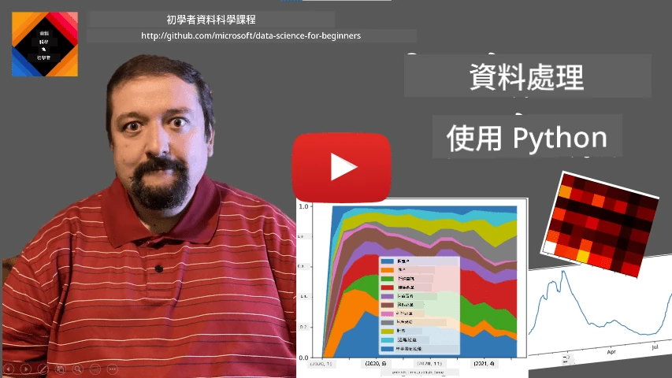
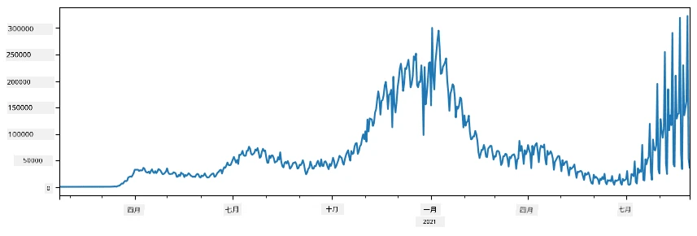
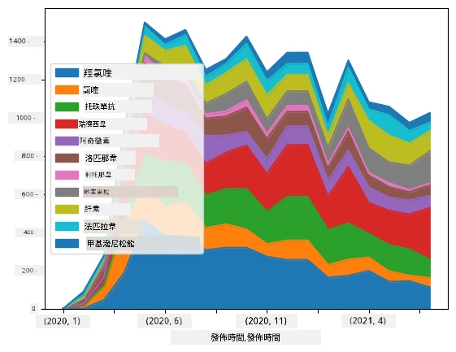

# 與資料共舞：Python 與 Pandas 函式庫

|  製作 ](../../sketchnotes/07-WorkWithPython.png) |
| :-------------------------------------------------------------------------------------------------------: |
|                 與 Python 共舞 - _速記筆記作者 [@nitya](https://twitter.com/nitya)_                 |

[](https://youtu.be/dZjWOGbsN4Y)

雖然資料庫提供非常有效率的方式來存放資料並使用查詢語言查詢，但處理資料最靈活的方式是撰寫自己的程式來操作資料。許多情況下，使用資料庫查詢會是更有效率的方式。然而當需要複雜的資料處理時，用 SQL 就無法輕易完成。
資料處理可以用任何程式語言進行，但某些語言在資料操作方面層級較高。資料科學家通常偏好以下其中一種語言：

* **[Python](https://www.python.org/)**，一種通用程式語言，由於簡單易學，經常被認為是初學者最佳選擇。Python 擁有許多額外的函式庫，可以幫助你解決許多實際問題，例如從 ZIP 壓縮檔案擷取資料，或將圖片轉成灰階。除了資料科學之外，Python 也常用於網站開發。
* **[R](https://www.r-project.org/)** 是專門為統計資料處理設計的傳統工具箱。它擁有龐大的函式庫資源庫 (CRAN)，因此是資料處理的良好選擇。但 R 不是通用程式語言，在資料科學領域之外很少使用。
* **[Julia](https://julialang.org/)** 是另種專為資料科學開發的語言，目標是比 Python 擁有更好的效能，是科學實驗的絕佳工具。

本課程將專注於使用 Python 進行簡單資料處理，假設你對該語言有基本熟悉。如果你想深入學習 Python，可以參考以下資源：

* [有趣學習 Python：烏龜圖形與分形](https://github.com/shwars/pycourse) – GitHub 上的 Python 快速入門課程
* [Python 入門初階學習路線](https://docs.microsoft.com/en-us/learn/paths/python-first-steps/?WT.mc_id=academic-77958-bethanycheum)，在 [Microsoft Learn](http://learn.microsoft.com/?WT.mc_id=academic-77958-bethanycheum) 平台提供

資料的型態多種多樣。這堂課將討論三種資料形式——<strong>表格式資料</strong>、<strong>文字資料</strong>及<strong>影像資料</strong>。

我們將著重幾個資料處理範例，而非完整介紹所有相關函式庫。這將幫助你理解其中的主要概念，並為你提供在需要時尋找解決方案的方法。

> <strong>最實用的建議</strong>：當你想進行某項資料操作，但不知道怎麼做時，請嘗試在網路上搜尋。[Stackoverflow](https://stackoverflow.com/) 通常有許多 Python 範例程式碼，可以應用於各種典型任務。


## [課前小考](https://ff-quizzes.netlify.app/en/ds/quiz/12)

## 表格式資料與 DataFrame

在談到關聯式資料庫時，你已經接觸過表格式資料。當你有龐大資料且包含多個相互連結的資料表時，使用 SQL 來處理非常合理。然而，許多情況是我們擁有一張資料表，希望獲得該資料的<strong>認識</strong>或<strong>洞察</strong>，例如分佈情況、數值間的相關性等。在資料科學中，許多情況需要對原始資料進行轉換，接著進行視覺化。這些任務都可以透過 Python 輕鬆完成。

Python 有兩個最常用的函式庫幫助你處理表格式資料：
* **[Pandas](https://pandas.pydata.org/)** 允許你操作稱為 **Dataframe** 的結構，它類似於關聯型資料表。你可以擁有具名稱的欄位，且能對列、欄及整個 Dataframe 執行各種操作。
* **[Numpy](https://numpy.org/)** 是操作 <strong>張量</strong>（即多維度 <strong>陣列</strong>）的函式庫。陣列採用相同底層型態，結構較 Dataframe 簡單，但提供更多數學運算且開銷較小。

另外還有幾個你應該知道的函式庫：
* **[Matplotlib](https://matplotlib.org/)** 是用於資料視覺化與繪圖的函式庫
* **[SciPy](https://www.scipy.org/)** 包含額外的科學運算功能，之前談到機率與統計時已出現過它

下面是一段通常用作於 Python 程式開頭，導入上述函式庫的範例代碼：
```python
import numpy as np
import pandas as pd
import matplotlib.pyplot as plt
from scipy import ... # 你需要指定你所需的確切子套件
``` 

Pandas 依靠幾個基本概念構成。

### Series

**Series** 是一系列數值序列，類似清單或 numpy 陣列。主要差異是 series 擁有 <strong>索引值</strong>，且當我們對 series 操作（如相加）時，會考慮索引。索引可簡單為整數列號（當從清單或陣列建立 series 時預設使用），也可以是複雜的結構，例如日期區間。

> <strong>注意</strong>：附帶的筆記本 [`notebook.ipynb`](notebook.ipynb) 含有 Pandas 入門範例。我們此處只大略說明部分範例，你也非常歡迎閱讀完整筆記本。

以範例說明：假設我們想分析冰淇淋店的銷售量。先生成一段銷售數量（每日銷售件數）的 series：

```python
start_date = "Jan 1, 2020"
end_date = "Mar 31, 2020"
idx = pd.date_range(start_date,end_date)
print(f"Length of index is {len(idx)}")
items_sold = pd.Series(np.random.randint(25,50,size=len(idx)),index=idx)
items_sold.plot()
```


假設每週我們會為朋友聚會準備額外 10 包冰淇淋，並且以週為索引建立另一個 series，來表示額外銷售量：
```python
additional_items = pd.Series(10,index=pd.date_range(start_date,end_date,freq="W"))
```
將兩個 series 相加，得到總銷售數量：
```python
total_items = items_sold.add(additional_items,fill_value=0)
total_items.plot()
```


> <strong>注意</strong>：我們沒有直接使用簡單語法 `total_items+additional_items`。如果如此，我們會得到許多 `NaN`（非數值）在結果 series 中。原因是 `additional_items` series 的部分索引值不存在，任何數值與 `NaN` 相加均為 `NaN`。因此在相加時需指定 `fill_value` 參數。

對於時間序列，我們也能<strong>重新取樣</strong>成不同時間間隔。例如，要計算每月平均銷售量，可用以下代碼：
```python
monthly = total_items.resample("1M").mean()
ax = monthly.plot(kind='bar')
```


### DataFrame

DataFrame 實際上是多個相同索引的 series 集合。我們可以將數個 series 合成一個 DataFrame：
```python
a = pd.Series(range(1,10))
b = pd.Series(["I","like","to","play","games","and","will","not","change"],index=range(0,9))
df = pd.DataFrame([a,b])
```
這會建立如下橫向資料表：
|     | 0   | 1    | 2   | 3   | 4      | 5   | 6      | 7    | 8    |
| --- | --- | ---- | --- | --- | ------ | --- | ------ | ---- | ---- |
| 0   | 1   | 2    | 3   | 4   | 5      | 6   | 7      | 8    | 9    |
| 1   | I   | like | to  | use | Python | and | Pandas | very | much |

也可以將 Series 作為欄位，並透過字典指定欄位名稱：
```python
df = pd.DataFrame({ 'A' : a, 'B' : b })
```
這會產生如下資料表：

|     | A   | B      |
| --- | --- | ------ |
| 0   | 1   | I      |
| 1   | 2   | like   |
| 2   | 3   | to     |
| 3   | 4   | use    |
| 4   | 5   | Python |
| 5   | 6   | and    |
| 6   | 7   | Pandas |
| 7   | 8   | very   |
| 8   | 9   | much   |

<strong>注意</strong>我們也能透過轉置前表格來得到同樣結果，例如寫成
```python
df = pd.DataFrame([a,b]).T.rename(columns={ 0 : 'A', 1 : 'B' })
```
這裡 `.T` 表示 DataFrame 轉置操作，即行列交換，`rename` 則可以重命名欄位符合前例。

以下是我們可以對 DataFrame 執行的幾項重要操作：

<strong>欄位選擇</strong>。可用 `df['A']` 選取單一欄，回傳一個 Series。也可用 `df[['B','A']]` 選取子欄位集合，回傳另一個 DataFrame。

<strong>篩選特定列</strong>。比如，留下欄位 `A` 值大於 5 的列，可寫為 `df[df['A']>5]`。

> <strong>注意</strong>：篩選是如此工作的。表達式 `df['A']<5` 回傳布林型 Series，表示 `df['A']` 中各元素是否符合條件。當用此布林型 Series 做為索引時，會回傳 DataFrame 的子集列。因此無法用一般 Python 布林表達式，例如 `df[df['A']>5 and df['A']<7]` 是錯誤的。應使用布林 Series 的特殊 `&` 運算，寫為 `df[(df['A']>5) & (df['A']<7)]`（<em>括號很重要</em>）。

<strong>建立新的可計算欄位</strong>。我們可以用直覺式表達式輕鬆建立新欄位：
```python
df['DivA'] = df['A']-df['A'].mean() 
``` 
此範例計算欄位 A 相對其均值的偏差。實際上，我們先計算一個 Series，再將其指派給左邊的欄位，新增一欄。因此不可用與 Series 不相容的操作，否則會錯誤，例如下例：
```python
# 錯誤的程式碼 -> df['ADescr'] = "Low" if df['A'] < 5 else "Hi"
df['LenB'] = len(df['B']) # <- 錯誤的結果
``` 
這個例子雖語法正確，但結果錯誤，因為它將欄位 B 的整體長度指派給所有列，而非意圖的各元素長度。

如果需計算較複雜的表達式，可用 `apply` 函數。之前例子也可改寫為：
```python
df['LenB'] = df['B'].apply(lambda x : len(x))
# 或者
df['LenB'] = df['B'].apply(len)
```

執行上述操作後，我們得到以下 DataFrame：

|     | A   | B      | DivA | LenB |
| --- | --- | ------ | ---- | ---- |
| 0   | 1   | I      | -4.0 | 1    |
| 1   | 2   | like   | -3.0 | 4    |
| 2   | 3   | to     | -2.0 | 2    |
| 3   | 4   | use    | -1.0 | 3    |
| 4   | 5   | Python | 0.0  | 6    |
| 5   | 6   | and    | 1.0  | 3    |
| 6   | 7   | Pandas | 2.0  | 6    |
| 7   | 8   | very   | 3.0  | 4    |
| 8   | 9   | much   | 4.0  | 4    |

<strong>依照列號選取列</strong>可用 `iloc`。例如，選取前 5 列：
```python
df.iloc[:5]
```

<strong>分組</strong>常用於得到類似 Excel 中 <em>樞紐分析表</em> 的效果。假設想計算欄位 `A` 於每個 `LenB` 群組的平均值，可對 DataFrame 依 `LenB` 分組，再呼叫 `mean`：
```python
df.groupby(by='LenB')[['A','DivA']].mean()
```
若同時計算群組數量與平均值，可用較複雜的 `aggregate` 函數：
```python
df.groupby(by='LenB') \
 .aggregate({ 'DivA' : len, 'A' : lambda x: x.mean() }) \
 .rename(columns={ 'DivA' : 'Count', 'A' : 'Mean'})
```
結果會得到這張表：

| LenB | Count | Mean     |
| ---- | ----- | -------- |
| 1    | 1     | 1.000000 |
| 2    | 1     | 3.000000 |
| 3    | 2     | 5.000000 |
| 4    | 3     | 6.333333 |
| 6    | 2     | 6.000000 |

### 獲取資料


我們已經看到了從 Python 物件構造 Series 和 DataFrames 是多麼簡單。然而，資料通常以文字檔案或 Excel 表格的形式出現。幸運的是，Pandas 提供了從磁盤加載資料的簡單方法。例如，讀取 CSV 檔案就像這樣簡單：
```python
df = pd.read_csv('file.csv')
```
我們將在「挑戰」部分看到更多載入資料的範例，包括從外部網站抓取資料


### 列印與繪圖

資料科學家經常需要探索資料，因此能夠視覺化資料非常重要。當 DataFrame 很大時，很多時候我們只想確保所有操作正確無誤，這時候可以只列印出前幾行。這可以透過調用 `df.head()` 來完成。如果你是在 Jupyter Notebook 中運行，會以漂亮的表格形式印出 DataFrame。

我們也看到了使用 `plot` 函數來視覺化部分欄位。雖然 `plot` 對許多任務很有用，並且支持透過 `kind=` 參數繪製多種不同的圖形類型，但你也可以使用原生 `matplotlib` 函式庫來繪出更複雜的圖形。我們會在單獨的課程中詳細講解資料視覺化。

本概述涵蓋了 Pandas 最重要的概念，不過這個函式庫功能非常豐富，幾乎沒有你不能做到的事情！現在讓我們運用這些知識來解決特定問題。

## 🚀 挑戰 1：分析 COVID 傳播

我們首個關注的問題是模擬 COVID-19 流行病的傳播。為此，我們將使用由[約翰霍普金斯大學](https://jhu.edu/)的[系統科學與工程中心](https://systems.jhu.edu/)（CSSE）提供的不同國家感染者人數資料。資料集可在[這個 GitHub 倉庫](https://github.com/CSSEGISandData/COVID-19)取得。

因為我們想示範如何處理資料，邀請你打開 [`notebook-covidspread.ipynb`](notebook-covidspread.ipynb) 並從頭到尾閱讀。你也可以執行其中的程式碼區塊，並完成我們在最後留給你的挑戰。



> 如果你不知道如何在 Jupyter Notebook 中執行程式碼，請參考[這篇文章](https://soshnikov.com/education/how-to-execute-notebooks-from-github/)。

## 處理非結構化資料

雖然資料往往以表格形式出現，但在某些情況下，我們需要處理較不結構化的資料，例如文字或圖片。在這種情況下，要應用上述資料處理技術，我們需要以某種方式<strong>擷取</strong>結構化的資料。以下是幾個範例：

* 從文字中擷取關鍵字，並統計這些關鍵字出現的頻率
* 使用神經網絡擷取圖片中物件的資訊
* 獲取影片畫面中人們的情緒資訊

## 🚀 挑戰 2：分析 COVID 論文

在這個挑戰中，我們將繼續探討 COVID 疫情的主題，重點放在處理相關的科學論文。有一個 [CORD-19 資料集](https://www.kaggle.com/allen-institute-for-ai/CORD-19-research-challenge)，截至撰寫時收錄了超過 7000 篇關於 COVID 的論文，並附有元資料與摘要（約一半論文還附有全文）。

使用 [Text Analytics for Health](https://docs.microsoft.com/azure/cognitive-services/text-analytics/how-tos/text-analytics-for-health/?WT.mc_id=academic-77958-bethanycheum) 認知服務分析此資料集的完整範例在[這篇部落格文章](https://soshnikov.com/science/analyzing-medical-papers-with-azure-and-text-analytics-for-health/)中有說明。我們將討論其簡化版本的分析。

> <strong>注意</strong>：本倉庫中並未提供資料集副本。你可能需要先從 [Kaggle 的此資料集](https://www.kaggle.com/allen-institute-for-ai/CORD-19-research-challenge?select=metadata.csv) 下載 [`metadata.csv`](https://www.kaggle.com/allen-institute-for-ai/CORD-19-research-challenge?select=metadata.csv) 檔案。註冊 Kaggle 可能是必要的。你也可以不需註冊[從這裡下載](https://ai2-semanticscholar-cord-19.s3-us-west-2.amazonaws.com/historical_releases.html)，但裡面包含所有全文以及元資料檔。

打開 [`notebook-papers.ipynb`](notebook-papers.ipynb)，從頭到尾閱讀。你也可執行其中的程式碼區塊並完成最後留給你的挑戰。



## 處理影像資料

近來開發出非常強大的 AI 模型，使我們能夠理解影像。有許多任務可以使用預先訓練的神經網絡或雲端服務來解決。一些範例如下：

* <strong>影像分類</strong>，幫助你將影像分類到預訂的類別中。你也可以使用如 [Custom Vision](https://azure.microsoft.com/services/cognitive-services/custom-vision-service/?WT.mc_id=academic-77958-bethanycheum) 等服務輕鬆訓練自己的影像分類器
* <strong>物件偵測</strong>，用於辨識影像中的不同物件。像是 [computer vision](https://azure.microsoft.com/services/cognitive-services/computer-vision/?WT.mc_id=academic-77958-bethanycheum) 服務可以偵測多種常見物件，你也可以訓練 [Custom Vision](https://azure.microsoft.com/services/cognitive-services/custom-vision-service/?WT.mc_id=academic-77958-bethanycheum) 模型來偵測一些特定的關注物件。
* <strong>臉部偵測</strong>，包括年齡、性別和情緒偵測。可透過 [Face API](https://azure.microsoft.com/services/cognitive-services/face/?WT.mc_id=academic-77958-bethanycheum) 完成。

這些雲端服務皆可使用 [Python SDKs](https://docs.microsoft.com/samples/azure-samples/cognitive-services-python-sdk-samples/cognitive-services-python-sdk-samples/?WT.mc_id=academic-77958-bethanycheum) 呼叫，因此能輕鬆整合入你的資料探索工作流程。

這裡是一些來自影像資料源探索資料的範例：
* 在部落格文章 [如何在不寫程式下學習資料科學](https://soshnikov.com/azure/how-to-learn-data-science-without-coding/) 中，我們探索 Instagram 照片，嘗試理解什麼因素使人們給照片按讚更多。我們先使用 [computer vision](https://azure.microsoft.com/services/cognitive-services/computer-vision/?WT.mc_id=academic-77958-bethanycheum) 擷取照片中的最多資訊，接著使用 [Azure Machine Learning AutoML](https://docs.microsoft.com/azure/machine-learning/concept-automated-ml/?WT.mc_id=academic-77958-bethanycheum) 建立可解釋的模型。
* 在 [Facial Studies Workshop](https://github.com/CloudAdvocacy/FaceStudies) 中，我們利用 [Face API](https://azure.microsoft.com/services/cognitive-services/face/?WT.mc_id=academic-77958-bethanycheum) 從活動照片中擷取人物的情緒，試圖理解什麼會讓人快樂。

## 結論

無論你已有結構化或非結構化資料，使用 Python 你都可以執行所有與資料處理與理解相關的步驟。它可能是最靈活的資料處理方式，這也是大多數資料科學家將 Python 當作主要工具的原因。如果你對資料科學之路抱持認真態度，深入學習 Python 很可能是個好主意！

## [課後測驗](https://ff-quizzes.netlify.app/en/ds/quiz/13)

## 複習與自學

<strong>書籍</strong>
* [Wes McKinney. Python for Data Analysis: Data Wrangling with Pandas, NumPy, and IPython](https://www.amazon.com/gp/product/1491957662)

<strong>線上資源</strong>
* 官方 [10 分鐘入門 Pandas](https://pandas.pydata.org/pandas-docs/stable/user_guide/10min.html) 教程
* [Pandas 視覺化文件](https://pandas.pydata.org/pandas-docs/stable/user_guide/visualization.html)

**學習 Python**
* [用海龜繪圖和分形有趣學 Python](https://github.com/shwars/pycourse)
* [Python 入門第一步](https://docs.microsoft.com/learn/paths/python-first-steps/?WT.mc_id=academic-77958-bethanycheum) 學習路徑，發布於 [Microsoft Learn](http://learn.microsoft.com/?WT.mc_id=academic-77958-bethanycheum)

## 作業

[針對上述挑戰進行更細緻的資料研究](assignment.md)

## 致謝

本課程由 [Dmitry Soshnikov](http://soshnikov.com) 用 ♥️ 創作

---

<!-- CO-OP TRANSLATOR DISCLAIMER START -->
**免責聲明**：
此文件已使用 AI 翻譯服務 [Co-op Translator](https://github.com/Azure/co-op-translator) 進行翻譯。雖然我們努力追求準確性，但請注意自動翻譯可能包含錯誤或不準確之處。原始文件的母語版本應視為權威來源。對於關鍵資訊，建議採用專業人工翻譯。我們不對因使用此翻譯所產生的任何誤解或誤譯承擔責任。
<!-- CO-OP TRANSLATOR DISCLAIMER END -->